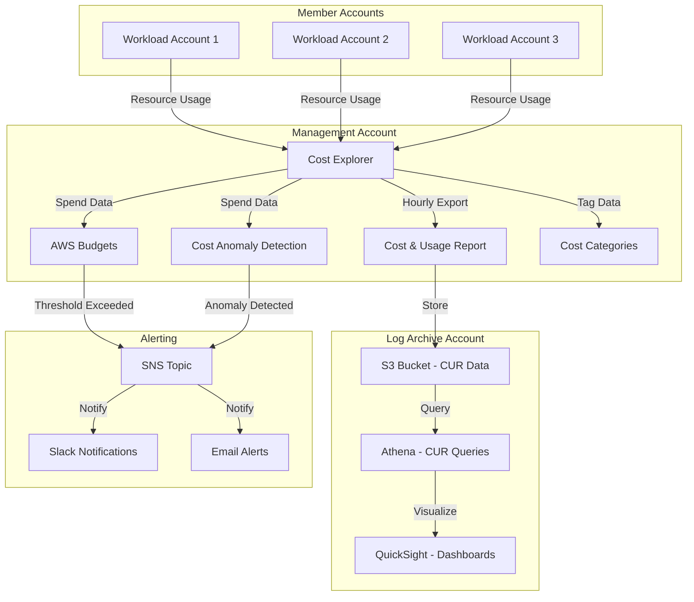

# Cost Management & Governance

This document describes the cost management and governance strategy for the AWS Landing Zone, including cost allocation, budgets, anomaly detection, and optimization recommendations.

## Overview

Cost governance in a multi-account environment requires proactive monitoring, clear allocation strategies, and automated controls. This Landing Zone implements a comprehensive approach using:

- **Cost Allocation Tags**: Consistent tagging taxonomy for cost attribution
- **AWS Budgets**: Proactive alerts and automated actions
- **Cost Categories**: Business unit and project-based cost grouping
- **Cost Anomaly Detection**: ML-based anomaly identification
- **Chargeback/Showback**: Transparent cost visibility for teams
- **Cost Optimization**: Continuous right-sizing and commitment management

## Cost Data Flow



## Cost Allocation Strategy

### Tagging Taxonomy

A consistent tagging strategy is critical for cost allocation and governance.

#### Mandatory Tags

All resources must have these tags (enforced via SCPs):

| Tag Key | Description | Example Values | Applied By |
|---------|-------------|----------------|------------|
| `Project` | Project or application name | `customer-portal`, `data-pipeline` | User/Automation |
| `Environment` | Deployment environment | `production`, `staging`, `development`, `sandbox` | User/Automation |
| `Owner` | Team or individual responsible | `platform-team`, `data-engineering` | User/Automation |
| `CostCenter` | Financial cost center | `CC-1234`, `engineering`, `marketing` | User/Automation |
| `ManagedBy` | How resource is managed | `terraform`, `cloudformation`, `manual`, `aft` | Automation |

#### Optional Tags

Recommended for enhanced cost visibility:

| Tag Key | Description | Example Values |
|---------|-------------|----------------|
| `Application` | Application component | `frontend`, `backend`, `database` |
| `Service` | Business service | `authentication`, `payment-processing` |
| `Compliance` | Compliance requirements | `pci-dss`, `hipaa`, `sox` |
| `DataClassification` | Data sensitivity | `public`, `internal`, `confidential`, `restricted` |
| `BackupPolicy` | Backup retention | `daily`, `weekly`, `none` |
| `Schedule` | Operating schedule | `24x7`, `business-hours`, `dev-hours` |

### Tag Enforcement via SCPs

Service Control Policies enforce mandatory tagging at the organization level.

**Deny resource creation without required tags**:

```json
{
  "Version": "2012-10-17",
  "Statement": [
    {
      "Sid": "DenyCreateWithoutRequiredTags",
      "Effect": "Deny",
      "Action": [
        "ec2:RunInstances",
        "ec2:CreateVolume",
        "ec2:CreateSnapshot",
        "rds:CreateDBInstance",
        "rds:CreateDBCluster",
        "s3:CreateBucket",
        "dynamodb:CreateTable",
        "lambda:CreateFunction",
        "ecs:CreateService",
        "eks:CreateCluster"
      ],
      "Resource": "*",
      "Condition": {
        "StringNotLike": {
          "aws:RequestTag/Project": "*",
          "aws:RequestTag/Environment": "*",
          "aws:RequestTag/Owner": "*",
          "aws:RequestTag/CostCenter": "*"
        }
      }
    },
    {
      "Sid": "DenyModifyRequiredTags",
      "Effect": "Deny",
      "Action": [
        "ec2:DeleteTags",
        "ec2:CreateTags"
      ],
      "Resource": "*",
      "Condition": {
        "ForAnyValue:StringEquals": {
          "aws:TagKeys": [
            "Project",
            "Environment",
            "Owner",
            "CostCenter",
            "ManagedBy"
          ]
        }
      }
    }
  ]
}
```

**Exceptions**:
- Service-linked roles and AWS-managed resources are exempt
- Break-glass roles can bypass (with CloudTrail logging)
- AFT provisioning roles have conditional exemptions

### Tag Inheritance

Tags automatically propagate to child resources:

**EC2 Instance → EBS Volumes**:
```hcl
resource "aws_instance" "app" {
  ami           = data.aws_ami.amazon_linux_2.id
  instance_type = "t3.medium"
  
  tags = {
    Project     = "customer-portal"
    Environment = "production"
    Owner       = "platform-team"
    CostCenter  = "CC-1234"
    ManagedBy   = "terraform"
  }
  
  # Propagate tags to volumes
  volume_tags = {
    Project     = "customer-portal"
    Environment = "production"
    Owner       = "platform-team"
    CostCenter  = "CC-1234"
    ManagedBy   = "terraform"
  }
}
```

**Auto Scaling Groups → Instances**:
```hcl
resource "aws_autoscaling_group" "app" {
  name                = "app-asg"
  vpc_zone_identifier = var.subnet_ids
  min_size            = 2
  max_size            = 10
  
  tag {
    key                 = "Project"
    value               = "customer-portal"
    propagate_at_launch = true
  }
  
  tag {
    key                 = "Environment"
    value               = "production"
    propagate_at_launch = true
  }
}
```

### Tag Compliance Monitoring

AWS Config rules monitor tag compliance:

**Required Tags Rule**:
```hcl
resource "aws_config_config_rule" "required_tags" {
  name = "required-tags"
  
  source {
    owner             = "AWS"
    source_identifier = "REQUIRED_TAGS"
  }
  
  input_parameters = jsonencode({
    tag1Key = "Project"
    tag2Key = "Environment"
    tag3Key = "Owner"
    tag4Key = "CostCenter"
  })
  
  scope {
    compliance_resource_types = [
      "AWS::EC2::Instance",
      "AWS::EC2::Volume",
      "AWS::RDS::DBInstance",
      "AWS::S3::Bucket",
      "AWS::Lambda::Function"
    ]
  }
}
```

**Automated Remediation**:
- Non-compliant resources trigger Security Hub findings
- Lambda function attempts auto-tagging from account defaults
- Persistent violations escalate to security team

## AWS Budgets

Proactive cost monitoring with automated alerts and actions.

### Organization-Level Budgets

**Total Organization Spend**:
```hcl
resource "aws_budgets_budget" "organization_total" {
  name              = "organization-total-monthly"
  budget_type       = "COST"
  limit_amount      = "50000"
  limit_unit        = "USD"
  time_unit         = "MONTHLY"
  time_period_start = "2024-01-01_00:00"
  
  cost_filter {
    name = "LinkedAccount"
    values = [
      for account in data.aws_organizations_organization.org.accounts : account.id
    ]
  }
  
  notification {
    comparison_operator        = "GREATER_THAN"
    threshold                  = 80
    threshold_type             = "PERCENTAGE"
    notification_type          = "ACTUAL"
    subscriber_email_addresses = ["finance@example.com"]
  }
  
  notification {
    comparison_operator        = "GREATER_THAN"
    threshold                  = 100
    threshold_type             = "PERCENTAGE"
    notification_type          = "FORECASTED"
    subscriber_email_addresses = ["finance@example.com", "cto@example.com"]
  }
}
```

**By Organizational Unit**:
```hcl
resource "aws_budgets_budget" "production_ou" {
  name              = "production-ou-monthly"
  budget_type       = "COST"
  limit_amount      = "30000"
  limit_unit        = "USD"
  time_unit         = "MONTHLY"
  time_period_start = "2024-01-01_00:00"
  
  cost_filter {
    name = "LinkedAccount"
    values = [
      for account in data.aws_organizations_organizational_unit.production.accounts : account.id
    ]
  }
  
  notification {
    comparison_operator = "GREATER_THAN"
    threshold           = 90
    threshold_type      = "PERCENTAGE"
    notification_type   = "ACTUAL"
    
    subscriber_sns_topic_arns = [aws_sns_topic.budget_alerts.arn]
  }
}
```

### Account-Level Budgets

**Per-Account Monthly Budget**:
```hcl
resource "aws_budgets_budget" "account_monthly" {
  for_each = toset(var.workload_account_ids)
  
  name              = "account-${each.key}-monthly"
  budget_type       = "COST"
  limit_amount      = "5000"
  limit_unit        = "USD"
  time_unit         = "MONTHLY"
  time_period_start = "2024-01-01_00:00"
  
  cost_filter {
    name   = "LinkedAccount"
    values = [each.key]
  }
  
  notification {
    comparison_operator        = "GREATER_THAN"
    threshold                  = 80
    threshold_type             = "PERCENTAGE"
    notification_type          = "ACTUAL"
    subscriber_email_addresses = ["team-${each.key}@example.com"]
  }
  
  notification {
    comparison_operator        = "GREATER_THAN"
    threshold                  = 100
    threshold_type             = "PERCENTAGE"
    notification_type          = "ACTUAL"
    subscriber_email_addresses = ["team-${each.key}@example.com", "finance@example.com"]
  }
}
```

**Service-Specific Budgets**:
```hcl
resource "aws_budgets_budget" "ec2_compute" {
  name              = "ec2-compute-monthly"
  budget_type       = "COST"
  limit_amount      = "10000"
  limit_unit        = "USD"
  time_unit         = "MONTHLY"
  time_period_start = "2024-01-01_00:00"
  
  cost_filter {
    name   = "Service"
    values = ["Amazon Elastic Compute Cloud - Compute"]
  }
  
  notification {
    comparison_operator = "GREATER_THAN"
    threshold           = 85
    threshold_type      = "PERCENTAGE"
    notification_type   = "ACTUAL"
    
    subscriber_sns_topic_arns = [aws_sns_topic.budget_alerts.arn]
  }
}
```

### Budget Actions

Automated responses when budgets are exceeded:

**Stop Non-Production Instances**:
```hcl
resource "aws_budgets_budget_action" "stop_dev_instances" {
  budget_name        = aws_budgets_budget.development_account.name
  action_type        = "APPLY_IAM_POLICY"
  approval_model     = "AUTOMATIC"
  notification_type  = "ACTUAL"
  execution_role_arn = aws_iam_role.budget_action.arn
  
  action_threshold {
    action_threshold_type  = "PERCENTAGE"
    action_threshold_value = 100
  }
  
  definition {
    iam_action_definition {
      policy_arn = aws_iam_policy.deny_ec2_launch.arn
      roles      = [aws_iam_role.developer.name]
    }
  }
  
  subscriber {
    address           = "devops@example.com"
    subscription_type = "EMAIL"
  }
}
```

**Deny New Resource Creation**:
```hcl
resource "aws_iam_policy" "deny_ec2_launch" {
  name        = "DenyEC2Launch"
  description = "Applied when budget threshold exceeded"
  
  policy = jsonencode({
    Version = "2012-10-17"
    Statement = [
      {
        Sid      = "DenyEC2Launch"
        Effect   = "Deny"
        Action   = [
          "ec2:RunInstances",
          "ec2:StartInstances"
        ]
        Resource = "*"
      }
    ]
  })
}
```

### Budget Alert Integration

**SNS Topic for Budget Alerts**:
```hcl
resource "aws_sns_topic" "budget_alerts" {
  name = "budget-alerts"
  
  tags = {
    Project     = "cost-governance"
    Environment = "production"
    Owner       = "finance-team"
    CostCenter  = "CC-FINANCE"
    ManagedBy   = "terraform"
  }
}

resource "aws_sns_topic_subscription" "budget_slack" {
  topic_arn = aws_sns_topic.budget_alerts.arn
  protocol  = "lambda"
  endpoint  = aws_lambda_function.slack_notifier.arn
}

resource "aws_sns_topic_subscription" "budget_email" {
  topic_arn = aws_sns_topic.budget_alerts.arn
  protocol  = "email"
  endpoint  = "finance@example.com"
}
```

## Cost Categories

Organize costs by business dimensions beyond account structure.

### Business Unit Categories

```hcl
resource "aws_ce_cost_category" "business_unit" {
  name         = "BusinessUnit"
  rule_version = "CostCategoryExpression.v1"
  
  rule {
    value = "Engineering"
    rule {
      dimension {
        key           = "LINKED_ACCOUNT"
        values        = var.engineering_account_ids
        match_options = ["EQUALS"]
      }
    }
  }
  
  rule {
    value = "Marketing"
    rule {
      dimension {
        key           = "LINKED_ACCOUNT"
        values        = var.marketing_account_ids
        match_options = ["EQUALS"]
      }
    }
  }
  
  rule {
    value = "Sales"
    rule {
      dimension {
        key           = "LINKED_ACCOUNT"
        values        = var.sales_account_ids
        match_options = ["EQUALS"]
      }
    }
  }
  
  rule {
    value = "Infrastructure"
    rule {
      dimension {
        key           = "LINKED_ACCOUNT"
        values        = [
          var.network_account_id,
          var.shared_services_account_id,
          var.security_account_id
        ]
        match_options = ["EQUALS"]
      }
    }
  }
}
```

### Project-Based Categories

```hcl
resource "aws_ce_cost_category" "project" {
  name         = "Project"
  rule_version = "CostCategoryExpression.v1"
  
  rule {
    value = "CustomerPortal"
    rule {
      tag {
        key           = "Project"
        values        = ["customer-portal"]
        match_options = ["EQUALS"]
      }
    }
  }
  
  rule {
    value = "DataPipeline"
    rule {
      tag {
        key           = "Project"
        values        = ["data-pipeline"]
        match_options = ["EQUALS"]
      }
    }
  }
  
  rule {
    value = "MobileApp"
    rule {
      tag {
        key           = "Project"
        values        = ["mobile-app", "mobile-backend"]
        match_options = ["EQUALS"]
      }
    }
  }
  
  rule {
    value = "Untagged"
    rule {
      tag {
        key           = "Project"
        values        = []
        match_options = ["ABSENT"]
      }
    }
  }
}
```

### Environment Categories

```hcl
resource "aws_ce_cost_category" "environment" {
  name         = "Environment"
  rule_version = "CostCategoryExpression.v1"
  
  rule {
    value = "Production"
    rule {
      or {
        dimension {
          key           = "LINKED_ACCOUNT"
          values        = var.production_account_ids
          match_options = ["EQUALS"]
        }
        tag {
          key           = "Environment"
          values        = ["production", "prod"]
          match_options = ["EQUALS"]
        }
      }
    }
  }
  
  rule {
    value = "NonProduction"
    rule {
      or {
        dimension {
          key           = "LINKED_ACCOUNT"
          values        = var.nonprod_account_ids
          match_options = ["EQUALS"]
        }
        tag {
          key           = "Environment"
          values        = ["staging", "development", "dev", "test"]
          match_options = ["EQUALS"]
        }
      }
    }
  }
  
  rule {
    value = "Sandbox"
    rule {
      tag {
        key           = "Environment"
        values        = ["sandbox"]
        match_options = ["EQUALS"]
      }
    }
  }
}
```

### Cost Category Usage

**Cost Explorer Filtering**:
```bash
# Query costs by business unit
aws ce get-cost-and-usage \
  --time-period Start=2024-01-01,End=2024-01-31 \
  --granularity MONTHLY \
  --metrics "UnblendedCost" \
  --group-by Type=COST_CATEGORY,Key=BusinessUnit
```

**Budget by Cost Category**:
```hcl
resource "aws_budgets_budget" "engineering_bu" {
  name              = "engineering-business-unit"
  budget_type       = "COST"
  limit_amount      = "25000"
  limit_unit        = "USD"
  time_unit         = "MONTHLY"
  time_period_start = "2024-01-01_00:00"
  
  cost_filter {
    name   = "CostCategory"
    values = ["Engineering"]
  }
}
```

## Cost Anomaly Detection

Machine learning-based anomaly detection for unexpected cost spikes.

### Organization-Wide Monitor

```hcl
resource "aws_ce_anomaly_monitor" "organization" {
  name              = "organization-anomaly-monitor"
  monitor_type      = "DIMENSIONAL"
  monitor_dimension = "SERVICE"
  
  tags = {
    Project     = "cost-governance"
    Environment = "production"
    Owner       = "finance-team"
    CostCenter  = "CC-FINANCE"
    ManagedBy   = "terraform"
  }
}
```

### Account-Specific Monitors

```hcl
resource "aws_ce_anomaly_monitor" "production_accounts" {
  name         = "production-accounts-monitor"
  monitor_type = "DIMENSIONAL"
  
  monitor_specification = jsonencode({
    Dimensions = {
      Key    = "LINKED_ACCOUNT"
      Values = var.production_account_ids
    }
  })
}
```

### Service-Specific Monitors

```hcl
resource "aws_ce_anomaly_monitor" "ec2_compute" {
  name         = "ec2-compute-monitor"
  monitor_type = "DIMENSIONAL"
  
  monitor_specification = jsonencode({
    Dimensions = {
      Key    = "SERVICE"
      Values = ["Amazon Elastic Compute Cloud - Compute"]
    }
  })
}
```

### Anomaly Subscriptions

**High-Severity Alerts**:
```hcl
resource "aws_ce_anomaly_subscription" "high_severity" {
  name      = "high-severity-anomalies"
  frequency = "IMMEDIATE"
  
  monitor_arn_list = [
    aws_ce_anomaly_monitor.organization.arn,
    aws_ce_anomaly_monitor.production_accounts.arn
  ]
  
  subscriber {
    type    = "SNS"
    address = aws_sns_topic.cost_anomaly_alerts.arn
  }
  
  threshold_expression {
    dimension {
      key           = "ANOMALY_TOTAL_IMPACT_ABSOLUTE"
      values        = ["500"]
      match_options = ["GREATER_THAN_OR_EQUAL"]
    }
  }
}
```

**Daily Digest**:
```hcl
resource "aws_ce_anomaly_subscription" "daily_digest" {
  name      = "daily-anomaly-digest"
  frequency = "DAILY"
  
  monitor_arn_list = [
    aws_ce_anomaly_monitor.organization.arn
  ]
  
  subscriber {
    type    = "EMAIL"
    address = "finance@example.com"
  }
  
  threshold_expression {
    dimension {
      key           = "ANOMALY_TOTAL_IMPACT_ABSOLUTE"
      values        = ["100"]
      match_options = ["GREATER_THAN_OR_EQUAL"]
    }
  }
}
```

### Anomaly Alert Integration

**Lambda Function for Slack Notifications**:
```python
import json
import os
import urllib3

http = urllib3.PoolManager()

def lambda_handler(event, context):
    message = json.loads(event['Records'][0]['Sns']['Message'])
    
    anomaly = message['anomalyDetails']
    impact = anomaly['impact']
    service = anomaly['rootCauses'][0]['service']
    account = anomaly['rootCauses'][0]['linkedAccount']
    
    slack_message = {
        "text": f"Cost Anomaly Detected",
        "blocks": [
            {
                "type": "header",
                "text": {
                    "type": "plain_text",
                    "text": "Cost Anomaly Alert"
                }
            },
            {
                "type": "section",
                "fields": [
                    {"type": "mrkdwn", "text": f"*Service:*\n{service}"},
                    {"type": "mrkdwn", "text": f"*Account:*\n{account}"},
                    {"type": "mrkdwn", "text": f"*Impact:*\n${impact['totalImpact']:.2f}"},
                    {"type": "mrkdwn", "text": f"*Percentage:*\n{impact['totalImpactPercentage']:.1f}%"}
                ]
            }
        ]
    }
    
    webhook_url = os.environ['SLACK_WEBHOOK_URL']
    response = http.request(
        'POST',
        webhook_url,
        body=json.dumps(slack_message),
        headers={'Content-Type': 'application/json'}
    )
    
    return {'statusCode': 200}
```

## Chargeback and Showback

Transparent cost visibility for teams and business units.

### Cost Allocation Reports

**Enable Cost Allocation Tags**:
```bash
# Activate user-defined cost allocation tags
aws ce update-cost-allocation-tags-status \
  --cost-allocation-tags-status \
    TagKey=Project,Status=Active \
    TagKey=Environment,Status=Active \
    TagKey=Owner,Status=Active \
    TagKey=CostCenter,Status=Active
```

**Cost and Usage Report (CUR)**:
```hcl
resource "aws_cur_report_definition" "organization" {
  report_name                = "organization-cur"
  time_unit                  = "HOURLY"
  format                     = "Parquet"
  compression                = "Parquet"
  additional_schema_elements = ["RESOURCES"]
  s3_bucket                  = aws_s3_bucket.cur.id
  s3_region                  = "us-east-1"
  s3_prefix                  = "cur"
  
  additional_artifacts = [
    "ATHENA"
  ]
  
  report_versioning = "OVERWRITE_REPORT"
  
  refresh_closed_reports = true
  
  tags = {
    Project     = "cost-governance"
    Environment = "production"
    Owner       = "finance-team"
    CostCenter  = "CC-FINANCE"
    ManagedBy   = "terraform"
  }
}
```

### Per-Account Cost Visibility

**Athena Query for Account Costs**:
```sql
SELECT
  line_item_usage_account_id AS account_id,
  DATE_FORMAT(line_item_usage_start_date, '%Y-%m') AS month,
  SUM(line_item_unblended_cost) AS total_cost
FROM
  cur_database.cur_table
WHERE
  line_item_usage_start_date >= DATE('2024-01-01')
GROUP BY
  line_item_usage_account_id,
  DATE_FORMAT(line_item_usage_start_date, '%Y-%m')
ORDER BY
  month DESC,
  total_cost DESC;
```

**By Project Tag**:
```sql
SELECT
  resource_tags_user_project AS project,
  line_item_product_code AS service,
  DATE_FORMAT(line_item_usage_start_date, '%Y-%m') AS month,
  SUM(line_item_unblended_cost) AS total_cost
FROM
  cur_database.cur_table
WHERE
  line_item_usage_start_date >= DATE('2024-01-01')
  AND resource_tags_user_project IS NOT NULL
GROUP BY
  resource_tags_user_project,
  line_item_product_code,
  DATE_FORMAT(line_item_usage_start_date, '%Y-%m')
ORDER BY
  month DESC,
  total_cost DESC;
```

### Business Unit Reporting

**QuickSight Dashboard**:
```hcl
resource "aws_quicksight_data_source" "cur" {
  data_source_id = "cur-data-source"
  name           = "Cost and Usage Report"
  type           = "ATHENA"
  
  parameters {
    athena {
      work_group = aws_athena_workgroup.cur.name
    }
  }
  
  permission {
    principal = aws_quicksight_user.finance_team.arn
    actions = [
      "quicksight:DescribeDataSource",
      "quicksight:DescribeDataSourcePermissions",
      "quicksight:PassDataSource"
    ]
  }
}
```

**Monthly Cost Report by Business Unit**:
```sql
SELECT
  CASE
    WHEN line_item_usage_account_id IN ('111111111111', '222222222222') THEN 'Engineering'
    WHEN line_item_usage_account_id IN ('333333333333') THEN 'Marketing'
    WHEN line_item_usage_account_id IN ('444444444444') THEN 'Sales'
    ELSE 'Other'
  END AS business_unit,
  DATE_FORMAT(line_item_usage_start_date, '%Y-%m') AS month,
  SUM(line_item_unblended_cost) AS total_cost,
  SUM(reservation_effective_cost) AS reserved_cost,
  SUM(savings_plan_savings_plan_effective_cost) AS savings_plan_cost
FROM
  cur_database.cur_table
WHERE
  line_item_usage_start_date >= DATE('2024-01-01')
GROUP BY
  business_unit,
  DATE_FORMAT(line_item_usage_start_date, '%Y-%m')
ORDER BY
  month DESC,
  total_cost DESC;
```

### Chargeback Automation

**Lambda Function for Monthly Chargeback**:
```python
import boto3
from datetime import datetime, timedelta

ce_client = boto3.client('ce')
ses_client = boto3.client('ses')

def lambda_handler(event, context):
    # Get last month's date range
    today = datetime.now()
    first_day_last_month = (today.replace(day=1) - timedelta(days=1)).replace(day=1)
    last_day_last_month = today.replace(day=1) - timedelta(days=1)
    
    # Query costs by account
    response = ce_client.get_cost_and_usage(
        TimePeriod={
            'Start': first_day_last_month.strftime('%Y-%m-%d'),
            'End': last_day_last_month.strftime('%Y-%m-%d')
        },
        Granularity='MONTHLY',
        Metrics=['UnblendedCost'],
        GroupBy=[
            {'Type': 'DIMENSION', 'Key': 'LINKED_ACCOUNT'},
            {'Type': 'TAG', 'Key': 'CostCenter'}
        ]
    )
    
    # Generate chargeback report
    chargeback_data = {}
    for result in response['ResultsByTime']:
        for group in result['Groups']:
            account = group['Keys'][0]
            cost_center = group['Keys'][1]
            cost = float(group['Metrics']['UnblendedCost']['Amount'])
            
            if cost_center not in chargeback_data:
                chargeback_data[cost_center] = []
            
            chargeback_data[cost_center].append({
                'account': account,
                'cost': cost
            })
    
    # Send email report
    for cost_center, accounts in chargeback_data.items():
        total_cost = sum(a['cost'] for a in accounts)
        
        email_body = f"Chargeback Report for {cost_center}\n\n"
        email_body += f"Total Cost: ${total_cost:.2f}\n\n"
        email_body += "Account Breakdown:\n"
        
        for account in accounts:
            email_body += f"  {account['account']}: ${account['cost']:.2f}\n"
        
        ses_client.send_email(
            Source='finance@example.com',
            Destination={'ToAddresses': [f'{cost_center}@example.com']},
            Message={
                'Subject': {'Data': f'Monthly AWS Chargeback - {cost_center}'},
                'Body': {'Text': {'Data': email_body}}
            }
        )
    
    return {'statusCode': 200}
```

## Cost Optimization Recommendations

### Reserved Instances Strategy

**RI Coverage Targets**:
- Production workloads: 70-80% coverage
- Staging/Development: 0% (use Spot/On-Demand)
- Baseline compute: 3-year Standard RIs
- Variable compute: 1-year Convertible RIs

**RI Purchase Automation**:
```python
import boto3

ce_client = boto3.client('ce')
ec2_client = boto3.client('ec2')

def lambda_handler(event, context):
    # Get RI recommendations
    response = ce_client.get_reservation_purchase_recommendation(
        Service='Amazon Elastic Compute Cloud - Compute',
        LookbackPeriodInDays='SIXTY_DAYS',
        TermInYears='ONE_YEAR',
        PaymentOption='NO_UPFRONT'
    )
    
    recommendations = response['Recommendations']
    
    for rec in recommendations:
        details = rec['RecommendationDetails']
        
        # Only purchase if estimated savings > $100/month
        monthly_savings = float(details['EstimatedMonthlySavingsAmount'])
        if monthly_savings > 100:
            instance_type = details['InstanceDetails']['EC2InstanceDetails']['InstanceType']
            quantity = int(details['RecommendedNumberOfInstancesToPurchase'])
            
            # Purchase RI
            ec2_client.purchase_reserved_instances_offering(
                InstanceCount=quantity,
                ReservedInstancesOfferingId=details['ReservedInstancesOfferingId']
            )
            
            print(f"Purchased {quantity}x {instance_type} RIs (${monthly_savings:.2f}/mo savings)")
    
    return {'statusCode': 200}
```

### Savings Plans

**Compute Savings Plans**:
- Flexible across instance families, regions, and compute services
- Recommended for dynamic workloads
- 1-year or 3-year commitment

**EC2 Instance Savings Plans**:
- Specific to instance family in a region
- Higher discount than Compute Savings Plans
- Recommended for stable workloads

**Recommendation Query**:
```bash
aws ce get-savings-plans-purchase-recommendation \
  --savings-plans-type COMPUTE_SP \
  --term-in-years ONE_YEAR \
  --payment-option NO_UPFRONT \
  --lookback-period-in-days SIXTY_DAYS
```

### Right-Sizing Recommendations

**Cost Explorer Right-Sizing**:
```bash
aws ce get-rightsizing-recommendation \
  --service "Amazon Elastic Compute Cloud - Compute" \
  --configuration '{"RecommendationTarget":"SAME_INSTANCE_FAMILY","BenefitsConsidered":true}'
```

**Automated Right-Sizing**:
```python
import boto3

ce_client = boto3.client('ce')
ec2_client = boto3.client('ec2')

def lambda_handler(event, context):
    # Get right-sizing recommendations
    response = ce_client.get_rightsizing_recommendation(
        Service='Amazon Elastic Compute Cloud - Compute',
        Configuration={
            'RecommendationTarget': 'SAME_INSTANCE_FAMILY',
            'BenefitsConsidered': True
        }
    )
    
    for rec in response['RightsizingRecommendations']:
        if rec['RightsizingType'] == 'Modify':
            current = rec['CurrentInstance']
            target = rec['ModifyRecommendationDetail']['TargetInstances'][0]
            
            instance_id = current['ResourceId']
            current_type = current['InstanceType']
            target_type = target['InstanceType']
            
            estimated_savings = float(target['EstimatedMonthlySavings'])
            
            # Only modify if savings > $50/month and non-production
            if estimated_savings > 50:
                tags = ec2_client.describe_tags(
                    Filters=[
                        {'Name': 'resource-id', 'Values': [instance_id]},
                        {'Name': 'key', 'Values': ['Environment']}
                    ]
                )
                
                environment = tags['Tags'][0]['Value'] if tags['Tags'] else 'unknown'
                
                if environment in ['development', 'staging', 'sandbox']:
                    # Stop instance
                    ec2_client.stop_instances(InstanceIds=[instance_id])
                    
                    # Wait for stopped state
                    waiter = ec2_client.get_waiter('instance_stopped')
                    waiter.wait(InstanceIds=[instance_id])
                    
                    # Modify instance type
                    ec2_client.modify_instance_attribute(
                        InstanceId=instance_id,
                        InstanceType={'Value': target_type}
                    )
                    
                    # Start instance
                    ec2_client.start_instances(InstanceIds=[instance_id])
                    
                    print(f"Right-sized {instance_id}: {current_type} -> {target_type} (${estimated_savings:.2f}/mo)")
    
    return {'statusCode': 200}
```

### Unused Resource Cleanup

**Identify Unused Resources**:
```python
import boto3
from datetime import datetime, timedelta

ec2_client = boto3.client('ec2')
cloudwatch_client = boto3.client('cloudwatch')

def lambda_handler(event, context):
    # Find unused EBS volumes
    volumes = ec2_client.describe_volumes(
        Filters=[{'Name': 'status', 'Values': ['available']}]
    )
    
    for volume in volumes['Volumes']:
        volume_id = volume['VolumeId']
        create_time = volume['CreateTime']
        
        # Delete if unattached for > 30 days
        if (datetime.now(create_time.tzinfo) - create_time).days > 30:
            ec2_client.delete_volume(VolumeId=volume_id)
            print(f"Deleted unused volume: {volume_id}")
    
    # Find idle EC2 instances
    instances = ec2_client.describe_instances(
        Filters=[{'Name': 'instance-state-name', 'Values': ['running']}]
    )
    
    for reservation in instances['Reservations']:
        for instance in reservation['Instances']:
            instance_id = instance['InstanceId']
            
            # Check CPU utilization
            response = cloudwatch_client.get_metric_statistics(
                Namespace='AWS/EC2',
                MetricName='CPUUtilization',
                Dimensions=[{'Name': 'InstanceId', 'Value': instance_id}],
                StartTime=datetime.now() - timedelta(days=7),
                EndTime=datetime.now(),
                Period=3600,
                Statistics=['Average']
            )
            
            if response['Datapoints']:
                avg_cpu = sum(d['Average'] for d in response['Datapoints']) / len(response['Datapoints'])
                
                # Stop if avg CPU < 5% for 7 days
                if avg_cpu < 5:
                    tags = instance.get('Tags', [])
                    environment = next((t['Value'] for t in tags if t['Key'] == 'Environment'), 'unknown')
                    
                    if environment in ['development', 'sandbox']:
                        ec2_client.stop_instances(InstanceIds=[instance_id])
                        print(f"Stopped idle instance: {instance_id} (avg CPU: {avg_cpu:.2f}%)")
    
    return {'statusCode': 200}
```

**Scheduled Cleanup**:
```hcl
resource "aws_cloudwatch_event_rule" "weekly_cleanup" {
  name                = "weekly-unused-resource-cleanup"
  description         = "Cleanup unused resources weekly"
  schedule_expression = "cron(0 2 ? * SUN *)"
}

resource "aws_cloudwatch_event_target" "cleanup_lambda" {
  rule      = aws_cloudwatch_event_rule.weekly_cleanup.name
  target_id = "CleanupLambda"
  arn       = aws_lambda_function.cleanup.arn
}
```

## Best Practices

### Cost Allocation

**Tag Everything**:
- Enforce mandatory tags via SCPs
- Use tag inheritance for child resources
- Activate cost allocation tags in billing console
- Monitor tag compliance with AWS Config

**Use Cost Categories**:
- Map accounts to business units
- Create project-based categories
- Separate production from non-production
- Track untagged resources separately

### Budget Management

**Set Realistic Budgets**:
- Base on historical data (3-6 months)
- Include growth projections (10-20%)
- Set multiple thresholds (80%, 90%, 100%)
- Use forecasted alerts for early warning

**Automate Responses**:
- Stop non-production resources at 100%
- Deny new resource creation at 110%
- Escalate to leadership at 120%
- Require approval for budget increases

### Cost Optimization

**Continuous Optimization**:
- Review right-sizing recommendations monthly
- Purchase RIs/Savings Plans quarterly
- Cleanup unused resources weekly
- Analyze cost anomalies daily

**Leverage Automation**:
- Auto-stop dev instances after hours
- Auto-scale based on demand
- Auto-snapshot and delete old volumes
- Auto-purchase RIs based on recommendations

### Reporting and Visibility

**Regular Reporting**:
- Daily: Anomaly alerts
- Weekly: Cost trends by account
- Monthly: Chargeback reports
- Quarterly: Optimization opportunities

**Stakeholder Communication**:
- Finance: Monthly chargeback reports
- Engineering: Cost optimization recommendations
- Leadership: Quarterly cost reviews
- Teams: Real-time budget alerts

## Related

- [Multi-Account Architecture](./multi-account)
- [Security Model](./security-model)
- [IAM Strategy](./iam-strategy)
- [Organization Module](../modules/organization)
