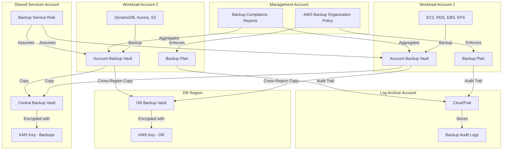
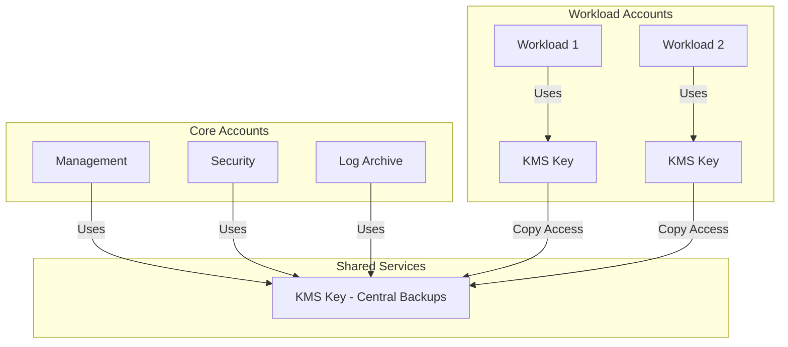

# Data Protection & Backup

This document describes the data protection and backup strategy for the AWS Landing Zone, including centralized backup management, encryption key strategy, disaster recovery procedures, and compliance considerations.

## Overview

Data protection in a multi-account environment requires a comprehensive approach that balances security, operational efficiency, recoverability, and compliance. This Landing Zone implements a defense-in-depth strategy using:

- **AWS Backup**: Centralized backup management with organization-wide policies
- **AWS KMS**: Encryption key management with cross-account access patterns
- **Data Classification**: Tiered approach to retention and encryption requirements
- **Cross-Region Backup**: Disaster recovery with geographic redundancy
- **Compliance Controls**: Audit trails and retention policies for regulatory requirements

## Backup Architecture



## AWS Backup Organization Policies

Centralized backup management using AWS Organizations policies.

### Backup Policy Structure

AWS Backup policies are JSON documents that define backup plans, rules, and vault configurations across the organization.

**Policy Components**:
- **Backup Plans**: Define backup schedules and retention
- **Backup Selections**: Specify which resources to back up
- **Backup Vaults**: Define where backups are stored
- **Copy Actions**: Configure cross-account and cross-region copies

### Organization-Wide Backup Policy

Applied at the Organization root or specific OUs:

```json
{
  "plans": {
    "ProductionBackupPlan": {
      "regions": {
        "@@assign": ["us-east-1", "us-west-2"]
      },
      "rules": {
        "DailyBackup": {
          "schedule_expression": {
            "@@assign": "cron(0 5 ? * * *)"
          },
          "start_backup_window_minutes": {
            "@@assign": "60"
          },
          "complete_backup_window_minutes": {
            "@@assign": "120"
          },
          "lifecycle": {
            "move_to_cold_storage_after_days": {
              "@@assign": "30"
            },
            "delete_after_days": {
              "@@assign": "365"
            }
          },
          "copy_actions": {
            "arn:aws:backup:us-west-2:111122223333:backup-vault:DRVault": {
              "lifecycle": {
                "delete_after_days": {
                  "@@assign": "365"
                }
              }
            }
          }
        },
        "WeeklyBackup": {
          "schedule_expression": {
            "@@assign": "cron(0 5 ? * SUN *)"
          },
          "lifecycle": {
            "move_to_cold_storage_after_days": {
              "@@assign": "90"
            },
            "delete_after_days": {
              "@@assign": "2555"
            }
          }
        }
      },
      "selections": {
        "tags": {
          "ProductionResources": {
            "iam_role_arn": {
              "@@assign": "arn:aws:iam::$account:role/AWSBackupDefaultServiceRole"
            },
            "tag_key": {
              "@@assign": "BackupPolicy"
            },
            "tag_value": {
              "@@assign": ["Production", "Critical"]
            }
          }
        }
      }
    }
  }
}
```

### Backup Plans by Environment

| Environment | Backup Frequency | Retention (Hot) | Retention (Cold) | Cross-Region | RTO | RPO |
|-------------|------------------|-----------------|------------------|--------------|-----|-----|
| Production | Daily + Weekly | 30 days | 7 years | Yes | 4 hours | 24 hours |
| Staging | Daily | 14 days | N/A | No | 8 hours | 24 hours |
| Development | Weekly | 7 days | N/A | No | 24 hours | 7 days |
| Sandbox | None | N/A | N/A | No | N/A | N/A |

### Resource Selection Strategies

**Tag-Based Selection**:
```json
{
  "selections": {
    "tags": {
      "DatabaseBackup": {
        "iam_role_arn": {
          "@@assign": "arn:aws:iam::$account:role/AWSBackupDefaultServiceRole"
        },
        "tag_key": {
          "@@assign": "BackupTier"
        },
        "tag_value": {
          "@@assign": ["Tier1", "Tier2"]
        }
      }
    }
  }
}
```

**Resource Type Selection**:
```json
{
  "selections": {
    "resources": {
      "AllRDS": {
        "iam_role_arn": {
          "@@assign": "arn:aws:iam::$account:role/AWSBackupDefaultServiceRole"
        },
        "resources": {
          "@@assign": ["arn:aws:rds:*:*:db:*"]
        }
      }
    }
  }
}
```

### Backup Compliance Reporting

AWS Backup provides compliance reports for organization-wide visibility:

**Report Types**:
- **Backup Job Report**: Status of all backup jobs
- **Copy Job Report**: Status of cross-account/region copies
- **Restore Job Report**: Restore activity and success rates
- **Compliance Report**: Resources with/without backup coverage

**Report Configuration**:
```hcl
resource "aws_backup_report_plan" "compliance" {
  name        = "organization-backup-compliance"
  description = "Organization-wide backup compliance report"

  report_delivery_channel {
    formats = ["CSV", "JSON"]
    s3_bucket_name = "backup-reports-${data.aws_caller_identity.current.account_id}"
    s3_key_prefix  = "compliance-reports/"
  }

  report_setting {
    report_template = "BACKUP_JOB_REPORT"
    
    framework_arns = [
      aws_backup_framework.compliance.arn
    ]
  }
}
```

## KMS Key Management Strategy

Encryption key strategy for backup data protection.

### Key Architecture Patterns

**Pattern 1: Centralized KMS Keys**

Single KMS key in Shared Services account for all backups:

**Advantages**:
- Simplified key management
- Single key policy to maintain
- Easier cross-account access

**Disadvantages**:
- Single point of failure
- Blast radius if key compromised
- All accounts depend on Shared Services

**Use Case**: Small organizations (< 20 accounts) with centralized security team

**Pattern 2: Per-Account KMS Keys**

Each account has its own KMS key for backups:

**Advantages**:
- Blast radius containment
- Account-level key rotation
- Independent key policies

**Disadvantages**:
- More keys to manage
- Complex cross-account policies
- Higher operational overhead

**Use Case**: Large organizations with decentralized teams

**Pattern 3: Hybrid Approach** (Recommended)

Centralized keys for core accounts, per-account keys for workload accounts:



### KMS Key Policy for Backups

**Cross-Account Backup Access**:

```json
{
  "Version": "2012-10-17",
  "Statement": [
    {
      "Sid": "Enable IAM User Permissions",
      "Effect": "Allow",
      "Principal": {
        "AWS": "arn:aws:iam::111122223333:root"
      },
      "Action": "kms:*",
      "Resource": "*"
    },
    {
      "Sid": "Allow AWS Backup to use the key",
      "Effect": "Allow",
      "Principal": {
        "Service": "backup.amazonaws.com"
      },
      "Action": [
        "kms:CreateGrant",
        "kms:DescribeKey",
        "kms:Decrypt",
        "kms:Encrypt",
        "kms:ReEncrypt*",
        "kms:GenerateDataKey*"
      ],
      "Resource": "*",
      "Condition": {
        "StringEquals": {
          "kms:ViaService": [
            "backup.us-east-1.amazonaws.com",
            "backup.us-west-2.amazonaws.com"
          ]
        }
      }
    },
    {
      "Sid": "Allow cross-account backup copy",
      "Effect": "Allow",
      "Principal": {
        "AWS": [
          "arn:aws:iam::444455556666:role/AWSBackupDefaultServiceRole",
          "arn:aws:iam::777788889999:role/AWSBackupDefaultServiceRole"
        ]
      },
      "Action": [
        "kms:Decrypt",
        "kms:DescribeKey"
      ],
      "Resource": "*",
      "Condition": {
        "StringEquals": {
          "kms:ViaService": "backup.us-east-1.amazonaws.com"
        }
      }
    },
    {
      "Sid": "Allow attachment of persistent resources",
      "Effect": "Allow",
      "Principal": {
        "Service": "backup.amazonaws.com"
      },
      "Action": "kms:CreateGrant",
      "Resource": "*",
      "Condition": {
        "Bool": {
          "kms:GrantIsForAWSResource": "true"
        }
      }
    }
  ]
}
```

### Key Rotation Policies

**Automatic Key Rotation**:
- Enabled for all KMS keys
- AWS rotates key material annually
- Old key material retained for decryption
- No application changes required

**Manual Key Rotation**:
- Required for imported key material
- Create new key with alias rotation
- Update key policies and grants
- Retain old key for decryption

**Rotation Schedule**:
```hcl
resource "aws_kms_key" "backup" {
  description             = "KMS key for backup encryption"
  deletion_window_in_days = 30
  enable_key_rotation     = true

  tags = {
    Name        = "backup-encryption-key"
    Purpose     = "Backup"
    Rotation    = "Automatic"
    Environment = "Production"
  }
}
```

### Multi-Region Keys for DR

Use multi-region KMS keys for cross-region backup encryption:

**Primary Key** (us-east-1):
```hcl
resource "aws_kms_key" "backup_primary" {
  description             = "Multi-region backup encryption key"
  multi_region            = true
  enable_key_rotation     = true
  deletion_window_in_days = 30
}

resource "aws_kms_alias" "backup_primary" {
  name          = "alias/backup-multi-region"
  target_key_id = aws_kms_key.backup_primary.key_id
}
```

**Replica Key** (us-west-2):
```hcl
resource "aws_kms_replica_key" "backup_replica" {
  provider = aws.us-west-2

  description             = "Multi-region backup encryption key replica"
  primary_key_arn         = aws_kms_key.backup_primary.arn
  deletion_window_in_days = 30
}

resource "aws_kms_alias" "backup_replica" {
  provider = aws.us-west-2

  name          = "alias/backup-multi-region"
  target_key_id = aws_kms_replica_key.backup_replica.key_id
}
```

**Benefits**:
- Same key ID in both regions
- Simplified cross-region restore
- No re-encryption required
- Consistent key policies

## Data Classification

Tiered approach to data protection based on sensitivity.

### Classification Levels

| Level | Description | Examples | Encryption | Retention | Backup Frequency |
|-------|-------------|----------|------------|-----------|------------------|
| **Public** | Publicly available data | Marketing content, public docs | Optional | 30 days | Weekly |
| **Internal** | Internal business data | Employee directories, internal wikis | Required (AES-256) | 1 year | Daily |
| **Confidential** | Sensitive business data | Financial records, customer data | Required (KMS) | 7 years | Daily + Weekly |
| **Restricted** | Highly sensitive data | PII, PHI, PCI, credentials | Required (KMS + MFA) | 7 years | Continuous |

### Tagging Strategy

Use tags to enforce classification-based policies:

```hcl
resource "aws_db_instance" "customer_db" {
  identifier = "customer-database"
  
  # ... other configuration ...
  
  tags = {
    DataClassification = "Confidential"
    BackupTier         = "Tier1"
    ComplianceScope    = "SOC2,HIPAA"
    RetentionPeriod    = "7years"
  }
}
```

### Retention Requirements by Classification

**Public Data**:
- Hot storage: 30 days
- Cold storage: Not required
- Deletion: After 30 days

**Internal Data**:
- Hot storage: 90 days
- Cold storage: 1 year
- Deletion: After 1 year

**Confidential Data**:
- Hot storage: 30 days
- Cold storage: 7 years
- Deletion: After 7 years (with audit trail)

**Restricted Data**:
- Hot storage: 90 days
- Cold storage: 7 years
- Deletion: Secure deletion with verification

### Encryption Requirements by Classification

**Public Data**:
- Encryption at rest: Optional
- Encryption in transit: Recommended (TLS 1.2+)
- Key management: AWS managed keys

**Internal Data**:
- Encryption at rest: Required (AES-256)
- Encryption in transit: Required (TLS 1.2+)
- Key management: AWS managed keys

**Confidential Data**:
- Encryption at rest: Required (KMS)
- Encryption in transit: Required (TLS 1.2+)
- Key management: Customer managed keys (CMK)
- Key rotation: Annual

**Restricted Data**:
- Encryption at rest: Required (KMS with MFA)
- Encryption in transit: Required (TLS 1.3)
- Key management: Customer managed keys (CMK)
- Key rotation: Quarterly
- Access logging: All decrypt operations

## Cross-Region Backup

Geographic redundancy for disaster recovery.

### DR Region Selection

**Criteria for DR Region**:
1. **Geographic Distance**: > 250 miles from primary region
2. **Service Availability**: All required services available
3. **Data Residency**: Complies with regulatory requirements
4. **Latency**: Acceptable for backup copy operations
5. **Cost**: Balanced with recovery requirements

**Common Region Pairs**:
| Primary Region | DR Region | Distance | Use Case |
|----------------|-----------|----------|----------|
| us-east-1 | us-west-2 | ~2,400 miles | US-based workloads |
| eu-west-1 | eu-central-1 | ~600 miles | EU data residency |
| ap-southeast-1 | ap-northeast-1 | ~3,000 miles | APAC workloads |

### Cross-Region Copy Rules

**Backup Plan with Cross-Region Copy**:

```hcl
resource "aws_backup_plan" "production" {
  name = "production-backup-plan"

  rule {
    rule_name         = "daily_backup"
    target_vault_name = aws_backup_vault.primary.name
    schedule          = "cron(0 5 ? * * *)"

    lifecycle {
      move_to_cold_storage_after_days = 30
      delete_after_days              = 365
    }

    copy_action {
      destination_vault_arn = aws_backup_vault.dr.arn

      lifecycle {
        move_to_cold_storage_after_days = 30
        delete_after_days              = 365
      }
    }
  }
}
```

**Copy Job Monitoring**:
```hcl
resource "aws_cloudwatch_metric_alarm" "backup_copy_failed" {
  alarm_name          = "backup-copy-job-failed"
  comparison_operator = "GreaterThanThreshold"
  evaluation_periods  = "1"
  metric_name         = "NumberOfBackupJobsFailed"
  namespace           = "AWS/Backup"
  period              = "300"
  statistic           = "Sum"
  threshold           = "0"
  alarm_description   = "Alert when backup copy job fails"
  alarm_actions       = [aws_sns_topic.backup_alerts.arn]

  dimensions = {
    BackupVaultName = aws_backup_vault.dr.name
  }
}
```

### RTO/RPO Considerations

**Recovery Time Objective (RTO)**:
- Time to restore service after disaster
- Factors: Backup size, network bandwidth, restore process complexity

**Recovery Point Objective (RPO)**:
- Maximum acceptable data loss
- Determined by backup frequency

**RTO/RPO Matrix**:

| Tier | RTO | RPO | Backup Frequency | Cost |
|------|-----|-----|------------------|------|
| Tier 1 (Critical) | < 4 hours | < 1 hour | Continuous + Daily | High |
| Tier 2 (Important) | < 8 hours | < 24 hours | Daily | Medium |
| Tier 3 (Standard) | < 24 hours | < 7 days | Weekly | Low |
| Tier 4 (Archive) | < 72 hours | < 30 days | Monthly | Very Low |

**Calculating RTO**:
```
RTO = Backup Retrieval Time + Data Transfer Time + Restore Process Time + Validation Time

Example (1TB database):
- Backup Retrieval: 30 minutes (from S3 Glacier)
- Data Transfer: 90 minutes (1TB at 150 MB/s)
- Restore Process: 60 minutes (database import)
- Validation: 30 minutes (integrity checks)
Total RTO: 3.5 hours
```

**Optimizing RTO**:
1. Use S3 Standard for hot backups (faster retrieval)
2. Pre-provision restore infrastructure (warm standby)
3. Automate restore procedures (runbooks, scripts)
4. Regular DR testing (quarterly)

## Disaster Recovery Procedures

Documented procedures for backup restoration and failover.

### Backup Restoration Process

**Step 1: Identify Recovery Point**

```bash
# List available recovery points
aws backup list-recovery-points-by-backup-vault \
  --backup-vault-name ProductionBackupVault \
  --by-resource-arn arn:aws:rds:us-east-1:123456789012:db:production-db

# Get recovery point details
aws backup describe-recovery-point \
  --backup-vault-name ProductionBackupVault \
  --recovery-point-arn <recovery-point-arn>
```

**Step 2: Initiate Restore Job**

```bash
# Restore RDS database
aws backup start-restore-job \
  --recovery-point-arn <recovery-point-arn> \
  --iam-role-arn arn:aws:iam::123456789012:role/AWSBackupDefaultServiceRole \
  --metadata '{
    "DBInstanceIdentifier": "restored-production-db",
    "DBInstanceClass": "db.r5.xlarge",
    "Engine": "postgres",
    "MultiAZ": "true",
    "PubliclyAccessible": "false",
    "VpcSecurityGroupIds": "sg-0123456789abcdef0"
  }'
```

**Step 3: Monitor Restore Progress**

```bash
# Check restore job status
aws backup describe-restore-job \
  --restore-job-id <restore-job-id>

# Monitor CloudWatch metrics
aws cloudwatch get-metric-statistics \
  --namespace AWS/Backup \
  --metric-name RestoreJobsCompleted \
  --dimensions Name=ResourceType,Value=RDS \
  --start-time 2024-01-01T00:00:00Z \
  --end-time 2024-01-01T23:59:59Z \
  --period 3600 \
  --statistics Sum
```

**Step 4: Validate Restored Data**

```bash
# Connect to restored database
psql -h restored-production-db.abc123.us-east-1.rds.amazonaws.com \
     -U admin -d production

# Run validation queries
SELECT COUNT(*) FROM customers;
SELECT MAX(created_at) FROM orders;

# Compare with expected values
```

**Step 5: Update Application Configuration**

```bash
# Update DNS or load balancer to point to restored resource
aws route53 change-resource-record-sets \
  --hosted-zone-id Z1234567890ABC \
  --change-batch file://dns-update.json

# Update application configuration
aws ssm put-parameter \
  --name /app/database/endpoint \
  --value restored-production-db.abc123.us-east-1.rds.amazonaws.com \
  --overwrite
```

### Cross-Region Failover

**Scenario**: Primary region (us-east-1) is unavailable, failover to DR region (us-west-2).

**Pre-Requisites**:
- Cross-region backup copies enabled
- DR region infrastructure pre-provisioned (warm standby)
- DNS failover configured (Route 53 health checks)
- Runbook tested quarterly

**Failover Steps**:

1. **Declare Disaster**: Incident commander declares DR event
2. **Activate DR Team**: Notify on-call engineers via PagerDuty
3. **Verify DR Backups**: Confirm latest backups available in DR region
4. **Restore Resources**: Execute restore jobs in DR region
5. **Update DNS**: Failover Route 53 to DR region endpoints
6. **Validate Services**: Run smoke tests and health checks
7. **Monitor**: Watch CloudWatch dashboards for anomalies
8. **Communicate**: Update status page and notify stakeholders

**Automated Failover** (for critical services):

```python
# Lambda function for automated DR failover
import boto3

def lambda_handler(event, context):
    # Triggered by CloudWatch alarm (primary region unhealthy)
    
    backup_client = boto3.client('backup', region_name='us-west-2')
    route53_client = boto3.client('route53')
    
    # Get latest recovery point in DR region
    recovery_points = backup_client.list_recovery_points_by_backup_vault(
        BackupVaultName='DRBackupVault',
        ByResourceArn='arn:aws:rds:us-east-1:123456789012:db:production-db'
    )
    
    latest_recovery_point = recovery_points['RecoveryPoints'][0]['RecoveryPointArn']
    
    # Start restore job
    restore_job = backup_client.start_restore_job(
        RecoveryPointArn=latest_recovery_point,
        IamRoleArn='arn:aws:iam::123456789012:role/AWSBackupDefaultServiceRole',
        Metadata={
            'DBInstanceIdentifier': 'production-db-dr',
            'DBInstanceClass': 'db.r5.xlarge',
            'Engine': 'postgres',
            'MultiAZ': 'true'
        }
    )
    
    # Wait for restore to complete (poll status)
    # ...
    
    # Update Route 53 to point to DR region
    route53_client.change_resource_record_sets(
        HostedZoneId='Z1234567890ABC',
        ChangeBatch={
            'Changes': [{
                'Action': 'UPSERT',
                'ResourceRecordSet': {
                    'Name': 'db.example.com',
                    'Type': 'CNAME',
                    'TTL': 60,
                    'ResourceRecords': [{'Value': 'production-db-dr.us-west-2.rds.amazonaws.com'}]
                }
            }]
        }
    )
    
    return {'statusCode': 200, 'body': 'DR failover initiated'}
```

### Testing DR Procedures

**Quarterly DR Test Schedule**:
- **Q1**: Restore single database from backup
- **Q2**: Cross-region failover simulation (non-production)
- **Q3**: Full DR exercise (all critical services)
- **Q4**: Tabletop exercise with stakeholders

**DR Test Checklist**:
- [ ] Identify test scope (which services to restore)
- [ ] Schedule test window (off-peak hours)
- [ ] Notify stakeholders (no customer impact expected)
- [ ] Execute restore procedures
- [ ] Measure RTO/RPO actuals vs. targets
- [ ] Document issues and lessons learned
- [ ] Update runbooks based on findings
- [ ] Report results to leadership

**DR Test Metrics**:
```hcl
resource "aws_cloudwatch_dashboard" "dr_testing" {
  dashboard_name = "dr-testing-metrics"

  dashboard_body = jsonencode({
    widgets = [
      {
        type = "metric"
        properties = {
          metrics = [
            ["Custom/DR", "RestoreTimeMinutes", { stat = "Average" }],
            ["Custom/DR", "DataLossHours", { stat = "Maximum" }],
            ["Custom/DR", "TestSuccessRate", { stat = "Average" }]
          ]
          period = 2592000  # 30 days
          stat   = "Average"
          region = "us-east-1"
          title  = "DR Testing Metrics"
        }
      }
    ]
  })
}
```

## Compliance Considerations

Backup and data protection requirements for regulatory compliance.

### Data Residency Requirements

**Regional Restrictions**:
- **GDPR (EU)**: Data must remain in EU regions
- **CCPA (California)**: No specific residency requirement, but data access controls required
- **HIPAA (Healthcare)**: No specific residency requirement, but BAA required with AWS
- **PCI DSS (Payment Card)**: No specific residency requirement, but encryption and access controls required

**Implementation**:
```hcl
# Enforce backup region restrictions via SCP
resource "aws_organizations_policy" "backup_region_restriction" {
  name        = "backup-region-restriction"
  description = "Restrict backup operations to approved regions"
  type        = "SERVICE_CONTROL_POLICY"

  content = jsonencode({
    Version = "2012-10-17"
    Statement = [
      {
        Sid    = "DenyBackupOutsideApprovedRegions"
        Effect = "Deny"
        Action = [
          "backup:CreateBackupVault",
          "backup:StartBackupJob",
          "backup:StartCopyJob"
        ]
        Resource = "*"
        Condition = {
          StringNotEquals = {
            "aws:RequestedRegion" = [
              "eu-west-1",
              "eu-central-1"
            ]
          }
        }
      }
    ]
  })
}
```

### Audit Trail for Backups

**CloudTrail Logging**:
- All backup operations logged to CloudTrail
- Logs stored in Log Archive account
- Immutable log storage (S3 Object Lock)
- Log retention: 7 years

**Key Events to Monitor**:
```json
{
  "eventName": [
    "CreateBackupVault",
    "DeleteBackupVault",
    "StartBackupJob",
    "StartRestoreJob",
    "DeleteRecoveryPoint",
    "UpdateRecoveryPointLifecycle",
    "PutBackupVaultAccessPolicy"
  ]
}
```

**Audit Log Analysis**:
```bash
# Query CloudTrail logs for backup deletions
aws cloudtrail lookup-events \
  --lookup-attributes AttributeKey=EventName,AttributeValue=DeleteRecoveryPoint \
  --start-time 2024-01-01T00:00:00Z \
  --end-time 2024-12-31T23:59:59Z

# Analyze with Athena
SELECT 
  useridentity.principalid,
  eventname,
  eventtime,
  requestparameters
FROM cloudtrail_logs
WHERE eventname IN ('DeleteRecoveryPoint', 'DeleteBackupVault')
  AND eventtime > date_add('day', -90, current_date)
ORDER BY eventtime DESC;
```

### Retention for Compliance

**Compliance Framework Retention Requirements**:

| Framework | Retention Period | Backup Type | Notes |
|-----------|------------------|-------------|-------|
| **SOC 2** | 1 year (audit period) | Daily | Must demonstrate continuous backup |
| **HIPAA** | 6 years | Daily + Weekly | PHI retention requirement |
| **PCI DSS** | 3 months (logs), 1 year (audit) | Daily | Cardholder data environment |
| **GDPR** | Varies by data type | Daily | Right to erasure applies |
| **SEC 17a-4** | 7 years | Daily | Financial records (WORM storage) |
| **FINRA** | 6 years | Daily | Broker-dealer records |

**Implementing Compliance Retention**:

```hcl
resource "aws_backup_plan" "hipaa_compliant" {
  name = "hipaa-compliant-backup-plan"

  rule {
    rule_name         = "daily_backup_6year_retention"
    target_vault_name = aws_backup_vault.hipaa.name
    schedule          = "cron(0 5 ? * * *)"

    lifecycle {
      move_to_cold_storage_after_days = 90
      delete_after_days              = 2190  # 6 years
    }

    copy_action {
      destination_vault_arn = aws_backup_vault.hipaa_dr.arn

      lifecycle {
        move_to_cold_storage_after_days = 90
        delete_after_days              = 2190
      }
    }
  }
}

# Prevent deletion with vault lock
resource "aws_backup_vault_lock_configuration" "hipaa" {
  backup_vault_name   = aws_backup_vault.hipaa.name
  min_retention_days  = 2190  # 6 years
  max_retention_days  = 2555  # 7 years
  changeable_for_days = 3     # Grace period before lock becomes immutable
}
```

**WORM Storage for SEC 17a-4**:

```hcl
# S3 bucket with Object Lock for immutable backups
resource "aws_s3_bucket" "sec_17a4_backups" {
  bucket = "sec-17a4-compliant-backups"

  object_lock_enabled = true
}

resource "aws_s3_bucket_object_lock_configuration" "sec_17a4" {
  bucket = aws_s3_bucket.sec_17a4_backups.id

  rule {
    default_retention {
      mode = "COMPLIANCE"  # Cannot be deleted by anyone, including root
      years = 7
    }
  }
}
```

### Compliance Reporting

**Automated Compliance Reports**:

```hcl
resource "aws_backup_report_plan" "compliance_report" {
  name        = "backup-compliance-report"
  description = "Daily backup compliance report for audit"

  report_delivery_channel {
    formats        = ["CSV", "JSON"]
    s3_bucket_name = aws_s3_bucket.compliance_reports.id
    s3_key_prefix  = "backup-compliance/"
  }

  report_setting {
    report_template = "RESOURCE_COMPLIANCE_REPORT"
    
    accounts = ["*"]  # All accounts in organization
    
    organization_units = [
      aws_organizations_organizational_unit.production.id
    ]
    
    regions = ["us-east-1", "us-west-2"]
    
    framework_arns = [
      aws_backup_framework.hipaa.arn,
      aws_backup_framework.pci.arn
    ]
  }
}
```

**Compliance Dashboard**:

```hcl
resource "aws_cloudwatch_dashboard" "backup_compliance" {
  dashboard_name = "backup-compliance-dashboard"

  dashboard_body = jsonencode({
    widgets = [
      {
        type = "metric"
        properties = {
          metrics = [
            ["AWS/Backup", "NumberOfBackupJobsCompleted"],
            ["AWS/Backup", "NumberOfBackupJobsFailed"],
            ["AWS/Backup", "NumberOfRecoveryPointsCreated"]
          ]
          period = 86400  # Daily
          stat   = "Sum"
          region = "us-east-1"
          title  = "Backup Job Status"
        }
      },
      {
        type = "metric"
        properties = {
          metrics = [
            ["Custom/Compliance", "ResourcesWithBackup", { stat = "Average" }],
            ["Custom/Compliance", "ResourcesWithoutBackup", { stat = "Average" }]
          ]
          period = 86400
          stat   = "Average"
          region = "us-east-1"
          title  = "Backup Coverage"
        }
      }
    ]
  })
}
```

## Best Practices

### Backup Validation

**Regular Restore Testing**:
- Test restores monthly (automated)
- Validate data integrity after restore
- Measure actual RTO/RPO vs. targets
- Document restore procedures

**Automated Validation**:
```python
# Lambda function for automated backup validation
import boto3
import hashlib

def lambda_handler(event, context):
    backup_client = boto3.client('backup')
    
    # Get latest recovery point
    recovery_points = backup_client.list_recovery_points_by_backup_vault(
        BackupVaultName='ProductionBackupVault'
    )
    
    latest_rp = recovery_points['RecoveryPoints'][0]
    
    # Start restore to test environment
    restore_job = backup_client.start_restore_job(
        RecoveryPointArn=latest_rp['RecoveryPointArn'],
        IamRoleArn='arn:aws:iam::123456789012:role/AWSBackupDefaultServiceRole',
        Metadata={
            'DBInstanceIdentifier': 'validation-test-db',
            'DBInstanceClass': 'db.t3.small'
        }
    )
    
    # Wait for restore to complete
    # Run validation queries
    # Compare checksums
    # Delete test instance
    
    return {'statusCode': 200, 'body': 'Backup validation completed'}
```

### Cost Optimization

**Lifecycle Policies**:
- Move to cold storage after 30 days (80% cost reduction)
- Delete old backups per retention policy
- Use S3 Intelligent-Tiering for backup storage

**Backup Frequency Optimization**:
- Critical data: Daily + continuous
- Important data: Daily
- Standard data: Weekly
- Archive data: Monthly

**Cross-Region Copy Optimization**:
- Only copy critical backups cross-region
- Use S3 Transfer Acceleration for large backups
- Schedule copies during off-peak hours

### Security Hardening

**Backup Vault Access Control**:
```json
{
  "Version": "2012-10-17",
  "Statement": [
    {
      "Sid": "DenyDeleteRecoveryPoint",
      "Effect": "Deny",
      "Principal": "*",
      "Action": "backup:DeleteRecoveryPoint",
      "Resource": "*",
      "Condition": {
        "StringNotLike": {
          "aws:PrincipalArn": "arn:aws:iam::123456789012:role/BackupAdmin"
        }
      }
    }
  ]
}
```

**MFA Delete for Critical Backups**:
```hcl
resource "aws_s3_bucket_versioning" "backup_bucket" {
  bucket = aws_s3_bucket.backups.id

  versioning_configuration {
    status     = "Enabled"
    mfa_delete = "Enabled"
  }
}
```

**Backup Encryption Enforcement**:
```json
{
  "Version": "2012-10-17",
  "Statement": [
    {
      "Sid": "DenyUnencryptedBackups",
      "Effect": "Deny",
      "Action": "backup:StartBackupJob",
      "Resource": "*",
      "Condition": {
        "StringNotEquals": {
          "backup:EncryptionKeyArn": "arn:aws:kms:us-east-1:123456789012:key/*"
        }
      }
    }
  ]
}
```

### Monitoring and Alerting

**Critical Backup Alerts**:
- Backup job failures
- Missing scheduled backups
- Cross-region copy failures
- Backup vault access changes
- Recovery point deletions

**CloudWatch Alarms**:
```hcl
resource "aws_cloudwatch_metric_alarm" "backup_job_failed" {
  alarm_name          = "backup-job-failed"
  comparison_operator = "GreaterThanThreshold"
  evaluation_periods  = "1"
  metric_name         = "NumberOfBackupJobsFailed"
  namespace           = "AWS/Backup"
  period              = "300"
  statistic           = "Sum"
  threshold           = "0"
  alarm_description   = "Alert when backup job fails"
  alarm_actions       = [aws_sns_topic.critical_alerts.arn]
}

resource "aws_cloudwatch_metric_alarm" "missing_backup" {
  alarm_name          = "missing-scheduled-backup"
  comparison_operator = "LessThanThreshold"
  evaluation_periods  = "1"
  metric_name         = "NumberOfBackupJobsCreated"
  namespace           = "AWS/Backup"
  period              = "86400"  # 24 hours
  statistic           = "Sum"
  threshold           = "1"
  alarm_description   = "Alert when no backup jobs created in 24 hours"
  alarm_actions       = [aws_sns_topic.critical_alerts.arn]
}
```

## Related

- [Security Model](./security-model)
- [Multi-Account Architecture](./multi-account)
- [IAM Strategy](./iam-strategy)
- [Network Design](./network-design)
