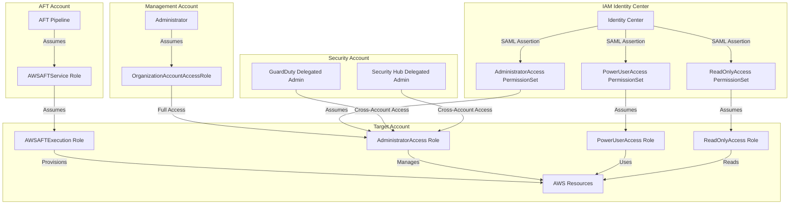
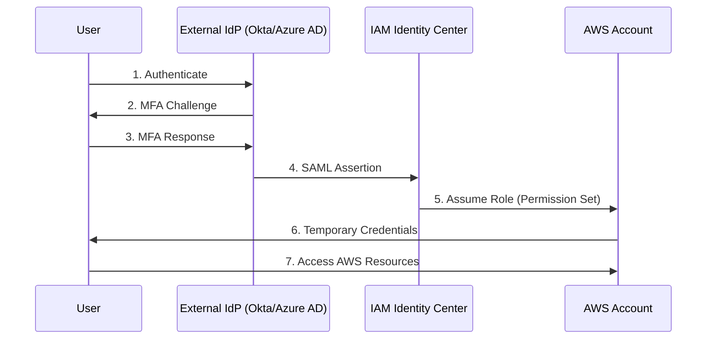
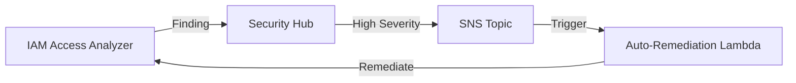

# IAM Strategy

This document describes the Identity and Access Management (IAM) strategy for the AWS Landing Zone, including cross-account access patterns, identity federation, and security best practices.

## Overview

IAM in a multi-account environment requires careful design to balance security, operational efficiency, and auditability. This Landing Zone implements a defense-in-depth approach using:

- **IAM Identity Center**: Centralized human access with federated identities
- **Cross-Account Roles**: Service-to-service and automation access
- **Service Control Policies**: Organization-wide guardrails
- **Permission Boundaries**: Prevent privilege escalation
- **IAM Access Analyzer**: Continuous monitoring for unintended access

## Cross-Account Access Patterns



## Cross-Account Role Strategy

### OrganizationAccountAccessRole

Created automatically by AWS Organizations when a new account is created.

**Purpose**: Allows the Management account to access member accounts for administrative tasks.

**Trust Policy**:
```json
{
  "Version": "2012-10-17",
  "Statement": [
    {
      "Effect": "Allow",
      "Principal": {
        "AWS": "arn:aws:iam::111122223333:root"
      },
      "Action": "sts:AssumeRole"
    }
  ]
}
```

**Permissions**: `AdministratorAccess` (AWS managed policy)

**Security Considerations**:
- Should only be used for break-glass scenarios
- All access should be logged via CloudTrail
- Consider restricting with SCPs or permission boundaries
- Prefer IAM Identity Center for day-to-day access

### AFT Execution Roles

Account Factory for Terraform uses dedicated roles for account provisioning and customization.

#### AWSAFTExecution

**Purpose**: Allows AFT to provision and customize resources in target accounts.

**Trust Policy**:
```json
{
  "Version": "2012-10-17",
  "Statement": [
    {
      "Effect": "Allow",
      "Principal": {
        "AWS": "arn:aws:iam::<AFT_ACCOUNT_ID>:role/AWSAFTService"
      },
      "Action": "sts:AssumeRole"
    }
  ]
}
```

**Permissions**: 
- `AdministratorAccess` (can be scoped down with permission boundaries)
- Used during account customization phase
- Executes Terraform in target accounts

#### AWSAFTService

**Purpose**: Service role for AFT Step Functions and Lambda functions.

**Trust Policy**:
```json
{
  "Version": "2012-10-17",
  "Statement": [
    {
      "Effect": "Allow",
      "Principal": {
        "Service": [
          "lambda.amazonaws.com",
          "states.amazonaws.com"
        ]
      },
      "Action": "sts:AssumeRole"
    }
  ]
}
```

**Permissions**:
- Assume AWSAFTExecution in target accounts
- Read/write to AFT DynamoDB tables
- Invoke AFT Lambda functions
- Execute Step Functions state machines

### Custom Cross-Account Roles

For specific services and use cases:

| Role Name | Source Account | Target Account | Purpose |
|-----------|----------------|----------------|---------|
| GuardDutyMemberRole | Security | All accounts | GuardDuty findings aggregation |
| SecurityHubMemberRole | Security | All accounts | Security Hub findings aggregation |
| ConfigAggregatorRole | Log Archive | All accounts | Config data aggregation |
| CloudTrailRole | Log Archive | All accounts | CloudTrail log delivery |
| BackupRole | Shared Services | Workload accounts | Centralized backup management |

**Trust Policy Pattern**:
```json
{
  "Version": "2012-10-17",
  "Statement": [
    {
      "Effect": "Allow",
      "Principal": {
        "AWS": "arn:aws:iam::<SOURCE_ACCOUNT_ID>:role/<SOURCE_ROLE>"
      },
      "Action": "sts:AssumeRole",
      "Condition": {
        "StringEquals": {
          "sts:ExternalId": "<UNIQUE_EXTERNAL_ID>"
        }
      }
    }
  ]
}
```

**Best Practices**:
- Always use ExternalId for third-party or cross-account access
- Scope permissions to least privilege
- Use session tags for audit trails
- Set maximum session duration appropriately (1-12 hours)

## IAM Identity Center (AWS SSO)

Centralized identity management for human users accessing AWS accounts.

### Permission Sets

Permission sets define the level of access users have when they assume roles in accounts.

| Permission Set | Managed Policies | Session Duration | MFA Required | Target Accounts |
|----------------|------------------|------------------|--------------|-----------------|
| AdministratorAccess | AdministratorAccess | 4 hours | Yes | All |
| PowerUserAccess | PowerUserAccess | 8 hours | Yes | Non-Production, Sandbox |
| ReadOnlyAccess | ReadOnlyAccess | 12 hours | No | All |
| SecurityAudit | SecurityAudit, ViewOnlyAccess | 8 hours | Yes | All |
| NetworkAdministrator | Custom inline policy | 8 hours | Yes | Network Hub, Infrastructure |
| DeveloperAccess | Custom inline policy | 8 hours | Yes | Non-Production, Sandbox |
| BillingAccess | Billing | 4 hours | Yes | Management |

### Account Assignments

Users and groups are assigned to permission sets in specific accounts:

```
Group: Platform-Admins
  → AdministratorAccess in Management, Security, Log Archive, Network Hub
  
Group: Developers
  → PowerUserAccess in Non-Production OU
  → ReadOnlyAccess in Production OU
  
Group: Security-Team
  → SecurityAudit in All Accounts
  → AdministratorAccess in Security Account
  
Group: Finance
  → BillingAccess in Management Account
  → ReadOnlyAccess in All Accounts
```

### Session Configuration

**Session Duration**:
- Administrative access: 4 hours (requires re-authentication)
- Developer access: 8 hours (balance between security and productivity)
- Read-only access: 12 hours (lowest risk)

**MFA Requirements**:
- Required for all administrative access
- Required for production account access
- Optional for read-only access in non-production

**Session Tags**:
```json
{
  "PrincipalTags": {
    "Email": "${path:email}",
    "Department": "${path:department}",
    "CostCenter": "${path:costCenter}"
  }
}
```

### External Identity Provider Integration

IAM Identity Center can integrate with external IdPs via SAML 2.0:

- **Okta**: Enterprise SSO with MFA
- **Azure AD**: Microsoft 365 integration
- **Google Workspace**: Google identity federation
- **ADFS**: On-premises Active Directory

**Integration Flow**:


## Service-Linked Roles

AWS services automatically create service-linked roles (SLRs) when needed.

### Common Service-Linked Roles in Landing Zone

| Service | Role Name | Purpose |
|---------|-----------|---------|
| AWS Organizations | AWSServiceRoleForOrganizations | Manage organization and accounts |
| GuardDuty | AWSServiceRoleForAmazonGuardDuty | Analyze VPC Flow Logs, DNS logs, CloudTrail |
| Security Hub | AWSServiceRoleForSecurityHub | Aggregate findings from security services |
| AWS Config | AWSServiceRoleForConfig | Record resource configurations |
| IAM Access Analyzer | AWSServiceRoleForAccessAnalyzer | Analyze resource policies |
| AWS Firewall Manager | AWSServiceRoleForFMS | Manage security policies across accounts |
| AWS SSO | AWSServiceRoleForSSO | Provision roles in member accounts |
| Transit Gateway | AWSServiceRoleForVPCTransitGateway | Manage Transit Gateway attachments |

**Characteristics**:
- Cannot be modified (trust policy and permissions are fixed)
- Automatically created when service is enabled
- Can only be deleted when service is disabled
- Scoped to specific service actions

**Management**:
- Do not attempt to manage SLRs in Terraform
- Document which services create SLRs in your environment
- Monitor SLR usage via IAM Access Analyzer

## Break-Glass Access

Emergency access procedures for critical situations.

### Root Account Protection

**Root Account Usage**:
- Only for tasks that require root (account closure, billing changes)
- MFA required (hardware token recommended)
- Credentials stored in secure vault (1Password, AWS Secrets Manager)
- All root actions logged and alerted

**Root Account Restrictions**:
```json
{
  "Version": "2012-10-17",
  "Statement": [
    {
      "Sid": "DenyRootUser",
      "Effect": "Deny",
      "Action": "*",
      "Resource": "*",
      "Condition": {
        "StringLike": {
          "aws:PrincipalArn": "arn:aws:iam::*:root"
        }
      }
    }
  ]
}
```

**Exceptions** (allowed root actions):
- Change account settings
- Close account
- Change AWS Support plan
- Register for GovCloud
- Restore IAM user permissions (if locked out)

### Break-Glass IAM Users

For scenarios where IAM Identity Center is unavailable.

**Setup**:
1. Create IAM user: `break-glass-admin`
2. Attach policy: `AdministratorAccess`
3. Enable MFA (hardware token)
4. Store credentials in secure vault
5. Set up CloudWatch alarm for usage

**Monitoring**:
```json
{
  "filterPattern": "{ $.userIdentity.userName = \"break-glass-admin\" }",
  "metricName": "BreakGlassUsage",
  "metricNamespace": "Security",
  "metricValue": "1"
}
```

**Procedure**:
1. Retrieve credentials from secure vault
2. Authenticate with MFA
3. Document reason for break-glass access
4. Perform emergency action
5. Rotate credentials after use
6. Conduct post-incident review

## IAM Access Analyzer

Continuous monitoring for unintended access to resources.

### Organization-Wide Analyzer

**Deployment**:
- Created in Security account (delegated administrator)
- Analyzes all accounts in organization
- Findings aggregated in Security Hub

**Analyzed Resources**:
- S3 buckets
- IAM roles
- KMS keys
- Lambda functions
- SQS queues
- Secrets Manager secrets
- SNS topics

### Finding Types

| Finding Type | Severity | Description | Remediation |
|--------------|----------|-------------|-------------|
| External Access | High | Resource accessible outside organization | Review and restrict policy |
| Public Access | Critical | Resource publicly accessible | Remove public access or add conditions |
| Cross-Account Access | Medium | Resource shared with specific account | Verify trust relationship |
| Unused Access | Low | Permissions granted but not used | Remove unused permissions |

### Integration with Security Hub

Access Analyzer findings are automatically sent to Security Hub:



**Automated Remediation**:
- Public S3 bucket → Enable block public access
- Overly permissive role → Create Security Hub ticket
- External KMS key access → Alert security team

### Policy Validation

Use Access Analyzer policy validation before deploying IAM policies:

```bash
aws accessanalyzer validate-policy \
  --policy-document file://policy.json \
  --policy-type IDENTITY_POLICY
```

**Validation Checks**:
- Syntax errors
- Security warnings (e.g., `"Resource": "*"`)
- Suggestions for improvement
- Best practice recommendations

## Permission Boundaries

Prevent privilege escalation by limiting maximum permissions.

### Use Cases

1. **Delegated Administration**: Allow teams to create IAM roles without granting full IAM permissions
2. **AFT Account Customization**: Limit what AFT can provision in accounts
3. **Developer Sandboxes**: Allow experimentation while preventing dangerous actions

### AFT Permission Boundary

Applied to all roles created by AFT in member accounts:

```json
{
  "Version": "2012-10-17",
  "Statement": [
    {
      "Sid": "AllowedServices",
      "Effect": "Allow",
      "Action": [
        "ec2:*",
        "s3:*",
        "lambda:*",
        "dynamodb:*",
        "rds:*",
        "ecs:*"
      ],
      "Resource": "*"
    },
    {
      "Sid": "DenyIAMEscalation",
      "Effect": "Deny",
      "Action": [
        "iam:CreateUser",
        "iam:CreateAccessKey",
        "iam:DeleteUserPermissionsBoundary",
        "iam:DeleteRolePermissionsBoundary",
        "iam:PutUserPermissionsBoundary",
        "iam:PutRolePermissionsBoundary"
      ],
      "Resource": "*"
    },
    {
      "Sid": "DenyOrganizationChanges",
      "Effect": "Deny",
      "Action": [
        "organizations:LeaveOrganization",
        "organizations:DeleteOrganization"
      ],
      "Resource": "*"
    }
  ]
}
```

### Delegated IAM Administration

Allow developers to create roles within boundaries:

```json
{
  "Version": "2012-10-17",
  "Statement": [
    {
      "Sid": "AllowCreateRoleWithBoundary",
      "Effect": "Allow",
      "Action": [
        "iam:CreateRole",
        "iam:AttachRolePolicy"
      ],
      "Resource": "*",
      "Condition": {
        "StringEquals": {
          "iam:PermissionsBoundary": "arn:aws:iam::123456789012:policy/DeveloperBoundary"
        }
      }
    },
    {
      "Sid": "DenyBoundaryModification",
      "Effect": "Deny",
      "Action": [
        "iam:DeleteRolePermissionsBoundary",
        "iam:PutRolePermissionsBoundary"
      ],
      "Resource": "*"
    }
  ]
}
```

## Session Tagging

Use session tags for fine-grained access control and audit trails.

### Principal Tags from Identity Center

Tags passed from IAM Identity Center to assumed roles:

```json
{
  "Version": "2012-10-17",
  "Statement": [
    {
      "Sid": "AllowS3AccessByDepartment",
      "Effect": "Allow",
      "Action": "s3:*",
      "Resource": "arn:aws:s3:::${aws:PrincipalTag/Department}/*"
    }
  ]
}
```

**Example**: User with `Department=Engineering` tag can only access `s3://engineering/*`

### Cost Allocation Tags

Session tags automatically applied to resources for cost tracking:

```json
{
  "PrincipalTags": {
    "CostCenter": "${path:costCenter}",
    "Project": "${path:project}",
    "Owner": "${path:email}"
  }
}
```

**Benefits**:
- Automatic cost allocation by team/project
- No manual tagging required
- Audit trail of who created resources

### Audit Trail Enhancement

Session tags appear in CloudTrail logs:

```json
{
  "eventName": "CreateBucket",
  "userIdentity": {
    "type": "AssumedRole",
    "principalId": "AIDAI...:user@example.com",
    "sessionContext": {
      "sessionIssuer": {
        "type": "Role",
        "principalId": "AIDAI...",
        "arn": "arn:aws:iam::123456789012:role/PowerUserAccess"
      },
      "attributes": {
        "creationDate": "2024-01-15T10:30:00Z",
        "mfaAuthenticated": "true"
      }
    }
  },
  "requestParameters": {
    "bucketName": "my-bucket",
    "tags": {
      "CostCenter": "12345",
      "Owner": "user@example.com"
    }
  }
}
```

## Best Practices

### Least Privilege Principle

**Start with minimum permissions**:
1. Grant only permissions required for the task
2. Use IAM Access Analyzer to identify unused permissions
3. Regularly review and remove unnecessary permissions
4. Use permission boundaries to limit maximum permissions

**Avoid wildcards**:
```json
// Bad
{
  "Effect": "Allow",
  "Action": "*",
  "Resource": "*"
}

// Good
{
  "Effect": "Allow",
  "Action": [
    "s3:GetObject",
    "s3:PutObject"
  ],
  "Resource": "arn:aws:s3:::my-bucket/*"
}
```

### Role Naming Conventions

Consistent naming for cross-account roles:

```
<Purpose>-<SourceAccount>-<TargetAccount>-Role

Examples:
- GuardDuty-Security-Member-Role
- Backup-SharedServices-Workload-Role
- AFTExecution-AFT-Member-Role
```

**Benefits**:
- Easy to identify role purpose
- Clear trust relationships
- Simplified automation

### Policy Size Limits

**Limits**:
- Managed policy: 6,144 characters
- Inline policy: 2,048 characters (role), 10,240 characters (user/group)
- Role trust policy: 2,048 characters

**Workarounds**:
1. **Use multiple managed policies**: Attach up to 10 managed policies per role
2. **Use resource-based policies**: Move permissions to resource side (S3 bucket policy)
3. **Use permission boundaries**: Define maximum permissions separately
4. **Consolidate actions**: Use wildcards for related actions (`s3:Get*`)

**Example**:
```json
// Instead of listing 100 S3 buckets
{
  "Effect": "Allow",
  "Action": "s3:GetObject",
  "Resource": [
    "arn:aws:s3:::bucket1/*",
    "arn:aws:s3:::bucket2/*",
    ...
  ]
}

// Use condition with tag
{
  "Effect": "Allow",
  "Action": "s3:GetObject",
  "Resource": "arn:aws:s3:::*/*",
  "Condition": {
    "StringEquals": {
      "s3:ExistingObjectTag/Environment": "Production"
    }
  }
}
```

### Regular Access Reviews

**Quarterly Reviews**:
- Review IAM users (should be minimal, prefer Identity Center)
- Review cross-account role trust policies
- Review permission set assignments
- Identify and remove unused roles

**Automated Detection**:
```bash
# Find roles not used in 90 days
aws iam get-credential-report
aws iam generate-credential-report

# Use IAM Access Analyzer
aws accessanalyzer list-findings \
  --analyzer-arn arn:aws:access-analyzer:us-east-1:123456789012:analyzer/org-analyzer \
  --filter '{"findingType": {"eq": ["UnusedAccess"]}}'
```

### MFA Enforcement

**Require MFA for sensitive actions**:
```json
{
  "Version": "2012-10-17",
  "Statement": [
    {
      "Sid": "DenyAllExceptListedIfNoMFA",
      "Effect": "Deny",
      "NotAction": [
        "iam:CreateVirtualMFADevice",
        "iam:EnableMFADevice",
        "iam:GetUser",
        "iam:ListMFADevices",
        "iam:ListVirtualMFADevices",
        "iam:ResyncMFADevice",
        "sts:GetSessionToken"
      ],
      "Resource": "*",
      "Condition": {
        "BoolIfExists": {
          "aws:MultiFactorAuthPresent": "false"
        }
      }
    }
  ]
}
```

### Credential Rotation

**Rotation Schedule**:
- IAM user access keys: 90 days (prefer temporary credentials)
- Service account keys: 180 days
- Root account password: Annually
- Break-glass credentials: After each use

**Automation**:
- Use AWS Secrets Manager for automatic rotation
- Set up CloudWatch alarms for credentials older than threshold
- Use IAM credential report for compliance checks

## Related

- [Security Model](./security-model)
- [Multi-Account Architecture](./multi-account)
- [Organization Module](../modules/organization)
- [AFT Module](../modules/aft)
