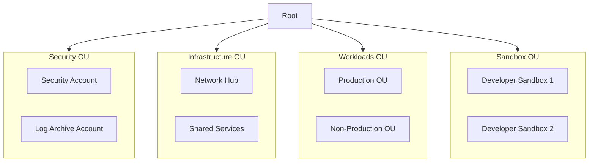

# Multi-Account Strategy

This document describes the multi-account strategy and Organizational Unit (OU) structure.

## Why Multi-Account?

- **Blast Radius Reduction**: Issues in one account don't affect others
- **Cost Allocation**: Clear cost attribution per workload/team
- **Security Boundaries**: IAM policies scoped to single account
- **Compliance**: Easier to achieve compliance with isolated environments
- **Quotas**: Each account has its own service quotas

## Why This OU Structure?

### Security OU Separation
- **Immutable logs**: Log Archive isolated from workloads
- **Delegated admin**: Security account manages security services
- **Blast radius**: Compromise of workload can't affect security

### Infrastructure vs Workloads Split
- **Different change velocity**: Infrastructure changes less frequently
- **Different access patterns**: Platform team vs application teams
- **SCP granularity**: Different policies for infrastructure vs workloads

### Why Sandbox OU?
- **Developer productivity**: Fast experimentation without approval
- **Cost control**: Budget limits prevent runaway spending
- **Learning environment**: Safe place to try new services
- **Isolation**: Sandbox issues don't affect other environments

## Organizational Unit Structure



## OU Details

### Security OU

Contains accounts with elevated security privileges and logging infrastructure.

| Account | Purpose |
|---------|---------|
| Security | Delegated admin for security services |
| Log Archive | Immutable log storage |

**SCPs Applied**:
- Deny modification of CloudTrail
- Deny deletion of security resources
- Require encryption at rest

### Infrastructure OU

Contains shared infrastructure accounts.

| Account | Purpose |
|---------|---------|
| Network Hub | Transit Gateway, DNS, shared VPCs |
| Shared Services | CI/CD, container registries, artifacts |

**SCPs Applied**:
- Restrict to approved regions
- Require tagging

### Workloads OU

Contains application workload accounts organized by environment.

**Sub-OUs**:
- **Production**: Production workloads with strict controls
- **Non-Production**: Staging, QA, development environments

**SCPs Applied**:
- Region restrictions
- Service restrictions per environment
- Mandatory tagging

### Sandbox OU

Individual developer accounts with relaxed controls for experimentation.

**SCPs Applied**:
- Budget limits
- Deny expensive services (p4d instances, etc.)
- Auto-cleanup policies

## Account Naming Convention

```
<org>-<environment>-<workload>

Examples:
- acme-prod-ecommerce
- acme-dev-analytics
- acme-shared-cicd
```

## Account Vending

New accounts are provisioned through [Account Factory for Terraform (AFT)](../modules/aft).

See the [Account Vending Runbook](../runbooks/account-vending) for step-by-step instructions.
