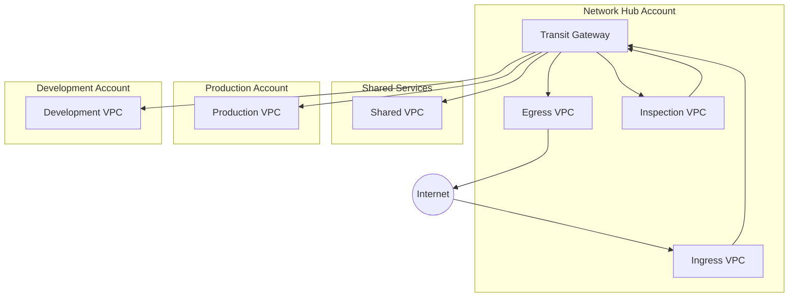
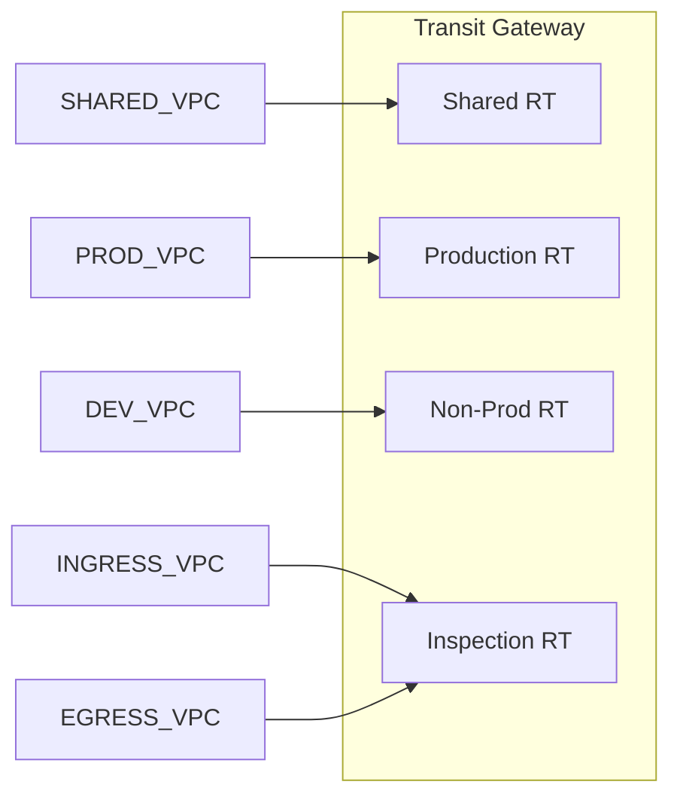
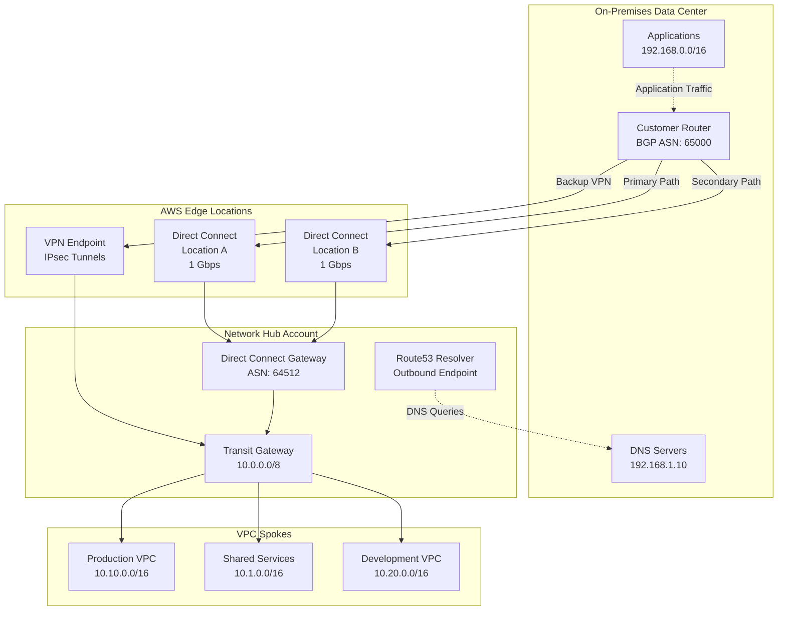
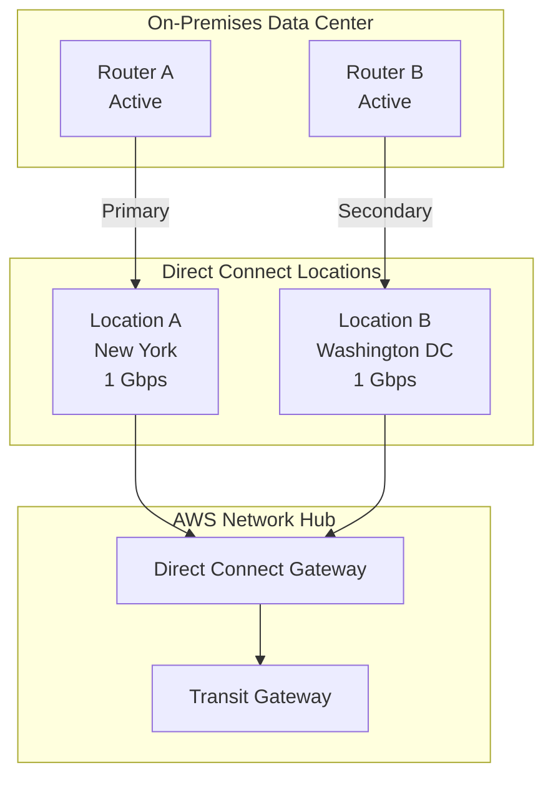
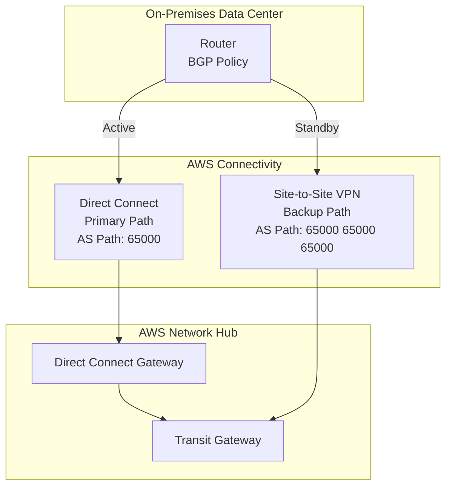
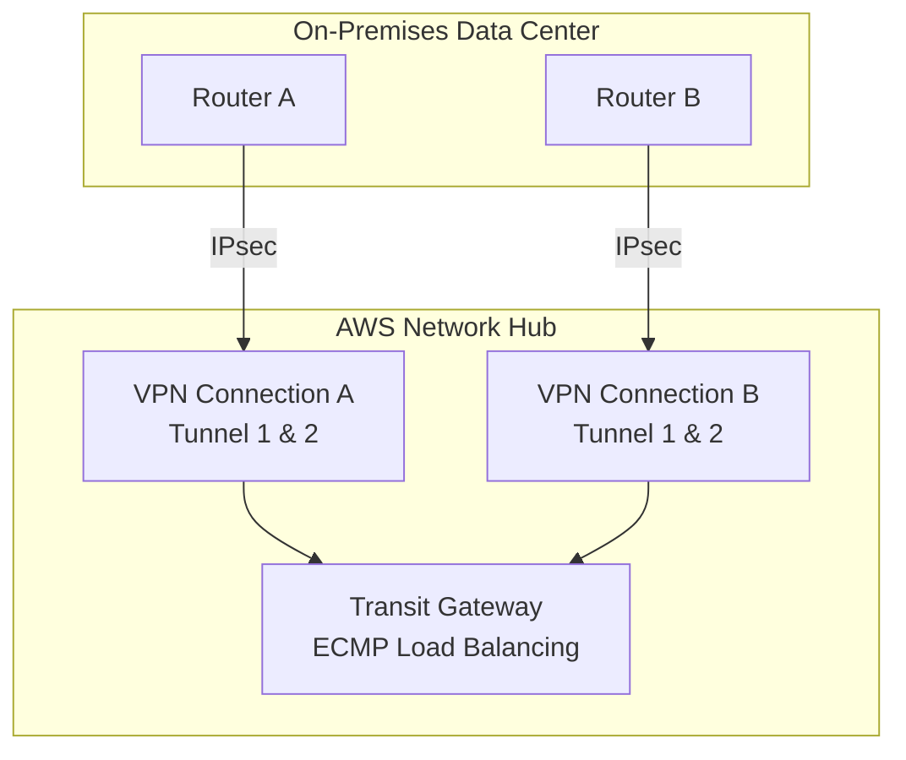
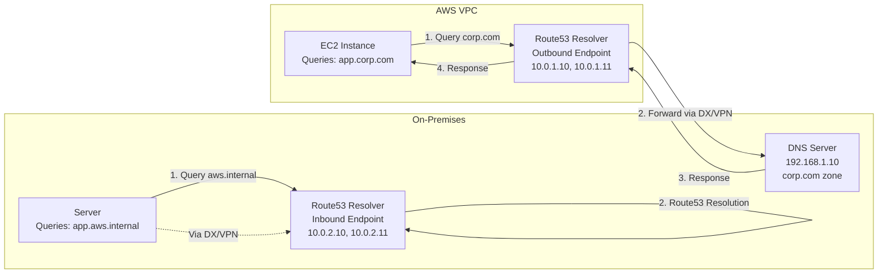

# Network Design

This document describes the network architecture using Transit Gateway hub-and-spoke topology.

## Network Topology



## Decision Rationale

### Why Transit Gateway Over VPC Peering?
- **Scalability**: VPC peering creates N*(N-1)/2 connections; TGW scales linearly
- **Centralized routing**: Single point for route management
- **Traffic inspection**: Enables centralized inspection VPC
- **Cost at scale**: More economical beyond 5-10 VPCs
- **Hybrid connectivity**: Single attachment point for Direct Connect/VPN

### Why Centralized Inspection VPC?
- **Consistent security**: All traffic inspected by same rules
- **Cost efficiency**: Single Network Firewall deployment
- **Simplified management**: One place to update rules
- **Compliance**: Easier to demonstrate traffic inspection
- **Trade-off**: Adds latency (~1-2ms) for inter-VPC traffic

### Why These CIDR Allocations?
- **/16 per VPC**: Allows 65,536 IPs, room for growth
- **10.x.0.0 ranges**: Private RFC1918, no conflict with common corporate ranges
- **Separated ranges by environment**: Prevents accidental routing between prod/non-prod
- **Large sandbox range (10.100-199)**: Accommodates many developer accounts

### Why Hub-and-Spoke Over Full Mesh?
- **Simplified routing**: Routes managed centrally
- **Security boundaries**: Traffic must traverse hub for inspection
- **Operational simplicity**: Easier to troubleshoot
- **Cost**: Fewer TGW attachments needed

## VPC Design

### CIDR Allocation

| Environment | CIDR Block | Notes |
|-------------|------------|-------|
| Network Hub | 10.0.0.0/16 | Shared networking |
| Shared Services | 10.1.0.0/16 | CI/CD, ECR |
| Production | 10.10.0.0/16 - 10.19.0.0/16 | Production workloads |
| Non-Production | 10.20.0.0/16 - 10.29.0.0/16 | Dev, staging, QA |
| Sandbox | 10.100.0.0/16 - 10.199.0.0/16 | Developer sandboxes |

### Subnet Strategy

Each VPC uses a consistent subnet layout:

```
VPC: 10.x.0.0/16
├── Public Subnets:     10.x.0.0/20, 10.x.16.0/20, 10.x.32.0/20
├── Private Subnets:    10.x.48.0/20, 10.x.64.0/20, 10.x.80.0/20
├── Database Subnets:   10.x.96.0/20, 10.x.112.0/20, 10.x.128.0/20
└── Transit Subnets:    10.x.144.0/20, 10.x.160.0/20, 10.x.176.0/20
```

## Transit Gateway

### Route Tables

| Route Table | Purpose | Propagations |
|-------------|---------|--------------|
| Shared | Shared services access | All VPCs |
| Production | Production isolation | Prod VPCs, Shared |
| Non-Production | Dev/staging | Non-prod VPCs, Shared |
| Inspection | Traffic inspection | Egress, Ingress |

### Route Table Associations



## DNS Architecture

### Route53 Private Hosted Zones

- Central private hosted zone in Network Hub
- Shared across all accounts via RAM
- Resolver endpoints for hybrid DNS

```
aws.internal (Private Zone)
├── shared.aws.internal  → Shared Services
├── prod.aws.internal    → Production
└── dev.aws.internal     → Development
```

### DNS Resolution Flow

1. EC2 instance queries VPC DNS (AmazonProvidedDNS)
2. Route53 Resolver checks private hosted zones
3. If not found, forwards to on-premises DNS (if configured)
4. Falls back to public DNS resolution

## Connectivity Options

### Internet Access

- **Egress**: Centralized NAT Gateways in Egress VPC
- **Ingress**: Application Load Balancers in Ingress VPC
- **Direct Internet**: Only in sandbox accounts (optional)

### Hybrid Connectivity

Connect on-premises data centers to AWS using Direct Connect (dedicated fiber) or Site-to-Site VPN (encrypted over internet). This section covers setup, high availability patterns, and operational best practices.

#### Architecture Overview



#### Direct Connect Setup

AWS Direct Connect provides dedicated network connections from on-premises to AWS, offering consistent network performance and reduced bandwidth costs.

##### Prerequisites

Before setting up Direct Connect:

1. **Physical Requirements**
   - Rack space at a Direct Connect location or partner facility
   - Single-mode fiber optic cable (1310nm wavelength)
   - Compatible router with BGP support

2. **AWS Requirements**
   - Letter of Authorization and Connecting Facility Assignment (LOA-CFA) from AWS
   - Cross-connect order with colocation provider
   - BGP ASN for your network (public or private)

3. **Network Planning**
   - VLAN ID for virtual interface (1-4094)
   - BGP peering IP addresses (/30 or /31 from 169.254.0.0/16)
   - Route advertisement strategy

##### Components

| Component | Purpose | Limits |
|-----------|---------|--------|
| **Direct Connect Connection** | Physical 1/10/100 Gbps link at DX location | 1 per location recommended |
| **Virtual Interface (VIF)** | Logical Layer 3 connection over physical link | 50 private VIFs per connection |
| **Direct Connect Gateway** | Multi-region gateway for TGW/VGW attachment | 10 TGW associations per gateway |
| **Transit VIF** | VIF type specifically for Transit Gateway | BGP required, no static routes |

##### Terraform Configuration

**Step 1: Create Direct Connect Gateway**

```hcl
resource "aws_dx_gateway" "main" {
  name            = "acme-dx-gateway"
  amazon_side_asn = "64512"  # Must be private ASN (64512-65534 or 4200000000-4294967294)
  
  tags = {
    Name        = "acme-dx-gateway"
    Environment = "production"
    ManagedBy   = "terraform"
  }
}
```

**Step 2: Associate Direct Connect Gateway with Transit Gateway**

```hcl
resource "aws_dx_gateway_association" "tgw" {
  dx_gateway_id         = aws_dx_gateway.main.id
  associated_gateway_id = aws_ec2_transit_gateway.main.id

  # Allowed prefixes advertised from AWS to on-premises
  allowed_prefixes = [
    "10.0.0.0/16",     # Network Hub
    "10.1.0.0/16",     # Shared Services
    "10.10.0.0/16",    # Production
    "10.20.0.0/16",    # Non-Production
  ]
  
  # Optional: Proposal timeout for manual approval
  # proposal_timeout_minutes = 60
}
```

**Step 3: Create Transit Virtual Interface**

```hcl
resource "aws_dx_transit_virtual_interface" "primary" {
  connection_id = aws_dx_connection.primary.id
  dx_gateway_id = aws_dx_gateway.main.id
  
  name           = "acme-transit-vif-primary"
  vlan           = 100
  address_family = "ipv4"
  bgp_asn        = 65000  # Customer BGP ASN
  
  # BGP peering addresses (AWS assigns if omitted)
  amazon_address   = "169.254.100.1/30"
  customer_address = "169.254.100.2/30"
  
  # BGP authentication (recommended)
  bgp_auth_key = random_password.bgp_key.result
  
  # Jumbo frames (MTU 9001)
  mtu = 9001
  
  tags = {
    Name = "acme-transit-vif-primary"
  }
}

# Generate secure BGP authentication key
resource "random_password" "bgp_key" {
  length  = 32
  special = false
}
```

**Step 4: Configure On-Premises Router**

Download the router configuration from AWS Console:
1. Navigate to Direct Connect > Virtual Interfaces
2. Select your VIF and click "Download Configuration"
3. Choose your router vendor (Cisco, Juniper, Palo Alto, etc.)
4. Apply configuration to your router

Example BGP configuration (Cisco IOS):
```
router bgp 65000
 neighbor 169.254.100.1 remote-as 64512
 neighbor 169.254.100.1 password <bgp-auth-key>
 address-family ipv4
  network 192.168.0.0 mask 255.255.0.0
  neighbor 169.254.100.1 activate
 exit-address-family
```

#### Site-to-Site VPN Setup

AWS Site-to-Site VPN creates encrypted IPsec tunnels over the internet, providing quick setup and cost-effective connectivity.

##### When to Use VPN

| Scenario | Recommendation |
|----------|----------------|
| **Backup for Direct Connect** | Recommended - provides failover path |
| **Quick setup needed** | VPN ready in hours vs weeks for DX |
| **Bandwidth < 1.25 Gbps** | VPN sufficient, DX may be overkill |
| **Cost-sensitive** | VPN cheaper for low-moderate traffic |
| **Testing/Development** | VPN adequate for non-production |
| **Temporary connectivity** | VPN ideal for short-term needs |

##### Terraform Configuration

**Step 1: Create Customer Gateway**

```hcl
resource "aws_customer_gateway" "main" {
  bgp_asn    = 65000
  ip_address = "203.0.113.1"  # On-premises router public IP
  type       = "ipsec.1"

  tags = {
    Name = "acme-on-prem-router"
  }
}

# For redundancy, create second customer gateway
resource "aws_customer_gateway" "secondary" {
  bgp_asn    = 65000
  ip_address = "203.0.113.2"  # Secondary router public IP
  type       = "ipsec.1"

  tags = {
    Name = "acme-on-prem-router-secondary"
  }
}
```

**Step 2: Create VPN Connection to Transit Gateway**

```hcl
resource "aws_vpn_connection" "main" {
  customer_gateway_id = aws_customer_gateway.main.id
  transit_gateway_id  = aws_ec2_transit_gateway.main.id
  type                = "ipsec.1"
  
  # Use BGP for dynamic routing (recommended)
  static_routes_only = false
  
  # Enable acceleration for improved performance (additional cost)
  enable_acceleration = false
  
  # Tunnel options for both tunnels
  tunnel1_inside_cidr   = "169.254.10.0/30"
  tunnel1_preshared_key = random_password.vpn_tunnel1.result
  
  tunnel2_inside_cidr   = "169.254.10.4/30"
  tunnel2_preshared_key = random_password.vpn_tunnel2.result

  tags = {
    Name = "acme-vpn-primary"
  }
}

# Generate secure pre-shared keys
resource "random_password" "vpn_tunnel1" {
  length  = 32
  special = false
}

resource "random_password" "vpn_tunnel2" {
  length  = 32
  special = false
}
```

**Step 3: Attach VPN to Transit Gateway Route Table**

```hcl
resource "aws_ec2_transit_gateway_route_table_association" "vpn" {
  transit_gateway_attachment_id  = aws_vpn_connection.main.transit_gateway_attachment_id
  transit_gateway_route_table_id = aws_ec2_transit_gateway_route_table.shared.id
}
```

**Step 4: Configure On-Premises Router**

Download VPN configuration from AWS Console and apply to your router. Each VPN connection provides two tunnels for redundancy.

#### High Availability Patterns

##### Pattern 1: Dual Direct Connect (Recommended for Production)



**Characteristics:**
- Two physical connections at different DX locations
- Survives single location or connection failure
- Active-active traffic distribution via BGP ECMP
- Highest reliability (99.99% SLA achievable)

**Terraform Implementation:**

```hcl
# Primary Direct Connect at Location A
resource "aws_dx_connection" "primary" {
  name      = "acme-dx-primary"
  bandwidth = "1Gbps"
  location  = "EqDC2"  # Equinix DC2 (example)
  
  tags = {
    Name = "acme-dx-primary"
    Site = "location-a"
  }
}

# Secondary Direct Connect at Location B
resource "aws_dx_connection" "secondary" {
  name      = "acme-dx-secondary"
  bandwidth = "1Gbps"
  location  = "EqDC10"  # Equinix DC10 (example)
  
  tags = {
    Name = "acme-dx-secondary"
    Site = "location-b"
  }
}

# Transit VIFs for both connections
resource "aws_dx_transit_virtual_interface" "primary" {
  connection_id = aws_dx_connection.primary.id
  dx_gateway_id = aws_dx_gateway.main.id
  name          = "acme-transit-vif-primary"
  vlan          = 100
  bgp_asn       = 65000
  mtu           = 9001
}

resource "aws_dx_transit_virtual_interface" "secondary" {
  connection_id = aws_dx_connection.secondary.id
  dx_gateway_id = aws_dx_gateway.main.id
  name          = "acme-transit-vif-secondary"
  vlan          = 101
  bgp_asn       = 65000
  mtu           = 9001
}
```

##### Pattern 2: Direct Connect + VPN Backup



**Characteristics:**
- Direct Connect for primary traffic (low latency, high bandwidth)
- VPN activates automatically on DX failure
- BGP AS path prepending makes VPN less preferred
- Cost-effective HA solution

**BGP Configuration for Failover:**

On-premises router configuration (Cisco IOS example):
```
# Route-map to prepend AS path for VPN (make it less preferred)
route-map VPN_BACKUP permit 10
 set as-path prepend 65000 65000 65000

router bgp 65000
 # Direct Connect neighbor (preferred)
 neighbor 169.254.100.1 remote-as 64512
 neighbor 169.254.100.1 activate
 
 # VPN neighbor (backup with AS path prepending)
 neighbor 169.254.10.1 remote-as 64512
 neighbor 169.254.10.1 route-map VPN_BACKUP out
 neighbor 169.254.10.1 activate
```

**Terraform Implementation:**

```hcl
# Direct Connect (primary)
resource "aws_dx_transit_virtual_interface" "primary" {
  connection_id = aws_dx_connection.main.id
  dx_gateway_id = aws_dx_gateway.main.id
  name          = "acme-transit-vif"
  vlan          = 100
  bgp_asn       = 65000
  mtu           = 9001
}

# VPN (backup)
resource "aws_vpn_connection" "backup" {
  customer_gateway_id = aws_customer_gateway.main.id
  transit_gateway_id  = aws_ec2_transit_gateway.main.id
  type                = "ipsec.1"
  static_routes_only  = false
  
  tags = {
    Name = "acme-vpn-backup"
    Role = "backup-for-dx"
  }
}
```

##### Pattern 3: Active-Active VPN



**Characteristics:**
- Two VPN connections from different routers
- Four total IPsec tunnels (2 per connection)
- ECMP load balancing across tunnels
- Survives single router or tunnel failure
- Maximum VPN bandwidth: ~5 Gbps (4 tunnels × 1.25 Gbps)

**Terraform Implementation:**

```hcl
# Primary VPN connection
resource "aws_vpn_connection" "primary" {
  customer_gateway_id = aws_customer_gateway.main.id
  transit_gateway_id  = aws_ec2_transit_gateway.main.id
  type                = "ipsec.1"
  static_routes_only  = false
  
  tunnel1_inside_cidr = "169.254.10.0/30"
  tunnel2_inside_cidr = "169.254.10.4/30"
  
  tags = {
    Name = "acme-vpn-primary"
  }
}

# Secondary VPN connection
resource "aws_vpn_connection" "secondary" {
  customer_gateway_id = aws_customer_gateway.secondary.id
  transit_gateway_id  = aws_ec2_transit_gateway.main.id
  type                = "ipsec.1"
  static_routes_only  = false
  
  tunnel1_inside_cidr = "169.254.10.8/30"
  tunnel2_inside_cidr = "169.254.10.12/30"
  
  tags = {
    Name = "acme-vpn-secondary"
  }
}

# Enable ECMP on Transit Gateway
resource "aws_ec2_transit_gateway" "main" {
  description                     = "Main Transit Gateway"
  default_route_table_association = "disable"
  default_route_table_propagation = "disable"
  vpn_ecmp_support               = "enable"  # Enable ECMP for VPN
  
  tags = {
    Name = "acme-tgw"
  }
}
```

#### BGP Routing Considerations

##### Route Advertisement Strategy

**From On-Premises to AWS:**
```
Advertise:
- On-premises network CIDRs (e.g., 192.168.0.0/16)
- Data center subnets
- Corporate network ranges

Do NOT advertise:
- Default route (0.0.0.0/0) unless intentional
- AWS CIDR ranges (causes routing loops)
- Public internet routes
```

**From AWS to On-Premises:**
```
Advertise:
- VPC CIDRs via Transit Gateway route propagation
- Configured allowed_prefixes on DX Gateway
- Specific subnets if using route filtering

Do NOT advertise:
- Entire 10.0.0.0/8 unless necessary
- Overlapping ranges with on-premises
```

##### Route Preference with BGP Attributes

| BGP Attribute | Priority | Use Case | Example |
|---------------|----------|----------|---------|
| **AS Path Length** | 1 (highest) | Prefer Direct Connect over VPN | DX: AS 65000<br/>VPN: AS 65000 65000 65000 |
| **Local Preference** | 2 | Internal routing preference | Set higher value for preferred path |
| **MED (Multi-Exit Discriminator)** | 3 | Prefer specific DX location | Location A: MED 100<br/>Location B: MED 200 |
| **Weight** | 4 (Cisco-specific) | Router-local preference | Higher weight = more preferred |

**Example: Prefer Direct Connect over VPN**

```
# On-premises router (Cisco IOS)
route-map PREFER_DX permit 10
 set local-preference 200

route-map BACKUP_VPN permit 10
 set local-preference 100
 set as-path prepend 65000 65000 65000

router bgp 65000
 neighbor 169.254.100.1 route-map PREFER_DX in    # Direct Connect
 neighbor 169.254.10.1 route-map BACKUP_VPN in    # VPN
```

##### BGP Communities (Advanced)

Use BGP communities to tag routes for policy-based routing:

```hcl
# Example: Tag production routes differently
# On-premises router configuration:
# route-map TAG_PROD permit 10
#  match ip address prefix-list PROD_NETWORKS
#  set community 65000:100
# route-map TAG_DEV permit 20
#  match ip address prefix-list DEV_NETWORKS
#  set community 65000:200
```

#### DNS Integration

Enable seamless DNS resolution between AWS and on-premises networks using Route53 Resolver.

##### Architecture



##### Terraform Configuration

**Step 1: Create Security Group for Resolver Endpoints**

```hcl
resource "aws_security_group" "resolver" {
  name        = "route53-resolver-endpoints"
  description = "Allow DNS traffic for Route53 Resolver"
  vpc_id      = aws_vpc.network_hub.id

  ingress {
    description = "DNS from on-premises"
    from_port   = 53
    to_port     = 53
    protocol    = "tcp"
    cidr_blocks = ["192.168.0.0/16"]  # On-premises CIDR
  }

  ingress {
    description = "DNS from on-premises"
    from_port   = 53
    to_port     = 53
    protocol    = "udp"
    cidr_blocks = ["192.168.0.0/16"]
  }

  egress {
    description = "DNS to on-premises"
    from_port   = 53
    to_port     = 53
    protocol    = "tcp"
    cidr_blocks = ["192.168.0.0/16"]
  }

  egress {
    description = "DNS to on-premises"
    from_port   = 53
    to_port     = 53
    protocol    = "udp"
    cidr_blocks = ["192.168.0.0/16"]
  }

  tags = {
    Name = "route53-resolver-sg"
  }
}
```

**Step 2: Create Outbound Resolver Endpoint (AWS to On-Premises)**

```hcl
resource "aws_route53_resolver_endpoint" "outbound" {
  name      = "outbound-to-onprem"
  direction = "OUTBOUND"

  security_group_ids = [aws_security_group.resolver.id]

  # Deploy in at least 2 AZs for high availability
  ip_address {
    subnet_id = aws_subnet.resolver_a.id
    ip        = "10.0.1.10"  # Optional: specify IP
  }
  
  ip_address {
    subnet_id = aws_subnet.resolver_b.id
    ip        = "10.0.1.11"
  }

  tags = {
    Name = "outbound-resolver"
  }
}
```

**Step 3: Create Forwarding Rules**

```hcl
# Forward on-premises domain to on-premises DNS
resource "aws_route53_resolver_rule" "onprem" {
  domain_name          = "corp.example.com"
  name                 = "forward-to-onprem"
  rule_type            = "FORWARD"
  resolver_endpoint_id = aws_route53_resolver_endpoint.outbound.id

  # Primary on-premises DNS server
  target_ip {
    ip   = "192.168.1.10"
    port = 53
  }
  
  # Secondary on-premises DNS server
  target_ip {
    ip   = "192.168.1.11"
    port = 53
  }

  tags = {
    Name = "forward-corp-domain"
  }
}

# Share resolver rule with other accounts via RAM
resource "aws_ram_resource_share" "resolver_rule" {
  name                      = "resolver-rule-share"
  allow_external_principals = false

  tags = {
    Name = "resolver-rule-share"
  }
}

resource "aws_ram_resource_association" "resolver_rule" {
  resource_arn       = aws_route53_resolver_rule.onprem.arn
  resource_share_arn = aws_ram_resource_share.resolver_rule.arn
}

resource "aws_ram_principal_association" "org" {
  principal          = "arn:aws:organizations::123456789012:organization/o-xxxxx"
  resource_share_arn = aws_ram_resource_share.resolver_rule.arn
}
```

**Step 4: Create Inbound Resolver Endpoint (On-Premises to AWS)**

```hcl
resource "aws_route53_resolver_endpoint" "inbound" {
  name      = "inbound-from-onprem"
  direction = "INBOUND"

  security_group_ids = [aws_security_group.resolver.id]

  ip_address {
    subnet_id = aws_subnet.resolver_a.id
    ip        = "10.0.2.10"
  }
  
  ip_address {
    subnet_id = aws_subnet.resolver_b.id
    ip        = "10.0.2.11"
  }

  tags = {
    Name = "inbound-resolver"
  }
}

# Output IPs for on-premises DNS configuration
output "resolver_inbound_ips" {
  description = "Configure these IPs as forwarders in on-premises DNS"
  value       = aws_route53_resolver_endpoint.inbound.ip_address[*].ip
}
```

**Step 5: Configure On-Premises DNS**

Add conditional forwarders in your on-premises DNS (example for Windows DNS):
```powershell
# Forward AWS private zone to Route53 Resolver inbound endpoint
Add-DnsServerConditionalForwarderZone -Name "aws.internal" -MasterServers 10.0.2.10,10.0.2.11
```

#### Monitoring Hybrid Connections

##### Key Metrics and Thresholds

| Metric | Namespace | Threshold | Action |
|--------|-----------|-----------|--------|
| **ConnectionState** | AWS/DX | != 1 (available) | Alert + investigate physical connection |
| **ConnectionBpsEgress** | AWS/DX | > 80% of bandwidth | Consider upgrading connection |
| **ConnectionBpsIngress** | AWS/DX | > 80% of bandwidth | Consider upgrading connection |
| **VpnTunnelState** | AWS/VPN | != 1 (UP) | Alert + check tunnel configuration |
| **TunnelDataIn** | AWS/VPN | == 0 for > 5 min | Possible routing issue |
| **TunnelDataOut** | AWS/VPN | == 0 for > 5 min | Possible routing issue |
| **VirtualInterfaceState** | AWS/DX | != available | Alert + check VIF configuration |
| **VirtualInterfaceBpsEgress** | AWS/DX | > 80% of VIF bandwidth | Consider additional VIF |

##### CloudWatch Alarms

**Direct Connect Connection Monitoring:**

```hcl
resource "aws_cloudwatch_metric_alarm" "dx_connection_down" {
  alarm_name          = "dx-connection-down"
  comparison_operator = "LessThanThreshold"
  evaluation_periods  = 2
  metric_name         = "ConnectionState"
  namespace           = "AWS/DX"
  period              = 60
  statistic           = "Minimum"
  threshold           = 1
  alarm_description   = "Direct Connect connection is down"
  treat_missing_data  = "breaching"
  
  dimensions = {
    ConnectionId = aws_dx_connection.primary.id
  }
  
  alarm_actions = [aws_sns_topic.network_alerts.arn]
}

resource "aws_cloudwatch_metric_alarm" "dx_bandwidth_high" {
  alarm_name          = "dx-bandwidth-high"
  comparison_operator = "GreaterThanThreshold"
  evaluation_periods  = 3
  metric_name         = "ConnectionBpsEgress"
  namespace           = "AWS/DX"
  period              = 300
  statistic           = "Average"
  threshold           = 800000000  # 800 Mbps for 1 Gbps connection (80%)
  alarm_description   = "Direct Connect bandwidth utilization high"
  
  dimensions = {
    ConnectionId = aws_dx_connection.primary.id
  }
  
  alarm_actions = [aws_sns_topic.network_alerts.arn]
}
```

**VPN Tunnel Monitoring:**

```hcl
resource "aws_cloudwatch_metric_alarm" "vpn_tunnel_down" {
  alarm_name          = "vpn-tunnel-down"
  comparison_operator = "LessThanThreshold"
  evaluation_periods  = 2
  metric_name         = "TunnelState"
  namespace           = "AWS/VPN"
  period              = 60
  statistic           = "Maximum"
  threshold           = 1
  alarm_description   = "VPN tunnel is down"
  treat_missing_data  = "breaching"
  
  dimensions = {
    VpnId = aws_vpn_connection.main.id
  }
  
  alarm_actions = [aws_sns_topic.network_alerts.arn]
}

resource "aws_cloudwatch_metric_alarm" "vpn_no_traffic" {
  alarm_name          = "vpn-no-traffic"
  comparison_operator = "LessThanThreshold"
  evaluation_periods  = 3
  metric_name         = "TunnelDataIn"
  namespace           = "AWS/VPN"
  period              = 300
  statistic           = "Sum"
  threshold           = 1000  # Less than 1KB in 5 minutes
  alarm_description   = "VPN tunnel has no inbound traffic"
  
  dimensions = {
    VpnId = aws_vpn_connection.main.id
  }
  
  alarm_actions = [aws_sns_topic.network_alerts.arn]
}
```

**BGP Session Monitoring:**

```hcl
resource "aws_cloudwatch_metric_alarm" "bgp_session_down" {
  alarm_name          = "bgp-session-down"
  comparison_operator = "LessThanThreshold"
  evaluation_periods  = 2
  metric_name         = "VirtualInterfaceBpsEgress"
  namespace           = "AWS/DX"
  period              = 60
  statistic           = "Sum"
  threshold           = 1
  alarm_description   = "BGP session appears down (no traffic)"
  treat_missing_data  = "breaching"
  
  dimensions = {
    VirtualInterfaceId = aws_dx_transit_virtual_interface.primary.id
  }
  
  alarm_actions = [aws_sns_topic.network_alerts.arn]
}
```

##### SNS Topic for Alerts

```hcl
resource "aws_sns_topic" "network_alerts" {
  name = "network-hybrid-connectivity-alerts"
  
  tags = {
    Name = "network-alerts"
  }
}

resource "aws_sns_topic_subscription" "email" {
  topic_arn = aws_sns_topic.network_alerts.arn
  protocol  = "email"
  endpoint  = "network-team@example.com"
}

# Optional: Send to Slack, PagerDuty, etc.
resource "aws_sns_topic_subscription" "lambda" {
  topic_arn = aws_sns_topic.network_alerts.arn
  protocol  = "lambda"
  endpoint  = aws_lambda_function.alert_forwarder.arn
}
```

### VPC Endpoints

Centralized VPC endpoints in Shared Services:
- S3 (Gateway)
- DynamoDB (Gateway)
- ECR, CloudWatch, SSM, etc. (Interface)

## Security Groups

### Standard Security Groups

| Name | Purpose | Ingress |
|------|---------|---------|
| `allow-internal` | Internal communication | VPC CIDR |
| `allow-tgw` | Transit Gateway | TGW CIDR |
| `allow-alb` | ALB targets | ALB SG |
| `allow-bastion` | Bastion access | Bastion SG |

## Network Monitoring

- VPC Flow Logs → Log Archive S3
- Transit Gateway Flow Logs
- CloudWatch metrics for TGW
- Network Manager (optional)

See [Networking Module](../modules/networking) for implementation details.
