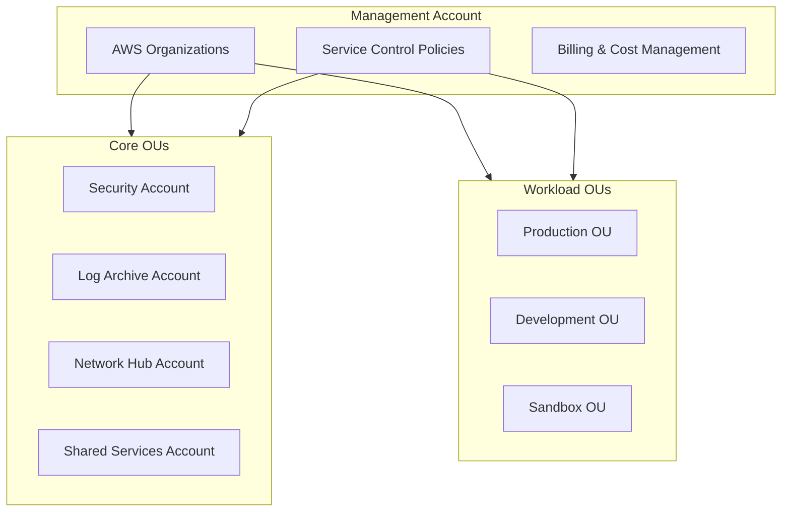

# Architecture Overview

This document provides a high-level overview of the AWS Landing Zone architecture implemented in this template.

## Design Principles

1. **Multi-Account Strategy**: Separate AWS accounts for different workloads and environments
2. **Security by Default**: SCPs, GuardDuty, Security Hub enabled from day one
3. **Network Isolation**: Transit Gateway hub-and-spoke topology with controlled routing
4. **Centralized Logging**: All logs aggregated in a dedicated Log Archive account
5. **Account Vending**: Automated account provisioning via Account Factory for Terraform (AFT)

## Account Structure



## Core Accounts

| Account | Purpose | Key Services |
|---------|---------|--------------|
| **Management** | Organization root, billing, SCPs | AWS Organizations, IAM Identity Center |
| **Security** | Security tooling and monitoring | GuardDuty, Security Hub, Config |
| **Log Archive** | Centralized logging | S3, CloudTrail, VPC Flow Logs |
| **Network Hub** | Network connectivity | Transit Gateway, Route53, VPCs |
| **Shared Services** | Common services | ECR, CI/CD, Artifacts |

## Terraform Structure

```
terraform/
├── organization/      # Management account
├── security/          # Security account
├── log-archive/       # Log Archive account
├── network/           # Network Hub account
├── shared-services/   # Shared Services account
├── aft/               # Account Factory for Terraform
└── modules/           # Reusable modules
```

## Next Steps

- [Multi-Account Strategy](./multi-account) - Detailed OU and account design
- [Security Model](./security-model) - Security controls and compliance
- [Network Design](./network-design) - Network topology and connectivity
