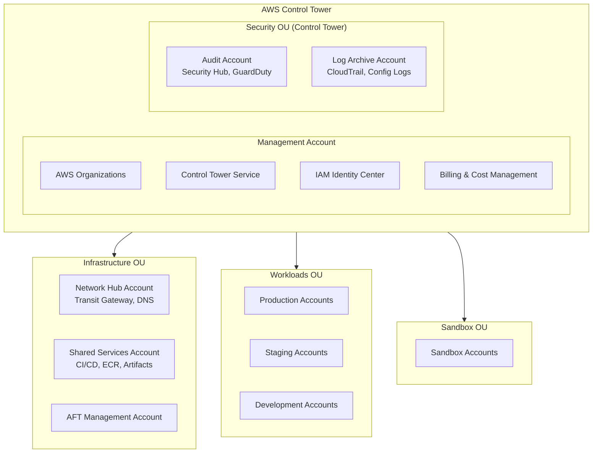
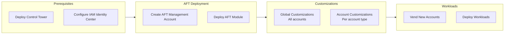

# Architecture Overview

This template implements an AWS Landing Zone built on **AWS Control Tower** with extended customizations via **Account Factory for Terraform (AFT)**. It follows AWS best practices for multi-account architecture.

## Foundation: AWS Control Tower

AWS Control Tower provides the foundational landing zone:

- **AWS Organizations** - Multi-account structure
- **Organizational Units (OUs)** - Security, Infrastructure, Sandbox, Workloads
- **Guardrails** - Preventive and detective controls (SCPs + Config Rules)
- **Core Accounts** - Management, Log Archive, Audit (Security)
- **IAM Identity Center** - Centralized access management
- **Account Factory** - Standardized account provisioning

:::info Control Tower First
This template assumes Control Tower is already deployed. We **extend** Control Tower capabilities rather than replace them.
:::

## Design Principles

1. **Control Tower as Foundation**: Leverage Control Tower for governance, don't duplicate
2. **Extend, Don't Replace**: Add customizations on top of Control Tower baseline
3. **AFT for Account Vending**: Use Account Factory for Terraform for automated provisioning
4. **Terraform for Customizations**: Infrastructure beyond Control Tower's scope
5. **GitOps Workflow**: All changes through version-controlled repositories

## Account Structure



## What Control Tower Manages vs. What We Customize

| Aspect | Control Tower Manages | Terraform Customizes |
|--------|----------------------|---------------------|
| **Organizations** | ✅ Creates and manages | ❌ Uses data sources only |
| **Core OUs** | ✅ Security, Infrastructure, Sandbox | ➕ Additional OUs if needed |
| **Core Accounts** | ✅ Log Archive, Audit | ➕ Network Hub, Shared Services |
| **Guardrails** | ✅ Mandatory + Strongly Recommended | ➕ Custom SCPs |
| **Account Baseline** | ✅ CloudTrail, Config, IAM roles | ➕ Additional security tools |
| **Account Vending** | ✅ Account Factory | ✅ AFT (extends Account Factory) |

## Core Accounts

| Account | Managed By | Purpose | Key Services |
|---------|------------|---------|--------------|
| **Management** | Control Tower | Organization root, billing | Organizations, Control Tower, IAM Identity Center |
| **Log Archive** | Control Tower | Centralized logging | S3 (CloudTrail, Config, VPC Flow Logs) |
| **Audit** | Control Tower | Security monitoring | GuardDuty, Security Hub, Config aggregator |
| **Network Hub** | Terraform/AFT | Network connectivity | Transit Gateway, Route53, VPCs |
| **Shared Services** | Terraform/AFT | Common services | ECR, CI/CD pipelines, Artifacts |
| **AFT Management** | AFT | Account Factory for Terraform | CodePipeline, Step Functions, DynamoDB |

## Deployment Model



## Repository Structure

```
aws-landing-zone-template/
├── terraform/
│   ├── control-tower/         # Control Tower data sources & references
│   ├── aft/                   # Account Factory for Terraform
│   │   ├── aft-setup/         # AFT infrastructure deployment
│   │   ├── aft-account-request/           # Account definitions
│   │   ├── aft-global-customizations/     # Applied to all accounts
│   │   └── aft-account-customizations/    # Per account-type customizations
│   ├── network/               # Network Hub account resources
│   ├── shared-services/       # Shared Services account resources
│   └── modules/               # Reusable Terraform modules
├── docs/                      # This documentation site
└── scripts/                   # Deployment and helper scripts
```

## Next Steps

- [Control Tower Setup](./control-tower) - Prerequisites and Control Tower deployment
- [Multi-Account Strategy](./multi-account) - OU structure and account design
- [Security Model](./security-model) - Guardrails and security controls
- [Network Design](./network-design) - Network topology and connectivity
