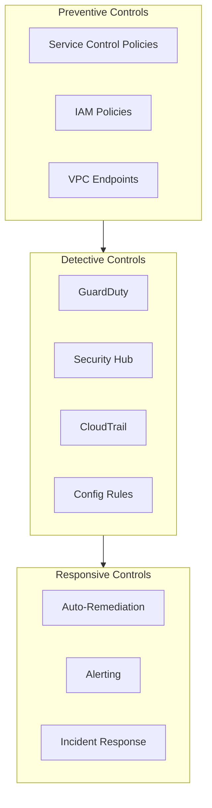

# Security Model

This document describes the security architecture and controls implemented in the Landing Zone.

## Defense in Depth



## Service Control Policies (SCPs)

SCPs provide guardrails at the organization level.

### Root Policies

Applied to all accounts:

```hcl
# Deny leaving organization
{
  "Effect": "Deny",
  "Action": "organizations:LeaveOrganization",
  "Resource": "*"
}

# Require IMDSv2
{
  "Effect": "Deny",
  "Action": "ec2:RunInstances",
  "Resource": "arn:aws:ec2:*:*:instance/*",
  "Condition": {
    "StringNotEquals": {
      "ec2:MetadataHttpTokens": "required"
    }
  }
}
```

### OU-Specific Policies

See [SCP Policies Module](../modules/organization#scp-policies) for complete list.

## IAM Identity Center

Centralized identity management using IAM Identity Center (successor to AWS SSO).

### Permission Sets

| Permission Set | Access Level | Target OUs |
|----------------|--------------|------------|
| AdministratorAccess | Full admin | All |
| PowerUserAccess | Developer access | Non-production |
| ReadOnlyAccess | Read only | All |
| SecurityAudit | Security audit | All |

## Security Services

### GuardDuty

- Enabled in delegated admin (Security Account)
- All accounts auto-enrolled
- Findings aggregated centrally
- S3 and EKS protection enabled

### Security Hub

- CIS AWS Foundations Benchmark
- AWS Foundational Security Best Practices
- Custom standards for organization

### CloudTrail

- Organization trail in Management Account
- Logs stored in Log Archive account
- Log file validation enabled
- Encrypted with KMS

### AWS Config

- Organization-wide Config aggregator
- Managed rules for compliance
- Custom rules for organization policies

## Network Security

See [Network Design](./network-design) for network-level security controls.

## Compliance Mapping

| Framework | Key Controls |
|-----------|--------------|
| CIS Benchmark | CloudTrail, Config, GuardDuty, MFA |
| SOC 2 | Access controls, logging, encryption |
| HIPAA | Encryption, access logging, BAA |
| PCI DSS | Network segmentation, encryption, logging |

## Incident Response

1. GuardDuty finding triggers SNS notification
2. Lambda function creates Security Hub finding
3. Security team receives PagerDuty alert
4. Runbook executed for known incident types
5. Post-incident review and documentation

See [Troubleshooting Runbook](../runbooks/troubleshooting) for common security issues.
