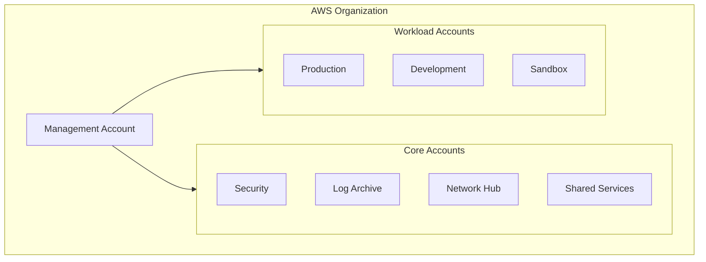

# Introduction

Welcome to the **AWS Landing Zone Template** documentation. This template provides a production-ready foundation for deploying a multi-account AWS Organization using Terraform.

## What is a Landing Zone?

A Landing Zone is a well-architected, multi-account AWS environment that provides:

- **Security**: Guardrails, monitoring, and compliance from day one
- **Governance**: Centralized policies and account management
- **Networking**: Scalable, secure network architecture
- **Cost Management**: Clear cost allocation and budget controls
- **Automation**: Infrastructure as Code with GitOps workflows

## Architecture at a Glance



## Key Features

| Feature | Description |
|---------|-------------|
| **Multi-Account** | Isolated environments with clear boundaries |
| **Security Baseline** | GuardDuty, Security Hub, Config, CloudTrail |
| **Network Hub** | Transit Gateway with centralized ingress/egress |
| **Account Vending** | Automated provisioning via AFT |
| **Documentation** | This Docusaurus site, deployed via SST |

## Quick Start

### Prerequisites

- AWS CLI v2 configured with Management account access
- Terraform >= 1.5.0
- Node.js >= 20 (for documentation)
- Beads CLI (for task tracking)

### Setup

```bash
# Clone the repository
git clone https://github.com/your-org/aws-landing-zone-template.git
cd aws-landing-zone-template

# Run setup script
./scripts/setup.sh

# View available tasks
bd ready
```

### Deploy

Follow the [Deployment Runbook](./runbooks/deployment) for step-by-step instructions.

## Repository Structure

```
aws-landing-zone-template/
├── terraform/
│   ├── organization/      # AWS Organizations, SCPs
│   ├── security/          # GuardDuty, Security Hub
│   ├── log-archive/       # CloudTrail, Config logs
│   ├── network/           # Transit Gateway, VPCs
│   ├── shared-services/   # CI/CD, ECR
│   ├── aft/               # Account Factory
│   └── modules/           # Reusable modules
├── docs/                  # This documentation (Docusaurus)
├── infra/                 # SST infrastructure for docs
└── scripts/               # Helper scripts
```

## Next Steps

<div className="row">
  <div className="col col--6">
    <div className="card">
      <div className="card__header">
        <h3>📐 Architecture</h3>
      </div>
      <div className="card__body">
        <p>Understand the multi-account design, security model, and network topology.</p>
      </div>
      <div className="card__footer">
        <a className="button button--primary button--block" href="./architecture/overview">View Architecture</a>
      </div>
    </div>
  </div>
  <div className="col col--6">
    <div className="card">
      <div className="card__header">
        <h3>🚀 Deployment</h3>
      </div>
      <div className="card__body">
        <p>Step-by-step guide to deploy the Landing Zone in your AWS environment.</p>
      </div>
      <div className="card__footer">
        <a className="button button--primary button--block" href="./runbooks/deployment">Deploy Now</a>
      </div>
    </div>
  </div>
</div>

## Contributing

This is a template repository. To customize:

1. Fork/clone this repository
2. Update `terraform.tfvars` files with your values
3. Modify modules as needed for your organization
4. Deploy following the runbooks

## Support

- [GitHub Issues](https://github.com/your-org/aws-landing-zone-template/issues)
- [AWS Documentation](https://docs.aws.amazon.com/)
- [Terraform AWS Provider](https://registry.terraform.io/providers/hashicorp/aws/latest/docs)
