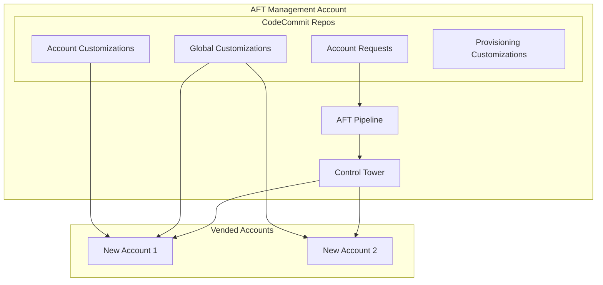

# Account Factory for Terraform (AFT)

AFT automates the provisioning and customization of AWS accounts in your organization.

## Overview

Account Factory for Terraform (AFT) provides:

- Automated account provisioning
- Account customization pipelines
- Global customizations (applied to all accounts)
- Account-specific customizations
- GitOps-based workflow

## Why AFT Over Alternatives?

### AFT vs Control Tower Account Factory (Console)
| Aspect | AFT | CT Console |
|--------|-----|------------|
| Automation | Full GitOps | Manual clicks |
| Customization | Terraform-based | Limited |
| Auditability | Git history | CloudTrail only |
| Scalability | Handles 100s of accounts | Manual bottleneck |
| Reproducibility | Infrastructure as Code | Not reproducible |

### AFT vs Custom Account Vending
- **AWS maintained**: Updates with Control Tower changes
- **Proven patterns**: Used by AWS Professional Services
- **Integration**: Native CT integration, no custom Lambda
- **Support**: AWS support available

### When NOT to Use AFT
- **Very small organizations** (&lt;10 accounts): Overhead may not be worth it
- **No Control Tower**: AFT requires Control Tower
- **Simple needs**: If only basic accounts needed, CT console may suffice

### Trade-offs of AFT
- **Complexity**: Learning curve for Terraform + AFT
- **Pipeline time**: Account provisioning takes 20-30 minutes
- **Debugging**: Pipeline failures require CodePipeline knowledge

## Architecture



## Directory Structure

```
terraform/aft/
├── aft-setup/                    # AFT infrastructure setup
│   ├── main.tf
│   ├── variables.tf
│   └── backend.tf
├── account-requests/             # Account request definitions
│   └── terraform/
│       ├── prod-workload-1.tf
│       └── dev-sandbox-1.tf
├── aft-global-customizations/    # Applied to ALL accounts
│   └── terraform/
│       ├── main.tf
│       └── iam-baseline.tf
├── aft-account-customizations/   # Account-specific
│   ├── PROD-WORKLOAD-1/
│   │   └── terraform/
│   └── DEV-SANDBOX-1/
│       └── terraform/
└── aft-account-provisioning/     # Post-provisioning
    └── terraform/
        └── main.tf
```

## Usage

### 1. AFT Setup

Deploy AFT infrastructure in the AFT management account:

```hcl
module "aft" {
  source = "github.com/aws-ia/terraform-aws-control_tower_account_factory"

  # Control Tower settings
  ct_management_account_id    = "123456789012"
  log_archive_account_id      = "234567890123"
  audit_account_id            = "345678901234"
  aft_management_account_id   = "456789012345"
  ct_home_region              = "us-east-1"

  # VCS settings
  vcs_provider                = "codecommit"
  account_request_repo_name   = "aft-account-request"
  global_customizations_repo_name = "aft-global-customizations"
  account_customizations_repo_name = "aft-account-customizations"
  account_provisioning_customizations_repo_name = "aft-account-provisioning"

  # Terraform settings
  terraform_version           = "1.5.0"
  terraform_distribution      = "oss"
}
```

### 2. Account Request

Create a new account by adding to `account-requests/terraform/`:

```hcl
# prod-ecommerce.tf
module "prod_ecommerce" {
  source = "./modules/aft-account-request"

  control_tower_parameters = {
    AccountEmail              = "aws+prod-ecommerce@acme.com"
    AccountName               = "acme-prod-ecommerce"
    ManagedOrganizationalUnit = "Production"
    SSOUserEmail              = "platform-team@acme.com"
    SSOUserFirstName          = "Platform"
    SSOUserLastName           = "Team"
  }

  account_tags = {
    Environment = "production"
    CostCenter  = "ecommerce-123"
    Team        = "platform"
  }

  custom_fields = {
    workload_type = "ecommerce"
    data_classification = "confidential"
  }

  account_customizations_name = "PROD-ECOMMERCE"
}
```

### 3. Global Customizations

Applied to ALL accounts after provisioning:

```hcl
# aft-global-customizations/terraform/main.tf

# IAM password policy
resource "aws_iam_account_password_policy" "strict" {
  minimum_password_length        = 14
  require_lowercase_characters   = true
  require_numbers                = true
  require_uppercase_characters   = true
  require_symbols                = true
  allow_users_to_change_password = true
  max_password_age               = 90
  password_reuse_prevention      = 24
}

# Default EBS encryption
resource "aws_ebs_encryption_by_default" "enabled" {
  enabled = true
}

# S3 public access block (account level)
resource "aws_s3_account_public_access_block" "block" {
  block_public_acls       = true
  block_public_policy     = true
  ignore_public_acls      = true
  restrict_public_buckets = true
}

# CloudTrail (if not using org trail)
# Security baseline resources
# etc.
```

### 4. Account-Specific Customizations

For specific accounts:

```hcl
# aft-account-customizations/PROD-ECOMMERCE/terraform/main.tf

# Workload-specific VPC
module "vpc" {
  source = "terraform-aws-modules/vpc/aws"

  name = "prod-ecommerce"
  cidr = "10.10.0.0/16"
  
  azs             = ["us-east-1a", "us-east-1b", "us-east-1c"]
  private_subnets = ["10.10.1.0/24", "10.10.2.0/24", "10.10.3.0/24"]
  public_subnets  = ["10.10.101.0/24", "10.10.102.0/24", "10.10.103.0/24"]

  enable_nat_gateway = true
  single_nat_gateway = false
}

# Transit Gateway attachment
resource "aws_ec2_transit_gateway_vpc_attachment" "tgw" {
  subnet_ids         = module.vpc.private_subnets
  transit_gateway_id = data.aws_ssm_parameter.tgw_id.value
  vpc_id             = module.vpc.vpc_id
}
```

## Workflow

1. **Request**: Developer submits PR to account-requests repo
2. **Review**: Platform team reviews and approves PR
3. **Merge**: PR merged triggers AFT pipeline
4. **Provision**: Control Tower creates account
5. **Baseline**: Global customizations applied
6. **Customize**: Account-specific customizations applied
7. **Notify**: Team notified of account readiness

## Inputs (AFT Setup)

| Name | Description | Type | Required |
|------|-------------|------|----------|
| `ct_management_account_id` | Management account ID | `string` | Yes |
| `log_archive_account_id` | Log Archive account ID | `string` | Yes |
| `audit_account_id` | Audit account ID | `string` | Yes |
| `aft_management_account_id` | AFT account ID | `string` | Yes |
| `ct_home_region` | Control Tower home region | `string` | Yes |
| `terraform_version` | Terraform version | `string` | Yes |

## Global Customization Patterns

Global customizations are applied to ALL accounts after provisioning. Keep these focused on security and compliance baselines.

### Security Baseline

```hcl
# aft-global-customizations/terraform/security-baseline.tf

# IMDSv2 requirement
resource "aws_ec2_instance_metadata_defaults" "imdsv2" {
  http_tokens                 = "required"
  http_put_response_hop_limit = 1
}

# Default encryption for new EBS volumes
resource "aws_ebs_encryption_by_default" "enabled" {
  enabled = true
}

# Block public S3 buckets at account level
resource "aws_s3_account_public_access_block" "block_public" {
  block_public_acls       = true
  block_public_policy     = true
  ignore_public_acls      = true
  restrict_public_buckets = true
}

# IAM Access Analyzer
resource "aws_accessanalyzer_analyzer" "account" {
  analyzer_name = "account-analyzer"
  type          = "ACCOUNT"
}
```

### Networking Baseline

```hcl
# aft-global-customizations/terraform/networking.tf

# Default VPC cleanup (optional - removes default VPC)
data "aws_vpc" "default" {
  default = true
}

# Note: Be careful with this - some services expect default VPC
# resource "aws_default_vpc" "default" {
#   force_destroy = true
# }
```

### Tagging Enforcement

```hcl
# aft-global-customizations/terraform/tagging.tf

# Tag policies are applied at Organization level, but you can
# create resources that help enforce tagging

locals {
  required_tags = {
    Environment = var.environment
    ManagedBy   = "AFT"
    AccountId   = data.aws_caller_identity.current.account_id
  }
}
```

## Account-Specific Customization Patterns

Account-specific customizations allow you to provision resources unique to each workload.

### Production Workload Account

```hcl
# aft-account-customizations/PROD-WORKLOAD/terraform/main.tf

# Production VPC with Transit Gateway attachment
module "vpc" {
  source  = "terraform-aws-modules/vpc/aws"
  version = "~> 5.0"

  name = "prod-workload"
  cidr = "10.10.0.0/16"

  azs             = ["us-east-1a", "us-east-1b", "us-east-1c"]
  private_subnets = ["10.10.1.0/24", "10.10.2.0/24", "10.10.3.0/24"]
  
  # No public subnets - egress via Transit Gateway
  enable_nat_gateway = false
}

# TGW attachment
resource "aws_ec2_transit_gateway_vpc_attachment" "main" {
  subnet_ids         = module.vpc.private_subnets
  transit_gateway_id = data.aws_ssm_parameter.tgw_id.value
  vpc_id             = module.vpc.vpc_id
  
  tags = {
    Name = "prod-workload-attachment"
  }
}

# Production-specific monitoring
resource "aws_cloudwatch_metric_alarm" "high_cpu" {
  alarm_name          = "high-cpu-utilization"
  comparison_operator = "GreaterThanThreshold"
  evaluation_periods  = "2"
  metric_name         = "CPUUtilization"
  namespace           = "AWS/EC2"
  period              = "300"
  statistic           = "Average"
  threshold           = "80"
  alarm_description   = "CPU utilization exceeded 80%"
}
```

### Developer Sandbox Account

```hcl
# aft-account-customizations/DEV-SANDBOX/terraform/main.tf

# Sandbox with direct internet access (for experimentation)
module "vpc" {
  source  = "terraform-aws-modules/vpc/aws"
  version = "~> 5.0"

  name = "sandbox"
  cidr = "10.100.0.0/16"

  azs             = ["us-east-1a", "us-east-1b"]
  private_subnets = ["10.100.1.0/24", "10.100.2.0/24"]
  public_subnets  = ["10.100.101.0/24", "10.100.102.0/24"]

  enable_nat_gateway = true
  single_nat_gateway = true  # Cost savings for sandbox
}

# Budget alert for sandbox
resource "aws_budgets_budget" "sandbox" {
  name              = "sandbox-monthly-budget"
  budget_type       = "COST"
  limit_amount      = "100"
  limit_unit        = "USD"
  time_unit         = "MONTHLY"

  notification {
    comparison_operator        = "GREATER_THAN"
    threshold                  = 80
    threshold_type             = "PERCENTAGE"
    notification_type          = "FORECASTED"
    subscriber_email_addresses = ["sandbox-owner@example.com"]
  }
}
```

## Using Custom Fields

Custom fields allow passing metadata from account requests to customizations.

### Account Request with Custom Fields

```hcl
# account-requests/terraform/prod-api.tf
module "prod_api" {
  source = "./modules/aft-account-request"

  control_tower_parameters = {
    AccountEmail              = "aws+prod-api@example.com"
    AccountName               = "prod-api"
    ManagedOrganizationalUnit = "Production"
    SSOUserEmail              = "platform@example.com"
    SSOUserFirstName          = "Platform"
    SSOUserLastName           = "Team"
  }

  custom_fields = {
    vpc_cidr            = "10.15.0.0/16"
    environment         = "production"
    data_classification = "confidential"
    backup_enabled      = "true"
    monitoring_level    = "enhanced"
  }
}
```

### Reading Custom Fields in Customizations

```hcl
# aft-account-customizations/PROD-API/terraform/main.tf

# Custom fields are available via SSM parameters
data "aws_ssm_parameter" "vpc_cidr" {
  name = "/aft/account-request/custom-fields/vpc_cidr"
}

data "aws_ssm_parameter" "environment" {
  name = "/aft/account-request/custom-fields/environment"
}

module "vpc" {
  source = "terraform-aws-modules/vpc/aws"
  
  cidr = data.aws_ssm_parameter.vpc_cidr.value
  # ... rest of config
}
```

## Troubleshooting

### Common Issues

#### Pipeline Fails at "Terraform Plan"

**Symptoms**: CodePipeline fails during terraform plan stage

**Common Causes**:
- Invalid Terraform syntax
- Missing provider configuration
- Resource already exists

**Resolution**:
1. Check CodeBuild logs in AFT account
2. Look for specific Terraform error
3. Fix in customization repo and re-trigger

#### Account Stuck in "Enrolling"

**Symptoms**: Account shows "Enrolling" in Control Tower for >1 hour

**Common Causes**:
- Service quota limits
- SCP blocking required actions
- Email already in use

**Resolution**:
1. Check Control Tower console for errors
2. Review CloudTrail in management account
3. Verify email is unique and accessible

#### Customizations Not Applied

**Symptoms**: Account created but customizations missing

**Common Causes**:
- Wrong customization folder name
- Terraform errors in customization
- Pipeline not triggered

**Resolution**:
1. Verify folder name matches `account_customizations_name`
2. Check CodePipeline execution history
3. Manually trigger pipeline if needed

#### SSM Parameter Not Found

**Symptoms**: `ParameterNotFound` error in customizations

**Common Causes**:
- Custom field not defined in account request
- Typo in parameter path
- Cross-region issue

**Resolution**:
1. Verify custom field exists in account request
2. Check parameter path: `/aft/account-request/custom-fields/<field_name>`
3. Ensure running in AFT home region

## Best Practices

1. **Use custom fields** for workload metadata
2. **Keep global customizations minimal** - security baseline only
3. **Version control everything** - GitOps workflow
4. **Test in sandbox** before production accounts
5. **Document account purposes** in request files

## Related

- [Account Vending Runbook](../runbooks/account-vending)
- [Multi-Account Architecture](../architecture/multi-account)
- [AWS AFT Documentation](https://docs.aws.amazon.com/controltower/latest/userguide/aft-overview.html)
