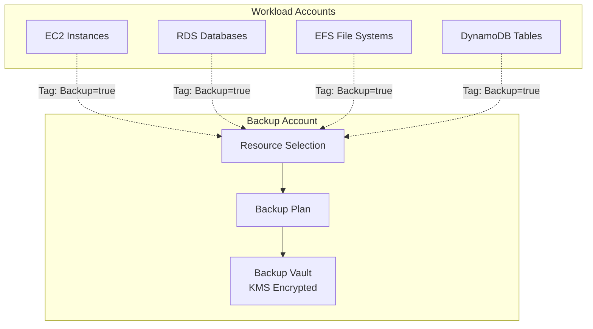

# Backup Module

The Backup module creates AWS Backup resources for centralized backup management across the Landing Zone.

## Overview

This module is deployed in the **Log Archive Account** or a dedicated **Backup Account** and creates:

- Backup vaults with KMS encryption
- Backup plans with configurable schedules
- Tag-based resource selection
- Cross-account backup support
- IAM roles with AWS managed policies

## Architecture



## Usage

```hcl
module "backup" {
  source = "../modules/backup"

  name_prefix = "production"
  kms_key_arn = aws_kms_key.backup.arn

  backup_rules = [
    {
      name         = "daily"
      schedule     = "cron(0 5 ? * * *)"
      delete_after = 35
    },
    {
      name               = "weekly"
      schedule           = "cron(0 5 ? * 1 *)"
      delete_after       = 90
      cold_storage_after = 30
    }
  ]

  selection_tags = [
    {
      key   = "Backup"
      value = "true"
    }
  ]

  tags = {
    Environment = "production"
    ManagedBy   = "terraform"
  }
}
```

## Inputs

| Name | Description | Type | Required |
|------|-------------|------|----------|
| `name_prefix` | Prefix for resource names | `string` | Yes |
| `kms_key_arn` | KMS key ARN for vault encryption | `string` | No |
| `enable_cross_account_backup` | Enable cross-account backup | `bool` | No |
| `source_account_ids` | Account IDs allowed to copy backups | `list(string)` | No |
| `backup_rules` | List of backup rules | `list(object)` | No |
| `selection_tags` | Tags to select resources for backup | `list(object)` | No |
| `resource_arns` | Specific resource ARNs to backup | `list(string)` | No |

## Outputs

| Name | Description |
|------|-------------|
| `vault_arn` | Backup vault ARN |
| `vault_name` | Backup vault name |
| `plan_id` | Backup plan ID |
| `plan_arn` | Backup plan ARN |
| `role_arn` | Backup IAM role ARN |

## Backup Rules

| Rule | Schedule | Retention | Cold Storage |
|------|----------|-----------|--------------|
| Daily | 5 AM UTC daily | 35 days | - |
| Weekly | 5 AM UTC Monday | 90 days | After 30 days |
| Monthly | 5 AM UTC 1st | 365 days | After 90 days |

## Cross-Account Backup

For centralized backup management:

```hcl
module "backup_central" {
  source = "../modules/backup"

  name_prefix                 = "central"
  enable_cross_account_backup = true
  source_account_ids = [
    "111111111111",
    "222222222222"
  ]

  backup_rules = [
    {
      name         = "daily"
      schedule     = "cron(0 5 ? * * *)"
      delete_after = 35
    }
  ]
}
```

## Related

- [Log Archive Module](./log-archive)
- [Storage Module](./storage)
- [Data Protection Architecture](../architecture/data-protection)
