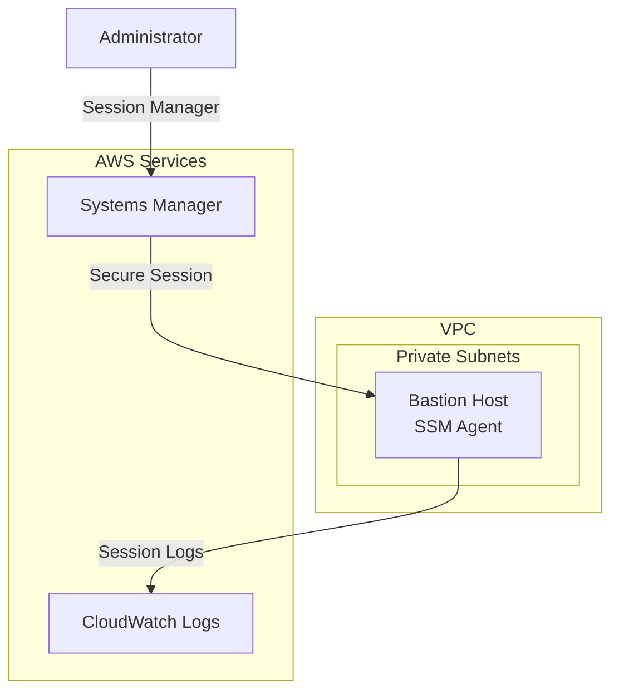

# Compute Module

The Compute module creates secure compute resources including bastion hosts with SSM Session Manager access.

## Overview

This module provides:

- **SSM Session Manager**: No SSH keys required, secure access via AWS Systems Manager
- **IMDSv2 Required**: Instance metadata service v2 enforced for security
- **Encrypted Volumes**: EBS encryption enabled by default
- **No Public IP**: Private subnet deployment by default
- **Auto Scaling**: Optional ASG for high availability
- **Session Logging**: Session Manager activity logged to CloudWatch

## Architecture



## Usage

### Basic Bastion Host

```hcl
module "compute" {
  source = "../modules/compute"

  name_prefix = "myorg"
  vpc_id      = module.vpc.vpc_id
  subnet_ids  = module.vpc.private_subnet_ids

  enable_bastion = true

  tags = {
    Environment = "production"
    ManagedBy   = "Terraform"
  }
}
```

### High Availability with Auto Scaling

```hcl
module "compute" {
  source = "../modules/compute"

  name_prefix = "myorg"
  vpc_id      = module.vpc.vpc_id
  subnet_ids  = module.vpc.private_subnet_ids

  enable_bastion              = true
  enable_bastion_auto_scaling = true
  bastion_desired_capacity    = 2
  bastion_min_size            = 1
  bastion_max_size            = 3

  tags = {
    Environment = "production"
  }
}
```

## Inputs

| Name | Description | Type | Required |
|------|-------------|------|----------|
| `name_prefix` | Prefix for resource names | `string` | Yes |
| `vpc_id` | VPC ID for deployment | `string` | Yes |
| `subnet_ids` | Subnet IDs for bastion | `list(string)` | Yes |
| `enable_bastion` | Enable bastion host | `bool` | No |
| `bastion_instance_type` | EC2 instance type | `string` | No |
| `enable_bastion_auto_scaling` | Enable ASG for HA | `bool` | No |
| `enable_cloudwatch_agent` | Enable CloudWatch agent | `bool` | No |
| `enable_session_manager_logging` | Log SSM sessions | `bool` | No |
| `enable_imdsv2` | Require IMDSv2 | `bool` | No |

## Outputs

| Name | Description |
|------|-------------|
| `bastion_instance_id` | EC2 instance ID |
| `bastion_private_ip` | Private IP address |
| `bastion_security_group_id` | Security group ID |
| `bastion_iam_role_arn` | IAM role ARN |
| `ssm_connect_command` | CLI command to connect |

## Connecting to Bastion

Use AWS Session Manager to connect (no SSH required):

```bash
# Using AWS CLI
aws ssm start-session --target <instance-id>

# Or use the output command
terraform output ssm_connect_command
```

## Security Features

| Feature | Description |
|---------|-------------|
| No SSH Access | Security group has no inbound rules |
| IMDSv2 Required | Prevents SSRF attacks via metadata service |
| Encrypted Storage | EBS volumes encrypted by default |
| Private Deployment | No public IP by default |
| Session Logging | All sessions logged to CloudWatch |
| Minimal Permissions | IAM role has only SSM permissions |

## Related

- [VPC Module](./vpc)
- [Security Baseline Module](./security-baseline)
- [Network Design](../architecture/network-design)
