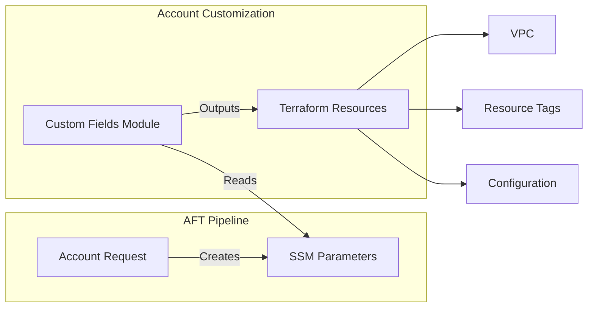

# Custom Fields Module

The Custom Fields module reads AFT account request metadata from SSM Parameter Store for use in account customization blueprints.

## Overview

This module is used within **AFT Account Customizations** to:

- Read custom fields from SSM Parameter Store
- Provide structured outputs for Terraform configurations
- Generate common tags from account metadata
- Support default values for missing fields

## Architecture



## Usage

```hcl
module "custom_fields" {
  source = "../../modules/custom-fields"

  read_environment         = true
  read_vpc_cidr            = true
  read_cost_center         = true
  read_owner               = true
  read_data_classification = true
  read_backup_enabled      = true

  additional_custom_fields = ["project_code", "compliance_framework"]

  default_environment = "development"
  default_vpc_cidr    = "10.0.0.0/16"
}

resource "aws_vpc" "main" {
  cidr_block = module.custom_fields.vpc_cidr

  tags = merge(
    module.custom_fields.tags,
    {
      Name = "main-vpc"
    }
  )
}
```

## Inputs

| Name | Description | Type | Required |
|------|-------------|------|----------|
| `read_environment` | Read environment custom field | `bool` | No |
| `read_vpc_cidr` | Read vpc_cidr custom field | `bool` | No |
| `read_cost_center` | Read cost_center custom field | `bool` | No |
| `read_owner` | Read owner custom field | `bool` | No |
| `read_data_classification` | Read data_classification custom field | `bool` | No |
| `read_backup_enabled` | Read backup_enabled custom field | `bool` | No |
| `additional_custom_fields` | Additional custom field names to read | `list(string)` | No |
| `default_environment` | Default environment if not specified | `string` | No |
| `default_vpc_cidr` | Default VPC CIDR if not specified | `string` | No |

## Outputs

| Name | Description |
|------|-------------|
| `account_id` | Account ID from AFT |
| `environment` | Environment (production, staging, development) |
| `vpc_cidr` | VPC CIDR block for this account |
| `cost_center` | Cost center for billing |
| `owner` | Account owner |
| `data_classification` | Data classification level |
| `backup_enabled` | Whether backup is enabled |
| `custom_fields` | Map of additional custom fields |
| `tags` | Common tags derived from custom fields |

## SSM Parameter Structure

AFT creates SSM parameters at:

```
/aft/account-request/custom-fields/<field_name>
```

### Standard Fields

| Parameter | Description | Example |
|-----------|-------------|---------|
| `environment` | Account environment | `production` |
| `vpc_cidr` | VPC CIDR allocation | `10.1.0.0/16` |
| `cost_center` | Billing cost center | `CC-12345` |
| `owner` | Account owner email | `team@example.com` |
| `data_classification` | Data sensitivity | `confidential` |
| `backup_enabled` | Enable backups | `true` |

## Account Request Example

In your AFT account request:

```hcl
module "account_request" {
  source = "./modules/aft-account-request"

  control_tower_parameters = {
    AccountEmail = "workload@example.com"
    AccountName  = "workload-prod"
    # ...
  }

  custom_fields = {
    environment         = "production"
    vpc_cidr            = "10.1.0.0/16"
    cost_center         = "CC-12345"
    owner               = "platform-team@example.com"
    data_classification = "confidential"
    backup_enabled      = "true"
  }
}
```

## Related

- [AFT Module](./aft)
- [Account Vending Runbook](../runbooks/account-vending)
- [Cost Governance](../architecture/cost-governance)
