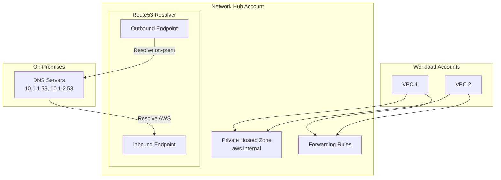

# DNS Module

The DNS module manages Route53 private hosted zones and Route53 Resolver endpoints for hybrid DNS resolution.

## Overview

This module is deployed in the **Network Hub Account** and creates:

- Private Route53 hosted zones with VPC associations
- Route53 Resolver inbound endpoints (on-premises to AWS)
- Route53 Resolver outbound endpoints (AWS to on-premises)
- Conditional forwarding rules for hybrid DNS
- AWS RAM sharing for cross-account access

## Architecture



## Usage

### Private Hosted Zone Only

```hcl
module "dns" {
  source = "../modules/dns"

  name_prefix = "network-hub"
  vpc_id      = module.vpc.vpc_id

  create_private_hosted_zone   = true
  private_zone_name            = "internal.example.com"
  
  share_zone_with_organization = true
  organization_arn             = "arn:aws:organizations::123456789012:organization/o-xxxxx"

  tags = {
    Environment = "production"
    ManagedBy   = "terraform"
  }
}
```

### Hybrid DNS with Resolver Endpoints

```hcl
module "dns" {
  source = "../modules/dns"

  name_prefix = "network-hub"
  vpc_id      = module.vpc.vpc_id

  create_private_hosted_zone = true
  private_zone_name          = "aws.internal.example.com"
  
  create_resolver_endpoints = true
  create_inbound_endpoint   = true
  create_outbound_endpoint  = true
  
  resolver_subnet_ids = [
    module.vpc.private_subnet_ids[0],
    module.vpc.private_subnet_ids[1]
  ]
  
  forward_rules = {
    onprem = {
      domain_name = "onprem.example.com"
      target_ips = [
        { ip = "10.1.1.53", port = 53 },
        { ip = "10.1.2.53", port = 53 }
      ]
    }
  }
  
  share_zone_with_organization  = true
  share_rules_with_organization = true
  organization_arn              = "arn:aws:organizations::123456789012:organization/o-xxxxx"

  tags = {
    Environment = "production"
  }
}
```

## Inputs

| Name | Description | Type | Required |
|------|-------------|------|----------|
| `name_prefix` | Prefix for resource names | `string` | Yes |
| `vpc_id` | VPC ID for hosted zone and endpoints | `string` | Yes |
| `create_private_hosted_zone` | Create a private hosted zone | `bool` | No |
| `private_zone_name` | Name of the private hosted zone | `string` | No |
| `create_resolver_endpoints` | Create Route53 Resolver endpoints | `bool` | No |
| `create_inbound_endpoint` | Create inbound resolver endpoint | `bool` | No |
| `create_outbound_endpoint` | Create outbound resolver endpoint | `bool` | No |
| `resolver_subnet_ids` | Subnet IDs for resolver endpoints | `list(string)` | No |
| `forward_rules` | Map of forwarding rules | `map(object)` | No |
| `share_zone_with_organization` | Share zone via RAM | `bool` | No |
| `share_rules_with_organization` | Share rules via RAM | `bool` | No |

## Outputs

| Name | Description |
|------|-------------|
| `private_zone_id` | ID of the private hosted zone |
| `private_zone_name` | Name of the private hosted zone |
| `inbound_endpoint_id` | ID of the inbound resolver endpoint |
| `inbound_endpoint_ips` | IP addresses of the inbound endpoint |
| `outbound_endpoint_id` | ID of the outbound resolver endpoint |
| `resolver_rule_ids` | Map of resolver rule names to IDs |

## DNS Resolution Flow

| Source | Destination | Path |
|--------|-------------|------|
| On-premises | AWS resources | On-prem DNS → Inbound Endpoint → Private Hosted Zone |
| AWS resources | On-premises | VPC DNS → Outbound Endpoint → On-prem DNS |
| AWS resources | AWS resources | VPC DNS → Private Hosted Zone |

## Notes

- Resolver endpoints require at least 2 subnets in different AZs
- Each resolver endpoint creates 1 ENI per subnet
- Inbound endpoint IPs should be configured as forwarders in on-premises DNS
- Outbound forwarding rules are automatically applied to VPCs that accept the RAM share

## Related

- [Networking Module](./networking)
- [Network Design](../architecture/network-design)
- [VPC Module](./vpc)
