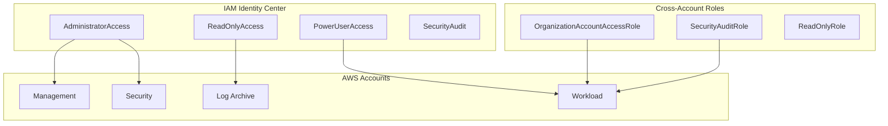

# IAM Module

The IAM module provides comprehensive IAM management for AWS Landing Zone deployments.

## Overview

This module is deployed in the **Management Account** or **Shared Services Account** and creates:

- IAM Identity Center permission sets
- Cross-account IAM roles
- Break-glass emergency access user
- Custom IAM policies
- Account-level password policy

## Architecture



## Usage

```hcl
module "iam" {
  source = "../modules/iam"

  name_prefix = "myorg"

  # IAM Identity Center Permission Sets
  create_permission_sets = true
  sso_instance_arn       = "arn:aws:sso:::instance/ssoins-1234567890abcdef"
  
  permission_sets = {
    DeveloperAccess = {
      description      = "Developer access with limited permissions"
      session_duration = "PT4H"
      managed_policies = [
        "arn:aws:iam::aws:policy/PowerUserAccess"
      ]
      inline_policy = null
    }
  }

  # Cross-Account Roles
  create_cross_account_roles    = true
  trusted_account_ids           = ["123456789012", "234567890123"]
  require_mfa_for_cross_account = true

  # Password Policy
  configure_password_policy = true
  password_policy = {
    minimum_password_length      = 14
    require_lowercase_characters = true
    require_uppercase_characters = true
    require_numbers              = true
    require_symbols              = true
    max_password_age             = 90
    password_reuse_prevention    = 24
  }

  tags = {
    Environment = "production"
    ManagedBy   = "Terraform"
  }
}
```

## Inputs

| Name | Description | Type | Required |
|------|-------------|------|----------|
| `name_prefix` | Prefix for IAM resource names | `string` | Yes |
| `create_permission_sets` | Create permission sets | `bool` | No |
| `sso_instance_arn` | ARN of IAM Identity Center instance | `string` | No |
| `permission_sets` | Map of permission sets to create | `map(object)` | No |
| `create_cross_account_roles` | Create cross-account roles | `bool` | No |
| `trusted_account_ids` | Account IDs that can assume roles | `list(string)` | No |
| `require_mfa_for_cross_account` | Require MFA for role assumption | `bool` | No |
| `create_break_glass_user` | Create break-glass IAM user | `bool` | No |
| `configure_password_policy` | Configure account password policy | `bool` | No |

## Outputs

| Name | Description |
|------|-------------|
| `permission_set_arns` | Map of custom permission set ARNs |
| `default_permission_set_arns` | Map of default permission set ARNs |
| `cross_account_role_arns` | Map of cross-account role ARNs |
| `break_glass_user_arn` | ARN of break-glass user (if created) |

## Default Permission Sets

| Permission Set | Description | Session Duration |
|----------------|-------------|------------------|
| AdministratorAccess | Full administrative access | 4 hours |
| ReadOnlyAccess | Read-only access to all services | 8 hours |
| PowerUserAccess | Full access except IAM/Organizations | 4 hours |
| SecurityAudit | Security audit access | 8 hours |
| ViewOnlyAccess | View-only access (more restrictive) | 8 hours |
| BillingAccess | Billing and cost management | 4 hours |

## Default Cross-Account Roles

| Role | Description |
|------|-------------|
| OrganizationAccountAccessRole | Full admin access from management account |
| SecurityAuditRole | Security audit access from security account |
| ReadOnlyRole | Read-only access for monitoring |

## Security Considerations

1. **MFA Requirement**: Cross-account roles require MFA by default
2. **Permission Boundaries**: Can be enforced on all roles
3. **Break-Glass User**: Disabled by default, enable only for emergency access
4. **Session Duration**: Default permission sets have appropriate session limits
5. **Password Policy**: Enforces strong password requirements by default

## Related

- [Security Baseline Module](./security-baseline)
- [IAM Strategy](../architecture/iam-strategy)
- [Organization Module](./organization)
