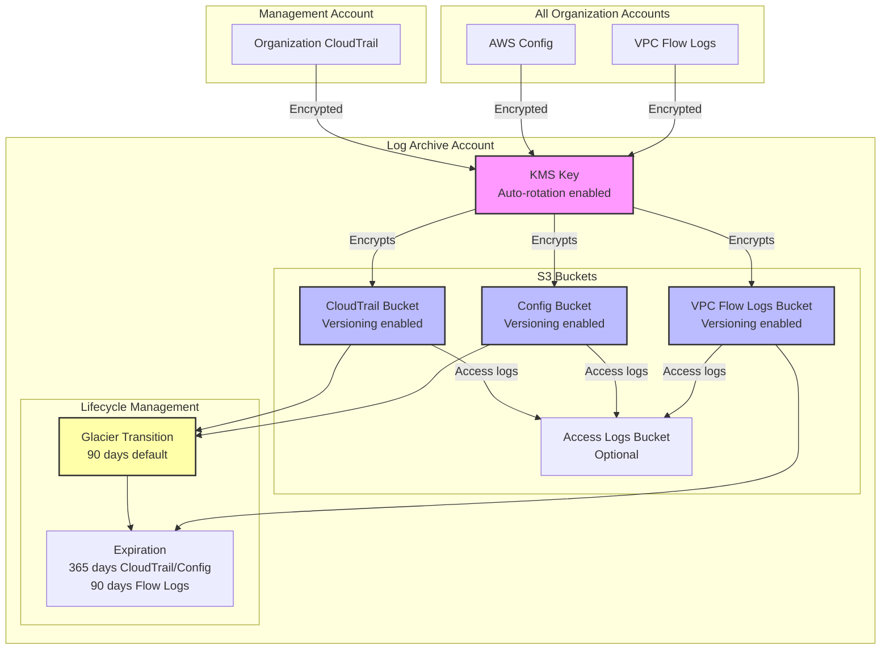

# Log Archive Module

The Log Archive module centralizes all audit and compliance logs from across the AWS Organization into a dedicated account with secure storage and lifecycle management.

## Overview

This module is deployed in the **Log Archive Account** and creates:

- KMS key for log encryption with automatic rotation
- CloudTrail S3 bucket for organization-wide audit logs
- AWS Config S3 bucket for configuration snapshots
- VPC Flow Logs S3 bucket for network traffic logs
- Optional S3 access logging bucket
- Lifecycle policies with Glacier transition for cost optimization
- Bucket policies enforcing secure access and encryption

## Usage

```hcl
module "log_archive" {
  source = "../modules/log-archive"

  organization_name = "acme-corp"
  organization_id   = "o-abc123def456"
  aws_region        = "us-east-1"

  # Retention policies
  cloudtrail_retention_days      = 365
  config_retention_days          = 365
  vpc_flow_log_retention_days    = 90

  # Cost optimization
  enable_glacier_transition = true
  glacier_transition_days   = 90

  # Access logging
  enable_s3_access_logging = true
}
```

## Inputs

| Name | Description | Type | Required |
|------|-------------|------|----------|
| `organization_name` | Organization name prefix for resource naming | `string` | Yes |
| `organization_id` | AWS Organization ID | `string` | Yes |
| `aws_region` | AWS region for log archive account | `string` | No (default: `us-east-1`) |
| `cloudtrail_retention_days` | Number of days to retain CloudTrail logs | `number` | No (default: `365`) |
| `config_retention_days` | Number of days to retain Config logs | `number` | No (default: `365`) |
| `vpc_flow_log_retention_days` | Number of days to retain VPC Flow Logs | `number` | No (default: `90`) |
| `enable_s3_access_logging` | Enable S3 access logging for log buckets | `bool` | No (default: `true`) |
| `enable_glacier_transition` | Enable transition to Glacier for older logs | `bool` | No (default: `true`) |
| `glacier_transition_days` | Days after which logs transition to Glacier | `number` | No (default: `90`) |

## Outputs

| Name | Description |
|------|-------------|
| `cloudtrail_bucket_name` | CloudTrail S3 bucket name |
| `cloudtrail_bucket_arn` | CloudTrail S3 bucket ARN |
| `config_bucket_name` | Config S3 bucket name |
| `config_bucket_arn` | Config S3 bucket ARN |
| `vpc_flow_logs_bucket_name` | VPC Flow Logs S3 bucket name |
| `vpc_flow_logs_bucket_arn` | VPC Flow Logs S3 bucket ARN |
| `kms_key_arn` | KMS key ARN for log encryption |
| `kms_key_id` | KMS key ID for log encryption |

## Architecture



## Security Features

### Encryption at Rest

All log buckets use KMS encryption with a dedicated key:

- **Automatic key rotation** enabled for compliance
- **Service-specific permissions** for CloudTrail, Config, and CloudWatch Logs
- **Bucket key enabled** to reduce KMS API costs

### Encryption in Transit

All bucket policies enforce TLS:

```json
{
  "Sid": "DenyInsecureTransport",
  "Effect": "Deny",
  "Principal": "*",
  "Action": "s3:*",
  "Resource": ["bucket-arn", "bucket-arn/*"],
  "Condition": {
    "Bool": {
      "aws:SecureTransport": "false"
    }
  }
}
```

### Public Access Prevention

All buckets have public access blocks enabled:

- `block_public_acls = true`
- `block_public_policy = true`
- `ignore_public_acls = true`
- `restrict_public_buckets = true`

### Versioning

CloudTrail, Config, and VPC Flow Logs buckets have versioning enabled to protect against accidental deletion or modification.

## Cost Optimization

### Glacier Transition

Logs automatically transition to Glacier storage class after 90 days (configurable):

- **CloudTrail**: Glacier after 90 days, expire after 365 days
- **Config**: Glacier after 90 days, expire after 365 days
- **VPC Flow Logs**: Expire after 90 days (no Glacier transition)

This reduces storage costs by up to 90% for older logs while maintaining compliance.

### Bucket Key

S3 Bucket Keys reduce KMS API costs by up to 99% by using bucket-level keys instead of object-level keys.

## File Structure

```
terraform/log-archive/
├── main.tf              # KMS key and alias
├── buckets.tf           # S3 buckets and configurations
├── variables.tf         # Input variables
├── outputs.tf           # Output values
├── providers.tf         # AWS provider configuration
├── backend.tf           # Terraform state backend
└── terraform.tfvars.example
```

## Dependencies

- **Organization Module**: Requires `organization_id` from the Organization module
- **Management Account**: Organization CloudTrail must be configured to use the CloudTrail bucket
- **Security Account**: AWS Config aggregator should reference the Config bucket
- **Network Account**: VPC Flow Logs should be configured to use the VPC Flow Logs bucket

## Related

- [Multi-Account Architecture](../architecture/multi-account)
- [Security Model](../architecture/security-model)
- [Organization Module](./organization)
- [Security Baseline Module](./security-baseline)
