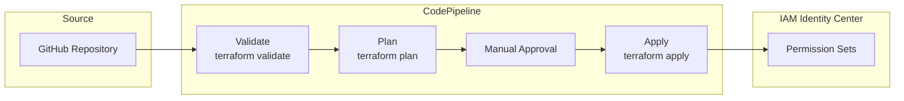

# Permission Set Pipeline Module

The Permission Set Pipeline module creates a CI/CD pipeline for managing IAM Identity Center permission sets using GitOps principles.

## Overview

This module is deployed in the **Shared Services Account** and creates:

- CodePipeline for automated permission set changes
- CodeBuild projects for validation, planning, and applying
- Optional manual approval stage
- S3 bucket for artifacts with encryption
- SNS topic for approval notifications

## Architecture



## Usage

```hcl
module "permission_set_pipeline" {
  source = "../modules/permission-set-pipeline"

  name_prefix             = "myorg"
  codestar_connection_arn = "arn:aws:codestar-connections:us-east-1:123456789012:connection/xxx"
  repository_id           = "myorg/permission-sets"
  branch_name             = "main"
  permission_sets_path    = "terraform/permission-sets"

  enable_manual_approval = true
  approval_email         = "platform-team@example.com"

  tags = {
    Environment = "production"
    ManagedBy   = "Terraform"
  }
}
```

## Inputs

| Name | Description | Type | Required |
|------|-------------|------|----------|
| `name_prefix` | Prefix for resource names | `string` | Yes |
| `codestar_connection_arn` | CodeStar connection ARN | `string` | Yes |
| `repository_id` | Repository ID (owner/repo) | `string` | Yes |
| `branch_name` | Branch to monitor | `string` | No |
| `permission_sets_path` | Path to Terraform config | `string` | No |
| `enable_manual_approval` | Enable approval stage | `bool` | No |
| `approval_email` | Email for approvals | `string` | No |
| `kms_key_arn` | KMS key for encryption | `string` | No |
| `terraform_version` | Terraform version | `string` | No |

## Outputs

| Name | Description |
|------|-------------|
| `pipeline_arn` | CodePipeline ARN |
| `pipeline_name` | CodePipeline name |
| `codebuild_project_arn` | CodeBuild project ARN |
| `artifacts_bucket_arn` | S3 artifacts bucket ARN |
| `approval_topic_arn` | SNS approval topic ARN |

## Prerequisites

1. **CodeStar Connection**: Create a connection to your Git provider
2. **Permission Sets Repository**: Repository containing Terraform code
3. **IAM Identity Center**: Must be enabled in your organization

## Repository Structure

Your permission sets repository should have this structure:

```
terraform/permission-sets/
├── main.tf
├── variables.tf
├── outputs.tf
├── versions.tf
└── permission-sets/
    ├── admin.tf
    ├── developer.tf
    └── readonly.tf
```

## Pipeline Stages

| Stage | Action | Description |
|-------|--------|-------------|
| Source | GitHub | Pulls code from repository |
| Validate | CodeBuild | Runs `terraform validate` |
| Plan | CodeBuild | Runs `terraform plan` |
| Approval | Manual | Optional human approval |
| Apply | CodeBuild | Runs `terraform apply` |

## Security Considerations

1. **Least Privilege**: CodeBuild role has minimal permissions for SSO management
2. **Encryption**: Artifacts encrypted at rest (optional KMS)
3. **Manual Approval**: Recommended for production changes
4. **Audit Trail**: CloudWatch logs for all pipeline executions

## Related

- [IAM Module](./iam)
- [Shared Services Module](./shared-services)
- [CI/CD Setup Runbook](../runbooks/cicd-setup)
