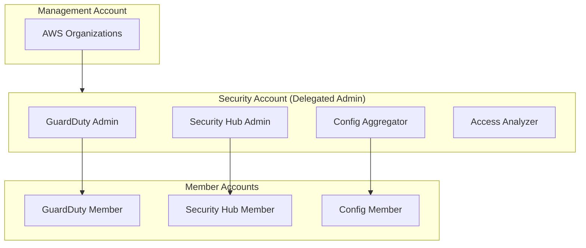

# Security Baseline Module

The Security Baseline module configures security services across all accounts.

## Overview

This module is deployed in the **Security Account** and configures:

- GuardDuty (organization-wide)
- Security Hub (organization-wide)
- AWS Config (organization aggregator)
- IAM Access Analyzer

## Architecture



## Usage

```hcl
module "security_baseline" {
  source = "../modules/security-baseline"

  # GuardDuty
  enable_guardduty          = true
  guardduty_s3_protection   = true
  guardduty_eks_protection  = true
  guardduty_finding_bucket  = "acme-security-guardduty-findings"

  # Security Hub
  enable_security_hub = true
  security_hub_standards = [
    "aws-foundational-security-best-practices/v/1.0.0",
    "cis-aws-foundations-benchmark/v/1.4.0"
  ]

  # Config
  enable_config_aggregator = true
  config_delivery_bucket   = "acme-log-archive-config"

  # Access Analyzer
  enable_access_analyzer = true
  access_analyzer_type   = "ORGANIZATION"

  # Notifications
  security_notification_emails = [
    "security-team@acme.com"
  ]
}
```

## Inputs

| Name | Description | Type | Required |
|------|-------------|------|----------|
| `enable_guardduty` | Enable GuardDuty | `bool` | No |
| `guardduty_s3_protection` | Enable S3 protection | `bool` | No |
| `guardduty_eks_protection` | Enable EKS protection | `bool` | No |
| `enable_security_hub` | Enable Security Hub | `bool` | No |
| `security_hub_standards` | Standards to enable | `list(string)` | No |
| `enable_config_aggregator` | Enable Config aggregator | `bool` | No |
| `enable_access_analyzer` | Enable Access Analyzer | `bool` | No |
| `security_notification_emails` | Email addresses for alerts | `list(string)` | No |

## Outputs

| Name | Description |
|------|-------------|
| `guardduty_detector_id` | GuardDuty detector ID |
| `security_hub_arn` | Security Hub ARN |
| `config_aggregator_arn` | Config aggregator ARN |
| `access_analyzer_arn` | Access Analyzer ARN |
| `sns_topic_arn` | SNS topic for security alerts |

## GuardDuty Configuration

### Enabled Detectors

- **EC2**: Malicious activity on EC2 instances
- **S3**: Data exfiltration, suspicious access patterns
- **EKS**: Kubernetes audit logs analysis
- **Malware Protection**: Scanning EBS volumes

### Finding Severity Mapping

| Severity | Action |
|----------|--------|
| Critical | PagerDuty + Slack + Email |
| High | Slack + Email |
| Medium | Email |
| Low | Log only |

## Security Hub Configuration

### Enabled Standards

1. **AWS Foundational Security Best Practices**
   - Covers most AWS services
   - ~200 automated checks

2. **CIS AWS Foundations Benchmark**
   - Industry standard compliance
   - IAM, logging, monitoring, networking

### Custom Insights

- Resources with public access
- Unencrypted storage
- Cross-account access

## Config Rules

### Organization Rules

| Rule | Description |
|------|-------------|
| `s3-bucket-ssl-requests-only` | Require SSL for S3 |
| `encrypted-volumes` | EBS encryption required |
| `rds-storage-encrypted` | RDS encryption required |
| `cloudtrail-enabled` | CloudTrail must be enabled |
| `root-account-mfa-enabled` | Root MFA required |

## File Structure

```
terraform/security/
├── main.tf              # Main configuration
├── guardduty.tf         # GuardDuty setup
├── security-hub.tf      # Security Hub setup
├── config.tf            # Config aggregator
├── access-analyzer.tf   # Access Analyzer
├── notifications.tf     # SNS topics and subscriptions
├── variables.tf
├── outputs.tf
├── providers.tf
├── backend.tf
└── terraform.tfvars.example
```

## Prerequisites

- Management account must delegate admin to Security account
- Log Archive account must exist (for findings storage)
- IAM roles for cross-account access

## Related

- [Security Model](../architecture/security-model)
- [Troubleshooting Runbook](../runbooks/troubleshooting)
