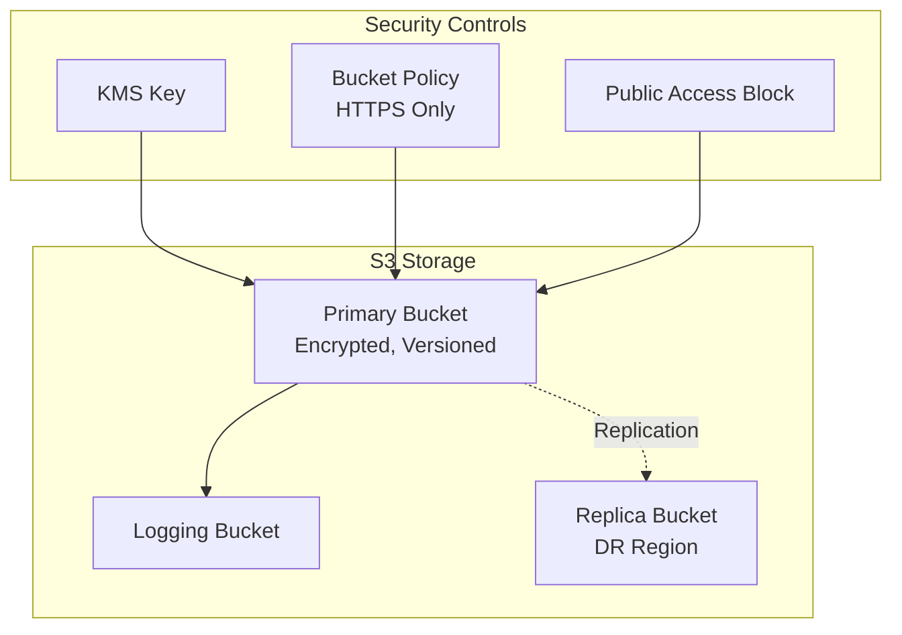

# Storage Module

The Storage module creates secure S3 buckets with AWS best practices for Landing Zone deployments.

## Overview

This module provides:

- **Server-Side Encryption**: SSE-S3 or SSE-KMS encryption
- **Versioning**: Enabled by default for data protection
- **Access Logging**: Optional logging to separate bucket
- **Public Access Block**: All public access blocked by default
- **Lifecycle Rules**: Configurable object lifecycle management
- **Cross-Region Replication**: Optional replication for DR
- **Object Lock**: Optional WORM compliance support
- **Secure Transport**: Enforces HTTPS-only access

## Architecture



## Usage

### Basic Secure Bucket

```hcl
module "storage" {
  source = "../modules/storage"

  bucket_name = "my-secure-bucket"

  enable_versioning = true
  enable_encryption = true
  enable_logging    = true

  lifecycle_rules = [
    {
      id                            = "archive-old-versions"
      enabled                       = true
      noncurrent_version_expiration = 90
      transition_days               = 30
      transition_storage_class      = "STANDARD_IA"
    }
  ]

  tags = {
    Environment = "production"
    ManagedBy   = "Terraform"
  }
}
```

### With KMS Encryption

```hcl
module "storage" {
  source = "../modules/storage"

  bucket_name       = "my-kms-encrypted-bucket"
  enable_encryption = true
  kms_key_id        = "arn:aws:kms:us-east-1:123456789012:key/xxx"

  tags = {
    Environment = "production"
  }
}
```

### With Cross-Region Replication

```hcl
module "storage" {
  source = "../modules/storage"

  bucket_name                     = "my-replicated-bucket"
  enable_replication              = true
  replication_role_arn            = aws_iam_role.replication.arn
  replication_destination_bucket_arn = "arn:aws:s3:::my-destination-bucket"

  tags = {
    Environment = "production"
  }
}
```

## Inputs

| Name | Description | Type | Required |
|------|-------------|------|----------|
| `bucket_name` | Name of the S3 bucket | `string` | Yes |
| `enable_versioning` | Enable versioning | `bool` | No |
| `enable_encryption` | Enable server-side encryption | `bool` | No |
| `kms_key_id` | KMS key ID for SSE-KMS | `string` | No |
| `enable_logging` | Enable access logging | `bool` | No |
| `logging_bucket_name` | Existing bucket for logs | `string` | No |
| `enable_public_access_block` | Block all public access | `bool` | No |
| `lifecycle_rules` | List of lifecycle rules | `list(object)` | No |
| `enable_replication` | Enable cross-region replication | `bool` | No |
| `enable_object_lock` | Enable object lock (WORM) | `bool` | No |
| `force_destroy` | Allow destroying non-empty bucket | `bool` | No |

## Outputs

| Name | Description |
|------|-------------|
| `bucket_id` | ID of the S3 bucket |
| `bucket_arn` | ARN of the S3 bucket |
| `bucket_domain_name` | Domain name of the bucket |
| `bucket_regional_domain_name` | Regional domain name |
| `logging_bucket_id` | ID of logging bucket (if created) |
| `logging_bucket_arn` | ARN of logging bucket (if created) |

## Security Features

| Feature | Description | Default |
|---------|-------------|---------|
| HTTPS Only | Bucket policy denies non-SSL requests | Enabled |
| Public Access Blocked | All public access settings blocked | Enabled |
| Encryption | Server-side encryption | Enabled (SSE-S3) |
| Versioning | Protects against accidental deletion | Enabled |
| Object Lock | WORM compliance for regulatory requirements | Disabled |

## Lifecycle Rules

| Transition | Days | Storage Class |
|------------|------|---------------|
| Standard → Standard-IA | 30 | STANDARD_IA |
| Standard-IA → Glacier | 90 | GLACIER |
| Glacier → Deep Archive | 180 | DEEP_ARCHIVE |
| Delete | 365 | - |

## Related

- [Log Archive Module](./log-archive)
- [Backup Module](./backup)
- [Data Protection Architecture](../architecture/data-protection)
