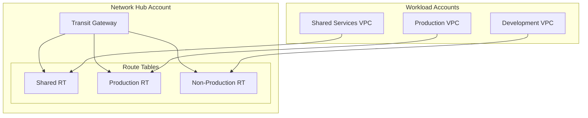

# Transit Gateway Module

The Transit Gateway module creates an AWS Transit Gateway with route tables and optional organization-wide sharing.

## Overview

This module is deployed in the **Network Hub Account** and creates:

- Transit Gateway as central hub for VPC connectivity
- Configurable route tables for traffic segmentation
- RAM sharing with entire AWS Organization
- BGP support for hybrid connectivity

## Architecture



## Usage

```hcl
module "transit_gateway" {
  source = "../modules/transit-gateway"

  name            = "acme-tgw"
  amazon_side_asn = 64512

  # Route tables for traffic segmentation
  route_tables = ["shared", "production", "nonproduction"]

  # Share with organization
  share_with_organization = true
  organization_arn        = "arn:aws:organizations::123456789012:organization/o-example"

  # Auto-accept attachments from organization accounts
  auto_accept_shared_attachments = "enable"

  tags = {
    Environment = "shared"
    ManagedBy   = "Terraform"
  }
}
```

## Inputs

| Name | Description | Type | Required |
|------|-------------|------|----------|
| `name` | Name prefix for Transit Gateway resources | `string` | Yes |
| `amazon_side_asn` | Private ASN for BGP session | `number` | No |
| `auto_accept_shared_attachments` | Auto accept shared attachments | `string` | No |
| `route_tables` | List of route table names to create | `list(string)` | No |
| `share_with_organization` | Share with entire organization | `bool` | No |
| `organization_arn` | ARN of the organization to share with | `string` | No |

## Outputs

| Name | Description |
|------|-------------|
| `transit_gateway_id` | Transit Gateway ID |
| `transit_gateway_arn` | Transit Gateway ARN |
| `route_table_ids` | Map of route table names to IDs |
| `ram_share_arn` | RAM resource share ARN |

## Route Table Strategy

| Route Table | Purpose | Typical Attachments |
|-------------|---------|---------------------|
| `shared` | Access to shared services | Shared Services VPC, Egress VPC |
| `production` | Production workloads | Production account VPCs |
| `nonproduction` | Non-production workloads | Dev, Staging, QA VPCs |

## Attaching a VPC

To attach a VPC from another account:

```hcl
# In the workload account
resource "aws_ec2_transit_gateway_vpc_attachment" "workload" {
  subnet_ids         = var.transit_subnet_ids
  transit_gateway_id = data.aws_ec2_transit_gateway.shared.id
  vpc_id             = aws_vpc.workload.id

  transit_gateway_default_route_table_association = false
  transit_gateway_default_route_table_propagation = false

  tags = {
    Name = "workload-attachment"
  }
}

# Accept RAM share first
resource "aws_ram_resource_share_accepter" "tgw" {
  share_arn = data.aws_ram_resource_share.tgw.arn
}
```

## Traffic Flow

```
┌─────────────┐     ┌─────────────┐     ┌─────────────┐
│  VPC A      │────►│   Transit   │────►│  VPC B      │
│  10.1.0.0   │     │   Gateway   │     │  10.2.0.0   │
└─────────────┘     └─────────────┘     └─────────────┘
                           │
                           ▼
                    ┌─────────────┐
                    │  Egress VPC │
                    │  Internet   │
                    └─────────────┘
```

## Related

- [Networking Module](./networking)
- [VPC Module](./vpc)
- [Network Design](../architecture/network-design)
