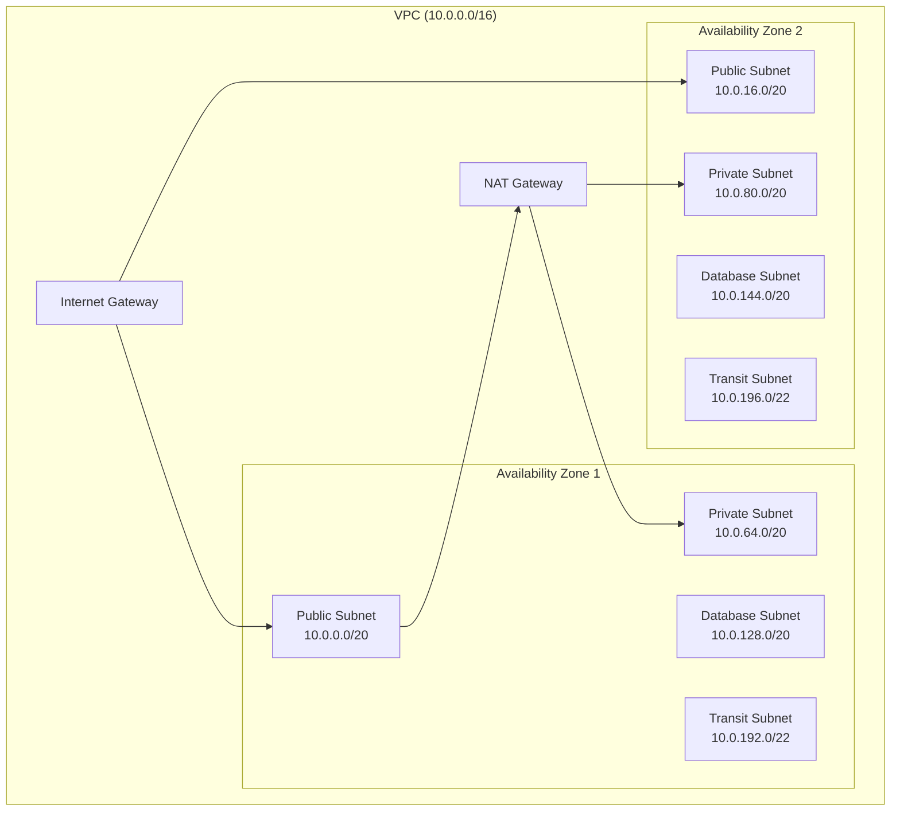

# VPC Module

The VPC module creates a VPC with multi-tier subnet architecture designed for AWS Landing Zone deployments.

## Overview

This module provides:

- **Multi-AZ Deployment**: Subnets across multiple availability zones
- **Tiered Subnets**: Public, private, database, and transit subnets
- **NAT Gateway**: Optional NAT gateway (single or per-AZ)
- **VPC Flow Logs**: Optional flow logging to S3 or CloudWatch
- **Secure Defaults**: Default security group with no rules

## Architecture



## Usage

```hcl
module "vpc" {
  source = "../modules/vpc"

  name               = "workload-vpc"
  cidr_block         = "10.0.0.0/16"
  availability_zones = ["us-east-1a", "us-east-1b", "us-east-1c"]

  enable_nat_gateway = true
  single_nat_gateway = false  # One NAT per AZ for HA

  enable_flow_logs         = true
  flow_log_destination_arn = "arn:aws:s3:::my-flow-logs-bucket"

  tags = {
    Environment = "production"
    ManagedBy   = "Terraform"
  }
}
```

## Inputs

| Name | Description | Type | Required |
|------|-------------|------|----------|
| `name` | VPC name | `string` | Yes |
| `cidr_block` | VPC CIDR block | `string` | Yes |
| `availability_zones` | List of AZs | `list(string)` | Yes |
| `enable_dns_support` | Enable DNS support | `bool` | No |
| `enable_dns_hostnames` | Enable DNS hostnames | `bool` | No |
| `enable_nat_gateway` | Create NAT gateways | `bool` | No |
| `single_nat_gateway` | Use single NAT gateway | `bool` | No |
| `enable_flow_logs` | Enable VPC flow logs | `bool` | No |
| `flow_log_destination_arn` | Flow logs destination ARN | `string` | No |

## Outputs

| Name | Description |
|------|-------------|
| `vpc_id` | VPC ID |
| `vpc_cidr_block` | VPC CIDR block |
| `public_subnet_ids` | Public subnet IDs |
| `private_subnet_ids` | Private subnet IDs |
| `database_subnet_ids` | Database subnet IDs |
| `transit_subnet_ids` | Transit subnet IDs |
| `nat_gateway_ids` | NAT gateway IDs |
| `private_route_table_ids` | Private route table IDs |
| `transit_route_table_id` | Transit route table ID |

## Subnet CIDR Allocation

Given a `/16` VPC CIDR, subnets are allocated as follows:

| Subnet Type | CIDR Range | Example (10.0.0.0/16) | Purpose |
|-------------|------------|------------------------|---------|
| Public | /20 | 10.0.0.0/20 - 10.0.48.0/20 | Load balancers, NAT gateways |
| Private | /20 | 10.0.64.0/20 - 10.0.112.0/20 | Application workloads |
| Database | /20 | 10.0.128.0/20 - 10.0.176.0/20 | RDS, ElastiCache |
| Transit | /22 | 10.0.192.0/22 - 10.0.204.0/22 | Transit Gateway attachments |

## NAT Gateway Options

| Configuration | Cost | Availability |
|---------------|------|--------------|
| `single_nat_gateway = true` | Low | Single AZ |
| `single_nat_gateway = false` | High | Multi-AZ HA |

## Security Features

| Feature | Description |
|---------|-------------|
| Default Security Group | Restricted with no ingress/egress rules |
| Private Subnets | No direct internet access |
| Database Isolation | Separate subnets for databases |
| Transit Subnets | Dedicated subnets for Transit Gateway |
| Flow Logs | Optional logging for network analysis |

## Related

- [Transit Gateway Module](./transit-gateway)
- [Networking Module](./networking)
- [Network Design](../architecture/network-design)
