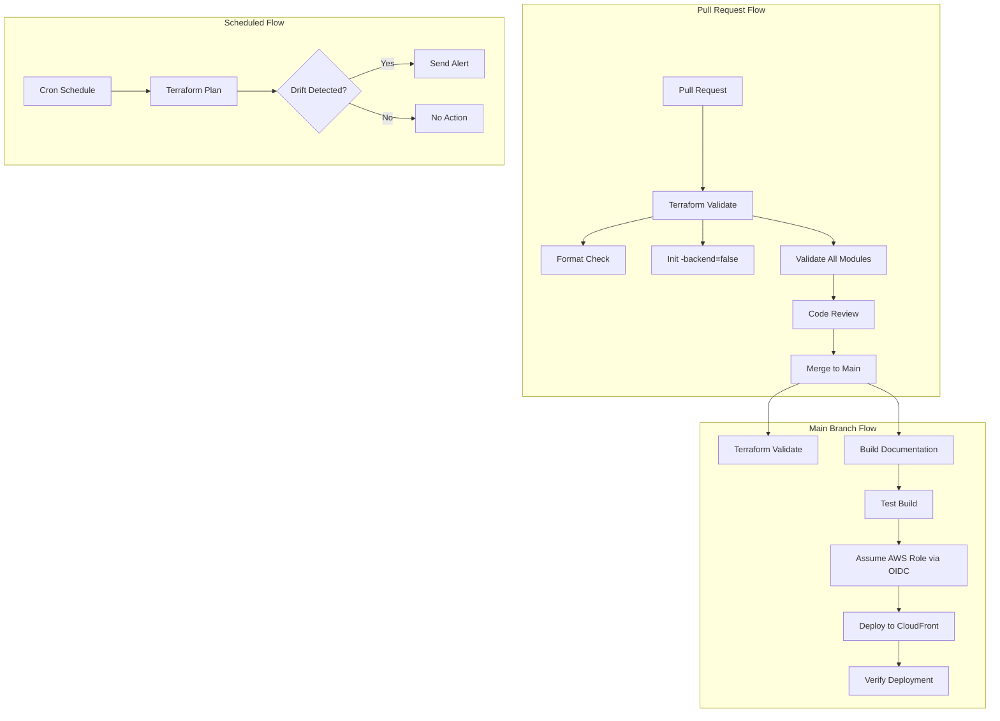

# CI/CD Pipeline Setup

This runbook describes how to set up and manage the CI/CD pipelines for the AWS Landing Zone using GitHub Actions.

## Pipeline Overview

The Landing Zone includes two GitHub Actions workflows for automation:

- **Terraform Validate**: Validates Terraform code on pull requests and pushes
- **Documentation Deploy**: Builds and deploys the Docusaurus site to AWS CloudFront

Both workflows are disabled by default (`.disabled` suffix) to prevent accidental execution before proper configuration.

### Workflow Architecture



### Workflow Triggers

| Workflow | Trigger | Purpose |
|----------|---------|---------|
| Terraform Validate | PR to `main` (terraform/**) | Validate changes before merge |
| Terraform Validate | Push to `main` (terraform/**) | Validate merged code |
| Documentation Deploy | Push to `main` (docs/**, infra/**) | Auto-deploy docs on merge |
| Documentation Deploy | Manual dispatch | Deploy to specific stage |

## Enabling the Pipelines

### Step 1: Remove Disabled Suffix

```bash
# Enable Terraform validation
mv .github/workflows/terraform-validate.yml.disabled \
   .github/workflows/terraform-validate.yml

# Enable documentation deployment
mv .github/workflows/docs-deploy.yml.disabled \
   .github/workflows/docs-deploy.yml

# Commit the changes
git add .github/workflows/
git commit -m "chore: enable CI/CD pipelines"
git push
```

### Step 2: Configure GitHub Secrets

Navigate to **Settings > Secrets and variables > Actions** in your GitHub repository and add:

| Secret Name | Description | Example Value |
|-------------|-------------|---------------|
| `AWS_ROLE_ARN` | IAM role ARN for GitHub Actions OIDC | `arn:aws:iam::123456789012:role/GitHubActionsRole` |

:::caution Important
Do NOT use long-lived AWS credentials (access keys). Use OIDC authentication instead.
:::

### Step 3: Configure Repository Settings

#### Branch Protection Rules

Navigate to **Settings > Branches** and configure protection for `main`:

- [ ] Require pull request reviews before merging (1 reviewer minimum)
- [ ] Require status checks to pass before merging
  - [ ] `Validate Terraform`
  - [ ] `Build Documentation`
- [ ] Require branches to be up to date before merging
- [ ] Do not allow bypassing the above settings

#### Environment Protection Rules

Navigate to **Settings > Environments** and create environments:

**Development Environment (`dev`)**
- No protection rules
- Auto-deploy on merge to `main`

**Production Environment (`prod`)**
- Required reviewers: 2 approvers
- Deployment branches: `main` only
- Manual approval required

## Terraform in CI/CD

### State Management

The pipelines use Terraform's S3 backend for state management:

```hcl
# terraform/*/backend.tf
terraform {
  backend "s3" {
    bucket         = "acme-terraform-state"
    key            = "terraform/organization/terraform.tfstate"
    region         = "us-east-1"
    dynamodb_table = "terraform-locks"
    encrypt        = true
  }
}
```

**Key Features:**
- **S3 Versioning**: Enabled for state history and rollback
- **DynamoDB Locking**: Prevents concurrent modifications
- **Encryption**: State files encrypted at rest with SSE-S3

### Validation Workflow

The validation workflow runs without backend initialization:

```bash
terraform init -backend=false
terraform validate
terraform fmt -check
```

This approach:
- Validates syntax and configuration
- Checks formatting compliance
- Does not require AWS credentials
- Runs quickly on every PR

### Plan/Apply Workflow

:::info
The current workflows only validate Terraform. Plan/Apply workflows are not included to prevent accidental infrastructure changes.
:::

To add plan/apply automation:

1. Create a new workflow for Terraform plan on PR
2. Store plan output as artifact
3. Require manual approval for apply
4. Apply only on merge to `main`

**Example Plan Workflow:**

```yaml
- name: Terraform Plan
  run: |
    cd terraform/organization
    terraform init
    terraform plan -out=tfplan
    terraform show -no-color tfplan > plan.txt

- name: Comment Plan on PR
  uses: actions/github-script@v7
  with:
    script: |
      const fs = require('fs');
      const plan = fs.readFileSync('plan.txt', 'utf8');
      github.rest.issues.createComment({
        issue_number: context.issue.number,
        owner: context.repo.owner,
        repo: context.repo.repo,
        body: `## Terraform Plan\n\`\`\`\n${plan}\n\`\`\``
      });
```

### Workspace Strategy

This Landing Zone uses **separate state files per account** rather than Terraform workspaces:

```
terraform/
├── organization/     # State: terraform/organization/terraform.tfstate
├── security/         # State: terraform/security/terraform.tfstate
├── log-archive/      # State: terraform/log-archive/terraform.tfstate
└── network/          # State: terraform/network/terraform.tfstate
```

**Benefits:**
- Clear separation of concerns
- Independent deployment cycles
- Reduced blast radius
- Easier to understand and maintain

## OIDC Authentication

### GitHub OIDC Provider Setup

Create the OIDC provider in your AWS Management account:

```bash
# Create OIDC provider
aws iam create-open-id-connect-provider \
  --url https://token.actions.githubusercontent.com \
  --client-id-list sts.amazonaws.com \
  --thumbprint-list 6938fd4d98bab03faadb97b34396831e3780aea1
```

### IAM Role for GitHub Actions

Create an IAM role with trust policy for GitHub:

```json
{
  "Version": "2012-10-17",
  "Statement": [
    {
      "Effect": "Allow",
      "Principal": {
        "Federated": "arn:aws:iam::123456789012:oidc-provider/token.actions.githubusercontent.com"
      },
      "Action": "sts:AssumeRoleWithWebIdentity",
      "Condition": {
        "StringEquals": {
          "token.actions.githubusercontent.com:aud": "sts.amazonaws.com"
        },
        "StringLike": {
          "token.actions.githubusercontent.com:sub": "repo:your-org/aws-landing-zone-template:*"
        }
      }
    }
  ]
}
```

### Least Privilege Permissions

Attach a policy with minimum required permissions:

```json
{
  "Version": "2012-10-17",
  "Statement": [
    {
      "Effect": "Allow",
      "Action": [
        "s3:PutObject",
        "s3:GetObject",
        "s3:ListBucket"
      ],
      "Resource": [
        "arn:aws:s3:::acme-docs-bucket",
        "arn:aws:s3:::acme-docs-bucket/*"
      ]
    },
    {
      "Effect": "Allow",
      "Action": [
        "cloudfront:CreateInvalidation",
        "cloudfront:GetDistribution"
      ],
      "Resource": "arn:aws:cloudfront::123456789012:distribution/*"
    }
  ]
}
```

### No Long-Lived Credentials

**Never use AWS access keys in GitHub Actions:**

- ❌ `AWS_ACCESS_KEY_ID` and `AWS_SECRET_ACCESS_KEY` secrets
- ✅ OIDC with `aws-actions/configure-aws-credentials@v4`

**Benefits of OIDC:**
- Temporary credentials (1 hour expiration)
- No credential rotation required
- Automatic credential management
- Audit trail via CloudTrail

## Approval Workflows

### Environment Protection

Configure environment protection rules for production deployments:

```yaml
# .github/workflows/docs-deploy.yml
deploy:
  name: Deploy to Production
  environment: prod  # Triggers protection rules
  runs-on: ubuntu-latest
```

### Required Reviewers

**Development (`dev`):**
- No approval required
- Auto-deploy on merge

**Staging (`staging`):**
- 1 reviewer required
- Team: `platform-team`

**Production (`prod`):**
- 2 reviewers required
- Team: `platform-leads`
- Wait timer: 5 minutes

### Manual Approval Gates

For Terraform changes, implement manual approval:

```yaml
- name: Wait for Approval
  uses: trstringer/manual-approval@v1
  with:
    secret: ${{ github.TOKEN }}
    approvers: platform-leads
    minimum-approvals: 2
    issue-title: "Approve Terraform Apply"
```

## Drift Detection

### Scheduled Drift Detection

Add a scheduled workflow to detect infrastructure drift:

```yaml
name: Terraform Drift Detection

on:
  schedule:
    - cron: '0 8 * * 1-5'  # 8 AM UTC, weekdays
  workflow_dispatch:

jobs:
  drift-detect:
    name: Detect Drift
    runs-on: ubuntu-latest
    
    steps:
      - uses: actions/checkout@v4
      
      - name: Configure AWS Credentials
        uses: aws-actions/configure-aws-credentials@v4
        with:
          role-to-assume: ${{ secrets.AWS_ROLE_ARN }}
          aws-region: us-east-1
      
      - name: Terraform Plan
        run: |
          cd terraform/organization
          terraform init
          terraform plan -detailed-exitcode
        continue-on-error: true
        id: plan
      
      - name: Check for Drift
        if: steps.plan.outputs.exitcode == 2
        run: |
          echo "Drift detected!"
          exit 1
```

### Alerting on Drift

Configure notifications when drift is detected:

```yaml
- name: Notify on Drift
  if: failure()
  uses: slackapi/slack-github-action@v1
  with:
    webhook-url: ${{ secrets.SLACK_WEBHOOK }}
    payload: |
      {
        "text": "Terraform drift detected in organization module",
        "blocks": [
          {
            "type": "section",
            "text": {
              "type": "mrkdwn",
              "text": "*Drift Detected* :warning:\n\nModule: organization\nRun: ${{ github.server_url }}/${{ github.repository }}/actions/runs/${{ github.run_id }}"
            }
          }
        ]
      }
```

### Remediation Process

When drift is detected:

1. **Investigate**: Review the plan output to understand changes
2. **Categorize**:
   - **Expected**: Manual changes that should be imported
   - **Unexpected**: Unauthorized changes that should be reverted
3. **Remediate**:
   - Import expected changes: `terraform import`
   - Revert unexpected changes: `terraform apply`
4. **Document**: Record the drift and remediation in incident log

## Rollback Procedures

### Rollback Terraform Changes

#### Option 1: Revert Commit

```bash
# Identify the breaking commit
git log --oneline terraform/

# Revert the commit
git revert <commit-sha>

# Push the revert
git push origin main

# CI/CD will validate and deploy the revert
```

#### Option 2: Restore Previous State

```bash
# List state versions
aws s3api list-object-versions \
  --bucket acme-terraform-state \
  --prefix terraform/organization/terraform.tfstate

# Download previous version
aws s3api get-object \
  --bucket acme-terraform-state \
  --key terraform/organization/terraform.tfstate \
  --version-id <version-id> \
  terraform.tfstate.restored

# Backup current state
terraform state pull > terraform.tfstate.backup

# Push restored state
terraform state push terraform.tfstate.restored

# Verify
terraform plan
```

### Rollback Documentation Deployment

```bash
# Redeploy previous version
git checkout <previous-commit>
cd infra
npx sst deploy --stage prod

# Or rollback via CloudFront
aws cloudfront create-invalidation \
  --distribution-id <distribution-id> \
  --paths "/*"
```

### Emergency Procedures

**If production is broken:**

1. **Stop all deployments**:
   ```bash
   # Cancel running workflows
   gh run list --workflow=docs-deploy.yml --status=in_progress
   gh run cancel <run-id>
   ```

2. **Notify stakeholders**:
   - Post in incident channel
   - Update status page
   - Notify on-call team

3. **Identify breaking change**:
   ```bash
   # Compare with last known good state
   git diff <last-good-commit> HEAD
   ```

4. **Apply targeted fix or full revert**:
   ```bash
   # Quick fix
   git revert <breaking-commit>
   git push
   
   # Or manual fix
   cd terraform/organization
   terraform apply
   ```

5. **Document incident**:
   - Root cause analysis
   - Timeline of events
   - Remediation steps
   - Prevention measures

## Security Considerations

### Secret Management

**GitHub Secrets:**
- Use environment-specific secrets
- Rotate OIDC roles quarterly
- Audit secret access logs
- Never log secret values

**Terraform Secrets:**
- Use AWS Secrets Manager for sensitive values
- Reference secrets via data sources
- Never commit secrets to git
- Use `.gitignore` for local secret files

### Audit Logging

**GitHub Actions:**
- All workflow runs are logged
- Audit log retention: 90 days
- Export logs to SIEM for long-term storage

**AWS CloudTrail:**
- All API calls from GitHub Actions are logged
- Enable CloudTrail in all accounts
- Send logs to Log Archive account
- Set up alerts for suspicious activity

### Branch Protection

**Required Settings:**
- Require pull request reviews
- Require status checks to pass
- Require signed commits (recommended)
- Restrict who can push to `main`
- Require linear history

**Additional Recommendations:**
- Enable GitHub Advanced Security
- Enable Dependabot alerts
- Enable secret scanning
- Enable code scanning (CodeQL)

## Monitoring and Observability

### Workflow Metrics

Monitor these metrics:

- Workflow success rate
- Average workflow duration
- Failed workflow count
- Deployment frequency
- Mean time to recovery (MTTR)

### CloudWatch Dashboards

Create dashboards for:

- CloudFront request metrics
- S3 bucket access patterns
- Lambda function invocations (if using SST)
- Error rates and latencies

### Alerting

Set up alerts for:

- Workflow failures
- Drift detection
- Deployment failures
- High error rates
- Security findings

## Related

- [Deployment Runbook](./deployment)
- [Troubleshooting Runbook](./troubleshooting)
- [Architecture Overview](../architecture/overview)
