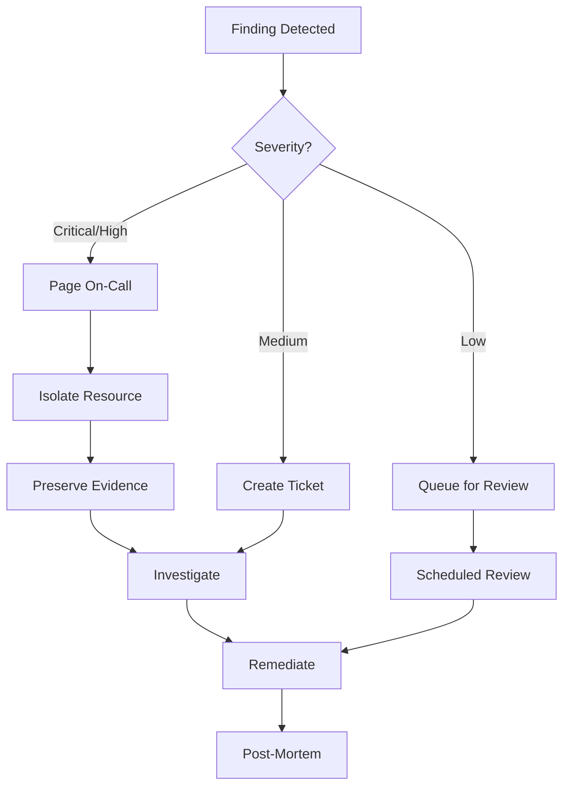

# Troubleshooting Runbook

This runbook provides guidance for common issues in the AWS Landing Zone.

## Quick Reference

| Symptom | Likely Cause | Jump to |
|---------|--------------|---------|
| Can't create resources | SCP blocking | [SCP Issues](#scp-issues) |
| GuardDuty finding | Security incident | [Security Alerts](#security-alerts) |
| Cross-account access denied | IAM/SCP issue | [Access Issues](#access-issues) |
| Network connectivity | Routing/TGW | [Network Issues](#network-issues) |
| Terraform state locked | Stale lock | [Terraform Issues](#terraform-issues) |

## SCP Issues

### Symptom: "Access Denied" when creating resources

**Diagnosis:**

1. Check which SCP is blocking:

```bash
# Get effective policies for account
aws organizations list-policies-for-target \
  --target-id <account-id> \
  --filter SERVICE_CONTROL_POLICY
```

2. Test specific action with IAM policy simulator:

```bash
aws iam simulate-principal-policy \
  --policy-source-arn arn:aws:iam::<account-id>:role/MyRole \
  --action-names ec2:RunInstances \
  --resource-arns arn:aws:ec2:us-east-1:<account-id>:instance/*
```

**Common SCPs that block:**

| SCP | Blocks | Solution |
|-----|--------|----------|
| `restrict-regions` | Non-approved regions | Use approved region |
| `require-imdsv2` | EC2 without IMDSv2 | Set `http_tokens = "required"` |
| `deny-root-user` | Root user actions | Use IAM user/role |

**Resolution:**

1. If legitimate need, request SCP exception
2. Modify resource to comply with SCP
3. Move account to different OU (if appropriate)

## Security Alerts

### GuardDuty Finding: High Severity

**Immediate Actions:**

1. Check finding details:

```bash
aws guardduty get-findings \
  --detector-id <detector-id> \
  --finding-ids <finding-id>
```

2. For compromised credentials:
   - Disable affected IAM user/role
   - Rotate credentials
   - Review CloudTrail for unauthorized actions

3. For EC2 instance compromise:
   - Isolate instance (modify security group)
   - Create EBS snapshot for forensics
   - Do NOT terminate immediately

**Escalation:**

| Severity | Response Time | Notify |
|----------|---------------|--------|
| Critical | 15 minutes | Security team + Management |
| High | 1 hour | Security team |
| Medium | 24 hours | Security team |
| Low | Weekly review | Logged only |

### Security Hub Finding: Failed Control

**Diagnosis:**

```bash
aws securityhub get-findings \
  --filters '{"ComplianceStatus":[{"Value":"FAILED","Comparison":"EQUALS"}]}'
```

**Common Findings:**

| Finding | Fix |
|---------|-----|
| S3 bucket public | Enable block public access |
| EBS not encrypted | Enable default encryption |
| Root MFA disabled | Enable MFA on root |
| CloudTrail disabled | Verify organization trail |

## Access Issues

### Can't Access Account via SSO

**Diagnosis:**

1. Verify SSO assignment:

```bash
aws sso-admin list-account-assignments \
  --instance-arn <sso-instance-arn> \
  --account-id <account-id> \
  --permission-set-arn <permission-set-arn>
```

2. Check permission set:

```bash
aws sso-admin describe-permission-set \
  --instance-arn <sso-instance-arn> \
  --permission-set-arn <permission-set-arn>
```

**Resolution:**

1. Assign user/group to account
2. Verify permission set policies
3. Check if account is suspended

### Cross-Account Role Assumption Failed

**Diagnosis:**

```bash
# Check trust policy
aws iam get-role --role-name CrossAccountRole

# Test assumption
aws sts assume-role \
  --role-arn arn:aws:iam::<target-account>:role/CrossAccountRole \
  --role-session-name test
```

**Common Issues:**

| Error | Cause | Fix |
|-------|-------|-----|
| `AccessDenied` | Trust policy | Update trust relationship |
| `MalformedPolicyDocument` | Invalid principal | Fix ARN format |
| `InvalidIdentityToken` | STS regional endpoint | Use global endpoint |

## Network Issues

### Can't Connect to Resources via Transit Gateway

**Diagnosis:**

1. Check TGW attachment:

```bash
aws ec2 describe-transit-gateway-vpc-attachments \
  --filters "Name=vpc-id,Values=<vpc-id>"
```

2. Check TGW route table:

```bash
aws ec2 search-transit-gateway-routes \
  --transit-gateway-route-table-id <rt-id> \
  --filters "Name=type,Values=static,propagated"
```

3. Check VPC route table:

```bash
aws ec2 describe-route-tables \
  --filters "Name=vpc-id,Values=<vpc-id>"
```

**Common Issues:**

| Issue | Symptoms | Fix |
|-------|----------|-----|
| Missing route | Packets don't leave VPC | Add route to TGW |
| Wrong route table | Asymmetric routing | Fix TGW RT association |
| Security group | Connection timeout | Allow traffic in SG |
| NACL | Connection refused | Check NACL rules |

### DNS Resolution Failing

**Diagnosis:**

```bash
# Check Route53 Resolver rules
aws route53resolver list-resolver-rules

# Check VPC DNS settings
aws ec2 describe-vpc-attribute \
  --vpc-id <vpc-id> \
  --attribute enableDnsSupport
```

**Resolution:**

1. Verify private hosted zone association
2. Check resolver rule sharing (RAM)
3. Verify enableDnsSupport and enableDnsHostnames

## Terraform Issues

### State Lock Not Released

**Symptom:** "Error acquiring the state lock"

**Resolution:**

1. Verify no other process is running:

```bash
# Check who has the lock
aws dynamodb get-item \
  --table-name terraform-locks \
  --key '{"LockID":{"S":"<state-path>"}}'
```

2. If stale, force unlock:

```bash
terraform force-unlock <lock-id>
```

:::warning
Only force-unlock if you're certain no other process is running!
:::

### State Drift Detected

**Diagnosis:**

```bash
terraform plan -refresh-only
```

**Resolution:**

1. If drift is expected, import or update state:

```bash
# Import existing resource
terraform import aws_instance.example i-1234567890abcdef0

# Or refresh state
terraform apply -refresh-only
```

2. If drift is unexpected, investigate who changed resource

## Security Remediation

### GuardDuty Finding Remediation

#### Severity Levels
| Severity | Range | Response Time | Action |
|----------|-------|---------------|--------|
| Critical | 9.0-10.0 | Immediate | Page on-call, isolate resource |
| High | 7.0-8.9 | < 1 hour | Alert security team |
| Medium | 4.0-6.9 | < 24 hours | Review and remediate |
| Low | 1.0-3.9 | < 1 week | Scheduled review |

#### Common Findings and Remediation

##### UnauthorizedAccess:EC2/SSHBruteForce
**Description**: SSH brute force attack detected
**Remediation**:
1. Check if instance should have SSH exposed
2. Review Security Group rules
3. Consider using Session Manager instead of SSH
4. If compromised, isolate and investigate

```bash
# Isolate instance by removing all security groups
aws ec2 modify-instance-attribute \
  --instance-id i-1234567890abcdef0 \
  --groups sg-isolation-only
```

##### Recon:EC2/PortProbeUnprotectedPort
**Description**: Unprotected port being probed
**Remediation**:
1. Review Security Group for unnecessary open ports
2. Close ports not required for application
3. Consider using AWS WAF for web applications

##### CryptoCurrency:EC2/BitcoinTool.B
**Description**: EC2 instance communicating with Bitcoin network
**Remediation**:
1. **Immediate**: Isolate instance
2. Capture memory dump if possible
3. Create AMI for forensics
4. Terminate instance
5. Investigate how instance was compromised
6. Review IAM credentials used to launch instance

##### Trojan:EC2/DNSDataExfiltration
**Description**: Data exfiltration via DNS queries
**Remediation**:
1. Isolate instance immediately
2. Block DNS traffic at VPC level
3. Investigate DNS query logs
4. Check for compromised credentials

### Security Hub Finding Remediation

#### Automated Remediation Setup

```hcl
# Lambda for automated remediation
resource "aws_lambda_function" "remediation" {
  filename         = "remediation.zip"
  function_name    = "security-hub-remediation"
  role             = aws_iam_role.remediation.arn
  handler          = "index.handler"
  runtime          = "python3.9"
}

# EventBridge rule for Security Hub findings
resource "aws_cloudwatch_event_rule" "security_hub" {
  name        = "security-hub-findings"
  description = "Capture Security Hub findings"

  event_pattern = jsonencode({
    source      = ["aws.securityhub"]
    detail-type = ["Security Hub Findings - Imported"]
    detail = {
      findings = {
        Severity = {
          Label = ["CRITICAL", "HIGH"]
        }
      }
    }
  })
}

resource "aws_cloudwatch_event_target" "remediation" {
  rule      = aws_cloudwatch_event_rule.security_hub.name
  target_id = "remediation-lambda"
  arn       = aws_lambda_function.remediation.arn
}
```

#### Common Security Hub Controls

##### [S3.1] S3 Block Public Access should be enabled
```bash
# Remediate: Enable block public access
aws s3api put-public-access-block \
  --bucket my-bucket \
  --public-access-block-configuration \
  "BlockPublicAcls=true,IgnorePublicAcls=true,BlockPublicPolicy=true,RestrictPublicBuckets=true"
```

##### [EC2.19] Security groups should not allow unrestricted access to high risk ports
```bash
# Find and remove offending rules
aws ec2 describe-security-groups \
  --filters "Name=ip-permission.from-port,Values=22" \
            "Name=ip-permission.cidr,Values=0.0.0.0/0"

# Revoke the rule
aws ec2 revoke-security-group-ingress \
  --group-id sg-12345678 \
  --protocol tcp \
  --port 22 \
  --cidr 0.0.0.0/0
```

##### [IAM.1] IAM policies should not allow full "*" administrative privileges
```bash
# Find policies with admin access
aws iam list-policies --scope Local --query \
  'Policies[?contains(PolicyName, `Admin`)]'

# Review and restrict policy
aws iam get-policy-version \
  --policy-arn arn:aws:iam::123456789012:policy/MyPolicy \
  --version-id v1
```

### AWS Config Rule Remediation

#### Manual Remediation Workflow
1. Navigate to AWS Config → Rules
2. Select non-compliant rule
3. View non-compliant resources
4. Click resource to see details
5. Remediate based on rule type

#### Automated Remediation with SSM

```hcl
resource "aws_config_remediation_configuration" "s3_encryption" {
  config_rule_name = aws_config_config_rule.s3_encryption.name
  target_type      = "SSM_DOCUMENT"
  target_id        = "AWS-EnableS3BucketEncryption"
  
  parameter {
    name         = "BucketName"
    resource_value = "RESOURCE_ID"
  }
  
  parameter {
    name         = "SSEAlgorithm"
    static_value = "AES256"
  }
  
  automatic                  = true
  maximum_automatic_attempts = 3
  retry_attempt_seconds      = 60
}
```

### Incident Response Workflow



### Escalation Procedures

| Level | Trigger | Contact | Response |
|-------|---------|---------|----------|
| L1 | Medium finding | Security team Slack | Acknowledge within 4 hours |
| L2 | High finding | Security team + manager | Acknowledge within 1 hour |
| L3 | Critical finding | Security + Exec + Legal | Immediate response |
| L4 | Data breach confirmed | CISO + Legal + PR | Incident commander assigned |

### Evidence Preservation

Before remediating, preserve evidence:

```bash
# 1. Create snapshot of EBS volumes
aws ec2 create-snapshot \
  --volume-id vol-1234567890abcdef0 \
  --description "Forensics - Incident INC-001"

# 2. Create AMI of instance
aws ec2 create-image \
  --instance-id i-1234567890abcdef0 \
  --name "Forensics-INC-001" \
  --no-reboot

# 3. Export CloudTrail logs
aws s3 cp s3://cloudtrail-bucket/AWSLogs/ ./forensics/ --recursive \
  --exclude "*" \
  --include "*2024-01-15*"

# 4. Export VPC Flow Logs
aws logs filter-log-events \
  --log-group-name vpc-flow-logs \
  --start-time 1705276800000 \
  --end-time 1705363200000 \
  > flow-logs-incident.json
```

### Post-Incident Actions

1. **Document**: Create incident report with timeline
2. **Review**: Identify gaps in detection/prevention
3. **Improve**: Update runbooks and automation
4. **Train**: Share learnings with team
5. **Test**: Validate remediation effectiveness

## Log Locations

| Log Type | Location |
|----------|----------|
| CloudTrail | s3://acme-log-archive-cloudtrail/ |
| VPC Flow Logs | s3://acme-log-archive-vpc-flow-logs/ |
| Config | s3://acme-log-archive-config/ |
| GuardDuty | s3://acme-security-guardduty-findings/ |
| ALB Access Logs | s3://acme-log-archive-alb-logs/ |

## Escalation Contacts

| Issue Type | Primary | Secondary |
|------------|---------|-----------|
| Security Incident | security-team@acme.com | CISO |
| Infrastructure | platform-team@acme.com | Cloud Architect |
| Access Issues | it-helpdesk@acme.com | Platform team |

## Related

- [Security Model](../architecture/security-model)
- [Network Design](../architecture/network-design)
- [Deployment Runbook](./deployment)
