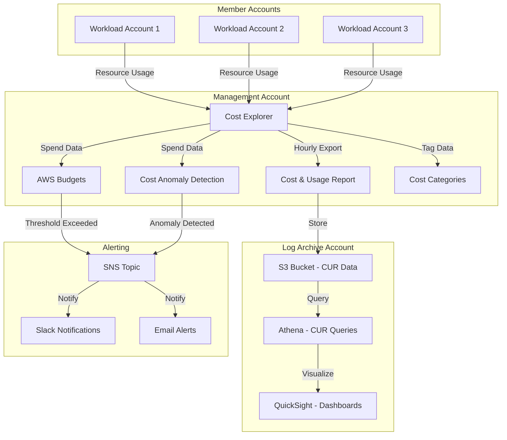

# Gestión de Costos y Gobernanza {#gestion-de-costos-y-gobernanza}

Este documento describe la estrategia de gestión de costos y gobernanza para la AWS Landing Zone, incluyendo la asignación de costos, presupuestos, detección de anomalías y recomendaciones de optimización.

## Descripción General {#descripcion-general-costos}

La gobernanza de costos en un entorno de múltiples cuentas requiere un monitoreo proactivo, estrategias de asignación claras y controles automatizados. Esta Landing Zone implementa un enfoque integral utilizando:

- **Etiquetas de Asignación de Costos**: Taxonomía de etiquetado consistente para la atribución de costos.
- **AWS Budgets**: Alertas proactivas y acciones automatizadas.
- **Categorías de Costos**: Agrupación de costos basada en unidades de negocio y proyectos.
- **Detección de Anomalías de Costos**: Identificación de anomalías basada en ML.
- **Chargeback/Showback**: Visibilidad transparente de los costos para los equipos.
- **Optimización de Costos**: Ajuste continuo del tamaño (right-sizing) y gestión de compromisos.

## Flujo de Datos de Costos {#flujo-de-datos-de-costos}



## Estrategia de Asignación de Costos {#estrategia-de-asignacion-de-costos}

### Taxonomía de Etiquetado {#taxonomia-de-etiquetado}

Una estrategia de etiquetado consistente es crítica para la asignación de costos y la gobernanza.

#### Etiquetas Obligatorias {#etiquetas-obligatorias}

Todos los recursos deben tener estas etiquetas (aplicadas a través de SCPs):

| Clave de Etiqueta | Descripción | Valores de Ejemplo | Aplicado Por |
|---------|-------------|----------------|------------|
| `Project` | Nombre del proyecto o aplicación | `customer-portal`, `data-pipeline` | Usuario/Automatización |
| `Environment` | Entorno de despliegue | `production`, `staging`, `development`, `sandbox` | Usuario/Automatización |
| `Owner` | Equipo o individuo responsable | `platform-team`, `data-engineering` | Usuario/Automatización |
| `CostCenter` | Centro de costos financiero | `CC-1234`, `engineering`, `marketing` | Usuario/Automatización |
| `ManagedBy` | Cómo se gestiona el recurso | `terraform`, `cloudformation`, `manual`, `aft` | Automatización |

#### Etiquetas Opcionales {#etiquetas-opcionales}

Recomendadas para una visibilidad de costos mejorada:

| Clave de Etiqueta | Descripción | Valores de Ejemplo |
|---------|-------------|----------------|
| `Application` | Componente de la aplicación | `frontend`, `backend`, `database` |
| `Service` | Servicio de negocio | `authentication`, `payment-processing` |
| `Compliance` | Requisitos de cumplimiento | `pci-dss`, `hipaa`, `sox` |
| `DataClassification` | Sensibilidad de los datos | `public`, `internal`, `confidential`, `restricted` |
| `BackupPolicy` | Retención de respaldos | `daily`, `weekly`, `none` |
| `Schedule` | Horario de operación | `24x7`, `business-hours`, `dev-hours` |

### Aplicación de Etiquetas a través de SCPs {#aplicacion-etiquetas-scps}

Las Service Control Policies obligan al etiquetado mandatorio a nivel de organización.

**Denegar la creación de recursos sin las etiquetas requeridas**:

```json
{
  "Version": "2012-10-17",
  "Statement": [
    {
      "Sid": "DenyCreateWithoutRequiredTags",
      "Effect": "Deny",
      "Action": [
        "ec2:RunInstances",
        "ec2:CreateVolume",
        "ec2:CreateSnapshot",
        "rds:CreateDBInstance",
        "rds:CreateDBCluster",
        "s3:CreateBucket",
        "dynamodb:CreateTable",
        "lambda:CreateFunction",
        "ecs:CreateService",
        "eks:CreateCluster"
      ],
      "Resource": "*",
      "Condition": {
        "StringNotLike": {
          "aws:RequestTag/Project": "*",
          "aws:RequestTag/Environment": "*",
          "aws:RequestTag/Owner": "*",
          "aws:RequestTag/CostCenter": "*"
        }
      }
    },
    {
      "Sid": "DenyModifyRequiredTags",
      "Effect": "Deny",
      "Action": [
        "ec2:DeleteTags",
        "ec2:CreateTags"
      ],
      "Resource": "*",
      "Condition": {
        "ForAnyValue:StringEquals": {
          "aws:TagKeys": [
            "Project",
            "Environment",
            "Owner",
            "CostCenter",
            "ManagedBy"
          ]
        }
      }
    }
  ]
}
```

**Excepciones**:
- Los roles vinculados al servicio y los recursos gestionados por AWS están exentos.
- Los roles de emergencia (break-glass) pueden omitirlo (con registro en CloudTrail).
- Los roles de aprovisionamiento de AFT tienen exenciones condicionales.

### Herencia de Etiquetas {#herencia-de-etiquetas}

Las etiquetas se propagan automáticamente a los recursos secundarios:

**Instancia EC2 → Volúmenes EBS**:
```hcl
resource "aws_instance" "app" {
  ami           = data.aws_ami.amazon_linux_2.id
  instance_type = "t3.medium"
  
  tags = {
    Project     = "customer-portal"
    Environment = "production"
    Owner       = "platform-team"
    CostCenter  = "CC-1234"
    ManagedBy   = "terraform"
  }
  
  # Propagate tags to volumes
  volume_tags = {
    Project     = "customer-portal"
    Environment = "production"
    Owner       = "platform-team"
    CostCenter  = "CC-1234"
    ManagedBy   = "terraform"
  }
}
```

**Grupos de Auto Scaling → Instancias**:
```hcl
resource "aws_autoscaling_group" "app" {
  name                = "app-asg"
  vpc_zone_identifier = var.subnet_ids
  min_size            = 2
  max_size            = 10
  
  tag {
    key                 = "Project"
    value               = "customer-portal"
    propagate_at_launch = true
  }
  
  tag {
    key                 = "Environment"
    value               = "production"
    propagate_at_launch = true
  }
}
```

### Monitoreo del Cumplimiento de Etiquetas {#monitoreo-cumplimiento-etiquetas}

Las reglas de AWS Config monitorean el cumplimiento de las etiquetas:

**Regla de Etiquetas Requeridas**:
```hcl
resource "aws_config_config_rule" "required_tags" {
  name = "required-tags"
  
  source {
    owner             = "AWS"
    source_identifier = "REQUIRED_TAGS"
  }
  
  input_parameters = jsonencode({
    tag1Key = "Project"
    tag2Key = "Environment"
    tag3Key = "Owner"
    tag4Key = "CostCenter"
  })
  
  scope {
    compliance_resource_types = [
      "AWS::EC2::Instance",
      "AWS::EC2::Volume",
      "AWS::RDS::DBInstance",
      "AWS::S3::Bucket",
      "AWS::Lambda::Function"
    ]
  }
}
```

**Remediación Automatizada**:
- Los recursos no conformes activan hallazgos en Security Hub.
- Una función Lambda intenta el etiquetado automático a partir de los valores predeterminados de la cuenta.
- Las violaciones persistentes se escalan al equipo de seguridad.

## AWS Budgets {#aws-budgets}

Monitoreo proactivo de costos con alertas y acciones automatizadas.

### Presupuestos a Nivel de Organización {#presupuestos-organizacion}

**Gasto Total de la Organización**:
```hcl
resource "aws_budgets_budget" "organization_total" {
  name              = "organization-total-monthly"
  budget_type       = "COST"
  limit_amount      = "50000"
  limit_unit        = "USD"
  time_unit         = "MONTHLY"
  time_period_start = "2024-01-01_00:00"
  
  cost_filter {
    name = "LinkedAccount"
    values = [
      for account in data.aws_organizations_organization.org.accounts : account.id
    ]
  }
  
  notification {
    comparison_operator        = "GREATER_THAN"
    threshold                  = 80
    threshold_type             = "PERCENTAGE"
    notification_type          = "ACTUAL"
    subscriber_email_addresses = ["finance@example.com"]
  }
  
  notification {
    comparison_operator        = "GREATER_THAN"
    threshold                  = 100
    threshold_type             = "PERCENTAGE"
    notification_type          = "FORECASTED"
    subscriber_email_addresses = ["finance@example.com", "cto@example.com"]
  }
}
```

**Por Unidad Organizativa**:
```hcl
resource "aws_budgets_budget" "production_ou" {
  name              = "production-ou-monthly"
  budget_type       = "COST"
  limit_amount      = "30000"
  limit_unit        = "USD"
  time_unit         = "MONTHLY"
  time_period_start = "2024-01-01_00:00"
  
  cost_filter {
    name = "LinkedAccount"
    values = [
      for account in data.aws_organizations_organizational_unit.production.accounts : account.id
    ]
  }
  
  notification {
    comparison_operator = "GREATER_THAN"
    threshold           = 90
    threshold_type      = "PERCENTAGE"
    notification_type   = "ACTUAL"
    
    subscriber_sns_topic_arns = [aws_sns_topic.budget_alerts.arn]
  }
}
```

### Presupuestos a Nivel de Cuenta {#presupuestos-cuenta}

**Presupuesto Mensual por Cuenta**:
```hcl
resource "aws_budgets_budget" "account_monthly" {
  for_each = toset(var.workload_account_ids)
  
  name              = "account-${each.key}-monthly"
  budget_type       = "COST"
  limit_amount      = "5000"
  limit_unit        = "USD"
  time_unit         = "MONTHLY"
  time_period_start = "2024-01-01_00:00"
  
  cost_filter {
    name   = "LinkedAccount"
    values = [each.key]
  }
  
  notification {
    comparison_operator        = "GREATER_THAN"
    threshold                  = 80
    threshold_type             = "PERCENTAGE"
    notification_type          = "ACTUAL"
    subscriber_email_addresses = ["team-${each.key}@example.com"]
  }
  
  notification {
    comparison_operator        = "GREATER_THAN"
    threshold                  = 100
    threshold_type             = "PERCENTAGE"
    notification_type          = "ACTUAL"
    subscriber_email_addresses = ["team-${each.key}@example.com", "finance@example.com"]
  }
}
```

**Presupuestos Específicos por Servicio**:
```hcl
resource "aws_budgets_budget" "ec2_compute" {
  name              = "ec2-compute-monthly"
  budget_type       = "COST"
  limit_amount      = "10000"
  limit_unit        = "USD"
  time_unit         = "MONTHLY"
  time_period_start = "2024-01-01_00:00"
  
  cost_filter {
    name   = "Service"
    values = ["Amazon Elastic Compute Cloud - Compute"]
  }
  
  notification {
    comparison_operator = "GREATER_THAN"
    threshold           = 85
    threshold_type      = "PERCENTAGE"
    notification_type   = "ACTUAL"
    
    subscriber_sns_topic_arns = [aws_sns_topic.budget_alerts.arn]
  }
}
```

### Acciones de Presupuesto {#acciones-de-presupuesto}

Respuestas automatizadas cuando se exceden los presupuestos:

**Detener Instancias de No-Producción**:
```hcl
resource "aws_budgets_budget_action" "stop_dev_instances" {
  budget_name        = aws_budgets_budget.development_account.name
  action_type        = "APPLY_IAM_POLICY"
  approval_model     = "AUTOMATIC"
  notification_type  = "ACTUAL"
  execution_role_arn = aws_iam_role.budget_action.arn
  
  action_threshold {
    action_threshold_type  = "PERCENTAGE"
    action_threshold_value = 100
  }
  
  definition {
    iam_action_definition {
      policy_arn = aws_iam_policy.deny_ec2_launch.arn
      roles      = [aws_iam_role.developer.name]
    }
  }
  
  subscriber {
    address           = "devops@example.com"
    subscription_type = "EMAIL"
  }
}
```

**Denegar la Creación de Nuevos Recursos**:
```hcl
resource "aws_iam_policy" "deny_ec2_launch" {
  name        = "DenyEC2Launch"
  description = "Applied when budget threshold exceeded"
  
  policy = jsonencode({
    Version = "2012-10-17"
    Statement = [
      {
        Sid      = "DenyEC2Launch"
        Effect   = "Deny"
        Action   = [
          "ec2:RunInstances",
          "ec2:StartInstances"
        ]
        Resource = "*"
      }
    ]
  })
}
```

### Integración de Alertas de Presupuesto {#integracion-alertas-presupuesto}

**Tema SNS para Alertas de Presupuesto**:
```hcl
resource "aws_sns_topic" "budget_alerts" {
  name = "budget-alerts"
  
  tags = {
    Project     = "cost-governance"
    Environment = "production"
    Owner       = "finance-team"
    CostCenter  = "CC-FINANCE"
    ManagedBy   = "terraform"
  }
}

resource "aws_sns_topic_subscription" "budget_slack" {
  topic_arn = aws_sns_topic.budget_alerts.arn
  protocol  = "lambda"
  endpoint  = aws_lambda_function.slack_notifier.arn
}

resource "aws_sns_topic_subscription" "budget_email" {
  topic_arn = aws_sns_topic.budget_alerts.arn
  protocol  = "email"
  endpoint  = "finance@example.com"
}
```

## Categorías de Costos {#categorias-de-costos}

Organice los costos por dimensiones de negocio más allá de la estructura de cuentas.

### Categorías por Unidad de Negocio {#categorias-unidad-negocio}

```hcl
resource "aws_ce_cost_category" "business_unit" {
  name         = "BusinessUnit"
  rule_version = "CostCategoryExpression.v1"
  
  rule {
    value = "Engineering"
    rule {
      dimension {
        key           = "LINKED_ACCOUNT"
        values        = var.engineering_account_ids
        match_options = ["EQUALS"]
      }
    }
  }
  
  rule {
    value = "Marketing"
    rule {
      dimension {
        key           = "LINKED_ACCOUNT"
        values        = var.marketing_account_ids
        match_options = ["EQUALS"]
      }
    }
  }
  
  rule {
    value = "Sales"
    rule {
      dimension {
        key           = "LINKED_ACCOUNT"
        values        = var.sales_account_ids
        match_options = ["EQUALS"]
      }
    }
  }
  
  rule {
    value = "Infrastructure"
    rule {
      dimension {
        key           = "LINKED_ACCOUNT"
        values        = [
          var.network_account_id,
          var.shared_services_account_id,
          var.security_account_id
        ]
        match_options = ["EQUALS"]
      }
    }
  }
}
```

### Categorías Basadas en Proyectos {#categorias-proyectos}

```hcl
resource "aws_ce_cost_category" "project" {
  name         = "Project"
  rule_version = "CostCategoryExpression.v1"
  
  rule {
    value = "CustomerPortal"
    rule {
      tag {
        key           = "Project"
        values        = ["customer-portal"]
        match_options = ["EQUALS"]
      }
    }
  }
  
  rule {
    value = "DataPipeline"
    rule {
      tag {
        key           = "Project"
        values        = ["data-pipeline"]
        match_options = ["EQUALS"]
      }
    }
  }
  
  rule {
    value = "MobileApp"
    rule {
      tag {
        key           = "Project"
        values        = ["mobile-app", "mobile-backend"]
        match_options = ["EQUALS"]
      }
    }
  }
  
  rule {
    value = "Untagged"
    rule {
      tag {
        key           = "Project"
        values        = []
        match_options = ["ABSENT"]
      }
    }
  }
}
```

### Categorías por Entorno {#categorias-entorno}

```hcl
resource "aws_ce_cost_category" "environment" {
  name         = "Environment"
  rule_version = "CostCategoryExpression.v1"
  
  rule {
    value = "Production"
    rule {
      or {
        dimension {
          key           = "LINKED_ACCOUNT"
          values        = var.production_account_ids
          match_options = ["EQUALS"]
        }
        tag {
          key           = "Environment"
          values        = ["production", "prod"]
          match_options = ["EQUALS"]
        }
      }
    }
  }
  
  rule {
    value = "NonProduction"
    rule {
      or {
        dimension {
          key           = "LINKED_ACCOUNT"
          values        = var.nonprod_account_ids
          match_options = ["EQUALS"]
        }
        tag {
          key           = "Environment"
          values        = ["staging", "development", "dev", "test"]
          match_options = ["EQUALS"]
        }
      }
    }
  }
  
  rule {
    value = "Sandbox"
    rule {
      tag {
        key           = "Environment"
        values        = ["sandbox"]
        match_options = ["EQUALS"]
      }
    }
  }
}
```

### Uso de Categorías de Costos {#uso-categorias-costos}

**Filtrado en Cost Explorer**:
```bash
# Query costs by business unit
aws ce get-cost-and-usage \
  --time-period Start=2024-01-01,End=2024-01-31 \
  --granularity MONTHLY \
  --metrics "UnblendedCost" \
  --group-by Type=COST_CATEGORY,Key=BusinessUnit
```

**Presupuesto por Categoría de Costos**:
```hcl
resource "aws_budgets_budget" "engineering_bu" {
  name              = "engineering-business-unit"
  budget_type       = "COST"
  limit_amount      = "25000"
  limit_unit        = "USD"
  time_unit         = "MONTHLY"
  time_period_start = "2024-01-01_00:00"
  
  cost_filter {
    name   = "CostCategory"
    values = ["Engineering"]
  }
}
```

## Detección de Anomalías de Costos {#deteccion-anomalias-costos}

Detección de anomalías basada en aprendizaje automático para picos de costos inesperados.

### Monitor a Nivel de Toda la Organización {#monitor-organizacion}

```hcl
resource "aws_ce_anomaly_monitor" "organization" {
  name              = "organization-anomaly-monitor"
  monitor_type      = "DIMENSIONAL"
  monitor_dimension = "SERVICE"
  
  tags = {
    Project     = "cost-governance"
    Environment = "production"
    Owner       = "finance-team"
    CostCenter  = "CC-FINANCE"
    ManagedBy   = "terraform"
  }
}
```

### Monitores Específicos por Cuenta {#monitores-cuenta}

```hcl
resource "aws_ce_anomaly_monitor" "production_accounts" {
  name         = "production-accounts-monitor"
  monitor_type = "DIMENSIONAL"
  
  monitor_specification = jsonencode({
    Dimensions = {
      Key    = "LINKED_ACCOUNT"
      Values = var.production_account_ids
    }
  })
}
```

### Monitores Específicos por Servicio {#monitores-servicio}

```hcl
resource "aws_ce_anomaly_monitor" "ec2_compute" {
  name         = "ec2-compute-monitor"
  monitor_type = "DIMENSIONAL"
  
  monitor_specification = jsonencode({
    Dimensions = {
      Key    = "SERVICE"
      Values = ["Amazon Elastic Compute Cloud - Compute"]
    }
  })
}
```

### Suscripciones a Anomalías {#suscripciones-anomalias}

**Alertas de Alta Severidad**:
```hcl
resource "aws_ce_anomaly_subscription" "high_severity" {
  name      = "high-severity-anomalies"
  frequency = "IMMEDIATE"
  
  monitor_arn_list = [
    aws_ce_anomaly_monitor.organization.arn,
    aws_ce_anomaly_monitor.production_accounts.arn
  ]
  
  subscriber {
    type    = "SNS"
    address = aws_sns_topic.cost_anomaly_alerts.arn
  }
  
  threshold_expression {
    dimension {
      key           = "ANOMALY_TOTAL_IMPACT_ABSOLUTE"
      values        = ["500"]
      match_options = ["GREATER_THAN_OR_EQUAL"]
    }
  }
}
```

**Resumen Diario**:
```hcl
resource "aws_ce_anomaly_subscription" "daily_digest" {
  name      = "daily-anomaly-digest"
  frequency = "DAILY"
  
  monitor_arn_list = [
    aws_ce_anomaly_monitor.organization.arn
  ]
  
  subscriber {
    type    = "EMAIL"
    address = "finance@example.com"
  }
  
  threshold_expression {
    dimension {
      key           = "ANOMALY_TOTAL_IMPACT_ABSOLUTE"
      values        = ["100"]
      match_options = ["GREATER_THAN_OR_EQUAL"]
    }
  }
}
```

### Integración de Alertas de Anomalías {#integracion-alertas-anomalias}

**Función Lambda para Notificaciones en Slack**:
```python
import json
import os
import urllib3

http = urllib3.PoolManager()

def lambda_handler(event, context):
    message = json.loads(event['Records'][0]['Sns']['Message'])
    
    anomaly = message['anomalyDetails']
    impact = anomaly['impact']
    service = anomaly['rootCauses'][0]['service']
    account = anomaly['rootCauses'][0]['linkedAccount']
    
    slack_message = {
        "text": f"Cost Anomaly Detected",
        "blocks": [
            {
                "type": "header",
                "text": {
                    "type": "plain_text",
                    "text": "Cost Anomaly Alert"
                }
            },
            {
                "type": "section",
                "fields": [
                    {"type": "mrkdwn", "text": f"*Service:*\n{service}"},
                    {"type": "mrkdwn", "text": f"*Account:*\n{account}"},
                    {"type": "mrkdwn", "text": f"*Impact:*\n${impact['totalImpact']:.2f}"},
                    {"type": "mrkdwn", "text": f"*Percentage:*\n{impact['totalImpactPercentage']:.1f}%"}
                ]
            }
        ]
    }
    
    webhook_url = os.environ['SLACK_WEBHOOK_URL']
    response = http.request(
        'POST',
        webhook_url,
        body=json.dumps(slack_message),
        headers={'Content-Type': 'application/json'}
    )
    
    return {'statusCode': 200}
```

## Chargeback y Showback {#chargeback-y-showback}

Visibilidad transparente de los costos para los equipos y unidades de negocio.

### Informes de Asignación de Costos {#informes-asignacion-costos}

**Habilitar Etiquetas de Asignación de Costos**:
```bash
# Activate user-defined cost allocation tags
aws ce update-cost-allocation-tags-status \
  --cost-allocation-tags-status \
    TagKey=Project,Status=Active \
    TagKey=Environment,Status=Active \
    TagKey=Owner,Status=Active \
    TagKey=CostCenter,Status=Active
```

**Cost and Usage Report (CUR)**:
```hcl
resource "aws_cur_report_definition" "organization" {
  report_name                = "organization-cur"
  time_unit                  = "HOURLY"
  format                     = "Parquet"
  compression                = "Parquet"
  additional_schema_elements = ["RESOURCES"]
  s3_bucket                  = aws_s3_bucket.cur.id
  s3_region                  = "us-east-1"
  s3_prefix                  = "cur"
  
  additional_artifacts = [
    "ATHENA"
  ]
  
  report_versioning = "OVERWRITE_REPORT"
  
  refresh_closed_reports = true
  
  tags = {
    Project     = "cost-governance"
    Environment = "production"
    Owner       = "finance-team"
    CostCenter  = "CC-FINANCE"
    ManagedBy   = "terraform"
  }
}
```

### Visibilidad de Costos por Cuenta {#visibilidad-costos-cuenta}

**Consulta de Athena para Costos por Cuenta**:
```sql
SELECT
  line_item_usage_account_id AS account_id,
  DATE_FORMAT(line_item_usage_start_date, '%Y-%m') AS month,
  SUM(line_item_unblended_cost) AS total_cost
FROM
  cur_database.cur_table
WHERE
  line_item_usage_start_date >= DATE('2024-01-01')
GROUP BY
  line_item_usage_account_id,
  DATE_FORMAT(line_item_usage_start_date, '%Y-%m')
ORDER BY
  month DESC,
  total_cost DESC;
```

**Por Etiqueta de Proyecto**:
```sql
SELECT
  resource_tags_user_project AS project,
  line_item_product_code AS service,
  DATE_FORMAT(line_item_usage_start_date, '%Y-%m') AS month,
  SUM(line_item_unblended_cost) AS total_cost
FROM
  cur_database.cur_table
WHERE
  line_item_usage_start_date >= DATE('2024-01-01')
  AND resource_tags_user_project IS NOT NULL
GROUP BY
  resource_tags_user_project,
  line_item_product_code,
  DATE_FORMAT(line_item_usage_start_date, '%Y-%m')
ORDER BY
  month DESC,
  total_cost DESC;
```

### Informes por Unidad de Negocio {#informes-unidad-negocio}

**Dashboard de QuickSight**:
```hcl
resource "aws_quicksight_data_source" "cur" {
  data_source_id = "cur-data-source"
  name           = "Cost and Usage Report"
  type           = "ATHENA"
  
  parameters {
    athena {
      work_group = aws_athena_workgroup.cur.name
    }
  }
  
  permission {
    principal = aws_quicksight_user.finance_team.arn
    actions = [
      "quicksight:DescribeDataSource",
      "quicksight:DescribeDataSourcePermissions",
      "quicksight:PassDataSource"
    ]
  }
}
```

**Informe Mensual de Costos por Unidad de Negocio**:
```sql
SELECT
  CASE
    WHEN line_item_usage_account_id IN ('111111111111', '222222222222') THEN 'Engineering'
    WHEN line_item_usage_account_id IN ('333333333333') THEN 'Marketing'
    WHEN line_item_usage_account_id IN ('444444444444') THEN 'Sales'
    ELSE 'Other'
  END AS business_unit,
  DATE_FORMAT(line_item_usage_start_date, '%Y-%m') AS month,
  SUM(line_item_unblended_cost) AS total_cost,
  SUM(reservation_effective_cost) AS reserved_cost,
  SUM(savings_plan_savings_plan_effective_cost) AS savings_plan_cost
FROM
  cur_database.cur_table
WHERE
  line_item_usage_start_date >= DATE('2024-01-01')
GROUP BY
  business_unit,
  DATE_FORMAT(line_item_usage_start_date, '%Y-%m')
ORDER BY
  month DESC,
  total_cost DESC;
```

### Automatización de Chargeback {#automatizacion-chargeback}

**Función Lambda para Chargeback Mensual**:
```python
import boto3
from datetime import datetime, timedelta

ce_client = boto3.client('ce')
ses_client = boto3.client('ses')

def lambda_handler(event, context):
    # Get last month's date range
    today = datetime.now()
    first_day_last_month = (today.replace(day=1) - timedelta(days=1)).replace(day=1)
    last_day_last_month = today.replace(day=1) - timedelta(days=1)
    
    # Query costs by account
    response = ce_client.get_cost_and_usage(
        TimePeriod={
            'Start': first_day_last_month.strftime('%Y-%m-%d'),
            'End': last_day_last_month.strftime('%Y-%m-%d')
        },
        Granularity='MONTHLY',
        Metrics=['UnblendedCost'],
        GroupBy=[
            {'Type': 'DIMENSION', 'Key': 'LINKED_ACCOUNT'},
            {'Type': 'TAG', 'Key': 'CostCenter'}
        ]
    )
    
    # Generate chargeback report
    chargeback_data = {}
    for result in response['ResultsByTime']:
        for group in result['Groups']:
            account = group['Keys'][0]
            cost_center = group['Keys'][1]
            cost = float(group['Metrics']['UnblendedCost']['Amount'])
            
            if cost_center not in chargeback_data:
                chargeback_data[cost_center] = []
            
            chargeback_data[cost_center].append({
                'account': account,
                'cost': cost
            })
    
    # Send email report
    for cost_center, accounts in chargeback_data.items():
        total_cost = sum(a['cost'] for a in accounts)
        
        email_body = f"Chargeback Report for {cost_center}\n\n"
        email_body += f"Total Cost: ${total_cost:.2f}\n\n"
        email_body += "Account Breakdown:\n"
        
        for account in accounts:
            email_body += f"  {account['account']}: ${account['cost']:.2f}\n"
        
        ses_client.send_email(
            Source='finance@example.com',
            Destination={'ToAddresses': [f'{cost_center}@example.com']},
            Message={
                'Subject': {'Data': f'Monthly AWS Chargeback - {cost_center}'},
                'Body': {'Text': {'Data': email_body}}
            }
        )
    
    return {'statusCode': 200}
```

## Recomendaciones de Optimización de Costos {#recomendaciones-optimizacion-costos}

### Estrategia de Instancias Reservadas (RI) {#estrategia-ri}

**Objetivos de Cobertura de RI**:
- Cargas de trabajo de producción: 70-80% de cobertura.
- Staging/Desarrollo: 0% (usar Spot/On-Demand).
- Cómputo de línea base: RIs estándar de 3 años.
- Cómputo variable: RIs convertibles de 1 año.

**Automatización de Compra de RI**:
```python
import boto3

ce_client = boto3.client('ce')
ec2_client = boto3.client('ec2')

def lambda_handler(event, context):
    # Get RI recommendations
    response = ce_client.get_reservation_purchase_recommendation(
        Service='Amazon Elastic Compute Cloud - Compute',
        LookbackPeriodInDays='SIXTY_DAYS',
        TermInYears='ONE_YEAR',
        PaymentOption='NO_UPFRONT'
    )
    
    recommendations = response['Recommendations']
    
    for rec in recommendations:
        details = rec['RecommendationDetails']
        
        # Only purchase if estimated savings > $100/month
        monthly_savings = float(details['EstimatedMonthlySavingsAmount'])
        if monthly_savings > 100:
            instance_type = details['InstanceDetails']['EC2InstanceDetails']['InstanceType']
            quantity = int(details['RecommendedNumberOfInstancesToPurchase'])
            
            # Purchase RI
            ec2_client.purchase_reserved_instances_offering(
                InstanceCount=quantity,
                ReservedInstancesOfferingId=details['ReservedInstancesOfferingId']
            )
            
            print(f"Purchased {quantity}x {instance_type} RIs (${monthly_savings:.2f}/mo savings)")
    
    return {'statusCode': 200}
```

### Savings Plans {#savings-plans}

**Compute Savings Plans**:
- Flexibles entre familias de instancias, regiones y servicios de cómputo.
- Recomendados para cargas de trabajo dinámicas.
- Compromiso de 1 o 3 años.

**EC2 Instance Savings Plans**:
- Específicos para una familia de instancias en una región.
- Mayor descuento que los Compute Savings Plans.
- Recomendados para cargas de trabajo estables.

**Consulta de Recomendaciones**:
```bash
aws ce get-savings-plans-purchase-recommendation \
  --savings-plans-type COMPUTE_SP \
  --term-in-years ONE_YEAR \
  --payment-option NO_UPFRONT \
  --lookback-period-in-days SIXTY_DAYS
```

### Recomendaciones de Ajuste de Tamaño (Right-Sizing) {#recomendaciones-right-sizing}

**Right-Sizing en Cost Explorer**:
```bash
aws ce get-rightsizing-recommendation \
  --service "Amazon Elastic Compute Cloud - Compute" \
  --configuration '{"RecommendationTarget":"SAME_INSTANCE_FAMILY","BenefitsConsidered":true}'
```

**Right-Sizing Automatizado**:
```python
import boto3

ce_client = boto3.client('ce')
ec2_client = boto3.client('ec2')

def lambda_handler(event, context):
    # Get right-sizing recommendations
    response = ce_client.get_rightsizing_recommendation(
        Service='Amazon Elastic Compute Cloud - Compute',
        Configuration={
            'RecommendationTarget': 'SAME_INSTANCE_FAMILY',
            'BenefitsConsidered': True
        }
    )
    
    for rec in response['RightsizingRecommendations']:
        if rec['RightsizingType'] == 'Modify':
            current = rec['CurrentInstance']
            target = rec['ModifyRecommendationDetail']['TargetInstances'][0]
            
            instance_id = current['ResourceId']
            current_type = current['InstanceType']
            target_type = target['InstanceType']
            
            estimated_savings = float(target['EstimatedMonthlySavings'])
            
            # Only modify if savings > $50/month and non-production
            if estimated_savings > 50:
                tags = ec2_client.describe_tags(
                    Filters=[
                        {'Name': 'resource-id', 'Values': [instance_id]},
                        {'Name': 'key', 'Values': ['Environment']}
                    ]
                )
                
                environment = tags['Tags'][0]['Value'] if tags['Tags'] else 'unknown'
                
                if environment in ['development', 'staging', 'sandbox']:
                    # Stop instance
                    ec2_client.stop_instances(InstanceIds=[instance_id])
                    
                    # Wait for stopped state
                    waiter = ec2_client.get_waiter('instance_stopped')
                    waiter.wait(InstanceIds=[instance_id])
                    
                    # Modify instance type
                    ec2_client.modify_instance_attribute(
                        InstanceId=instance_id,
                        InstanceType={'Value': target_type}
                    )
                    
                    # Start instance
                    ec2_client.start_instances(InstanceIds=[instance_id])
                    
                    print(f"Right-sized {instance_id}: {current_type} -> {target_type} (${estimated_savings:.2f}/mo)")
    
    return {'statusCode': 200}
```

### Limpieza de Recursos no Utilizados {#limpieza-recursos-no-utilizados}

**Identificar Recursos no Utilizados**:
```python
import boto3
from datetime import datetime, timedelta

ec2_client = boto3.client('ec2')
cloudwatch_client = boto3.client('cloudwatch')

def lambda_handler(event, context):
    # Find unused EBS volumes
    volumes = ec2_client.describe_volumes(
        Filters=[{'Name': 'status', 'Values': ['available']}]
    )
    
    for volume in volumes['Volumes']:
        volume_id = volume['VolumeId']
        create_time = volume['CreateTime']
        
        # Delete if unattached for > 30 days
        if (datetime.now(create_time.tzinfo) - create_time).days > 30:
            ec2_client.delete_volume(VolumeId=volume_id)
            print(f"Deleted unused volume: {volume_id}")
    
    # Find idle EC2 instances
    instances = ec2_client.describe_instances(
        Filters=[{'Name': 'instance-state-name', 'Values': ['running']}]
    )
    
    for reservation in instances['Reservations']:
        for instance in reservation['Instances']:
            instance_id = instance['InstanceId']
            
            # Check CPU utilization
            response = cloudwatch_client.get_metric_statistics(
                Namespace='AWS/EC2',
                MetricName='CPUUtilization',
                Dimensions=[{'Name': 'InstanceId', 'Value': instance_id}],
                StartTime=datetime.now() - timedelta(days=7),
                EndTime=datetime.now(),
                Period=3600,
                Statistics=['Average']
            )
            
            if response['Datapoints']:
                avg_cpu = sum(d['Average'] for d in response['Datapoints']) / len(response['Datapoints'])
                
                # Stop if avg CPU < 5% for 7 days
                if avg_cpu < 5:
                    tags = instance.get('Tags', [])
                    environment = next((t['Value'] for t in tags if t['Key'] == 'Environment'), 'unknown')
                    
                    if environment in ['development', 'sandbox']:
                        ec2_client.stop_instances(InstanceIds=[instance_id])
                        print(f"Stopped idle instance: {instance_id} (avg CPU: {avg_cpu:.2f}%)")
    
    return {'statusCode': 200}
```

**Limpieza Programada**:
```hcl
resource "aws_cloudwatch_event_rule" "weekly_cleanup" {
  name                = "weekly-unused-resource-cleanup"
  description         = "Cleanup unused resources weekly"
  schedule_expression = "cron(0 2 ? * SUN *)"
}

resource "aws_cloudwatch_event_target" "cleanup_lambda" {
  rule      = aws_cloudwatch_event_rule.weekly_cleanup.name
  target_id = "CleanupLambda"
  arn       = aws_lambda_function.cleanup.arn
}
```

## Mejores Prácticas {#mejores-practicas-costos}

### Asignación de Costos {#asignacion-costos-best-practices}

**Etiquetar Todo**:
- Obligar al uso de etiquetas mandatorias a través de SCPs.
- Utilizar la herencia de etiquetas para los recursos secundarios.
- Activar las etiquetas de asignación de costos en la consola de facturación.
- Monitorear el cumplimiento de las etiquetas con AWS Config.

**Utilizar Categorías de Costos**:
- Mapear las cuentas a las unidades de negocio.
- Crear categorías basadas en proyectos.
- Separar la producción de la no-producción.
- Rastrear los recursos sin etiquetas por separado.

### Gestión de Presupuestos {#gestion-presupuestos-best-practices}

**Establecer Presupuestos Realistas**:
- Basarse en datos históricos (3-6 meses).
- Incluir proyecciones de crecimiento (10-20%).
- Establecer múltiples umbrales (80%, 90%, 100%).
- Utilizar alertas pronosticadas para una advertencia temprana.

**Automatizar Respuestas**:
- Detener los recursos de no-producción al 100%.
- Denegar la creación de nuevos recursos al 110%.
- Escalar a la dirección al 120%.
- Requerir aprobación para los aumentos de presupuesto.

### Optimización de Costos {#optimizacion-costos-best-practices}

**Optimización Continua**:
- Revisar las recomendaciones de ajuste de tamaño mensualmente.
- Comprar RIs/Savings Plans trimestralmente.
- Limpiar los recursos no utilizados semanalmente.
- Analizar las anomalías de costos diariamente.

**Aprovechar la Automatización**:
- Detener automáticamente las instancias de desarrollo fuera del horario laboral.
- Escalar automáticamente según la demanda.
- Realizar instantáneas (snapshots) automáticas y eliminar volúmenes antiguos.
- Comprar RIs automáticamente basándose en las recomendaciones.

### Informes y Visibilidad {#informes-visibilidad-best-practices}

**Informes Regulares**:
- Diario: Alertas de anomalías.
- Semanal: Tendencias de costos por cuenta.
- Mensual: Informes de chargeback.
- Trimestral: Oportunidades de optimización.

**Comunicación con los Interesados**:
- Finanzas: Informes mensuales de chargeback.
- Ingeniería: Recomendaciones de optimización de costos.
- Dirección: Revisiones trimestrales de costos.
- Equipos: Alertas de presupuesto en tiempo real.

## Relacionado {#relacionado-costos}

- [Arquitectura de Cuentas Múltiples](./multi-account)
- [Modelo de Seguridad](./security-model)
- [Estrategia de IAM](./iam-strategy)
- [Módulo de Organización](../modules/organization)
