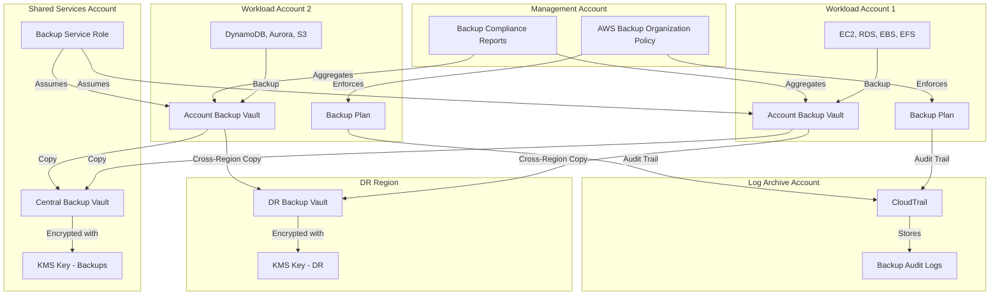
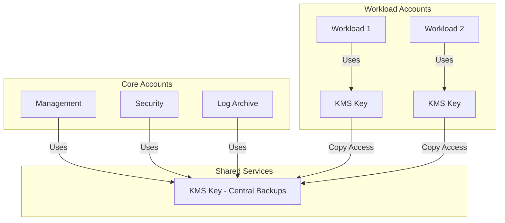

# Protección de Datos y Respaldos {#proteccion-de-datos-y-respaldos}

Este documento describe la estrategia de protección de datos y respaldos (backups) para la AWS Landing Zone, incluyendo la gestión centralizada de respaldos, la estrategia de claves de cifrado, los procedimientos de recuperación ante desastres y las consideraciones de cumplimiento.

## Descripción General {#descripcion-general-proteccion-datos}

La protección de datos en un entorno de múltiples cuentas requiere un enfoque integral que equilibre la seguridad, la eficiencia operativa, la capacidad de recuperación y el cumplimiento. Esta Landing Zone implementa una estrategia de defensa en profundidad utilizando:

- **AWS Backup**: Gestión centralizada de respaldos con políticas a nivel de toda la organización.
- **AWS KMS**: Gestión de claves de cifrado con patrones de acceso entre cuentas.
- **Clasificación de Datos**: Enfoque por niveles para los requisitos de retención y cifrado.
- **Respaldo entre Regiones (Cross-Region Backup)**: Recuperación ante desastres con redundancia geográfica.
- **Controles de Cumplimiento**: Pistas de auditoría y políticas de retención para requisitos regulatorios.

## Arquitectura de Respaldos {#arquitectura-de-respaldos}



## Políticas de Organización de AWS Backup {#politicas-organizacion-aws-backup}

Gestión centralizada de respaldos utilizando las políticas de AWS Organizations.

### Estructura de la Política de Respaldo {#estructura-politica-respaldo}

Las políticas de AWS Backup son documentos JSON que definen planes de respaldo, reglas y configuraciones de bóvedas (vaults) en toda la organización.

**Componentes de la Política**:
- **Planes de Respaldo (Backup Plans)**: Definen los horarios de respaldo y la retención.
- **Selecciones de Respaldo (Backup Selections)**: Especifican qué recursos respaldar.
- **Bóvedas de Respaldo (Backup Vaults)**: Definen dónde se almacenan los respaldos.
- **Acciones de Copia (Copy Actions)**: Configuran copias entre cuentas y entre regiones.

### Política de Respaldo a Nivel de Organización {#politica-respaldo-organizacion}

Aplicada en la raíz de la Organización o en OUs específicas:

```json
{
  "plans": {
    "ProductionBackupPlan": {
      "regions": {
        "@@assign": ["us-east-1", "us-west-2"]
      },
      "rules": {
        "DailyBackup": {
          "schedule_expression": {
            "@@assign": "cron(0 5 ? * * *)"
          },
          "start_backup_window_minutes": {
            "@@assign": "60"
          },
          "complete_backup_window_minutes": {
            "@@assign": "120"
          },
          "lifecycle": {
            "move_to_cold_storage_after_days": {
              "@@assign": "30"
            },
            "delete_after_days": {
              "@@assign": "365"
            }
          },
          "copy_actions": {
            "arn:aws:backup:us-west-2:111122223333:backup-vault:DRVault": {
              "lifecycle": {
                "delete_after_days": {
                  "@@assign": "365"
                }
              }
            }
          }
        },
        "WeeklyBackup": {
          "schedule_expression": {
            "@@assign": "cron(0 5 ? * SUN *)"
          },
          "lifecycle": {
            "move_to_cold_storage_after_days": {
              "@@assign": "90"
            },
            "delete_after_days": {
              "@@assign": "2555"
            }
          }
        }
      },
      "selections": {
        "tags": {
          "ProductionResources": {
            "iam_role_arn": {
              "@@assign": "arn:aws:iam::$account:role/AWSBackupDefaultServiceRole"
            },
            "tag_key": {
              "@@assign": "BackupPolicy"
            },
            "tag_value": {
              "@@assign": ["Production", "Critical"]
            }
          }
        }
      }
    }
  }
}
```

### Planes de Respaldo por Entorno {#planes-respaldo-entorno}

| Entorno | Frecuencia de Respaldo | Retención (Hot) | Retención (Cold) | Entre Regiones | RTO | RPO |
|-------------|------------------|-----------------|------------------|--------------|-----|-----|
| Producción | Diario + Semanal | 30 días | 7 años | Sí | 4 horas | 24 horas |
| Staging | Diario | 14 días | N/A | No | 8 horas | 24 horas |
| Desarrollo | Semanal | 7 días | N/A | No | 24 horas | 7 días |
| Sandbox | Ninguno | N/A | N/A | No | N/A | N/A |

### Estrategias de Selección de Recursos {#estrategias-seleccion-recursos}

**Selección Basada en Etiquetas**:
```json
{
  "selections": {
    "tags": {
      "DatabaseBackup": {
        "iam_role_arn": {
          "@@assign": "arn:aws:iam::$account:role/AWSBackupDefaultServiceRole"
        },
        "tag_key": {
          "@@assign": "BackupTier"
        },
        "tag_value": {
          "@@assign": ["Tier1", "Tier2"]
        }
      }
    }
  }
}
```

**Selección por Tipo de Recurso**:
```json
{
  "selections": {
    "resources": {
      "AllRDS": {
        "iam_role_arn": {
          "@@assign": "arn:aws:iam::$account:role/AWSBackupDefaultServiceRole"
        },
        "resources": {
          "@@assign": ["arn:aws:rds:*:*:db:*"]
        }
      }
    }
  }
}
```

### Informes de Cumplimiento de Respaldos {#informes-cumplimiento-respaldos}

AWS Backup proporciona informes de cumplimiento para una visibilidad a nivel de toda la organización:

**Tipos de Informes**:
- **Informe de Trabajos de Respaldo**: Estado de todos los trabajos de respaldo.
- **Informe de Trabajos de Copia**: Estado de las copias entre cuentas/regiones.
- **Informe de Trabajos de Restauración**: Actividad de restauración y tasas de éxito.
- **Informe de Cumplimiento**: Recursos con/sin cobertura de respaldo.

**Configuración de Informes**:
```hcl
resource "aws_backup_report_plan" "compliance" {
  name        = "organization-backup-compliance"
  description = "Organization-wide backup compliance report"

  report_delivery_channel {
    formats = ["CSV", "JSON"]
    s3_bucket_name = "backup-reports-${data.aws_caller_identity.current.account_id}"
    s3_key_prefix  = "compliance-reports/"
  }

  report_setting {
    report_template = "BACKUP_JOB_REPORT"
    
    framework_arns = [
      aws_backup_framework.compliance.arn
    ]
  }
}
```

## Estrategia de Gestión de Claves KMS {#estrategia-gestion-claves-kms}

Estrategia de claves de cifrado para la protección de los datos de respaldo.

### Patrones de Arquitectura de Claves {#patrones-arquitectura-claves}

**Patrón 1: Claves KMS Centralizadas**

Una única clave KMS en la cuenta de Shared Services para todos los respaldos:

**Ventajas**:
- Gestión de claves simplificada.
- Una única política de claves que mantener.
- Acceso entre cuentas más fácil.

**Desventajas**:
- Punto único de falla.
- Radio de impacto si la clave se ve comprometida.
- Todas las cuentas dependen de Shared Services.

**Caso de Uso**: Organizaciones pequeñas (< 20 cuentas) con un equipo de seguridad centralizado.

**Patrón 2: Claves KMS por Cuenta**

Cada cuenta tiene su propia clave KMS para los respaldos:

**Ventajas**:
- Contención del radio de impacto.
- Rotación de claves a nivel de cuenta.
- Políticas de claves independientes.

**Desventajas**:
- Más claves que gestionar.
- Políticas entre cuentas complejas.
- Mayor sobrecarga operativa.

**Caso de Uso**: Organizaciones grandes con equipos descentralizados.

**Patrón 3: Enfoque Híbrido** (Recomendado)

Claves centralizadas para las cuentas principales, claves por cuenta para las cuentas de carga de trabajo:



### Política de Claves KMS para Respaldos {#politica-claves-kms-respaldos}

**Acceso a Respaldos entre Cuentas**:

```json
{
  "Version": "2012-10-17",
  "Statement": [
    {
      "Sid": "Enable IAM User Permissions",
      "Effect": "Allow",
      "Principal": {
        "AWS": "arn:aws:iam::111122223333:root"
      },
      "Action": "kms:*",
      "Resource": "*"
    },
    {
      "Sid": "Allow AWS Backup to use the key",
      "Effect": "Allow",
      "Principal": {
        "Service": "backup.amazonaws.com"
      },
      "Action": [
        "kms:CreateGrant",
        "kms:DescribeKey",
        "kms:Decrypt",
        "kms:Encrypt",
        "kms:ReEncrypt*",
        "kms:GenerateDataKey*"
      ],
      "Resource": "*",
      "Condition": {
        "StringEquals": {
          "kms:ViaService": [
            "backup.us-east-1.amazonaws.com",
            "backup.us-west-2.amazonaws.com"
          ]
        }
      }
    },
    {
      "Sid": "Allow cross-account backup copy",
      "Effect": "Allow",
      "Principal": {
        "AWS": [
          "arn:aws:iam::444455556666:role/AWSBackupDefaultServiceRole",
          "arn:aws:iam::777788889999:role/AWSBackupDefaultServiceRole"
        ]
      },
      "Action": [
        "kms:Decrypt",
        "kms:DescribeKey"
      ],
      "Resource": "*",
      "Condition": {
        "StringEquals": {
          "kms:ViaService": "backup.us-east-1.amazonaws.com"
        }
      }
    },
    {
      "Sid": "Allow attachment of persistent resources",
      "Effect": "Allow",
      "Principal": {
        "Service": "backup.amazonaws.com"
      },
      "Action": "kms:CreateGrant",
      "Resource": "*",
      "Condition": {
        "Bool": {
          "kms:GrantIsForAWSResource": "true"
        }
      }
    }
  ]
}
```

### Políticas de Rotación de Claves {#politicas-rotacion-claves}

**Rotación Automática de Claves**:
- Habilitada para todas las claves KMS.
- AWS rota el material de la clave anualmente.
- El material de la clave antiguo se conserva para el descifrado.
- No se requieren cambios en las aplicaciones.

**Rotación Manual de Claves**:
- Requerida para el material de clave importado.
- Crear una nueva clave con rotación de alias.
- Actualizar las políticas de claves y las concesiones (grants).
- Conservar la clave antigua para el descifrado.

**Programa de Rotación**:
```hcl
resource "aws_kms_key" "backup" {
  description             = "KMS key for backup encryption"
  deletion_window_in_days = 30
  enable_key_rotation     = true

  tags = {
    Name        = "backup-encryption-key"
    Purpose     = "Backup"
    Rotation    = "Automatic"
    Environment = "Production"
  }
}
```

### Claves Multirregión para DR {#claves-multirregion-dr}

Utilice claves KMS multirregión para el cifrado de respaldos entre regiones:

**Clave Primaria** (us-east-1):
```hcl
resource "aws_kms_key" "backup_primary" {
  description             = "Multi-region backup encryption key"
  multi_region            = true
  enable_key_rotation     = true
  deletion_window_in_days = 30
}

resource "aws_kms_alias" "backup_primary" {
  name          = "alias/backup-multi-region"
  target_key_id = aws_kms_key.backup_primary.key_id
}
```

**Clave Réplica** (us-west-2):
```hcl
resource "aws_kms_replica_key" "backup_replica" {
  provider = aws.us-west-2

  description             = "Multi-region backup encryption key replica"
  primary_key_arn         = aws_kms_key.backup_primary.arn
  deletion_window_in_days = 30
}

resource "aws_kms_alias" "backup_replica" {
  provider = aws.us-west-2

  name          = "alias/backup-multi-region"
  target_key_id = aws_kms_replica_key.backup_replica.key_id
}
```

**Beneficios**:
- El mismo ID de clave en ambas regiones.
- Restauración entre regiones simplificada.
- No se requiere volver a cifrar.
- Políticas de claves consistentes.

## Clasificación de Datos {#clasificacion-de-datos}

Enfoque por niveles para la protección de datos basado en la sensibilidad.

### Niveles de Clasificación {#niveles-clasificacion}

| Nivel | Descripción | Ejemplos | Cifrado | Retención | Frecuencia de Respaldo |
|-------|-------------|----------|------------|-----------|------------------|
| **Público** | Datos disponibles públicamente | Contenido de marketing, docs públicos | Opcional | 30 días | Semanal |
| **Interno** | Datos de negocio internos | Directorios de empleados, wikis internas | Requerido (AES-256) | 1 año | Diario |
| **Confidencial** | Datos de negocio sensibles | Registros financieros, datos de clientes | Requerido (KMS) | 7 años | Diario + Semanal |
| **Restringido** | Datos altamente sensibles | PII, PHI, PCI, credenciales | Requerido (KMS + MFA) | 7 años | Continuo |

### Estrategia de Etiquetado {#estrategia-etiquetado-clasificacion}

Utilice etiquetas para obligar al cumplimiento de las políticas basadas en la clasificación:

```hcl
resource "aws_db_instance" "customer_db" {
  identifier = "customer-database"
  
  # ... other configuration ...
  
  tags = {
    DataClassification = "Confidential"
    BackupTier         = "Tier1"
    ComplianceScope    = "SOC2,HIPAA"
    RetentionPeriod    = "7years"
  }
}
```

### Requisitos de Retención por Clasificación {#requisitos-retencion-clasificacion}

**Datos Públicos**:
- Almacenamiento hot: 30 días.
- Almacenamiento cold: No requerido.
- Eliminación: Después de 30 días.

**Datos Internos**:
- Almacenamiento hot: 90 días.
- Almacenamiento cold: 1 año.
- Eliminación: Después de 1 año.

**Datos Confidenciales**:
- Almacenamiento hot: 30 días.
- Almacenamiento cold: 7 años.
- Eliminación: Después de 7 años (con pista de auditoría).

**Datos Restringidos**:
- Almacenamiento hot: 90 días.
- Almacenamiento cold: 7 años.
- Eliminación: Eliminación segura con verificación.

### Requisitos de Cifrado por Clasificación {#requisitos-cifrado-clasificacion}

**Datos Públicos**:
- Cifrado en reposo: Opcional.
- Cifrado en tránsito: Recomendado (TLS 1.2+).
- Gestión de claves: Claves gestionadas por AWS.

**Datos Internos**:
- Cifrado en reposo: Requerido (AES-256).
- Cifrado en tránsito: Requerido (TLS 1.2+).
- Gestión de claves: Claves gestionadas por AWS.

**Datos Confidenciales**:
- Cifrado en reposo: Requerido (KMS).
- Cifrado en tránsito: Requerido (TLS 1.2+).
- Gestión de claves: Claves gestionadas por el cliente (CMK).
- Rotación de claves: Anual.

**Datos Restringidos**:
- Cifrado en reposo: Requerido (KMS con MFA).
- Cifrado en tránsito: Requerido (TLS 1.3).
- Gestión de claves: Claves gestionadas por el cliente (CMK).
- Rotación de claves: Trimestral.
- Registro de acceso: Todas las operaciones de descifrado.

## Respaldo entre Regiones (Cross-Region Backup) {#respaldo-entre-regiones}

Redundancia geográfica para la recuperación ante desastres.

### Selección de la Región de DR {#seleccion-region-dr}

**Criterios para la Región de DR**:
1. **Distancia Geográfica**: > 250 millas de la región primaria.
2. **Disponibilidad de Servicios**: Todos los servicios requeridos disponibles.
3. **Residencia de Datos**: Cumple con los requisitos regulatorios.
4. **Latencia**: Aceptable para las operaciones de copia de respaldo.
5. **Costo**: Equilibrado con los requisitos de recuperación.

**Pares de Regiones Comunes**:
| Región Primaria | Región de DR | Distancia | Caso de Uso |
|----------------|-----------|----------|----------|
| us-east-1 | us-west-2 | ~2,400 millas | Cargas de trabajo en EE. UU. |
| eu-west-1 | eu-central-1 | ~600 millas | Residencia de datos en la UE |
| ap-southeast-1 | ap-northeast-1 | ~3,000 millas | Cargas de trabajo en APAC |

### Reglas de Copia entre Regiones {#reglas-copia-entre-regiones}

**Plan de Respaldo con Copia entre Regiones**:

```hcl
resource "aws_backup_plan" "production" {
  name = "production-backup-plan"

  rule {
    rule_name         = "daily_backup"
    target_vault_name = aws_backup_vault.primary.name
    schedule          = "cron(0 5 ? * * *)"

    lifecycle {
      move_to_cold_storage_after_days = 30
      delete_after_days              = 365
    }

    copy_action {
      destination_vault_arn = aws_backup_vault.dr.arn

      lifecycle {
        move_to_cold_storage_after_days = 30
        delete_after_days              = 365
      }
    }
  }
}
```

**Monitoreo de Trabajos de Copia**:
```hcl
resource "aws_cloudwatch_metric_alarm" "backup_copy_failed" {
  alarm_name          = "backup-copy-job-failed"
  comparison_operator = "GreaterThanThreshold"
  evaluation_periods  = "1"
  metric_name         = "NumberOfBackupJobsFailed"
  namespace           = "AWS/Backup"
  period              = "300"
  statistic           = "Sum"
  threshold           = "0"
  alarm_description   = "Alert when backup copy job fails"
  alarm_actions       = [aws_sns_topic.backup_alerts.arn]

  dimensions = {
    BackupVaultName = aws_backup_vault.dr.name
  }
}
```

### Consideraciones de RTO/RPO {#consideraciones-rto-rpo}

**Objetivo de Tiempo de Recuperación (RTO)**:
- Tiempo para restaurar el servicio después de un desastre.
- Factores: Tamaño del respaldo, ancho de banda de red, complejidad del proceso de restauración.

**Objetivo de Punto de Recuperación (RPO)**:
- Pérdida de datos máxima aceptable.
- Determinado por la frecuencia de los respaldos.

**Matriz de RTO/RPO**:

| Nivel | RTO | RPO | Frecuencia de Respaldo | Costo |
|------|-----|-----|------------------|------|
| Nivel 1 (Crítico) | < 4 horas | < 1 hora | Continuo + Diario | Alto |
| Nivel 2 (Importante) | < 8 horas | < 24 horas | Diario | Medio |
| Nivel 3 (Estándar) | < 24 horas | < 7 días | Semanal | Bajo |
| Nivel 4 (Archivo) | < 72 horas | < 30 días | Mensual | Muy Bajo |

**Cálculo del RTO**:
```
RTO = Tiempo de Recuperación del Respaldo + Tiempo de Transferencia de Datos + Tiempo del Proceso de Restauración + Tiempo de Validación

Ejemplo (base de datos de 1TB):
- Recuperación del Respaldo: 30 minutos (desde S3 Glacier)
- Transferencia de Datos: 90 minutos (1TB a 150 MB/s)
- Proceso de Restauración: 60 minutos (importación de base de datos)
- Validación: 30 minutos (comprobaciones de integridad)
Total RTO: 3.5 horas
```

**Optimización del RTO**:
1. Utilizar S3 Standard para respaldos hot (recuperación más rápida).
2. Pre-aprovisionar la infraestructura de restauración (warm standby).
3. Automatizar los procedimientos de restauración (runbooks, scripts).
4. Pruebas de DR regulares (trimestrales).

## Procedimientos de Recuperación ante Desastres {#procedimientos-recuperacion-desastres}

Procedimientos documentados para la restauración de respaldos y el failover.

### Proceso de Restauración de Respaldos {#proceso-restauracion-respaldos}

**Paso 1: Identificar el Punto de Recuperación**

```bash
# List available recovery points
aws backup list-recovery-points-by-backup-vault \
  --backup-vault-name ProductionBackupVault \
  --by-resource-arn arn:aws:rds:us-east-1:123456789012:db:production-db

# Get recovery point details
aws backup describe-recovery-point \
  --backup-vault-name ProductionBackupVault \
  --recovery-point-arn <recovery-point-arn>
```

**Paso 2: Iniciar el Trabajo de Restauración**

```bash
# Restore RDS database
aws backup start-restore-job \
  --recovery-point-arn <recovery-point-arn> \
  --iam-role-arn arn:aws:iam::123456789012:role/AWSBackupDefaultServiceRole \
  --metadata '{
    "DBInstanceIdentifier": "restored-production-db",
    "DBInstanceClass": "db.r5.xlarge",
    "Engine": "postgres",
    "MultiAZ": "true",
    "PubliclyAccessible": "false",
    "VpcSecurityGroupIds": "sg-0123456789abcdef0"
  }'
```

**Paso 3: Monitorear el Progreso de la Restauración**

```bash
# Check restore job status
aws backup describe-restore-job \
  --restore-job-id <restore-job-id>

# Monitor CloudWatch metrics
aws cloudwatch get-metric-statistics \
  --namespace AWS/Backup \
  --metric-name RestoreJobsCompleted \
  --dimensions Name=ResourceType,Value=RDS \
  --start-time 2024-01-01T00:00:00Z \
  --end-time 2024-01-01T23:59:59Z \
  --period 3600 \
  --statistics Sum
```

**Paso 4: Validar los Datos Restaurados**

```bash
# Connect to restored database
psql -h restored-production-db.abc123.us-east-1.rds.amazonaws.com \
     -U admin -d production

# Run validation queries
SELECT COUNT(*) FROM customers;
SELECT MAX(created_at) FROM orders;

# Compare with expected values
```

**Paso 5: Actualizar la Configuración de la Aplicación**

```bash
# Update DNS or load balancer to point to restored resource
aws route53 change-resource-record-sets \
  --hosted-zone-id Z1234567890ABC \
  --change-batch file://dns-update.json

# Update application configuration
aws ssm put-parameter \
  --name /app/database/endpoint \
  --value restored-production-db.abc123.us-east-1.rds.amazonaws.com \
  --overwrite
```

### Failover entre Regiones {#failover-entre-regiones}

**Escenario**: La región primaria (us-east-1) no está disponible, failover a la región de DR (us-west-2).

**Requisitos Previos**:
- Copias de respaldo entre regiones habilitadas.
- Infraestructura de la región de DR pre-aprovisionada (warm standby).
- Failover de DNS configurado (comprobaciones de salud de Route 53).
- Runbook probado trimestralmente.

**Pasos del Failover**:

1. **Declarar el Desastre**: El comandante del incidente declara el evento de DR.
2. **Activar el Equipo de DR**: Notificar a los ingenieros de guardia a través de PagerDuty.
3. **Verificar los Respaldos de DR**: Confirmar que los últimos respaldos están disponibles en la región de DR.
4. **Restaurar Recursos**: Ejecutar los trabajos de restauración en la región de DR.
5. **Actualizar DNS**: Failover de Route 53 a los endpoints de la región de DR.
6. **Validar Servicios**: Ejecutar pruebas de humo (smoke tests) y comprobaciones de salud.
7. **Monitorear**: Observar los dashboards de CloudWatch para detectar anomalías.
8. **Comunicar**: Actualizar la página de estado y notificar a los interesados.

**Failover Automatizado** (para servicios críticos):

```python
# Lambda function for automated DR failover
import boto3

def lambda_handler(event, context):
    # Triggered by CloudWatch alarm (primary region unhealthy)
    
    backup_client = boto3.client('backup', region_name='us-west-2')
    route53_client = boto3.client('route53')
    
    # Get latest recovery point in DR region
    recovery_points = backup_client.list_recovery_points_by_backup_vault(
        BackupVaultName='DRBackupVault',
        ByResourceArn='arn:aws:rds:us-east-1:123456789012:db:production-db'
    )
    
    latest_recovery_point = recovery_points['RecoveryPoints'][0]['RecoveryPointArn']
    
    # Start restore job
    restore_job = backup_client.start_restore_job(
        RecoveryPointArn=latest_recovery_point,
        IamRoleArn='arn:aws:iam::123456789012:role/AWSBackupDefaultServiceRole',
        Metadata={
            'DBInstanceIdentifier': 'production-db-dr',
            'DBInstanceClass': 'db.r5.xlarge',
            'Engine': 'postgres',
            'MultiAZ': 'true'
        }
    )
    
    # Wait for restore to complete (poll status)
    # ...
    
    # Update Route 53 to point to DR region
    route53_client.change_resource_record_sets(
        HostedZoneId='Z1234567890ABC',
        ChangeBatch={
            'Changes': [{
                'Action': 'UPSERT',
                'ResourceRecordSet': {
                    'Name': 'db.example.com',
                    'Type': 'CNAME',
                    'TTL': 60,
                    'ResourceRecords': [{'Value': 'production-db-dr.us-west-2.rds.amazonaws.com'}]
                }
            }]
        }
    )
    
    return {'statusCode': 200, 'body': 'DR failover initiated'}
```

### Pruebas de los Procedimientos de DR {#pruebas-procedimientos-dr}

**Programa Trimestral de Pruebas de DR**:
- **Q1**: Restaurar una sola base de datos desde el respaldo.
- **Q2**: Simulación de failover entre regiones (no-producción).
- **Q3**: Ejercicio de DR completo (todos los servicios críticos).
- **Q4**: Ejercicio de mesa (tabletop) con los interesados.

**Lista de Verificación de la Prueba de DR**:
- [ ] Identificar el alcance de la prueba (qué servicios restaurar).
- [ ] Programar la ventana de la prueba (horas de menor actividad).
- [ ] Notificar a los interesados (no se espera impacto en el cliente).
- [ ] Ejecutar los procedimientos de restauración.
- [ ] Medir los RTO/RPO reales frente a los objetivos.
- [ ] Documentar los problemas y las lecciones aprendidas.
- [ ] Actualizar los runbooks basándose en los hallazgos.
- [ ] Informar los resultados a la dirección.

**Métricas de la Prueba de DR**:
```hcl
resource "aws_cloudwatch_dashboard" "dr_testing" {
  dashboard_name = "dr-testing-metrics"

  dashboard_body = jsonencode({
    widgets = [
      {
        type = "metric"
        properties = {
          metrics = [
            ["Custom/DR", "RestoreTimeMinutes", { stat = "Average" }],
            ["Custom/DR", "DataLossHours", { stat = "Maximum" }],
            ["Custom/DR", "TestSuccessRate", { stat = "Average" }]
          ]
          period = 2592000  # 30 days
          stat   = "Average"
          region = "us-east-1"
          title  = "DR Testing Metrics"
        }
      }
    ]
  })
}
```

## Consideraciones de Cumplimiento {#consideraciones-cumplimiento-respaldo}

Requisitos de respaldo y protección de datos para el cumplimiento regulatorio.

### Requisitos de Residencia de Datos {#requisitos-residencia-datos}

**Restricciones Regionales**:
- **GDPR (UE)**: Los datos deben permanecer en las regiones de la UE.
- **CCPA (California)**: Sin requisito de residencia específico, pero se requieren controles de acceso a los datos.
- **HIPAA (Salud)**: Sin requisito de residencia específico, pero se requiere un BAA con AWS.
- **PCI DSS (Tarjetas de Pago)**: Sin requisito de residencia específico, pero se requiere cifrado y controles de acceso.

**Implementación**:
```hcl
# Enforce backup region restrictions via SCP
resource "aws_organizations_policy" "backup_region_restriction" {
  name        = "backup-region-restriction"
  description = "Restrict backup operations to approved regions"
  type        = "SERVICE_CONTROL_POLICY"

  content = jsonencode({
    Version = "2012-10-17"
    Statement = [
      {
        Sid    = "DenyBackupOutsideApprovedRegions"
        Effect = "Deny"
        Action = [
          "backup:CreateBackupVault",
          "backup:StartBackupJob",
          "backup:StartCopyJob"
        ]
        Resource = "*"
        Condition = {
          StringNotEquals = {
            "aws:RequestedRegion" = [
              "eu-west-1",
              "eu-central-1"
            ]
          }
        }
      }
    ]
  })
}
```

### Pista de Auditoría para Respaldos {#pista-auditoria-respaldos}

**Registro en CloudTrail**:
- Todas las operaciones de respaldo se registran en CloudTrail.
- Los registros se almacenan en la cuenta de Log Archive.
- Almacenamiento de registros inmutable (S3 Object Lock).
- Retención de registros: 7 años.

**Eventos Clave a Monitorear**:
```json
{
  "eventName": [
    "CreateBackupVault",
    "DeleteBackupVault",
    "StartBackupJob",
    "StartRestoreJob",
    "DeleteRecoveryPoint",
    "UpdateRecoveryPointLifecycle",
    "PutBackupVaultAccessPolicy"
  ]
}
```

**Análisis de los Registros de Auditoría**:
```bash
# Query CloudTrail logs for backup deletions
aws cloudtrail lookup-events \
  --lookup-attributes AttributeKey=EventName,AttributeValue=DeleteRecoveryPoint \
  --start-time 2024-01-01T00:00:00Z \
  --end-time 2024-12-31T23:59:59Z

# Analyze with Athena
SELECT 
  useridentity.principalid,
  eventname,
  eventtime,
  requestparameters
FROM cloudtrail_logs
WHERE eventname IN ('DeleteRecoveryPoint', 'DeleteBackupVault')
  AND eventtime > date_add('day', -90, current_date)
ORDER BY eventtime DESC;
```

### Retención para el Cumplimiento {#retencion-cumplimiento}

**Requisitos de Retención de los Marcos de Cumplimiento**:

| Marco de Trabajo | Período de Retención | Tipo de Respaldo | Notas |
|-----------|------------------|-------------|-------|
| **SOC 2** | 1 año (período de auditoría) | Diario | Debe demostrar respaldo continuo |
| **HIPAA** | 6 años | Diario + Semanal | Requisito de retención de PHI |
| **PCI DSS** | 3 meses (logs), 1 año (auditoría) | Diario | Entorno de datos de titulares de tarjeta |
| **GDPR** | Varía según el tipo de datos | Diario | Se aplica el derecho de supresión |
| **SEC 17a-4** | 7 años | Diario | Registros financieros (almacenamiento WORM) |
| **FINRA** | 6 años | Diario | Registros de corredores de bolsa |

**Implementación de la Retención para el Cumplimiento**:

```hcl
resource "aws_backup_plan" "hipaa_compliant" {
  name = "hipaa-compliant-backup-plan"

  rule {
    rule_name         = "daily_backup_6year_retention"
    target_vault_name = aws_backup_vault.hipaa.name
    schedule          = "cron(0 5 ? * * *)"

    lifecycle {
      move_to_cold_storage_after_days = 90
      delete_after_days              = 2190  # 6 years
    }

    copy_action {
      destination_vault_arn = aws_backup_vault.hipaa_dr.arn

      lifecycle {
        move_to_cold_storage_after_days = 90
        delete_after_days              = 2190
      }
    }
  }
}

# Prevent deletion with vault lock
resource "aws_backup_vault_lock_configuration" "hipaa" {
  backup_vault_name   = aws_backup_vault.hipaa.name
  min_retention_days  = 2190  # 6 years
  max_retention_days  = 2555  # 7 years
  changeable_for_days = 3     # Grace period before lock becomes immutable
}
```

**Almacenamiento WORM para SEC 17a-4**:

```hcl
# S3 bucket with Object Lock for immutable backups
resource "aws_s3_bucket" "sec_17a4_backups" {
  bucket = "sec-17a4-compliant-backups"

  object_lock_enabled = true
}

resource "aws_s3_bucket_object_lock_configuration" "sec_17a4" {
  bucket = aws_s3_bucket.sec_17a4_backups.id

  rule {
    default_retention {
      mode = "COMPLIANCE"  # Cannot be deleted by anyone, including root
      years = 7
    }
  }
}
```

### Informes de Cumplimiento {#informes-cumplimiento-backup}

**Informes de Cumplimiento Automatizados**:

```hcl
resource "aws_backup_report_plan" "compliance_report" {
  name        = "backup-compliance-report"
  description = "Daily backup compliance report for audit"

  report_delivery_channel {
    formats        = ["CSV", "JSON"]
    s3_bucket_name = aws_s3_bucket.compliance_reports.id
    s3_key_prefix  = "backup-compliance/"
  }

  report_setting {
    report_template = "RESOURCE_COMPLIANCE_REPORT"
    
    accounts = ["*"]  # All accounts in organization
    
    organization_units = [
      aws_organizations_organizational_unit.production.id
    ]
    
    regions = ["us-east-1", "us-west-2"]
    
    framework_arns = [
      aws_backup_framework.hipaa.arn,
      aws_backup_framework.pci.arn
    ]
  }
}
```

**Dashboard de Cumplimiento**:

```hcl
resource "aws_cloudwatch_dashboard" "backup_compliance" {
  dashboard_name = "backup-compliance-dashboard"

  dashboard_body = jsonencode({
    widgets = [
      {
        type = "metric"
        properties = {
          metrics = [
            ["AWS/Backup", "NumberOfBackupJobsCompleted"],
            ["AWS/Backup", "NumberOfBackupJobsFailed"],
            ["AWS/Backup", "NumberOfRecoveryPointsCreated"]
          ]
          period = 86400  # Daily
          stat   = "Sum"
          region = "us-east-1"
          title  = "Backup Job Status"
        }
      },
      {
        type = "metric"
        properties = {
          metrics = [
            ["Custom/Compliance", "ResourcesWithBackup", { stat = "Average" }],
            ["Custom/Compliance", "ResourcesWithoutBackup", { stat = "Average" }]
          ]
          period = 86400
          stat   = "Average"
          region = "us-east-1"
          title  = "Backup Coverage"
        }
      }
    ]
  })
}
```

## Mejores Prácticas {#mejores-practicas-proteccion-datos}

### Validación de Respaldos {#validacion-respaldos}

**Pruebas de Restauración Regulares**:
- Probar las restauraciones mensualmente (automatizado).
- Validar la integridad de los datos después de la restauración.
- Medir los RTO/RPO reales frente a los objetivos.
- Documentar los procedimientos de restauración.

**Validación Automatizada**:
```python
# Lambda function for automated backup validation
import boto3
import hashlib

def lambda_handler(event, context):
    backup_client = boto3.client('backup')
    
    # Get latest recovery point
    recovery_points = backup_client.list_recovery_points_by_backup_vault(
        BackupVaultName='ProductionBackupVault'
    )
    
    latest_rp = recovery_points['RecoveryPoints'][0]
    
    # Start restore to test environment
    restore_job = backup_client.start_restore_job(
        RecoveryPointArn=latest_rp['RecoveryPointArn'],
        IamRoleArn='arn:aws:iam::123456789012:role/AWSBackupDefaultServiceRole',
        Metadata={
            'DBInstanceIdentifier': 'validation-test-db',
            'DBInstanceClass': 'db.t3.small'
        }
    )
    
    return {'statusCode': 200, 'body': 'Backup validation completed'}
```

### Optimización de Costos {#optimizacion-costos-backup}

**Políticas de Ciclo de Vida**:
- Mover al almacenamiento cold después de 30 días (reducción de costos del 80%).
- Eliminar los respaldos antiguos según la política de retención.
- Utilizar S3 Intelligent-Tiering para el almacenamiento de respaldos.

**Optimización de la Frecuencia de Respaldo**:
- Datos críticos: Diario + continuo.
- Datos importantes: Diario.
- Datos estándar: Semanal.
- Datos de archivo: Mensual.

**Optimización de la Copia entre Regiones**:
- Solo copiar los respaldos críticos entre regiones.
- Utilizar S3 Transfer Acceleration para respaldos grandes.
- Programar las copias durante las horas de menor actividad.

### Fortalecimiento de la Seguridad {#seguridad-backup}

**Control de Acceso a la Bóveda de Respaldo**:
```json
{
  "Version": "2012-10-17",
  "Statement": [
    {
      "Sid": "DenyDeleteRecoveryPoint",
      "Effect": "Deny",
      "Principal": "*",
      "Action": "backup:DeleteRecoveryPoint",
      "Resource": "*",
      "Condition": {
        "StringNotLike": {
          "aws:PrincipalArn": "arn:aws:iam::123456789012:role/BackupAdmin"
        }
      }
    }
  ]
}
```

**MFA Delete para Respaldos Críticos**:
```hcl
resource "aws_s3_bucket_versioning" "backup_bucket" {
  bucket = aws_s3_bucket.backups.id

  versioning_configuration {
    status     = "Enabled"
    mfa_delete = "Enabled"
  }
}
```

**Obligación de Cifrado de Respaldos**:
```json
{
  "Version": "2012-10-17",
  "Statement": [
    {
      "Sid": "DenyUnencryptedBackups",
      "Effect": "Deny",
      "Action": "backup:StartBackupJob",
      "Resource": "*",
      "Condition": {
        "StringNotEquals": {
          "backup:EncryptionKeyArn": "arn:aws:kms:us-east-1:123456789012:key/*"
        }
      }
    }
  ]
}
```

### Monitoreo y Alertas {#monitoreo-alertas-backup}

**Alertas de Respaldo Críticas**:
- Fallas en los trabajos de respaldo.
- Respaldos programados faltantes.
- Fallas en las copias entre regiones.
- Cambios en el acceso a la bóveda de respaldo.
- Eliminaciones de puntos de recuperación.

**Alarmas de CloudWatch**:
```hcl
resource "aws_cloudwatch_metric_alarm" "backup_job_failed" {
  alarm_name          = "backup-job-failed"
  comparison_operator = "GreaterThanThreshold"
  evaluation_periods  = "1"
  metric_name         = "NumberOfBackupJobsFailed"
  namespace           = "AWS/Backup"
  period              = "300"
  statistic           = "Sum"
  threshold           = "0"
  alarm_description   = "Alert when backup job fails"
  alarm_actions       = [aws_sns_topic.critical_alerts.arn]
}

resource "aws_cloudwatch_metric_alarm" "missing_backup" {
  alarm_name          = "missing-scheduled-backup"
  comparison_operator = "LessThanThreshold"
  evaluation_periods  = "1"
  metric_name         = "NumberOfBackupJobsCreated"
  namespace           = "AWS/Backup"
  period              = "86400"  # 24 hours
  statistic           = "Sum"
  threshold           = "1"
  alarm_description   = "Alert when no backup jobs created in 24 hours"
  alarm_actions       = [aws_sns_topic.critical_alerts.arn]
}
```

## Relacionado {#relacionado-proteccion-datos}

- [Modelo de Seguridad](./security-model)
- [Arquitectura de Cuentas Múltiples](./multi-account)
- [Estrategia de IAM](./iam-strategy)
- [Diseño de Red](./network-design)
