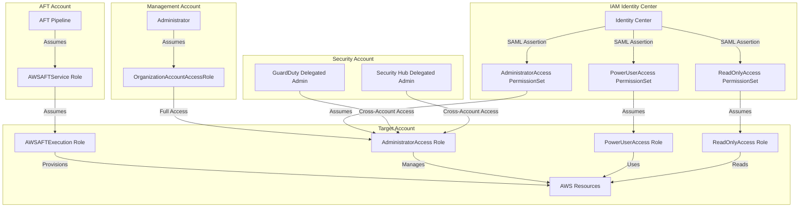
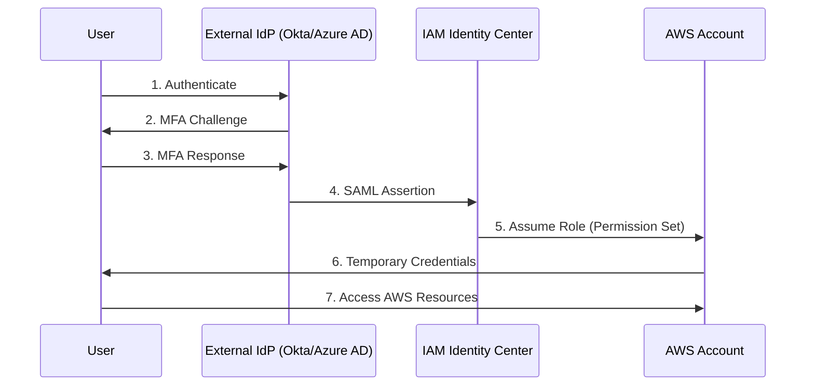
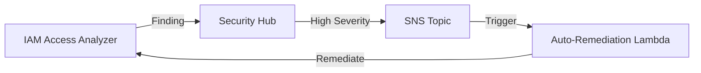

# Estrategia de IAM {#estrategia-de-iam}

Este documento describe la estrategia de Identity and Access Management (IAM) para la AWS Landing Zone, incluyendo patrones de acceso entre cuentas, federación de identidades y mejores prácticas de seguridad.

## Descripción General {#descripcion-general}

IAM en un entorno de múltiples cuentas requiere un diseño cuidadoso para equilibrar la seguridad, la eficiencia operativa y la auditabilidad. Esta Landing Zone implementa un enfoque de defensa en profundidad utilizando:

- **IAM Identity Center**: Acceso humano centralizado con identidades federadas.
- **Roles entre cuentas (Cross-Account Roles)**: Acceso de servicio a servicio y automatización.
- **Service Control Policies (SCPs)**: Guardrails a nivel de toda la organización.
- **Límites de permisos (Permission Boundaries)**: Prevención de la escalada de privilegios.
- **IAM Access Analyzer**: Monitoreo continuo para accesos no intencionados.

## Patrones de Acceso entre Cuentas {#patrones-de-acceso-entre-cuentas}



## Estrategia de Roles entre Cuentas {#estrategia-de-roles-entre-cuentas}

### OrganizationAccountAccessRole {#organizationaccountaccessrole}

Creado automáticamente por AWS Organizations cuando se crea una nueva cuenta.

**Propósito**: Permite que la cuenta Management acceda a las cuentas miembro para tareas administrativas.

**Política de Confianza (Trust Policy)**:
```json
{
  "Version": "2012-10-17",
  "Statement": [
    {
      "Effect": "Allow",
      "Principal": {
        "AWS": "arn:aws:iam::111122223333:root"
      },
      "Action": "sts:AssumeRole"
    }
  ]
}
```

**Permisos**: `AdministratorAccess` (política gestionada por AWS)

**Consideraciones de Seguridad**:
- Solo debe usarse para escenarios de emergencia (break-glass).
- Todo el acceso debe registrarse a través de CloudTrail.
- Considere restringirlo con SCPs o límites de permisos.
- Prefiera IAM Identity Center para el acceso diario.

### Roles de Ejecución de AFT {#roles-de-ejecucion-de-aft}

Account Factory for Terraform utiliza roles dedicados para el aprovisionamiento y la personalización de cuentas.

#### AWSAFTExecution {#awsaftexecution}

**Propósito**: Permite a AFT aprovisionar y personalizar recursos en las cuentas de destino.

**Política de Confianza**:
```json
{
  "Version": "2012-10-17",
  "Statement": [
    {
      "Effect": "Allow",
      "Principal": {
        "AWS": "arn:aws:iam::<AFT_ACCOUNT_ID>:role/AWSAFTService"
      },
      "Action": "sts:AssumeRole"
    }
  ]
}
```

**Permisos**: 
- `AdministratorAccess` (puede limitarse con límites de permisos).
- Se utiliza durante la fase de personalización de la cuenta.
- Ejecuta Terraform en las cuentas de destino.

#### AWSAFTService {#awsaftservice}

**Propósito**: Rol de servicio para las Step Functions y funciones Lambda de AFT.

**Política de Confianza**:
```json
{
  "Version": "2012-10-17",
  "Statement": [
    {
      "Effect": "Allow",
      "Principal": {
        "Service": [
          "lambda.amazonaws.com",
          "states.amazonaws.com"
        ]
      },
      "Action": "sts:AssumeRole"
    }
  ]
}
```

**Permisos**:
- Asumir AWSAFTExecution en las cuentas de destino.
- Lectura/escritura en las tablas DynamoDB de AFT.
- Invocar funciones Lambda de AFT.
- Ejecutar máquinas de estado de Step Functions.

### Roles Personalizados entre Cuentas {#roles-personalizados-entre-cuentas}

Para servicios y casos de uso específicos:

| Nombre del Rol | Cuenta de Origen | Cuenta de Destino | Propósito |
|-----------|----------------|----------------|---------|
| GuardDutyMemberRole | Security | Todas las cuentas | Agregación de hallazgos de GuardDuty |
| SecurityHubMemberRole | Security | Todas las cuentas | Agregación de hallazgos de Security Hub |
| ConfigAggregatorRole | Log Archive | Todas las cuentas | Agregación de datos de Config |
| CloudTrailRole | Log Archive | Todas las cuentas | Entrega de registros de CloudTrail |
| BackupRole | Shared Services | Cuentas de carga de trabajo | Gestión centralizada de respaldos |

**Patrón de Política de Confianza**:
```json
{
  "Version": "2012-10-17",
  "Statement": [
    {
      "Effect": "Allow",
      "Principal": {
        "AWS": "arn:aws:iam::<SOURCE_ACCOUNT_ID>:role/<SOURCE_ROLE>"
      },
      "Action": "sts:AssumeRole",
      "Condition": {
        "StringEquals": {
          "sts:ExternalId": "<UNIQUE_EXTERNAL_ID>"
        }
      }
    }
  ]
}
```

**Mejores Prácticas**:
- Utilice siempre ExternalId para el acceso de terceros o entre cuentas.
- Limite los permisos al mínimo privilegio necesario.
- Utilice etiquetas de sesión (session tags) para las pistas de auditoría.
- Establezca la duración máxima de la sesión de forma adecuada (1-12 horas).

## IAM Identity Center (AWS SSO) {#iam-identity-center-aws-sso}

Gestión de identidad centralizada para usuarios humanos que acceden a las cuentas de AWS.

### Conjuntos de Permisos (Permission Sets) {#conjuntos-de-permisos-iam}

Los conjuntos de permisos definen el nivel de acceso que tienen los usuarios cuando asumen roles en las cuentas.

| Permission Set | Políticas Gestionadas | Duración de Sesión | Requiere MFA | Cuentas de Destino |
|----------------|------------------|------------------|--------------|-----------------|
| AdministratorAccess | AdministratorAccess | 4 horas | Sí | Todas |
| PowerUserAccess | PowerUserAccess | 8 horas | Sí | No-Producción, Sandbox |
| ReadOnlyAccess | ReadOnlyAccess | 12 horas | No | Todas |
| SecurityAudit | SecurityAudit, ViewOnlyAccess | 8 horas | Sí | Todas |
| NetworkAdministrator | Política inline personalizada | 8 horas | Sí | Network Hub, Infraestructura |
| DeveloperAccess | Política inline personalizada | 8 horas | Sí | No-Producción, Sandbox |
| BillingAccess | Billing | 4 horas | Sí | Management |

### Asignaciones de Cuentas {#asignaciones-de-cuentas}

Los usuarios y grupos se asignan a conjuntos de permisos en cuentas específicas:

```
Grupo: Platform-Admins
  → AdministratorAccess en Management, Security, Log Archive, Network Hub
  
Grupo: Developers
  → PowerUserAccess en la OU de Non-Production
  → ReadOnlyAccess en la OU de Production
  
Grupo: Security-Team
  → SecurityAudit en todas las cuentas
  → AdministratorAccess en la cuenta de Security
  
Grupo: Finance
  → BillingAccess en la cuenta Management
  → ReadOnlyAccess en todas las cuentas
```

### Configuración de Sesión {#configuracion-de-sesion}

**Duración de la Sesión**:
- Acceso administrativo: 4 horas (requiere re-autenticación).
- Acceso de desarrollador: 8 horas (equilibrio entre seguridad y productividad).
- Acceso de solo lectura: 12 horas (menor riesgo).

**Requisitos de MFA**:
- Requerido para todo acceso administrativo.
- Requerido para el acceso a la cuenta de producción.
- Opcional para el acceso de solo lectura en no-producción.

**Etiquetas de Sesión (Session Tags)**:
```json
{
  "PrincipalTags": {
    "Email": "${path:email}",
    "Department": "${path:department}",
    "CostCenter": "${path:costCenter}"
  }
}
```

### Integración con Proveedores de Identidad Externos {#integracion-idp-externo}

IAM Identity Center puede integrarse con IdPs externos a través de SAML 2.0:

- **Okta**: SSO empresarial con MFA.
- **Azure AD**: Integración con Microsoft 365.
- **Google Workspace**: Federación de identidad de Google.
- **ADFS**: Active Directory on-premises.

**Flujo de Integración**:


## Roles Vinculados al Servicio (Service-Linked Roles) {#roles-vinculados-al-servicio}

Los servicios de AWS crean automáticamente roles vinculados al servicio (SLRs) cuando es necesario.

### SLRs Comunes en la Landing Zone {#slrs-comunes}

| Servicio | Nombre del Rol | Propósito |
|---------|-----------|---------|
| AWS Organizations | AWSServiceRoleForOrganizations | Gestionar la organización y las cuentas |
| GuardDuty | AWSServiceRoleForAmazonGuardDuty | Analizar VPC Flow Logs, registros DNS, CloudTrail |
| Security Hub | AWSServiceRoleForSecurityHub | Agregar hallazgos de servicios de seguridad |
| AWS Config | AWSServiceRoleForConfig | Registrar configuraciones de recursos |
| IAM Access Analyzer | AWSServiceRoleForAccessAnalyzer | Analizar políticas de recursos |
| AWS Firewall Manager | AWSServiceRoleForFMS | Gestionar políticas de seguridad entre cuentas |
| AWS SSO | AWSServiceRoleForSSO | Aprovisionar roles en cuentas miembro |
| Transit Gateway | AWSServiceRoleForVPCTransitGateway | Gestionar adjuntos de Transit Gateway |

**Características**:
- No se pueden modificar (la política de confianza y los permisos son fijos).
- Se crean automáticamente cuando se habilita el servicio.
- Solo se pueden eliminar cuando se deshabilita el servicio.
- Limitados a acciones específicas del servicio.

**Gestión**:
- No intente gestionar los SLRs en Terraform.
- Documente qué servicios crean SLRs en su entorno.
- Monitoree el uso de SLRs a través de IAM Access Analyzer.

## Acceso de Emergencia (Break-Glass) {#acceso-de-emergencia}

Procedimientos de acceso de emergencia para situaciones críticas.

### Protección de la Cuenta Raíz (Root Account) {#proteccion-cuenta-raiz}

**Uso de la Cuenta Raíz**:
- Solo para tareas que requieren root (cierre de cuenta, cambios de facturación).
- Requiere MFA (se recomienda token de hardware).
- Credenciales almacenadas en una bóveda segura (1Password, AWS Secrets Manager).
- Todas las acciones de root se registran y alertan.

**Restricciones de la Cuenta Raíz**:
```json
{
  "Version": "2012-10-17",
  "Statement": [
    {
      "Sid": "DenyRootUser",
      "Effect": "Deny",
      "Action": "*",
      "Resource": "*",
      "Condition": {
        "StringLike": {
          "aws:PrincipalArn": "arn:aws:iam::*:root"
        }
      }
    }
  ]
}
```

**Excepciones** (acciones de root permitidas):
- Cambiar la configuración de la cuenta.
- Cerrar la cuenta.
- Cambiar el plan de AWS Support.
- Registrarse en GovCloud.
- Restaurar permisos de usuario IAM (si se bloquea el acceso).

### Usuarios IAM de Emergencia (Break-Glass) {#usuarios-iam-emergencia}

Para escenarios donde IAM Identity Center no está disponible.

**Configuración**:
1. Crear usuario IAM: `break-glass-admin`.
2. Adjuntar política: `AdministratorAccess`.
3. Habilitar MFA (token de hardware).
4. Almacenar credenciales en una bóveda segura.
5. Configurar alarma de CloudWatch para el uso.

**Monitoreo**:
```json
{
  "filterPattern": "{ $.userIdentity.userName = \"break-glass-admin\" }",
  "metricName": "BreakGlassUsage",
  "metricNamespace": "Security",
  "metricValue": "1"
}
```

**Procedimiento**:
1. Recuperar credenciales de la bóveda segura.
2. Autenticarse con MFA.
3. Documentar el motivo del acceso de emergencia.
4. Realizar la acción de emergencia.
5. Rotar las credenciales después de su uso.
6. Realizar una revisión post-incidente.

## IAM Access Analyzer {#iam-access-analyzer}

Monitoreo continuo para accesos no intencionados a los recursos.

### Analizador a Nivel de Organización {#analizador-organizacion}

**Despliegue**:
- Creado en la cuenta de Security (administrador delegado).
- Analiza todas las cuentas de la organización.
- Hallazgos agregados en Security Hub.

**Recursos Analizados**:
- Cubetas S3 (Buckets).
- Roles IAM.
- Claves KMS.
- Funciones Lambda.
- Colas SQS.
- Secretos de Secrets Manager.
- Temas SNS.

### Tipos de Hallazgos {#tipos-hallazgos}

| Tipo de Hallazgo | Severidad | Descripción | Remediación |
|--------------|----------|-------------|-------------|
| Acceso Externo | Alta | Recurso accesible fuera de la organización | Revisar y restringir la política |
| Acceso Público | Crítica | Recurso accesible públicamente | Eliminar el acceso público o añadir condiciones |
| Acceso entre Cuentas | Media | Recurso compartido con una cuenta específica | Verificar la relación de confianza |
| Acceso no Utilizado | Baja | Permisos concedidos pero no utilizados | Eliminar permisos no utilizados |

### Integración con Security Hub {#integracion-security-hub-aa}

Los hallazgos de Access Analyzer se envían automáticamente a Security Hub:



**Remediación Automatizada**:
- Cubeta S3 pública → Habilitar el bloqueo de acceso público.
- Rol excesivamente permisivo → Crear ticket en Security Hub.
- Acceso externo a clave KMS → Alertar al equipo de seguridad.

### Validación de Políticas {#validacion-politicas}

Utilice la validación de políticas de Access Analyzer antes de desplegar políticas IAM:

```bash
aws accessanalyzer validate-policy \
  --policy-document file://policy.json \
  --policy-type IDENTITY_POLICY
```

**Comprobaciones de Validación**:
- Errores de sintaxis.
- Advertencias de seguridad (ej. `"Resource": "*"`).
- Sugerencias de mejora.
- Recomendaciones de mejores prácticas.

## Límites de Permisos (Permission Boundaries) {#limites-de-permisos}

Previenen la escalada de privilegios limitando los permisos máximos.

### Casos de Uso {#casos-uso-boundaries}

1. **Administración Delegada**: Permitir que los equipos creen roles IAM sin otorgar permisos completos de IAM.
2. **Personalización de Cuentas AFT**: Limitar lo que AFT puede aprovisionar en las cuentas.
3. **Sandboxes de Desarrolladores**: Permitir la experimentación mientras se previenen acciones peligrosas.

### Límite de Permisos de AFT {#limite-permisos-aft}

Aplicado a todos los roles creados por AFT en las cuentas miembro:

```json
{
  "Version": "2012-10-17",
  "Statement": [
    {
      "Sid": "AllowedServices",
      "Effect": "Allow",
      "Action": [
        "ec2:*",
        "s3:*",
        "lambda:*",
        "dynamodb:*",
        "rds:*",
        "ecs:*"
      ],
      "Resource": "*"
    },
    {
      "Sid": "DenyIAMEscalation",
      "Effect": "Deny",
      "Action": [
        "iam:CreateUser",
        "iam:CreateAccessKey",
        "iam:DeleteUserPermissionsBoundary",
        "iam:DeleteRolePermissionsBoundary",
        "iam:PutUserPermissionsBoundary",
        "iam:PutRolePermissionsBoundary"
      ],
      "Resource": "*"
    },
    {
      "Sid": "DenyOrganizationChanges",
      "Effect": "Deny",
      "Action": [
        "organizations:LeaveOrganization",
        "organizations:DeleteOrganization"
      ],
      "Resource": "*"
    }
  ]
}
```

### Administración Delegada de IAM {#administracion-delegada-iam}

Permitir que los desarrolladores creen roles dentro de los límites:

```json
{
  "Version": "2012-10-17",
  "Statement": [
    {
      "Sid": "AllowCreateRoleWithBoundary",
      "Effect": "Allow",
      "Action": [
        "iam:CreateRole",
        "iam:AttachRolePolicy"
      ],
      "Resource": "*",
      "Condition": {
        "StringEquals": {
          "iam:PermissionsBoundary": "arn:aws:iam::123456789012:policy/DeveloperBoundary"
        }
      }
    },
    {
      "Sid": "DenyBoundaryModification",
      "Effect": "Deny",
      "Action": [
        "iam:DeleteRolePermissionsBoundary",
        "iam:PutRolePermissionsBoundary"
      ],
      "Resource": "*"
    }
  ]
}
```

## Etiquetado de Sesión (Session Tagging) {#etiquetado-de-sesion}

Utilice etiquetas de sesión para un control de acceso detallado y pistas de auditoría.

### Etiquetas de Principal desde Identity Center {#etiquetas-principal-idc}

Etiquetas pasadas desde IAM Identity Center a los roles asumidos:

```json
{
  "Version": "2012-10-17",
  "Statement": [
    {
      "Sid": "AllowS3AccessByDepartment",
      "Effect": "Allow",
      "Action": "s3:*",
      "Resource": "arn:aws:s3:::${aws:PrincipalTag/Department}/*"
    }
  ]
}
```

**Ejemplo**: Un usuario con la etiqueta `Department=Engineering` solo puede acceder a `s3://engineering/*`.

### Etiquetas de Asignación de Costos {#etiquetas-asignacion-costos}

Etiquetas de sesión aplicadas automáticamente a los recursos para el seguimiento de costos:

```json
{
  "PrincipalTags": {
    "CostCenter": "${path:costCenter}",
    "Project": "${path:project}",
    "Owner": "${path:email}"
  }
}
```

**Beneficios**:
- Asignación automática de costos por equipo/proyecto.
- No se requiere etiquetado manual.
- Pista de auditoría de quién creó los recursos.

### Mejora de la Pista de Auditoría {#mejora-pista-auditoria}

Las etiquetas de sesión aparecen en los registros de CloudTrail:

```json
{
  "eventName": "CreateBucket",
  "userIdentity": {
    "type": "AssumedRole",
    "principalId": "AIDAI...:user@example.com",
    "sessionContext": {
      "sessionIssuer": {
        "type": "Role",
        "principalId": "AIDAI...",
        "arn": "arn:aws:iam::123456789012:role/PowerUserAccess"
      },
      "attributes": {
        "creationDate": "2024-01-15T10:30:00Z",
        "mfaAuthenticated": "true"
      }
    }
  },
  "requestParameters": {
    "bucketName": "my-bucket",
    "tags": {
      "CostCenter": "12345",
      "Owner": "user@example.com"
    }
  }
}
```

## Mejores Prácticas {#mejores-practicas-iam}

### Principio de Mínimo Privilegio {#principio-minimo-privilegio}

**Comience con los permisos mínimos**:
1. Otorgue solo los permisos requeridos para la tarea.
2. Utilice IAM Access Analyzer para identificar permisos no utilizados.
3. Revise y elimine regularmente los permisos innecesarios.
4. Utilice límites de permisos para restringir los permisos máximos.

**Evite los comodines (wildcards)**:
```json
// Mal
{
  "Effect": "Allow",
  "Action": "*",
  "Resource": "*"
}

// Bien
{
  "Effect": "Allow",
  "Action": [
    "s3:GetObject",
    "s3:PutObject"
  ],
  "Resource": "arn:aws:s3:::my-bucket/*"
}
```

### Convenciones de Nombres de Roles {#convenciones-nombres-roles}

Nombres consistentes para los roles entre cuentas:

```
<Purpose>-<SourceAccount>-<TargetAccount>-Role

Ejemplos:
- GuardDuty-Security-Member-Role
- Backup-SharedServices-Workload-Role
- AFTExecution-AFT-Member-Role
```

**Beneficios**:
- Fácil de identificar el propósito del rol.
- Relaciones de confianza claras.
- Automatización simplificada.

### Límites de Tamaño de las Políticas {#limites-tamano-politicas}

**Límites**:
- Política gestionada: 6,144 caracteres.
- Política inline: 2,048 caracteres (rol), 10,240 caracteres (usuario/grupo).
- Política de confianza del rol: 2,048 caracteres.

**Soluciones**:
1. **Utilice múltiples políticas gestionadas**: Adjunte hasta 10 políticas gestionadas por rol.
2. **Utilice políticas basadas en recursos**: Mueva los permisos al lado del recurso (política de cubeta S3).
3. **Utilice límites de permisos**: Defina los permisos máximos por separado.
4. **Consolide acciones**: Utilice comodines para acciones relacionadas (`s3:Get*`).

### Revisiones Regulares de Acceso {#revisiones-regulares-acceso}

**Revisiones Trimestrales**:
- Revisar los usuarios IAM (deben ser mínimos, prefiera Identity Center).
- Revisar las políticas de confianza de los roles entre cuentas.
- Revisar las asignaciones de conjuntos de permisos.
- Identificar y eliminar roles no utilizados.

**Detección Automatizada**:
```bash
# Find roles not used in 90 days
aws iam get-credential-report
aws iam generate-credential-report

# Use IAM Access Analyzer
aws accessanalyzer list-findings \
  --analyzer-arn arn:aws:access-analyzer:us-east-1:123456789012:analyzer/org-analyzer \
  --filter '{"findingType": {"eq": ["UnusedAccess"]}}'
```

### Aplicación de MFA {#aplicacion-mfa}

**Requerir MFA para acciones sensibles**:
```json
{
  "Version": "2012-10-17",
  "Statement": [
    {
      "Sid": "DenyAllExceptListedIfNoMFA",
      "Effect": "Deny",
      "NotAction": [
        "iam:CreateVirtualMFADevice",
        "iam:EnableMFADevice",
        "iam:GetUser",
        "iam:ListMFADevices",
        "iam:ListVirtualMFADevices",
        "iam:ResyncMFADevice",
        "sts:GetSessionToken"
      ],
      "Resource": "*",
      "Condition": {
        "BoolIfExists": {
          "aws:MultiFactorAuthPresent": "false"
        }
      }
    }
  ]
}
```

### Rotación de Credenciales {#rotacion-credenciales}

**Programa de Rotación**:
- Claves de acceso de usuario IAM: 90 días (prefiera credenciales temporales).
- Claves de cuentas de servicio: 180 días.
- Contraseña de la cuenta raíz: Anualmente.
- Credenciales de emergencia (break-glass): Después de cada uso.

**Automatización**:
- Utilice AWS Secrets Manager para la rotación automática.
- Configure alarmas de CloudWatch para credenciales más antiguas que el umbral.
- Utilice el informe de credenciales de IAM para las comprobaciones de cumplimiento.

## Relacionado {#relacionado-iam}

- [Modelo de Seguridad](./security-model)
- [Arquitectura de Cuentas Múltiples](./multi-account)
- [Módulo de Organización](../modules/organization)
- [Módulo de AFT](../modules/aft)
