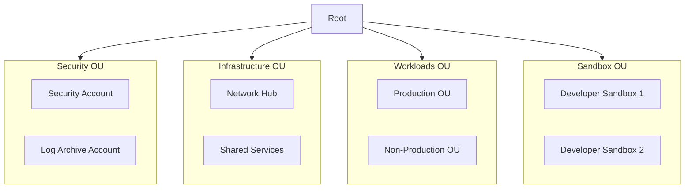

# Estrategia de Cuentas Múltiples {#estrategia-de-cuentas-multiples}

Este documento describe la estrategia de cuentas múltiples y la estructura de Unidades Organizativas (OU).

## ¿Por qué Cuentas Múltiples? {#por-que-cuentas-multiples}

- **Reducción del Radio de Impacto**: Los problemas en una cuenta no afectan a las demás.
- **Asignación de Costos**: Atribución clara de costos por carga de trabajo/equipo.
- **Límites de Seguridad**: Políticas IAM limitadas a una sola cuenta.
- **Cumplimiento**: Más fácil de lograr el cumplimiento con entornos aislados.
- **Cuotas**: Cada cuenta tiene sus propias cuotas de servicio.

## ¿Por qué esta Estructura de OU? {#por-que-esta-estructura-de-ou}

### Separación de la OU de Seguridad {#separacion-de-la-ou-de-seguridad}
- **Registros inmutables**: Log Archive aislado de las cargas de trabajo.
- **Administrador delegado**: La cuenta de Security gestiona los servicios de seguridad.
- **Radio de impacto**: El compromiso de una carga de trabajo no puede afectar a la seguridad.

### División entre Infraestructura y Cargas de Trabajo {#division-entre-infraestructura-y-cargas-de-trabajo}
- **Diferente velocidad de cambio**: La infraestructura cambia con menos frecuencia.
- **Diferentes patrones de acceso**: Equipo de plataforma frente a equipos de aplicaciones.
- **Granularidad de SCP**: Diferentes políticas para infraestructura frente a cargas de trabajo.

### ¿Por qué una OU de Sandbox? {#por-que-una-ou-de-sandbox}
- **Productividad del desarrollador**: Experimentación rápida sin aprobación.
- **Control de costos**: Los límites presupuestarios evitan gastos descontrolados.
- **Entorno de aprendizaje**: Lugar seguro para probar nuevos servicios.
- **Aislamiento**: Los problemas en Sandbox no afectan a otros entornos.

## Estructura de Unidades Organizativas {#estructura-de-unidades-organizativas}



## Detalles de las OU {#detalles-de-las-ou}

### Security OU {#security-ou}

Contiene cuentas con privilegios de seguridad elevados e infraestructura de registro.

| Cuenta | Propósito |
|---------|---------|
| Security | Administrador delegado para servicios de seguridad |
| Log Archive | Almacenamiento de registros inmutable |

**SCPs Aplicadas**:
- Denegar la modificación de CloudTrail
- Denegar la eliminación de recursos de seguridad
- Requerir cifrado en reposo

### Infrastructure OU {#infrastructure-ou}

Contiene cuentas de infraestructura compartida.

| Cuenta | Propósito |
|---------|---------|
| Network Hub | Transit Gateway, DNS, VPCs compartidas |
| Shared Services | CI/CD, registros de contenedores, artefactos |

**SCPs Aplicadas**:
- Restringir a regiones aprobadas
- Requerir etiquetado (tagging)

### Workloads OU {#workloads-ou}

Contiene cuentas de carga de trabajo de aplicaciones organizadas por entorno.

**Sub-OUs**:
- **Production**: Cargas de trabajo de producción con controles estrictos.
- **Non-Production**: Entornos de staging, QA, desarrollo.

**SCPs Aplicadas**:
- Restricciones de región
- Restricciones de servicio por entorno
- Etiquetado obligatorio

### Sandbox OU {#sandbox-ou}

Cuentas individuales de desarrolladores con controles relajados para la experimentación.

**SCPs Aplicadas**:
- Límites presupuestarios
- Denegar servicios costosos (instancias p4d, etc.)
- Políticas de limpieza automática

## Convención de Nombres de Cuentas {#convencion-de-nombres-de-cuentas}

```
<org>-<environment>-<workload>

Ejemplos:
- acme-prod-ecommerce
- acme-dev-analytics
- acme-shared-cicd
```

## Venta de Cuentas {#venta-de-cuentas}

Las nuevas cuentas se aprovisionan a través de [Account Factory for Terraform (AFT)](../modules/aft).

Consulte el [Runbook de Venta de Cuentas](../runbooks/account-vending) para obtener instrucciones paso a paso.
