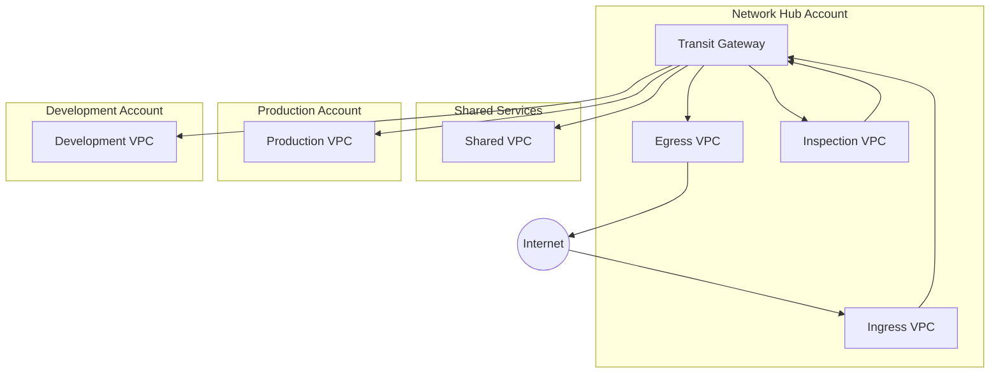
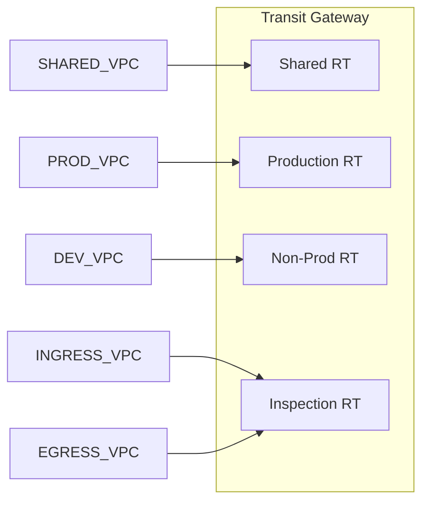
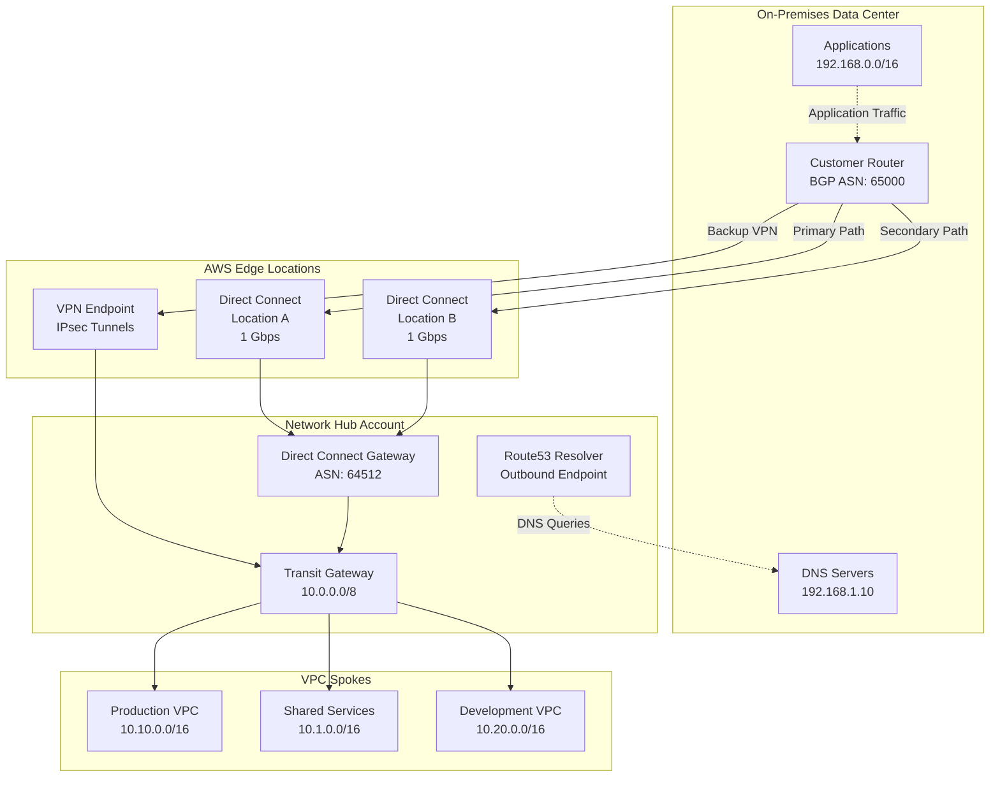
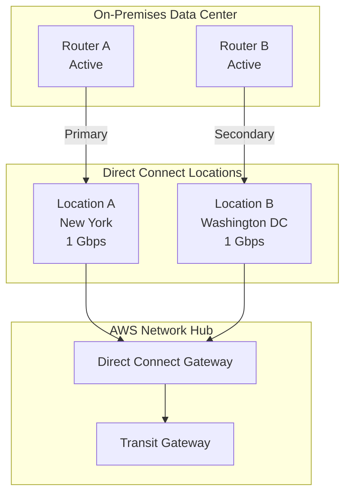
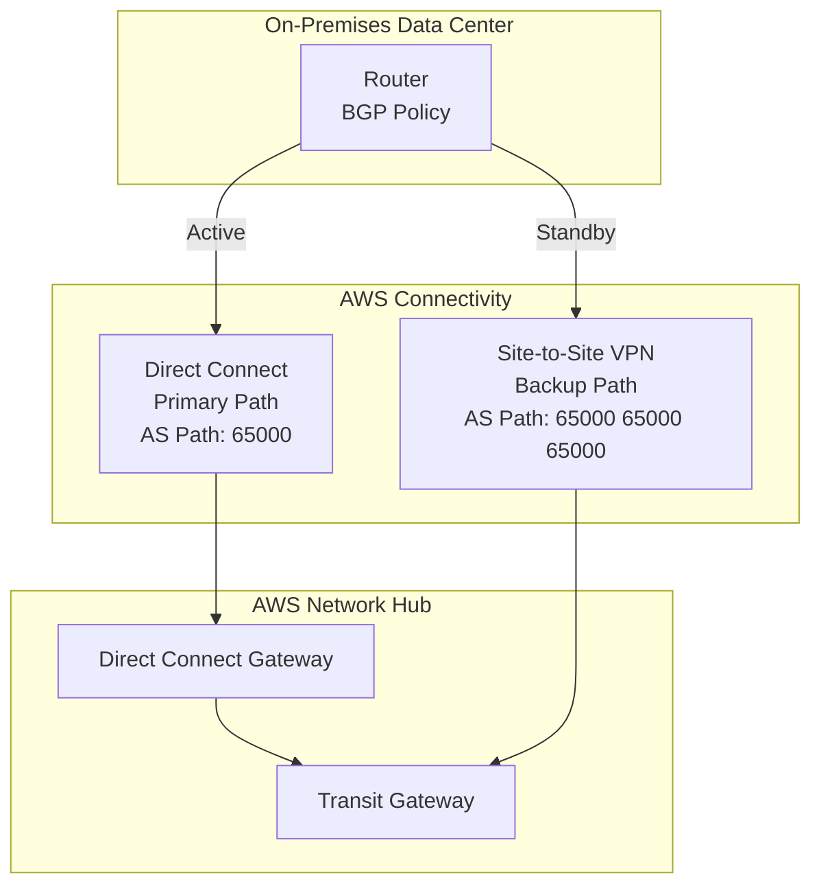
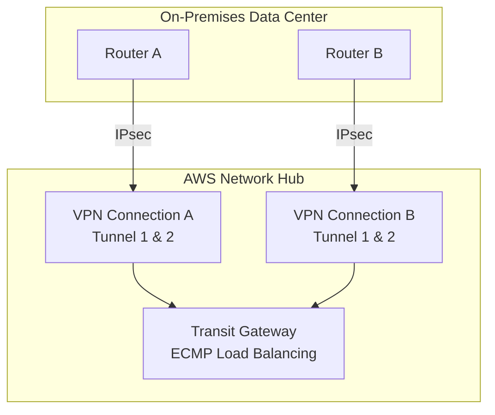
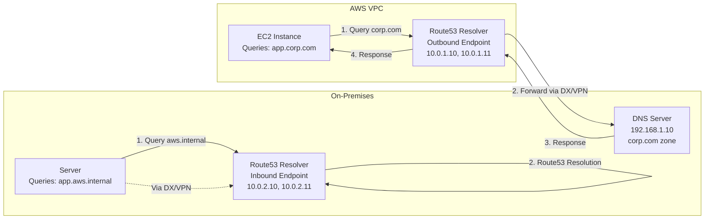

# Diseño de Red {#diseno-de-red}

Este documento describe la arquitectura de red utilizando una topología hub-and-spoke de Transit Gateway.

## Topología de Red {#topologia-de-red}



## Justificación de Decisiones {#justificacion-de-decisiones}

### ¿Por qué Transit Gateway en lugar de VPC Peering? {#por-que-transit-gateway-en-lugar-de-vpc-peering}
- **Escalabilidad**: El VPC peering crea N*(N-1)/2 conexiones; TGW escala linealmente.
- **Enrutamiento centralizado**: Punto único para la gestión de rutas.
- **Inspección de tráfico**: Permite una VPC de inspección centralizada.
- **Costo a escala**: Más económico a partir de 5-10 VPCs.
- **Conectividad híbrida**: Punto de conexión único para Direct Connect/VPN.

### ¿Por qué una VPC de Inspección Centralizada? {#por-que-una-vpc-de-inspeccion-centralizada}
- **Seguridad consistente**: Todo el tráfico es inspeccionado por las mismas reglas.
- **Eficiencia de costos**: Despliegue único de Network Firewall.
- **Gestión simplificada**: Un solo lugar para actualizar las reglas.
- **Cumplimiento**: Más fácil de demostrar la inspección de tráfico.
- **Compromiso**: Añade latencia (~1-2ms) para el tráfico entre VPCs.

### ¿Por qué estas asignaciones de CIDR? {#por-que-estas-asignaciones-de-cidr}
- **/16 por VPC**: Permite 65,536 IPs, espacio para el crecimiento.
- **Rangos 10.x.0.0**: RFC1918 privado, sin conflicto con rangos corporativos comunes.
- **Rangos separados por entorno**: Evita el enrutamiento accidental entre prod/no-prod.
- **Rango de sandbox grande (10.100-199)**: Acomoda muchas cuentas de desarrolladores.

### ¿Por qué Hub-and-Spoke en lugar de Full Mesh? {#por-que-hub-and-spoke-en-lugar-de-full-mesh}
- **Enrutamiento simplificado**: Rutas gestionadas centralmente.
- **Límites de seguridad**: El tráfico debe atravesar el hub para su inspección.
- **Simplicidad operativa**: Más fácil de solucionar problemas.
- **Costo**: Se necesitan menos archivos adjuntos (attachments) de TGW.

## Diseño de VPC {#diseno-de-vpc}

### Asignación de CIDR {#asignacion-de-cidr}

| Entorno | Bloque CIDR | Notas |
|-------------|------------|-------|
| Network Hub | 10.0.0.0/16 | Redes compartidas |
| Shared Services | 10.1.0.0/16 | CI/CD, ECR |
| Production | 10.10.0.0/16 - 10.19.0.0/16 | Cargas de trabajo de producción |
| Non-Production | 10.20.0.0/16 - 10.29.0.0/16 | Dev, staging, QA |
| Sandbox | 10.100.0.0/16 - 10.199.0.0/16 | Sandboxes de desarrolladores |

### Estrategia de Subredes {#estrategia-de-subredes}

Cada VPC utiliza un diseño de subred consistente:

```
VPC: 10.x.0.0/16
├── Subredes Públicas:     10.x.0.0/20, 10.x.16.0/20, 10.x.32.0/20
├── Subredes Privadas:    10.x.48.0/20, 10.x.64.0/20, 10.x.80.0/20
├── Subredes de Base de Datos:   10.x.96.0/20, 10.x.112.0/20, 10.x.128.0/20
└── Subredes de Tránsito:    10.x.144.0/20, 10.x.160.0/20, 10.x.176.0/20
```

## Transit Gateway {#transit-gateway}

### Tablas de Rutas {#tablas-de-rutas}

| Tabla de Rutas | Propósito | Propagaciones |
|-------------|---------|--------------|
| Shared | Acceso a servicios compartidos | Todas las VPCs |
| Production | Aislamiento de producción | VPCs de Prod, Shared |
| Non-Production | Dev/staging | VPCs de No-prod, Shared |
| Inspection | Inspección de tráfico | Egress, Ingress |

### Asociaciones de Tablas de Rutas {#asociaciones-de-tablas-de-rutas}



## Arquitectura de DNS {#arquitectura-de-dns}

### Zonas Hospedadas Privadas de Route53 {#zonas-hospedadas-privadas-de-route53}

- Zona hospedada privada central en Network Hub.
- Compartida en todas las cuentas a través de RAM.
- Resolver endpoints para DNS híbrido.

```
aws.internal (Zona Privada)
├── shared.aws.internal  → Shared Services
├── prod.aws.internal    → Production
└── dev.aws.internal     → Development
```

### Flujo de Resolución de DNS {#flujo-de-resolucion-de-dns}

1. La instancia EC2 consulta el DNS de la VPC (AmazonProvidedDNS).
2. Route53 Resolver comprueba las zonas hospedadas privadas.
3. Si no se encuentra, reenvía al DNS on-premises (si está configurado).
4. Recurre a la resolución de DNS pública.

## Opciones de Conectividad {#opciones-de-conectividad}

### Acceso a Internet {#acceso-a-internet}

- **Salida (Egress)**: NAT Gateways centralizados en la VPC de Egress.
- **Entrada (Ingress)**: Application Load Balancers en la VPC de Ingress.
- **Internet Directo**: Solo en cuentas de sandbox (opcional).

### Conectividad Híbrida {#conectividad-hibrida}

Conecte los centros de datos on-premises a AWS utilizando Direct Connect (fibra dedicada) o Site-to-Site VPN (cifrado a través de internet). Esta sección cubre la configuración, los patrones de alta disponibilidad y las mejores prácticas operativas.

#### Descripción General de la Arquitectura {#descripcion-general-de-la-arquitectura-hibrida}



#### Configuración de Direct Connect {#configuracion-de-direct-connect}

AWS Direct Connect proporciona conexiones de red dedicadas desde las instalaciones on-premises a AWS, ofreciendo un rendimiento de red consistente y costos de ancho de banda reducidos.

##### Requisitos Previos {#requisitos-previos-dx}

Antes de configurar Direct Connect:

1. **Requisitos Físicos**
   - Espacio en rack en una ubicación de Direct Connect o instalación de un socio.
   - Cable de fibra óptica monomodo (longitud de onda de 1310 nm).
   - Router compatible con soporte BGP.

2. **Requisitos de AWS**
   - Carta de Autorización y Asignación de Instalación de Conexión (LOA-CFA) de AWS.
   - Orden de conexión cruzada con el proveedor de coubicación.
   - ASN de BGP para su red (pública o privada).

3. **Planificación de Red**
   - ID de VLAN para la interfaz virtual (1-4094).
   - Direcciones IP de peering BGP (/30 o /31 de 169.254.0.0/16).
   - Estrategia de anuncio de rutas.

##### Componentes {#componentes-dx}

| Componente | Propósito | Límites |
|-----------|---------|--------|
| **Direct Connect Connection** | Enlace físico de 1/10/100 Gbps en la ubicación DX | Se recomienda 1 por ubicación |
| **Virtual Interface (VIF)** | Conexión lógica de Capa 3 sobre el enlace físico | 50 VIFs privadas por conexión |
| **Direct Connect Gateway** | Gateway multirregión para conexión TGW/VGW | 10 asociaciones TGW por gateway |
| **Transit VIF** | Tipo de VIF específicamente para Transit Gateway | Requiere BGP, sin rutas estáticas |

##### Configuración de Terraform {#configuracion-terraform-dx}

**Paso 1: Crear el Direct Connect Gateway**

```hcl
resource "aws_dx_gateway" "main" {
  name            = "acme-dx-gateway"
  amazon_side_asn = "64512"  # Must be private ASN (64512-65534 or 4200000000-4294967294)
  
  tags = {
    Name        = "acme-dx-gateway"
    Environment = "production"
    ManagedBy   = "terraform"
  }
}
```

**Paso 2: Asociar el Direct Connect Gateway con el Transit Gateway**

```hcl
resource "aws_dx_gateway_association" "tgw" {
  dx_gateway_id         = aws_dx_gateway.main.id
  associated_gateway_id = aws_ec2_transit_gateway.main.id

  # Allowed prefixes advertised from AWS to on-premises
  allowed_prefixes = [
    "10.0.0.0/16",     # Network Hub
    "10.1.0.0/16",     # Shared Services
    "10.10.0.0/16",    # Production
    "10.20.0.0/16",    # Non-Production
  ]
  
  # Optional: Proposal timeout for manual approval
  # proposal_timeout_minutes = 60
}
```

**Paso 3: Crear la Interfaz Virtual de Tránsito (Transit VIF)**

```hcl
resource "aws_dx_transit_virtual_interface" "primary" {
  connection_id = aws_dx_connection.primary.id
  dx_gateway_id = aws_dx_gateway.main.id
  
  name           = "acme-transit-vif-primary"
  vlan           = 100
  address_family = "ipv4"
  bgp_asn        = 65000  # Customer BGP ASN
  
  # BGP peering addresses (AWS assigns if omitted)
  amazon_address   = "169.254.100.1/30"
  customer_address = "169.254.100.2/30"
  
  # BGP authentication (recommended)
  bgp_auth_key = random_password.bgp_key.result
  
  # Jumbo frames (MTU 9001)
  mtu = 9001
  
  tags = {
    Name = "acme-transit-vif-primary"
  }
}

# Generate secure BGP authentication key
resource "random_password" "bgp_key" {
  length  = 32
  special = false
}
```

**Paso 4: Configurar el Router On-Premises**

Descargue la configuración del router desde la Consola de AWS:
1. Navegue a Direct Connect > Virtual Interfaces.
2. Seleccione su VIF y haga clic en "Download Configuration".
3. Elija el proveedor de su router (Cisco, Juniper, Palo Alto, etc.).
4. Aplique la configuración a su router.

Ejemplo de configuración BGP (Cisco IOS):
```
router bgp 65000
 neighbor 169.254.100.1 remote-as 64512
 neighbor 169.254.100.1 password <bgp-auth-key>
 address-family ipv4
  network 192.168.0.0 mask 255.255.0.0
  neighbor 169.254.100.1 activate
 exit-address-family
```

#### Configuración de Site-to-Site VPN {#configuracion-site-to-site-vpn}

AWS Site-to-Site VPN crea túneles IPsec cifrados a través de internet, proporcionando una configuración rápida y una conectividad rentable.

##### Cuándo usar VPN {#cuando-usar-vpn}

| Escenario | Recomendación |
|----------|----------------|
| **Respaldo para Direct Connect** | Recomendado - proporciona una ruta de failover |
| **Necesidad de configuración rápida** | VPN lista en horas frente a semanas para DX |
| **Ancho de banda < 1.25 Gbps** | VPN suficiente, DX puede ser excesivo |
| **Sensible al costo** | VPN más barata para tráfico bajo-moderado |
| **Pruebas/Desarrollo** | VPN adecuada para no-producción |
| **Conectividad temporal** | VPN ideal para necesidades a corto plazo |

##### Configuración de Terraform {#configuracion-terraform-vpn}

**Paso 1: Crear el Customer Gateway**

```hcl
resource "aws_customer_gateway" "main" {
  bgp_asn    = 65000
  ip_address = "203.0.113.1"  # On-premises router public IP
  type       = "ipsec.1"

  tags = {
    Name = "acme-on-prem-router"
  }
}

# For redundancy, create second customer gateway
resource "aws_customer_gateway" "secondary" {
  bgp_asn    = 65000
  ip_address = "203.0.113.2"  # Secondary router public IP
  type       = "ipsec.1"

  tags = {
    Name = "acme-on-prem-router-secondary"
  }
}
```

**Paso 2: Crear la Conexión VPN al Transit Gateway**

```hcl
resource "aws_vpn_connection" "main" {
  customer_gateway_id = aws_customer_gateway.main.id
  transit_gateway_id  = aws_ec2_transit_gateway.main.id
  type                = "ipsec.1"
  
  # Use BGP for dynamic routing (recommended)
  static_routes_only = false
  
  # Enable acceleration for improved performance (additional cost)
  enable_acceleration = false
  
  # Tunnel options for both tunnels
  tunnel1_inside_cidr   = "169.254.10.0/30"
  tunnel1_preshared_key = random_password.vpn_tunnel1.result
  
  tunnel2_inside_cidr   = "169.254.10.4/30"
  tunnel2_preshared_key = random_password.vpn_tunnel2.result

  tags = {
    Name = "acme-vpn-primary"
  }
}

# Generate secure pre-shared keys
resource "random_password" "vpn_tunnel1" {
  length  = 32
  special = false
}

resource "random_password" "vpn_tunnel2" {
  length  = 32
  special = false
}
```

**Paso 3: Adjuntar la VPN a la Tabla de Rutas del Transit Gateway**

```hcl
resource "aws_ec2_transit_gateway_route_table_association" "vpn" {
  transit_gateway_attachment_id  = aws_vpn_connection.main.transit_gateway_attachment_id
  transit_gateway_route_table_id = aws_ec2_transit_gateway_route_table.shared.id
}
```

**Paso 4: Configurar el Router On-Premises**

Descargue la configuración de VPN desde la Consola de AWS y aplíquela a su router. Cada conexión VPN proporciona dos túneles para redundancia.

#### Patrones de Alta Disponibilidad {#patrones-de-alta-disponibilidad}

##### Patrón 1: Dual Direct Connect (Recomendado para Producción) {#patron-1-dual-dx}



**Características:**
- Dos conexiones físicas en diferentes ubicaciones DX.
- Sobrevive a la falla de una sola ubicación o conexión.
- Distribución de tráfico activo-activo a través de BGP ECMP.
- Máxima fiabilidad (SLA del 99.99% alcanzable).

**Implementación en Terraform:**

```hcl
# Primary Direct Connect at Location A
resource "aws_dx_connection" "primary" {
  name      = "acme-dx-primary"
  bandwidth = "1Gbps"
  location  = "EqDC2"  # Equinix DC2 (example)
  
  tags = {
    Name = "acme-dx-primary"
    Site = "location-a"
  }
}

# Secondary Direct Connect at Location B
resource "aws_dx_connection" "secondary" {
  name      = "acme-dx-secondary"
  bandwidth = "1Gbps"
  location  = "EqDC10"  # Equinix DC10 (example)
  
  tags = {
    Name = "acme-dx-secondary"
    Site = "location-b"
  }
}

# Transit VIFs for both connections
resource "aws_dx_transit_virtual_interface" "primary" {
  connection_id = aws_dx_connection.primary.id
  dx_gateway_id = aws_dx_gateway.main.id
  name          = "acme-transit-vif-primary"
  vlan          = 100
  bgp_asn       = 65000
  mtu           = 9001
}

resource "aws_dx_transit_virtual_interface" "secondary" {
  connection_id = aws_dx_connection.secondary.id
  dx_gateway_id = aws_dx_gateway.main.id
  name          = "acme-transit-vif-secondary"
  vlan          = 101
  bgp_asn       = 65000
  mtu           = 9001
}
```

##### Patrón 2: Direct Connect + Respaldo VPN {#patron-2-dx-vpn}



**Características:**
- Direct Connect para el tráfico primario (baja latencia, alto ancho de banda).
- La VPN se activa automáticamente ante una falla de DX.
- El prepending de AS path de BGP hace que la VPN sea menos preferida.
- Solución de HA rentable.

**Configuración de BGP para Failover:**

Configuración del router on-premises (ejemplo de Cisco IOS):
```
# Route-map to prepend AS path for VPN (make it less preferred)
route-map VPN_BACKUP permit 10
 set as-path prepend 65000 65000 65000

router bgp 65000
 # Direct Connect neighbor (preferred)
 neighbor 169.254.100.1 remote-as 64512
 neighbor 169.254.100.1 activate
 
 # VPN neighbor (backup with AS path prepending)
 neighbor 169.254.10.1 remote-as 64512
 neighbor 169.254.10.1 route-map VPN_BACKUP out
 neighbor 169.254.10.1 activate
```

**Implementación en Terraform:**

```hcl
# Direct Connect (primary)
resource "aws_dx_transit_virtual_interface" "primary" {
  connection_id = aws_dx_connection.main.id
  dx_gateway_id = aws_dx_gateway.main.id
  name          = "acme-transit-vif"
  vlan          = 100
  bgp_asn       = 65000
  mtu           = 9001
}

# VPN (backup)
resource "aws_vpn_connection" "backup" {
  customer_gateway_id = aws_customer_gateway.main.id
  transit_gateway_id  = aws_ec2_transit_gateway.main.id
  type                = "ipsec.1"
  static_routes_only  = false
  
  tags = {
    Name = "acme-vpn-backup"
    Role = "backup-for-dx"
  }
}
```

##### Patrón 3: VPN Activo-Activo {#patron-3-vpn-activo-activo}



**Características:**
- Dos conexiones VPN desde diferentes routers.
- Cuatro túneles IPsec en total (2 por conexión).
- Equilibrio de carga ECMP a través de los túneles.
- Sobrevive a la falla de un solo router o túnel.
- Ancho de banda máximo de VPN: ~5 Gbps (4 túneles × 1.25 Gbps).

**Implementación en Terraform:**

```hcl
# Primary VPN connection
resource "aws_vpn_connection" "primary" {
  customer_gateway_id = aws_customer_gateway.main.id
  transit_gateway_id  = aws_ec2_transit_gateway.main.id
  type                = "ipsec.1"
  static_routes_only  = false
  
  tunnel1_inside_cidr = "169.254.10.0/30"
  tunnel2_inside_cidr = "169.254.10.4/30"
  
  tags = {
    Name = "acme-vpn-primary"
  }
}

# Secondary VPN connection
resource "aws_vpn_connection" "secondary" {
  customer_gateway_id = aws_customer_gateway.secondary.id
  transit_gateway_id  = aws_ec2_transit_gateway.main.id
  type                = "ipsec.1"
  static_routes_only  = false
  
  tunnel1_inside_cidr = "169.254.10.8/30"
  tunnel2_inside_cidr = "169.254.10.12/30"
  
  tags = {
    Name = "acme-vpn-secondary"
  }
}

# Enable ECMP on Transit Gateway
resource "aws_ec2_transit_gateway" "main" {
  description                     = "Main Transit Gateway"
  default_route_table_association = "disable"
  default_route_table_propagation = "disable"
  vpn_ecmp_support               = "enable"  # Enable ECMP for VPN
  
  tags = {
    Name = "acme-tgw"
  }
}
```

#### Consideraciones de Enrutamiento BGP {#consideraciones-enrutamiento-bgp}

##### Estrategia de Anuncio de Rutas {#estrategia-anuncio-rutas}

**De On-Premises a AWS:**
```
Anunciar:
- CIDRs de la red on-premises (ej. 192.168.0.0/16)
- Subredes del centro de datos
- Rangos de la red corporativa

NO anunciar:
- Ruta por defecto (0.0.0.0/0) a menos que sea intencional
- Rangos CIDR de AWS (causa bucles de enrutamiento)
- Rutas de internet pública
```

**De AWS a On-Premises:**
```
Anunciar:
- CIDRs de VPC a través de la propagación de rutas de Transit Gateway
- Prefijos permitidos (allowed_prefixes) configurados en el DX Gateway
- Subredes específicas si se utiliza filtrado de rutas

NO anunciar:
- Todo el 10.0.0.0/8 a menos que sea necesario
- Rangos superpuestos con on-premises
```

##### Preferencia de Ruta con Atributos BGP {#preferencia-ruta-bgp}

| Atributo BGP | Prioridad | Caso de Uso | Ejemplo |
|---------------|----------|----------|---------|
| **AS Path Length** | 1 (más alta) | Preferir Direct Connect sobre VPN | DX: AS 65000<br/>VPN: AS 65000 65000 65000 |
| **Local Preference** | 2 | Preferencia de enrutamiento interno | Establecer un valor más alto para la ruta preferida |
| **MED (Multi-Exit Discriminator)** | 3 | Preferir una ubicación DX específica | Ubicación A: MED 100<br/>Ubicación B: MED 200 |
| **Weight** | 4 (específico de Cisco) | Preferencia local del router | Mayor peso = más preferido |

**Ejemplo: Preferir Direct Connect sobre VPN**

```
# On-premises router (Cisco IOS)
route-map PREFER_DX permit 10
 set local-preference 200

route-map BACKUP_VPN permit 10
 set local-preference 100
 set as-path prepend 65000 65000 65000

router bgp 65000
 neighbor 169.254.100.1 route-map PREFER_DX in    # Direct Connect
 neighbor 169.254.10.1 route-map BACKUP_VPN in    # VPN
```

##### Comunidades BGP (Avanzado) {#comunidades-bgp}

Utilice comunidades BGP para etiquetar rutas para el enrutamiento basado en políticas:

```hcl
# Example: Tag production routes differently
# On-premises router configuration:
# route-map TAG_PROD permit 10
#  match ip address prefix-list PROD_NETWORKS
#  set community 65000:100
# route-map TAG_DEV permit 20
#  match ip address prefix-list DEV_NETWORKS
#  set community 65000:200
```

#### Integración de DNS {#integracion-dns}

Habilite una resolución de DNS fluida entre AWS y las redes on-premises utilizando Route53 Resolver.

##### Arquitectura {#arquitectura-dns-hibrida}



##### Configuración de Terraform {#configuracion-terraform-dns}

**Paso 1: Crear el Grupo de Seguridad para los Resolver Endpoints**

```hcl
resource "aws_security_group" "resolver" {
  name        = "route53-resolver-endpoints"
  description = "Allow DNS traffic for Route53 Resolver"
  vpc_id      = aws_vpc.network_hub.id

  ingress {
    description = "DNS from on-premises"
    from_port   = 53
    to_port     = 53
    protocol    = "tcp"
    cidr_blocks = ["192.168.0.0/16"]  # On-premises CIDR
  }

  ingress {
    description = "DNS from on-premises"
    from_port   = 53
    to_port     = 53
    protocol    = "udp"
    cidr_blocks = ["192.168.0.0/16"]
  }

  egress {
    description = "DNS to on-premises"
    from_port   = 53
    to_port     = 53
    protocol    = "tcp"
    cidr_blocks = ["192.168.0.0/16"]
  }

  egress {
    description = "DNS to on-premises"
    from_port   = 53
    to_port     = 53
    protocol    = "udp"
    cidr_blocks = ["192.168.0.0/16"]
  }

  tags = {
    Name = "route53-resolver-sg"
  }
}
```

**Paso 2: Crear el Resolver Endpoint de Salida (AWS a On-Premises)**

```hcl
resource "aws_route53_resolver_endpoint" "outbound" {
  name      = "outbound-to-onprem"
  direction = "OUTBOUND"

  security_group_ids = [aws_security_group.resolver.id]

  # Deploy in at least 2 AZs for high availability
  ip_address {
    subnet_id = aws_subnet.resolver_a.id
    ip        = "10.0.1.10"  # Optional: specify IP
  }
  
  ip_address {
    subnet_id = aws_subnet.resolver_b.id
    ip        = "10.0.1.11"
  }

  tags = {
    Name = "outbound-resolver"
  }
}
```

**Paso 3: Crear Reglas de Reenvío**

```hcl
# Forward on-premises domain to on-premises DNS
resource "aws_route53_resolver_rule" "onprem" {
  domain_name          = "corp.example.com"
  name                 = "forward-to-onprem"
  rule_type            = "FORWARD"
  resolver_endpoint_id = aws_route53_resolver_endpoint.outbound.id

  # Primary on-premises DNS server
  target_ip {
    ip   = "192.168.1.10"
    port = 53
  }
  
  # Secondary on-premises DNS server
  target_ip {
    ip   = "192.168.1.11"
    port = 53
  }

  tags = {
    Name = "forward-corp-domain"
  }
}

# Share resolver rule with other accounts via RAM
resource "aws_ram_resource_share" "resolver_rule" {
  name                      = "resolver-rule-share"
  allow_external_principals = false

  tags = {
    Name = "resolver-rule-share"
  }
}

resource "aws_ram_resource_association" "resolver_rule" {
  resource_arn       = aws_route53_resolver_rule.onprem.arn
  resource_share_arn = aws_ram_resource_share.resolver_rule.arn
}

resource "aws_ram_principal_association" "org" {
  principal          = "arn:aws:organizations::123456789012:organization/o-xxxxx"
  resource_share_arn = aws_ram_resource_share.resolver_rule.arn
}
```

**Paso 4: Crear el Resolver Endpoint de Entrada (On-Premises a AWS)**

```hcl
resource "aws_route53_resolver_endpoint" "inbound" {
  name      = "inbound-from-onprem"
  direction = "INBOUND"

  security_group_ids = [aws_security_group.resolver.id]

  ip_address {
    subnet_id = aws_subnet.resolver_a.id
    ip        = "10.0.2.10"
  }
  
  ip_address {
    subnet_id = aws_subnet.resolver_b.id
    ip        = "10.0.2.11"
  }

  tags = {
    Name = "inbound-resolver"
  }
}

# Output IPs for on-premises DNS configuration
output "resolver_inbound_ips" {
  description = "Configure these IPs as forwarders in on-premises DNS"
  value       = aws_route53_resolver_endpoint.inbound.ip_address[*].ip
}
```

**Paso 5: Configurar el DNS On-Premises**

Añada reenviadores condicionales en su DNS on-premises (ejemplo para Windows DNS):
```powershell
# Forward AWS private zone to Route53 Resolver inbound endpoint
Add-DnsServerConditionalForwarderZone -Name "aws.internal" -MasterServers 10.0.2.10,10.0.2.11
```

#### Monitoreo de Conexiones Híbridas {#monitoreo-conexiones-hibridas}

##### Métricas Clave y Umbrales {#metricas-umbrales}

| Métrica | Espacio de Nombres | Umbral | Acción |
|--------|-----------|-----------|--------|
| **ConnectionState** | AWS/DX | != 1 (disponible) | Alertar + investigar conexión física |
| **ConnectionBpsEgress** | AWS/DX | > 80% del ancho de banda | Considerar actualizar la conexión |
| **ConnectionBpsIngress** | AWS/DX | > 80% del ancho de banda | Considerar actualizar la conexión |
| **VpnTunnelState** | AWS/VPN | != 1 (UP) | Alertar + comprobar configuración del túnel |
| **TunnelDataIn** | AWS/VPN | == 0 por > 5 min | Posible problema de enrutamiento |
| **TunnelDataOut** | AWS/VPN | == 0 por > 5 min | Posible problema de enrutamiento |
| **VirtualInterfaceState** | AWS/DX | != disponible | Alertar + comprobar configuración de VIF |
| **VirtualInterfaceBpsEgress** | AWS/DX | > 80% del ancho de banda de VIF | Considerar VIF adicional |

##### Alarmas de CloudWatch {#alarmas-cloudwatch}

**Monitoreo de la Conexión Direct Connect:**

```hcl
resource "aws_cloudwatch_metric_alarm" "dx_connection_down" {
  alarm_name          = "dx-connection-down"
  comparison_operator = "LessThanThreshold"
  evaluation_periods  = 2
  metric_name         = "ConnectionState"
  namespace           = "AWS/DX"
  period              = 60
  statistic           = "Minimum"
  threshold           = 1
  alarm_description   = "Direct Connect connection is down"
  treat_missing_data  = "breaching"
  
  dimensions = {
    ConnectionId = aws_dx_connection.primary.id
  }
  
  alarm_actions = [aws_sns_topic.network_alerts.arn]
}

resource "aws_cloudwatch_metric_alarm" "dx_bandwidth_high" {
  alarm_name          = "dx-bandwidth-high"
  comparison_operator = "GreaterThanThreshold"
  evaluation_periods  = 3
  metric_name         = "ConnectionBpsEgress"
  namespace           = "AWS/DX"
  period              = 300
  statistic           = "Average"
  threshold           = 800000000  # 800 Mbps for 1 Gbps connection (80%)
  alarm_description   = "Direct Connect bandwidth utilization high"
  
  dimensions = {
    ConnectionId = aws_dx_connection.primary.id
  }
  
  alarm_actions = [aws_sns_topic.network_alerts.arn]
}
```

**Monitoreo del Túnel VPN:**

```hcl
resource "aws_cloudwatch_metric_alarm" "vpn_tunnel_down" {
  alarm_name          = "vpn-tunnel-down"
  comparison_operator = "LessThanThreshold"
  evaluation_periods  = 2
  metric_name         = "TunnelState"
  namespace           = "AWS/VPN"
  period              = 60
  statistic           = "Maximum"
  threshold           = 1
  alarm_description   = "VPN tunnel is down"
  treat_missing_data  = "breaching"
  
  dimensions = {
    VpnId = aws_vpn_connection.main.id
  }
  
  alarm_actions = [aws_sns_topic.network_alerts.arn]
}

resource "aws_cloudwatch_metric_alarm" "vpn_no_traffic" {
  alarm_name          = "vpn-no-traffic"
  comparison_operator = "LessThanThreshold"
  evaluation_periods  = 3
  metric_name         = "TunnelDataIn"
  namespace           = "AWS/VPN"
  period              = 300
  statistic           = "Sum"
  threshold           = 1000  # Less than 1KB in 5 minutes
  alarm_description   = "VPN tunnel has no inbound traffic"
  
  dimensions = {
    VpnId = aws_vpn_connection.main.id
  }
  
  alarm_actions = [aws_sns_topic.network_alerts.arn]
}
```

**Monitoreo de la Sesión BGP:**

```hcl
resource "aws_cloudwatch_metric_alarm" "bgp_session_down" {
  alarm_name          = "bgp-session-down"
  comparison_operator = "LessThanThreshold"
  evaluation_periods  = 2
  metric_name         = "VirtualInterfaceBpsEgress"
  namespace           = "AWS/DX"
  period              = 60
  statistic           = "Sum"
  threshold           = 1
  alarm_description   = "BGP session appears down (no traffic)"
  treat_missing_data  = "breaching"
  
  dimensions = {
    VirtualInterfaceId = aws_dx_transit_virtual_interface.primary.id
  }
  
  alarm_actions = [aws_sns_topic.network_alerts.arn]
}
```

##### Tema SNS para Alertas {#tema-sns-alertas}

```hcl
resource "aws_sns_topic" "network_alerts" {
  name = "network-hybrid-connectivity-alerts"
  
  tags = {
    Name = "network-alerts"
  }
}

resource "aws_sns_topic_subscription" "email" {
  topic_arn = aws_sns_topic.network_alerts.arn
  protocol  = "email"
  endpoint  = "network-team@example.com"
}

# Optional: Send to Slack, PagerDuty, etc.
resource "aws_sns_topic_subscription" "lambda" {
  topic_arn = aws_sns_topic.network_alerts.arn
  protocol  = "lambda"
  endpoint  = aws_lambda_function.alert_forwarder.arn
}
```

### VPC Endpoints {#vpc-endpoints}

VPC endpoints centralizados en Shared Services:
- S3 (Gateway)
- DynamoDB (Gateway)
- ECR, CloudWatch, SSM, etc. (Interface)

## Grupos de Seguridad {#grupos-de-seguridad}

### Grupos de Seguridad Estándar {#grupos-de-seguridad-estandar}

| Nombre | Propósito | Entrada (Ingress) |
|------|---------|---------|
| `allow-internal` | Comunicación interna | CIDR de la VPC |
| `allow-tgw` | Transit Gateway | CIDR de TGW |
| `allow-alb` | Objetivos de ALB | SG de ALB |
| `allow-bastion` | Acceso de Bastión | SG de Bastión |

## Monitoreo de Red {#monitoreo-de-red}

- VPC Flow Logs → Log Archive S3.
- Transit Gateway Flow Logs.
- Métricas de CloudWatch para TGW.
- Network Manager (opcional).

Consulte el [Módulo de Redes](../modules/networking) para obtener detalles de la implementación.
