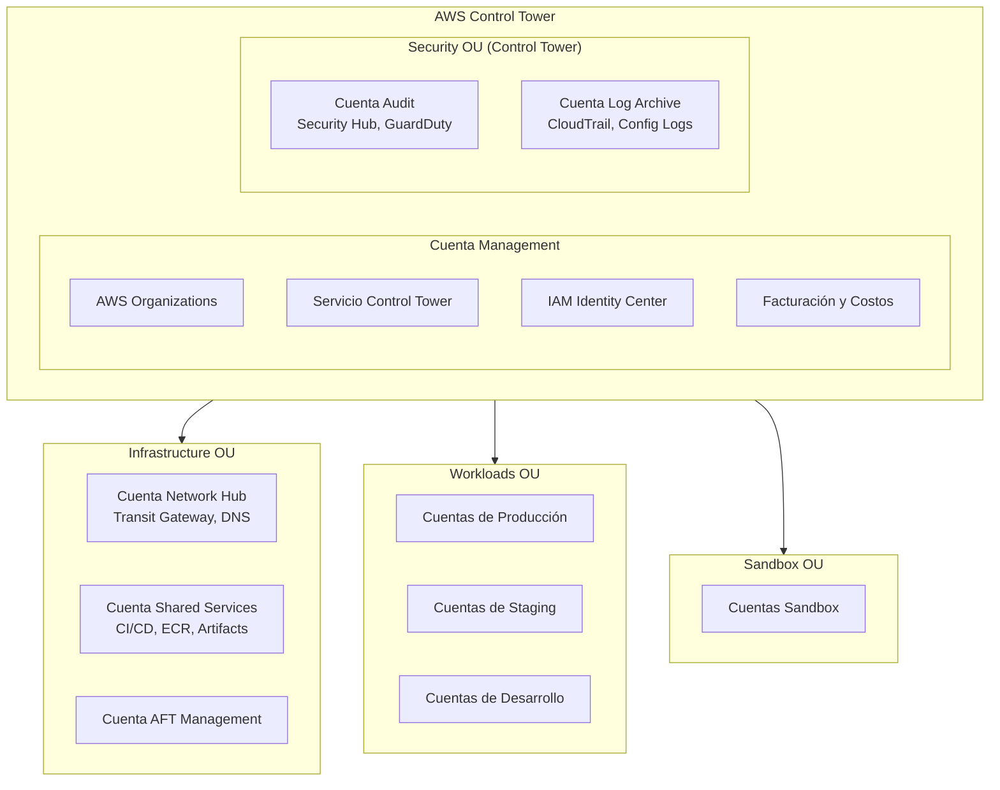

# Descripción General de la Arquitectura

Esta plantilla implementa una AWS Landing Zone construida sobre **AWS Control Tower** con personalizaciones extendidas a través de **Account Factory for Terraform (AFT)**. Sigue las mejores prácticas de AWS para arquitectura multi-cuenta.

## Base: AWS Control Tower

AWS Control Tower proporciona la landing zone fundamental:

- **AWS Organizations** - Estructura multi-cuenta
- **Unidades Organizativas (OUs)** - Security, Infrastructure, Sandbox, Workloads
- **Guardrails** - Controles preventivos y detectivos (SCPs + Config Rules)
- **Cuentas Core** - Management, Log Archive, Audit (Security)
- **IAM Identity Center** - Gestión de acceso centralizada
- **Account Factory** - Aprovisionamiento estandarizado de cuentas

:::info Control Tower Primero
Esta plantilla asume que Control Tower ya está desplegado. **Extendemos** las capacidades de Control Tower en lugar de reemplazarlas.
:::

## Principios de Diseño

1. **Control Tower como Base**: Aprovechar Control Tower para gobernanza, no duplicar
2. **Extender, No Reemplazar**: Añadir personalizaciones sobre la línea base de Control Tower
3. **AFT para Venta de Cuentas**: Usar Account Factory for Terraform para aprovisionamiento automatizado
4. **Terraform para Personalizaciones**: Infraestructura más allá del alcance de Control Tower
5. **Flujo de Trabajo GitOps**: Todos los cambios a través de repositorios con control de versiones

## Estructura de Cuentas



## Qué Gestiona Control Tower vs. Qué Personalizamos

| Aspecto | Control Tower Gestiona | Terraform Personaliza |
|---------|----------------------|---------------------|
| **Organizations** | ✅ Crea y gestiona | ❌ Solo usa data sources |
| **OUs Core** | ✅ Security, Infrastructure, Sandbox | ➕ OUs adicionales si es necesario |
| **Cuentas Core** | ✅ Log Archive, Audit | ➕ Network Hub, Shared Services |
| **Guardrails** | ✅ Obligatorios + Muy Recomendados | ➕ SCPs personalizados |
| **Línea Base de Cuenta** | ✅ CloudTrail, Config, roles IAM | ➕ Herramientas de seguridad adicionales |
| **Venta de Cuentas** | ✅ Account Factory | ✅ AFT (extiende Account Factory) |

## Cuentas Core

| Cuenta | Gestionada Por | Propósito | Servicios Clave |
|---------|------------|---------|--------------|
| **Management** | Control Tower | Raíz de organización, facturación | Organizations, Control Tower, IAM Identity Center |
| **Log Archive** | Control Tower | Registro centralizado | S3 (CloudTrail, Config, VPC Flow Logs) |
| **Audit** | Control Tower | Monitoreo de seguridad | GuardDuty, Security Hub, Config aggregator |
| **Network Hub** | Terraform/AFT | Conectividad de red | Transit Gateway, Route53, VPCs |
| **Shared Services** | Terraform/AFT | Servicios comunes | ECR, pipelines CI/CD, Artifacts |
| **AFT Management** | AFT | Account Factory for Terraform | CodePipeline, Step Functions, DynamoDB |

## Modelo de Despliegue

```mermaid
flowchart LR
    subgraph Prerequisites["Prerrequisitos"]
        CT[Desplegar Control Tower]
        SSO[Configurar IAM Identity Center]
    end
    
    subgraph AFT_Deploy["Despliegue AFT"]
        AFT_ACCT[Crear Cuenta AFT Management]
        AFT_SETUP[Desplegar Módulo AFT]
    end
    
    subgraph Customizations["Personalizaciones"]
        GLOBAL[Personalizaciones Globales<br/>Todas las cuentas]
        ACCT_CUSTOM[Personalizaciones de Cuenta<br/>Por tipo de cuenta]
    end
    
    subgraph Workloads["Cargas de Trabajo"]
        VEND[Aprovisionar Nuevas Cuentas]
        DEPLOY[Desplegar Workloads]
    end
    
    Prerequisites --> AFT_Deploy
    AFT_Deploy --> Customizations
    Customizations --> Workloads
```



## Estructura del Repositorio

```
aws-landing-zone-template/
├── terraform/
│   ├── control-tower/         # Data sources y referencias de Control Tower
│   ├── aft/                   # Account Factory for Terraform
│   │   ├── aft-setup/         # Despliegue de infraestructura AFT
│   │   ├── aft-account-request/           # Definiciones de cuentas
│   │   ├── aft-global-customizations/     # Aplicado a todas las cuentas
│   │   └── aft-account-customizations/    # Personalizaciones por tipo de cuenta
│   ├── network/               # Recursos de cuenta Network Hub
│   ├── shared-services/       # Recursos de cuenta Shared Services
│   └── modules/               # Módulos Terraform reutilizables
├── docs/                      # Este sitio de documentación
└── scripts/                   # Scripts de despliegue y ayuda
```

## Próximos Pasos

- [Configuración de Control Tower](./control-tower) - Prerrequisitos y despliegue de Control Tower
- [Estrategia Multi-Cuenta](./multi-account) - Estructura de OUs y diseño de cuentas
- [Modelo de Seguridad](./security-model) - Guardrails y controles de seguridad
- [Diseño de Red](./network-design) - Topología de red y conectividad
