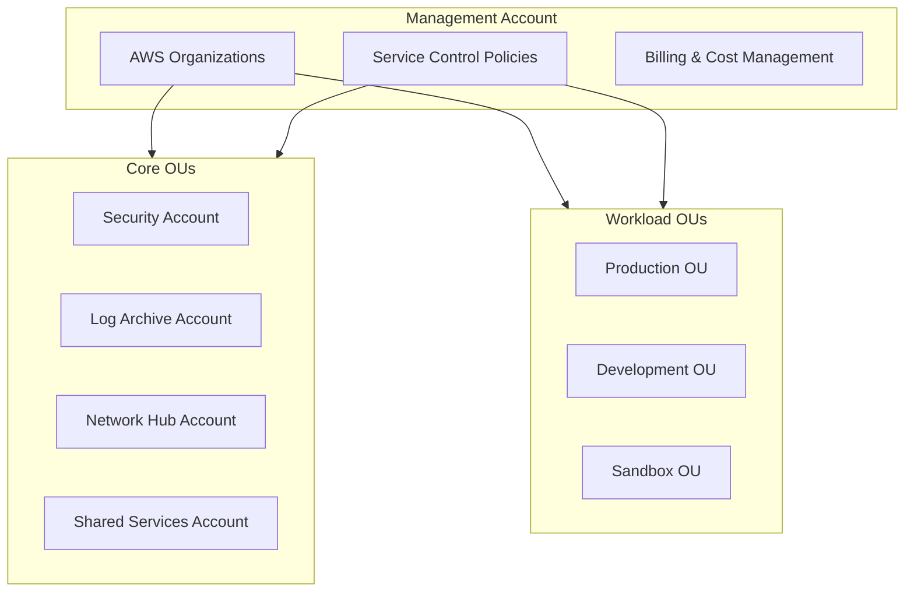

# Descripción General de la Arquitectura {#descripcion-general-de-la-arquitectura}

Este documento proporciona una descripción general de alto nivel de la arquitectura de AWS Landing Zone implementada en esta plantilla.

## Principios de Diseño {#principios-de-diseno}

1. **Estrategia de Cuentas Múltiples**: Cuentas AWS separadas para diferentes cargas de trabajo y entornos.
2. **Seguridad por Defecto**: SCPs, GuardDuty, Security Hub habilitados desde el primer día.
3. **Aislamiento de Red**: Topología hub-and-spoke de Transit Gateway con enrutamiento controlado.
4. **Registro Centralizado**: Todos los registros (logs) agregados en una cuenta dedicada de Log Archive.
5. **Venta de Cuentas**: Aprovisionamiento automatizado de cuentas a través de Account Factory for Terraform (AFT).

## Estructura de Cuentas {#estructura-de-cuentas}



## Cuentas Principales {#cuentas-principales}

| Cuenta | Propósito | Servicios Clave |
|---------|---------|--------------|
| **Management** | Raíz de la organización, facturación, SCPs | AWS Organizations, IAM Identity Center |
| **Security** | Herramientas de seguridad y monitoreo | GuardDuty, Security Hub, Config |
| **Log Archive** | Registro centralizado | S3, CloudTrail, VPC Flow Logs |
| **Network Hub** | Conectividad de red | Transit Gateway, Route53, VPCs |
| **Shared Services** | Servicios comunes | ECR, CI/CD, Artifacts |

## Estructura de Terraform {#estructura-de-terraform}

```
terraform/
├── organization/      # Management account
├── security/          # Security account
├── log-archive/       # Log Archive account
├── network/           # Network Hub account
├── shared-services/   # Shared Services account
├── aft/               # Account Factory for Terraform
└── modules/           # Reusable modules
```

## Próximos Pasos {#proximos-pasos}

- [Estrategia de Cuentas Múltiples](./multi-account) - Diseño detallado de OUs y cuentas
- [Modelo de Seguridad](./security-model) - Controles de seguridad y cumplimiento
- [Diseño de Red](./network-design) - Topología de red y conectividad
