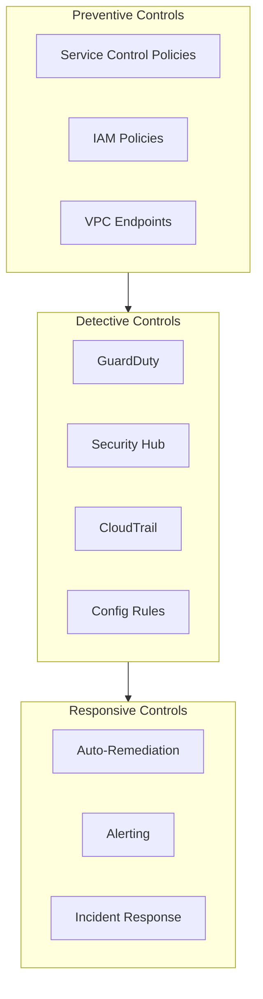

# Modelo de Seguridad {#modelo-de-seguridad}

Este documento describe la arquitectura de seguridad y los controles implementados en la Landing Zone.

## Defensa en Profundidad {#defensa-en-profundidad}



## Service Control Policies (SCPs) {#service-control-policies-scps}

Las SCPs proporcionan guardrails a nivel de organización.

### Políticas de Raíz {#politicas-de-raiz}

Aplicadas a todas las cuentas:

```hcl
# Deny leaving organization
{
  "Effect": "Deny",
  "Action": "organizations:LeaveOrganization",
  "Resource": "*"
}

# Require IMDSv2
{
  "Effect": "Deny",
  "Action": "ec2:RunInstances",
  "Resource": "arn:aws:ec2:*:*:instance/*",
  "Condition": {
    "StringNotEquals": {
      "ec2:MetadataHttpTokens": "required"
    }
  }
}
```

### Políticas Específicas de OU {#politicas-especificas-de-ou}

Consulte el [Módulo de Políticas SCP](../modules/organization#scp-policies) para obtener la lista completa.

## IAM Identity Center {#iam-identity-center}

Gestión de identidad centralizada utilizando IAM Identity Center (sucesor de AWS SSO).

### Conjuntos de Permisos (Permission Sets) {#conjuntos-de-permisos}

| Permission Set | Nivel de Acceso | OUs de Destino |
|----------------|--------------|------------|
| AdministratorAccess | Administrador total | Todas |
| PowerUserAccess | Acceso de desarrollador | No-producción |
| ReadOnlyAccess | Solo lectura | Todas |
| SecurityAudit | Auditoría de seguridad | Todas |

## Servicios de Seguridad {#servicios-de-seguridad}

### GuardDuty {#guardduty}

- Habilitado en el administrador delegado (Cuenta de Security).
- Todas las cuentas inscritas automáticamente.
- Hallazgos (findings) agregados centralmente.
- Protección de S3 y EKS habilitada.

### Security Hub {#security-hub}

- CIS AWS Foundations Benchmark.
- AWS Foundational Security Best Practices.
- Estándares personalizados para la organización.

### CloudTrail {#cloudtrail}

- Trail de organización en la cuenta Management.
- Registros almacenados en la cuenta de Log Archive.
- Validación de archivos de registro habilitada.
- Cifrado con KMS.

### AWS Config {#aws-config}

- Agregador de Config a nivel de toda la organización.
- Reglas gestionadas para el cumplimiento.
- Reglas personalizadas para las políticas de la organización.

## Seguridad de Red {#seguridad-de-red}

Consulte el [Diseño de Red](./network-design) para conocer los controles de seguridad a nivel de red.

## Mapeo de Cumplimiento {#mapeo-de-cumplimiento}

| Marco de Trabajo | Controles Clave |
|-----------|--------------|
| CIS Benchmark | CloudTrail, Config, GuardDuty, MFA |
| SOC 2 | Controles de acceso, registro, cifrado |
| HIPAA | Cifrado, registro de acceso, BAA |
| PCI DSS | Segmentación de red, cifrado, registro |

## Respuesta a Incidentes {#respuesta-a-incidentes}

1. Un hallazgo de GuardDuty activa una notificación SNS.
2. Una función Lambda crea un hallazgo en Security Hub.
3. El equipo de seguridad recibe una alerta de PagerDuty.
4. Se ejecuta el runbook para tipos de incidentes conocidos.
5. Revisión y documentación post-incidente.

Consulte el [Runbook de Solución de Problemas](../runbooks/troubleshooting) para problemas de seguridad comunes.
