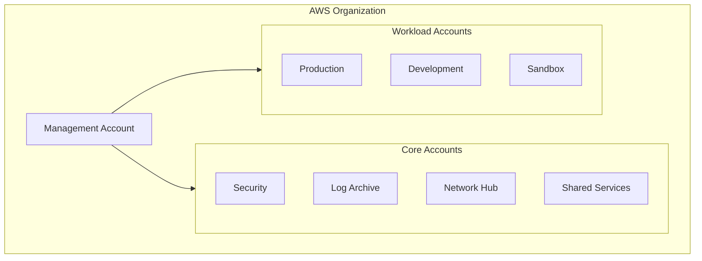

# Introducción {#introduccion}

Bienvenido a la documentación de **AWS Landing Zone Template**. Esta plantilla proporciona una base lista para producción para desplegar una AWS Organization de múltiples cuentas utilizando Terraform.

## ¿Qué es una Landing Zone? {#que-es-una-landing-zone}

Una Landing Zone es un entorno AWS de múltiples cuentas bien arquitectado que proporciona:

- **Seguridad**: Guardrails, monitoreo y cumplimiento desde el primer día
- **Gobernanza**: Políticas centralizadas y gestión de cuentas
- **Redes**: Arquitectura de red escalable y segura
- **Gestión de Costos**: Asignación clara de costos y controles presupuestarios
- **Automatización**: Infraestructura como Código (IaC) con flujos de trabajo GitOps

## Arquitectura de un Vistazo {#arquitectura-de-un-vistazo}



## Características Clave {#caracteristicas-clave}

| Característica | Descripción |
|---------|-------------|
| **Multi-Account** | Entornos aislados con límites claros |
| **Security Baseline** | GuardDuty, Security Hub, Config, CloudTrail |
| **Network Hub** | Transit Gateway con entrada/salida centralizada |
| **Account Vending** | Aprovisionamiento automatizado a través de AFT |
| **Documentación** | Este sitio de Docusaurus, desplegado a través de SST |

## Inicio Rápido {#inicio-rapido}

### Requisitos Previos {#requisitos-previos}

- AWS CLI v2 configurado con acceso a la cuenta Management
- Terraform >= 1.5.0
- Node.js >= 20 (para la documentación)
- Beads CLI (para el seguimiento de tareas)

### Configuración {#configuracion}

```bash
# Clone the repository
git clone https://github.com/your-org/aws-landing-zone-template.git
cd aws-landing-zone-template

# Run setup script
./scripts/setup.sh

# View available tasks
bd ready
```

### Despliegue {#despliegue}

Siga el [Runbook de Despliegue](./runbooks/deployment) para obtener instrucciones paso a paso.

## Estructura del Repositorio {#estructura-del-repositorio}

```
aws-landing-zone-template/
├── terraform/
│   ├── organization/      # AWS Organizations, SCPs
│   ├── security/          # GuardDuty, Security Hub
│   ├── log-archive/       # CloudTrail, Config logs
│   ├── network/           # Transit Gateway, VPCs
│   ├── shared-services/   # CI/CD, ECR
│   ├── aft/               # Account Factory
│   └── modules/           # Reusable modules
│ ├── docs/                  # This documentation (Docusaurus)
│ ├── infra/                 # SST infrastructure for docs
│ └── scripts/               # Helper scripts
```

## Próximos Pasos {#proximos-pasos}

<div className="row">
  <div className="col col--6">
    <div className="card">
      <div className="card__header">
        <h3>📐 Arquitectura</h3>
      </div>
      <div className="card__body">
        <p>Comprenda el diseño de múltiples cuentas, el modelo de seguridad y la topología de red.</p>
      </div>
      <div className="card__footer">
        <a className="button button--primary button--block" href="./architecture/overview">Ver Arquitectura</a>
      </div>
    </div>
  </div>
  <div className="col col--6">
    <div className="card">
      <div className="card__header">
        <h3>🚀 Despliegue</h3>
      </div>
      <div className="card__body">
        <p>Guía paso a paso para desplegar la Landing Zone en su entorno AWS.</p>
      </div>
      <div className="card__footer">
        <a className="button button--primary button--block" href="./runbooks/deployment">Desplegar Ahora</a>
      </div>
    </div>
  </div>
</div>

## Contribución {#contribucion}

Este es un repositorio de plantilla. Para personalizar:

1. Realice un Fork/clon de este repositorio
2. Actualice los archivos `terraform.tfvars` con sus valores
3. Modifique los módulos según sea necesario para su organización
4. Despliegue siguiendo los runbooks

## Soporte {#soporte}

- [GitHub Issues](https://github.com/your-org/aws-landing-zone-template/issues)
- [AWS Documentation](https://docs.aws.amazon.com/)
- [Terraform AWS Provider](https://registry.terraform.io/providers/hashicorp/aws/latest/docs)
