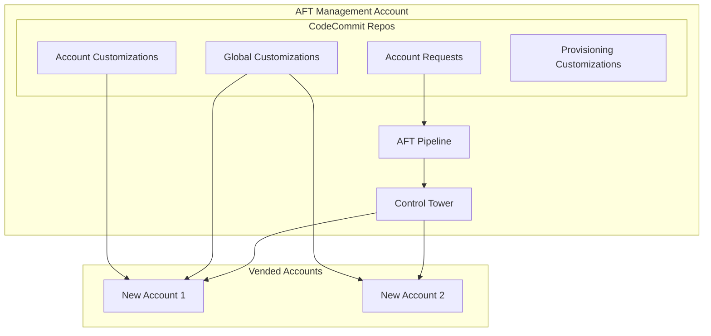

# Account Factory for Terraform (AFT) {#account-factory-for-terraform-aft}

AFT automatiza el aprovisionamiento y la personalización de cuentas de AWS en su organización.

## Descripción General {#overview}

Account Factory for Terraform (AFT) proporciona:

- Aprovisionamiento automatizado de cuentas
- Pipelines de personalización de cuentas
- Personalizaciones globales (aplicadas a todas las cuentas)
- Personalizaciones específicas por cuenta
- Flujo de trabajo basado en GitOps

## ¿Por qué AFT frente a otras alternativas? {#why-aft-over-alternatives}

### AFT vs Control Tower Account Factory (Consola) {#aft-vs-control-tower-account-factory-console}
| Aspecto | AFT | Consola de CT |
|---------|-----|------------|
| Automatización | GitOps completo | Clics manuales |
| Personalización | Basada en Terraform | Limitada |
| Auditabilidad | Historial de Git | Solo CloudTrail |
| Escalabilidad | Maneja cientos de cuentas | Cuello de botella manual |
| Reproducibilidad | Infraestructura como Código | No reproducible |

### AFT vs Aprovisionamiento de Cuentas Personalizado {#aft-vs-custom-account-vending}
- **Mantenido por AWS**: Se actualiza con los cambios de Control Tower.
- **Patrones probados**: Utilizado por AWS Professional Services.
- **Integración**: Integración nativa con CT, sin Lambdas personalizadas.
- **Soporte**: Soporte de AWS disponible.

### Cuándo NO usar AFT {#when-not-to-use-aft}
- **Organizaciones muy pequeñas** (&lt;10 cuentas): La sobrecarga puede no valer la pena.
- **Sin Control Tower**: AFT requiere Control Tower.
- **Necesidades simples**: Si solo se necesitan cuentas básicas, la consola de CT puede ser suficiente.

### Desventajas de AFT {#trade-offs-of-aft}
- **Complejidad**: Curva de aprendizaje para Terraform + AFT.
- **Tiempo del pipeline**: El aprovisionamiento de cuentas tarda entre 20 y 30 minutos.
- **Depuración**: Los fallos en el pipeline requieren conocimientos de CodePipeline.

## Arquitectura {#architecture}



## Estructura de Directorios {#directory-structure}

```
terraform/aft/
├── aft-setup/                    # Configuración de la infraestructura de AFT
├── account-requests/             # Definiciones de solicitudes de cuenta
├── aft-global-customizations/    # Aplicado a TODAS las cuentas
├── aft-account-customizations/   # Específico por cuenta
└── aft-account-provisioning/     # Post-aprovisionamiento
```

## Uso {#usage}

### 1. Configuración de AFT {#aft-setup}

Despliegue la infraestructura de AFT en la cuenta de gestión de AFT:

```hcl
module "aft" {
  source = "github.com/aws-ia/terraform-aws-control_tower_account_factory"

  # Control Tower settings
  ct_management_account_id    = "123456789012"
  log_archive_account_id      = "234567890123"
  audit_account_id            = "345678901234"
  aft_management_account_id   = "456789012345"
  ct_home_region              = "us-east-1"

  # VCS settings
  vcs_provider                = "codecommit"
  account_request_repo_name   = "aft-account-request"
  global_customizations_repo_name = "aft-global-customizations"
  account_customizations_repo_name = "aft-account-customizations"
  account_provisioning_customizations_repo_name = "aft-account-provisioning"

  # Terraform settings
  terraform_version           = "1.5.0"
  terraform_distribution      = "oss"
}
```

### 2. Solicitud de Cuenta {#account-request}

Cree una nueva cuenta añadiéndola a `account-requests/terraform/`:

```hcl
# prod-ecommerce.tf
module "prod_ecommerce" {
  source = "./modules/aft-account-request"

  control_tower_parameters = {
    AccountEmail              = "aws+prod-ecommerce@acme.com"
    AccountName               = "acme-prod-ecommerce"
    ManagedOrganizationalUnit = "Production"
    SSOUserEmail              = "platform-team@acme.com"
    SSOUserFirstName          = "Platform"
    SSOUserLastName           = "Team"
  }

  account_tags = {
    Environment = "production"
    CostCenter  = "ecommerce-123"
    Team        = "platform"
  }

  custom_fields = {
    workload_type = "ecommerce"
    data_classification = "confidential"
  }

  account_customizations_name = "PROD-ECOMMERCE"
}
```

### 3. Personalizaciones Globales {#global-customizations}

Aplicadas a TODAS las cuentas después del aprovisionamiento:

```hcl
# aft-global-customizations/terraform/main.tf

# IAM password policy
resource "aws_iam_account_password_policy" "strict" {
  minimum_password_length        = 14
  require_lowercase_characters   = true
  require_numbers                = true
  require_uppercase_characters   = true
  require_symbols                = true
  allow_users_to_change_password = true
  max_password_age               = 90
  password_reuse_prevention      = 24
}

# Default EBS encryption
resource "aws_ebs_encryption_by_default" "enabled" {
  enabled = true
}

# S3 public access block (account level)
resource "aws_s3_account_public_access_block" "block" {
  block_public_acls       = true
  block_public_policy     = true
  ignore_public_acls      = true
  restrict_public_buckets = true
}
```

### 4. Personalizaciones Específicas por Cuenta {#account-specific-customizations}

Para cuentas específicas:

```hcl
# aft-account-customizations/PROD-ECOMMERCE/terraform/main.tf

# Workload-specific VPC
module "vpc" {
  source = "terraform-aws-modules/vpc/aws"

  name = "prod-ecommerce"
  cidr = "10.10.0.0/16"
  
  azs             = ["us-east-1a", "us-east-1b", "us-east-1c"]
  private_subnets = ["10.10.1.0/24", "10.10.2.0/24", "10.10.3.0/24"]
  public_subnets  = ["10.10.101.0/24", "10.10.102.0/24", "10.10.103.0/24"]

  enable_nat_gateway = true
  single_nat_gateway = false
}

# Transit Gateway attachment
resource "aws_ec2_transit_gateway_vpc_attachment" "tgw" {
  subnet_ids         = module.vpc.private_subnets
  transit_gateway_id = data.aws_ssm_parameter.tgw_id.value
  vpc_id             = module.vpc.vpc_id
}
```

## Flujo de Trabajo {#workflow}

1. **Solicitud**: El desarrollador envía un PR al repositorio de solicitudes de cuenta.
2. **Revisión**: El equipo de plataforma revisa y aprueba el PR.
3. **Fusión (Merge)**: La fusión del PR activa el pipeline de AFT.
4. **Aprovisionamiento**: Control Tower crea la cuenta.
5. **Línea Base**: Se aplican las personalizaciones globales.
6. **Personalización**: Se aplican las personalizaciones específicas de la cuenta.
7. **Notificación**: Se notifica al equipo que la cuenta está lista.

## Entradas (Configuración de AFT) {#inputs-aft-setup}

| Name | Description | Type | Required |
|------|-------------|------|----------|
| `ct_management_account_id` | ID de la cuenta de gestión | `string` | Yes |
| `log_archive_account_id` | ID de la cuenta de archivo de logs | `string` | Yes |
| `audit_account_id` | ID de la cuenta de auditoría | `string` | Yes |
| `aft_management_account_id` | ID de la cuenta de AFT | `string` | Yes |
| `ct_home_region` | Región de origen de Control Tower | `string` | Yes |
| `terraform_version` | Versión de Terraform | `string` | Yes |

## Patrones de Personalización Global {#global-customization-patterns}

Las personalizaciones globales se aplican a TODAS las cuentas después del aprovisionamiento. Manténgalas enfocadas en las líneas base de seguridad y cumplimiento.

### Línea Base de Seguridad {#security-baseline}

```hcl
# aft-global-customizations/terraform/security-baseline.tf

# IMDSv2 requirement
resource "aws_ec2_instance_metadata_defaults" "imdsv2" {
  http_tokens                 = "required"
  http_put_response_hop_limit = 1
}

# Default encryption for new EBS volumes
resource "aws_ebs_encryption_by_default" "enabled" {
  enabled = true
}

# Block public S3 buckets at account level
resource "aws_s3_account_public_access_block" "block_public" {
  block_public_acls       = true
  block_public_policy     = true
  ignore_public_acls      = true
  restrict_public_buckets = true
}

# IAM Access Analyzer
resource "aws_accessanalyzer_analyzer" "account" {
  analyzer_name = "account-analyzer"
  type          = "ACCOUNT"
}
```

### Línea Base de Redes {#networking-baseline}

```hcl
# aft-global-customizations/terraform/networking.tf

# Default VPC cleanup (opcional - elimina la VPC por defecto)
data "aws_vpc" "default" {
  default = true
}
```

### Aplicación de Etiquetas (Tagging) {#tagging-enforcement}

```hcl
# aft-global-customizations/terraform/tagging.tf

locals {
  required_tags = {
    Environment = var.environment
    ManagedBy   = "AFT"
    AccountId   = data.aws_caller_identity.current.account_id
  }
}
```

## Patrones de Personalización Específicos por Cuenta {#account-specific-customization-patterns}

Las personalizaciones específicas por cuenta le permiten aprovisionar recursos únicos para cada carga de trabajo.

### Cuenta de Carga de Trabajo de Producción {#production-workload-account}

```hcl
# aft-account-customizations/PROD-WORKLOAD/terraform/main.tf

# Production VPC with Transit Gateway attachment
module "vpc" {
  source  = "terraform-aws-modules/vpc/aws"
  version = "~> 5.0"

  name = "prod-workload"
  cidr = "10.10.0.0/16"

  azs             = ["us-east-1a", "us-east-1b", "us-east-1c"]
  private_subnets = ["10.10.1.0/24", "10.10.2.0/24", "10.10.3.0/24"]
  
  # No public subnets - egress via Transit Gateway
  enable_nat_gateway = false
}

# TGW attachment
resource "aws_ec2_transit_gateway_vpc_attachment" "main" {
  subnet_ids         = module.vpc.private_subnets
  transit_gateway_id = data.aws_ssm_parameter.tgw_id.value
  vpc_id             = module.vpc.vpc_id
  
  tags = {
    Name = "prod-workload-attachment"
  }
}
```

### Cuenta Sandbox de Desarrollador {#developer-sandbox-account}

```hcl
# aft-account-customizations/DEV-SANDBOX/terraform/main.tf

# Sandbox with direct internet access (for experimentation)
module "vpc" {
  source  = "terraform-aws-modules/vpc/aws"
  version = "~> 5.0"

  name = "sandbox"
  cidr = "10.100.0.0/16"

  azs             = ["us-east-1a", "us-east-1b"]
  private_subnets = ["10.100.1.0/24", "10.100.2.0/24"]
  public_subnets  = ["10.100.101.0/24", "10.100.102.0/24"]

  enable_nat_gateway = true
  single_nat_gateway = true  # Ahorro de costos para sandbox
}
```

## Uso de Campos Personalizados (Custom Fields) {#using-custom-fields}

Los campos personalizados permiten pasar metadatos desde las solicitudes de cuenta a las personalizaciones.

### Solicitud de Cuenta con Campos Personalizados {#account-request-with-custom-fields}

```hcl
# account-requests/terraform/prod-api.tf
module "prod_api" {
  source = "./modules/aft-account-request"

  control_tower_parameters = {
    AccountEmail              = "aws+prod-api@example.com"
    AccountName               = "prod-api"
    ManagedOrganizationalUnit = "Production"
    SSOUserEmail              = "platform@example.com"
    SSOUserFirstName          = "Platform"
    SSOUserLastName           = "Team"
  }

  custom_fields = {
    vpc_cidr            = "10.15.0.0/16"
    environment         = "production"
    data_classification = "confidential"
    backup_enabled      = "true"
    monitoring_level    = "enhanced"
  }
}
```

### Lectura de Campos Personalizados en Personalizaciones {#reading-custom-fields-in-customizations}

```hcl
# aft-account-customizations/PROD-API/terraform/main.tf

# Los campos personalizados están disponibles a través de parámetros de SSM
data "aws_ssm_parameter" "vpc_cidr" {
  name = "/aft/account-request/custom-fields/vpc_cidr"
}

data "aws_ssm_parameter" "environment" {
  name = "/aft/account-request/custom-fields/environment"
}
```

## Solución de Problemas {#troubleshooting}

### Problemas Comunes {#common-issues}

#### El pipeline falla en "Terraform Plan" {#pipeline-fails-at-terraform-plan}

**Síntomas**: CodePipeline falla durante la etapa de terraform plan.

**Causas Comunes**:
- Sintaxis de Terraform inválida.
- Falta la configuración del proveedor.
- El recurso ya existe.

**Resolución**:
1. Revise los logs de CodeBuild en la cuenta de AFT.
2. Busque el error específico de Terraform.
3. Corrija en el repositorio de personalización y vuelva a activar.

#### Cuenta atascada en "Enrolling" {#account-stuck-in-enrolling}

**Síntomas**: La cuenta muestra "Enrolling" en Control Tower durante más de 1 hora.

**Causas Comunes**:
- Límites de cuota de servicio.
- SCP bloqueando acciones requeridas.
- Correo electrónico ya en uso.

**Resolución**:
1. Revise la consola de Control Tower para ver errores.
2. Revise CloudTrail en la cuenta de gestión.
3. Verifique que el correo sea único y accesible.

## Mejores Prácticas {#best-practices}

1. **Use campos personalizados** para los metadatos de la carga de trabajo.
2. **Mantenga las personalizaciones globales al mínimo**: solo la línea base de seguridad.
3. **Control de versiones para todo**: flujo de trabajo GitOps.
4. **Pruebe en sandbox** antes de las cuentas de producción.
5. **Documente el propósito de las cuentas** en los archivos de solicitud.

## Relacionado {#related}

- [Guía Operativa de Aprovisionamiento de Cuentas](../runbooks/account-vending)
- [Arquitectura Multi-Cuenta](../architecture/multi-account)
- [Documentación de AWS AFT](https://docs.aws.amazon.com/controltower/latest/userguide/aft-overview.html)
