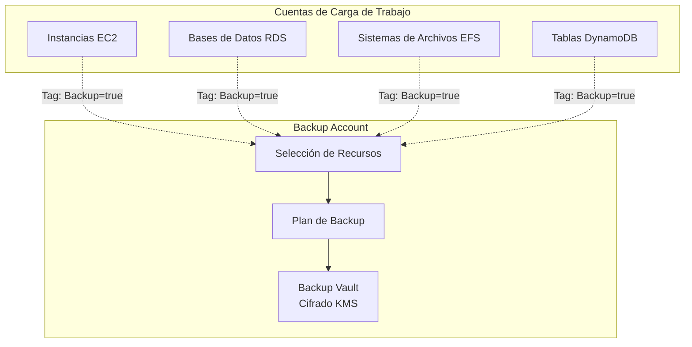

# Módulo de Backup {#backup-module}

El módulo de Backup crea recursos de AWS Backup para la gestión centralizada de copias de seguridad en la Landing Zone.

## Descripción General {#overview}

Este módulo se despliega en la **Log Archive Account** o una **Backup Account** dedicada y crea:

- Vaults de backup con cifrado KMS
- Planes de backup con programaciones configurables
- Selección de recursos basada en etiquetas
- Soporte para backup entre cuentas
- Roles de IAM con políticas administradas de AWS

## Arquitectura {#architecture}



## Uso {#usage}

```hcl
module "backup" {
  source = "../modules/backup"

  name_prefix = "production"
  kms_key_arn = aws_kms_key.backup.arn

  backup_rules = [
    {
      name         = "daily"
      schedule     = "cron(0 5 ? * * *)"
      delete_after = 35
    },
    {
      name               = "weekly"
      schedule           = "cron(0 5 ? * 1 *)"
      delete_after       = 90
      cold_storage_after = 30
    }
  ]

  selection_tags = [
    {
      key   = "Backup"
      value = "true"
    }
  ]

  tags = {
    Environment = "production"
    ManagedBy   = "terraform"
  }
}
```

## Entradas {#inputs}

| Nombre | Descripción | Tipo | Requerido |
|--------|-------------|------|-----------|
| `name_prefix` | Prefijo para nombres de recursos | `string` | Sí |
| `kms_key_arn` | ARN de la clave KMS para cifrado del vault | `string` | No |
| `enable_cross_account_backup` | Habilitar backup entre cuentas | `bool` | No |
| `source_account_ids` | IDs de cuentas permitidas para copiar backups | `list(string)` | No |
| `backup_rules` | Lista de reglas de backup | `list(object)` | No |
| `selection_tags` | Etiquetas para seleccionar recursos | `list(object)` | No |
| `resource_arns` | ARNs específicos de recursos a respaldar | `list(string)` | No |

## Salidas {#outputs}

| Nombre | Descripción |
|--------|-------------|
| `vault_arn` | ARN del vault de backup |
| `vault_name` | Nombre del vault de backup |
| `plan_id` | ID del plan de backup |
| `plan_arn` | ARN del plan de backup |
| `role_arn` | ARN del rol IAM de backup |

## Reglas de Backup {#backup-rules}

| Regla | Programación | Retención | Almacenamiento Frío |
|-------|--------------|-----------|---------------------|
| Diario | 5 AM UTC diario | 35 días | - |
| Semanal | 5 AM UTC Lunes | 90 días | Después de 30 días |
| Mensual | 5 AM UTC día 1 | 365 días | Después de 90 días |

## Backup Entre Cuentas {#cross-account-backup}

Para gestión centralizada de backups:

```hcl
module "backup_central" {
  source = "../modules/backup"

  name_prefix                 = "central"
  enable_cross_account_backup = true
  source_account_ids = [
    "111111111111",
    "222222222222"
  ]

  backup_rules = [
    {
      name         = "daily"
      schedule     = "cron(0 5 ? * * *)"
      delete_after = 35
    }
  ]
}
```

## Relacionado {#related}

- [Módulo de Log Archive](./log-archive)
- [Módulo de Storage](./storage)
- [Arquitectura de Protección de Datos](../architecture/data-protection)
