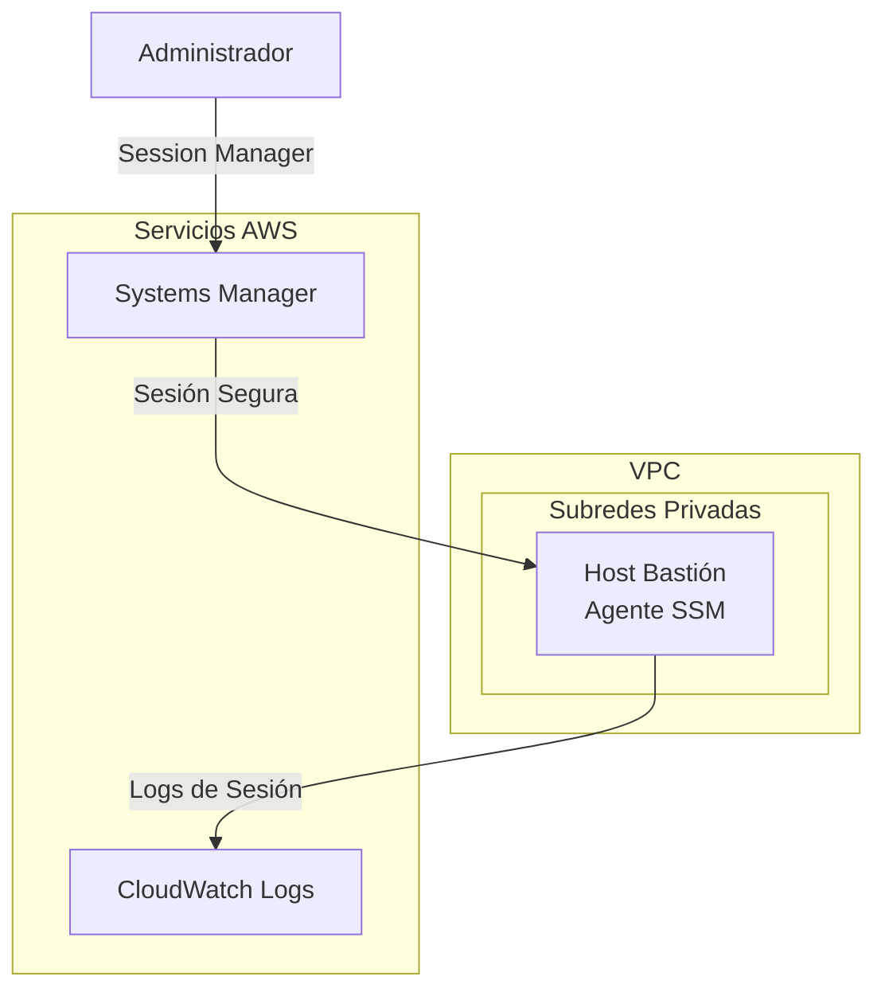

# Módulo de Compute {#compute-module}

El módulo de Compute crea recursos de cómputo seguros incluyendo hosts bastión con acceso SSM Session Manager.

## Descripción General {#overview}

Este módulo proporciona:

- **SSM Session Manager**: Sin necesidad de claves SSH, acceso seguro vía AWS Systems Manager
- **IMDSv2 Requerido**: Servicio de metadatos de instancia v2 obligatorio por seguridad
- **Volúmenes Cifrados**: Cifrado EBS habilitado por defecto
- **Sin IP Pública**: Despliegue en subred privada por defecto
- **Auto Scaling**: ASG opcional para alta disponibilidad
- **Registro de Sesiones**: Actividad de Session Manager registrada en CloudWatch

## Arquitectura {#architecture}



## Uso {#usage}

### Host Bastión Básico {#basic-bastion}

```hcl
module "compute" {
  source = "../modules/compute"

  name_prefix = "myorg"
  vpc_id      = module.vpc.vpc_id
  subnet_ids  = module.vpc.private_subnet_ids

  enable_bastion = true

  tags = {
    Environment = "production"
    ManagedBy   = "Terraform"
  }
}
```

### Alta Disponibilidad con Auto Scaling {#high-availability}

```hcl
module "compute" {
  source = "../modules/compute"

  name_prefix = "myorg"
  vpc_id      = module.vpc.vpc_id
  subnet_ids  = module.vpc.private_subnet_ids

  enable_bastion              = true
  enable_bastion_auto_scaling = true
  bastion_desired_capacity    = 2
  bastion_min_size            = 1
  bastion_max_size            = 3

  tags = {
    Environment = "production"
  }
}
```

## Entradas {#inputs}

| Nombre | Descripción | Tipo | Requerido |
|--------|-------------|------|-----------|
| `name_prefix` | Prefijo para nombres de recursos | `string` | Sí |
| `vpc_id` | ID de la VPC para despliegue | `string` | Sí |
| `subnet_ids` | IDs de subredes para el bastión | `list(string)` | Sí |
| `enable_bastion` | Habilitar host bastión | `bool` | No |
| `bastion_instance_type` | Tipo de instancia EC2 | `string` | No |
| `enable_bastion_auto_scaling` | Habilitar ASG para HA | `bool` | No |
| `enable_cloudwatch_agent` | Habilitar agente CloudWatch | `bool` | No |
| `enable_session_manager_logging` | Registrar sesiones SSM | `bool` | No |
| `enable_imdsv2` | Requerir IMDSv2 | `bool` | No |

## Salidas {#outputs}

| Nombre | Descripción |
|--------|-------------|
| `bastion_instance_id` | ID de la instancia EC2 |
| `bastion_private_ip` | Dirección IP privada |
| `bastion_security_group_id` | ID del grupo de seguridad |
| `bastion_iam_role_arn` | ARN del rol IAM |
| `ssm_connect_command` | Comando CLI para conectar |

## Conexión al Bastión {#connecting}

Use AWS Session Manager para conectar (sin SSH requerido):

```bash
# Usando AWS CLI
aws ssm start-session --target <instance-id>

# O use el comando de salida
terraform output ssm_connect_command
```

## Características de Seguridad {#security-features}

| Característica | Descripción |
|----------------|-------------|
| Sin Acceso SSH | El grupo de seguridad no tiene reglas de entrada |
| IMDSv2 Requerido | Previene ataques SSRF vía servicio de metadatos |
| Almacenamiento Cifrado | Volúmenes EBS cifrados por defecto |
| Despliegue Privado | Sin IP pública por defecto |
| Registro de Sesiones | Todas las sesiones registradas en CloudWatch |
| Permisos Mínimos | El rol IAM solo tiene permisos SSM |

## Relacionado {#related}

- [Módulo de VPC](./vpc)
- [Módulo de Security Baseline](./security-baseline)
- [Diseño de Red](../architecture/network-design)
