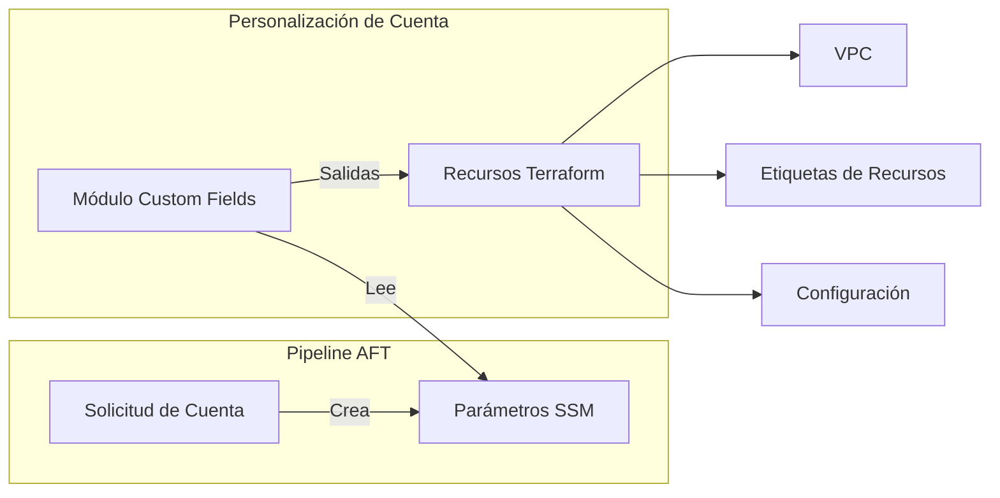

# Módulo de Custom Fields {#custom-fields-module}

El módulo de Custom Fields lee metadatos de solicitudes de cuentas AFT desde SSM Parameter Store para uso en blueprints de personalización de cuentas.

## Descripción General {#overview}

Este módulo se usa dentro de **AFT Account Customizations** para:

- Leer campos personalizados desde SSM Parameter Store
- Proporcionar salidas estructuradas para configuraciones de Terraform
- Generar etiquetas comunes desde metadatos de cuenta
- Soportar valores por defecto para campos faltantes

## Arquitectura {#architecture}



## Uso {#usage}

```hcl
module "custom_fields" {
  source = "../../modules/custom-fields"

  read_environment         = true
  read_vpc_cidr            = true
  read_cost_center         = true
  read_owner               = true
  read_data_classification = true
  read_backup_enabled      = true

  additional_custom_fields = ["project_code", "compliance_framework"]

  default_environment = "development"
  default_vpc_cidr    = "10.0.0.0/16"
}

resource "aws_vpc" "main" {
  cidr_block = module.custom_fields.vpc_cidr

  tags = merge(
    module.custom_fields.tags,
    {
      Name = "main-vpc"
    }
  )
}
```

## Entradas {#inputs}

| Nombre | Descripción | Tipo | Requerido |
|--------|-------------|------|-----------|
| `read_environment` | Leer campo personalizado environment | `bool` | No |
| `read_vpc_cidr` | Leer campo personalizado vpc_cidr | `bool` | No |
| `read_cost_center` | Leer campo personalizado cost_center | `bool` | No |
| `read_owner` | Leer campo personalizado owner | `bool` | No |
| `read_data_classification` | Leer campo personalizado data_classification | `bool` | No |
| `read_backup_enabled` | Leer campo personalizado backup_enabled | `bool` | No |
| `additional_custom_fields` | Nombres de campos personalizados adicionales | `list(string)` | No |
| `default_environment` | Entorno por defecto si no se especifica | `string` | No |
| `default_vpc_cidr` | CIDR de VPC por defecto si no se especifica | `string` | No |

## Salidas {#outputs}

| Nombre | Descripción |
|--------|-------------|
| `account_id` | ID de cuenta desde AFT |
| `environment` | Entorno (production, staging, development) |
| `vpc_cidr` | Bloque CIDR de VPC para esta cuenta |
| `cost_center` | Centro de costos para facturación |
| `owner` | Propietario de la cuenta |
| `data_classification` | Nivel de clasificación de datos |
| `backup_enabled` | Si el backup está habilitado |
| `custom_fields` | Mapa de campos personalizados adicionales |
| `tags` | Etiquetas comunes derivadas de campos personalizados |

## Estructura de Parámetros SSM {#ssm-parameter-structure}

AFT crea parámetros SSM en:

```
/aft/account-request/custom-fields/<nombre_campo>
```

### Campos Estándar {#standard-fields}

| Parámetro | Descripción | Ejemplo |
|-----------|-------------|---------|
| `environment` | Entorno de la cuenta | `production` |
| `vpc_cidr` | Asignación de CIDR de VPC | `10.1.0.0/16` |
| `cost_center` | Centro de costos de facturación | `CC-12345` |
| `owner` | Email del propietario de la cuenta | `team@example.com` |
| `data_classification` | Sensibilidad de datos | `confidential` |
| `backup_enabled` | Habilitar backups | `true` |

## Ejemplo de Solicitud de Cuenta {#account-request-example}

En su solicitud de cuenta AFT:

```hcl
module "account_request" {
  source = "./modules/aft-account-request"

  control_tower_parameters = {
    AccountEmail = "workload@example.com"
    AccountName  = "workload-prod"
    # ...
  }

  custom_fields = {
    environment         = "production"
    vpc_cidr            = "10.1.0.0/16"
    cost_center         = "CC-12345"
    owner               = "platform-team@example.com"
    data_classification = "confidential"
    backup_enabled      = "true"
  }
}
```

## Relacionado {#related}

- [Módulo AFT](./aft)
- [Runbook de Account Vending](../runbooks/account-vending)
- [Gobernanza de Costos](../architecture/cost-governance)
