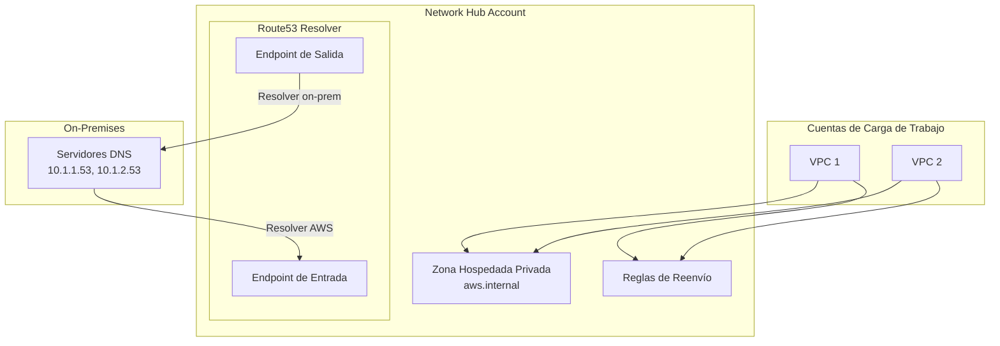

# Módulo de DNS {#dns-module}

El módulo de DNS gestiona zonas hospedadas privadas de Route53 y endpoints de Route53 Resolver para resolución DNS híbrida.

## Descripción General {#overview}

Este módulo se despliega en la **Network Hub Account** y crea:

- Zonas hospedadas privadas de Route53 con asociaciones de VPC
- Endpoints de entrada de Route53 Resolver (on-premises a AWS)
- Endpoints de salida de Route53 Resolver (AWS a on-premises)
- Reglas de reenvío condicional para DNS híbrido
- Compartición vía AWS RAM para acceso entre cuentas

## Arquitectura {#architecture}



## Uso {#usage}

### Solo Zona Hospedada Privada {#private-hosted-zone-only}

```hcl
module "dns" {
  source = "../modules/dns"

  name_prefix = "network-hub"
  vpc_id      = module.vpc.vpc_id

  create_private_hosted_zone   = true
  private_zone_name            = "internal.example.com"
  
  share_zone_with_organization = true
  organization_arn             = "arn:aws:organizations::123456789012:organization/o-xxxxx"

  tags = {
    Environment = "production"
    ManagedBy   = "terraform"
  }
}
```

### DNS Híbrido con Endpoints de Resolver {#hybrid-dns}

```hcl
module "dns" {
  source = "../modules/dns"

  name_prefix = "network-hub"
  vpc_id      = module.vpc.vpc_id

  create_private_hosted_zone = true
  private_zone_name          = "aws.internal.example.com"
  
  create_resolver_endpoints = true
  create_inbound_endpoint   = true
  create_outbound_endpoint  = true
  
  resolver_subnet_ids = [
    module.vpc.private_subnet_ids[0],
    module.vpc.private_subnet_ids[1]
  ]
  
  forward_rules = {
    onprem = {
      domain_name = "onprem.example.com"
      target_ips = [
        { ip = "10.1.1.53", port = 53 },
        { ip = "10.1.2.53", port = 53 }
      ]
    }
  }
  
  share_zone_with_organization  = true
  share_rules_with_organization = true
  organization_arn              = "arn:aws:organizations::123456789012:organization/o-xxxxx"

  tags = {
    Environment = "production"
  }
}
```

## Entradas {#inputs}

| Nombre | Descripción | Tipo | Requerido |
|--------|-------------|------|-----------|
| `name_prefix` | Prefijo para nombres de recursos | `string` | Sí |
| `vpc_id` | ID de VPC para zona hospedada y endpoints | `string` | Sí |
| `create_private_hosted_zone` | Crear una zona hospedada privada | `bool` | No |
| `private_zone_name` | Nombre de la zona hospedada privada | `string` | No |
| `create_resolver_endpoints` | Crear endpoints de Route53 Resolver | `bool` | No |
| `create_inbound_endpoint` | Crear endpoint de resolver de entrada | `bool` | No |
| `create_outbound_endpoint` | Crear endpoint de resolver de salida | `bool` | No |
| `resolver_subnet_ids` | IDs de subredes para endpoints de resolver | `list(string)` | No |
| `forward_rules` | Mapa de reglas de reenvío | `map(object)` | No |
| `share_zone_with_organization` | Compartir zona vía RAM | `bool` | No |
| `share_rules_with_organization` | Compartir reglas vía RAM | `bool` | No |

## Salidas {#outputs}

| Nombre | Descripción |
|--------|-------------|
| `private_zone_id` | ID de la zona hospedada privada |
| `private_zone_name` | Nombre de la zona hospedada privada |
| `inbound_endpoint_id` | ID del endpoint de resolver de entrada |
| `inbound_endpoint_ips` | Direcciones IP del endpoint de entrada |
| `outbound_endpoint_id` | ID del endpoint de resolver de salida |
| `resolver_rule_ids` | Mapa de nombres de reglas de resolver a IDs |

## Flujo de Resolución DNS {#dns-resolution-flow}

| Origen | Destino | Ruta |
|--------|---------|------|
| On-premises | Recursos AWS | DNS On-prem → Endpoint de Entrada → Zona Hospedada Privada |
| Recursos AWS | On-premises | DNS de VPC → Endpoint de Salida → DNS On-prem |
| Recursos AWS | Recursos AWS | DNS de VPC → Zona Hospedada Privada |

## Notas {#notes}

- Los endpoints de resolver requieren al menos 2 subredes en diferentes AZs
- Cada endpoint de resolver crea 1 ENI por subred
- Las IPs del endpoint de entrada deben configurarse como reenviadores en el DNS on-premises
- Las reglas de reenvío de salida se aplican automáticamente a las VPCs que aceptan la compartición RAM

## Relacionado {#related}

- [Módulo de Networking](./networking)
- [Diseño de Red](../architecture/network-design)
- [Módulo de VPC](./vpc)
