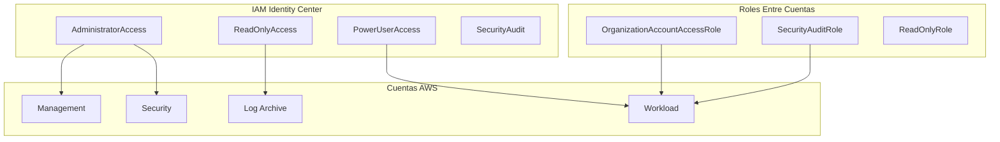

# Módulo de IAM {#iam-module}

El módulo de IAM proporciona gestión integral de IAM para despliegues de AWS Landing Zone.

## Descripción General {#overview}

Este módulo se despliega en la **Management Account** o **Shared Services Account** y crea:

- Permission sets de IAM Identity Center
- Roles IAM entre cuentas
- Usuario de acceso de emergencia (break-glass)
- Políticas IAM personalizadas
- Política de contraseñas a nivel de cuenta

## Arquitectura {#architecture}



## Uso {#usage}

```hcl
module "iam" {
  source = "../modules/iam"

  name_prefix = "myorg"

  # Permission Sets de IAM Identity Center
  create_permission_sets = true
  sso_instance_arn       = "arn:aws:sso:::instance/ssoins-1234567890abcdef"
  
  permission_sets = {
    DeveloperAccess = {
      description      = "Acceso de desarrollador con permisos limitados"
      session_duration = "PT4H"
      managed_policies = [
        "arn:aws:iam::aws:policy/PowerUserAccess"
      ]
      inline_policy = null
    }
  }

  # Roles Entre Cuentas
  create_cross_account_roles    = true
  trusted_account_ids           = ["123456789012", "234567890123"]
  require_mfa_for_cross_account = true

  # Política de Contraseñas
  configure_password_policy = true
  password_policy = {
    minimum_password_length      = 14
    require_lowercase_characters = true
    require_uppercase_characters = true
    require_numbers              = true
    require_symbols              = true
    max_password_age             = 90
    password_reuse_prevention    = 24
  }

  tags = {
    Environment = "production"
    ManagedBy   = "Terraform"
  }
}
```

## Entradas {#inputs}

| Nombre | Descripción | Tipo | Requerido |
|--------|-------------|------|-----------|
| `name_prefix` | Prefijo para nombres de recursos IAM | `string` | Sí |
| `create_permission_sets` | Crear permission sets | `bool` | No |
| `sso_instance_arn` | ARN de la instancia de IAM Identity Center | `string` | No |
| `permission_sets` | Mapa de permission sets a crear | `map(object)` | No |
| `create_cross_account_roles` | Crear roles entre cuentas | `bool` | No |
| `trusted_account_ids` | IDs de cuentas que pueden asumir roles | `list(string)` | No |
| `require_mfa_for_cross_account` | Requerir MFA para asunción de roles | `bool` | No |
| `create_break_glass_user` | Crear usuario IAM de emergencia | `bool` | No |
| `configure_password_policy` | Configurar política de contraseñas de cuenta | `bool` | No |

## Salidas {#outputs}

| Nombre | Descripción |
|--------|-------------|
| `permission_set_arns` | Mapa de ARNs de permission sets personalizados |
| `default_permission_set_arns` | Mapa de ARNs de permission sets por defecto |
| `cross_account_role_arns` | Mapa de ARNs de roles entre cuentas |
| `break_glass_user_arn` | ARN del usuario de emergencia (si se creó) |

## Permission Sets por Defecto {#default-permission-sets}

| Permission Set | Descripción | Duración de Sesión |
|----------------|-------------|-------------------|
| AdministratorAccess | Acceso administrativo completo | 4 horas |
| ReadOnlyAccess | Acceso de solo lectura a todos los servicios | 8 horas |
| PowerUserAccess | Acceso completo excepto IAM/Organizations | 4 horas |
| SecurityAudit | Acceso de auditoría de seguridad | 8 horas |
| ViewOnlyAccess | Acceso de solo visualización (más restrictivo) | 8 horas |
| BillingAccess | Facturación y gestión de costos | 4 horas |

## Roles Entre Cuentas por Defecto {#default-cross-account-roles}

| Rol | Descripción |
|-----|-------------|
| OrganizationAccountAccessRole | Acceso admin completo desde cuenta de gestión |
| SecurityAuditRole | Acceso de auditoría de seguridad desde cuenta de seguridad |
| ReadOnlyRole | Acceso de solo lectura para monitoreo |

## Consideraciones de Seguridad {#security-considerations}

1. **Requisito de MFA**: Los roles entre cuentas requieren MFA por defecto
2. **Permission Boundaries**: Pueden aplicarse a todos los roles
3. **Usuario de Emergencia**: Deshabilitado por defecto, habilitar solo para acceso de emergencia
4. **Duración de Sesión**: Los permission sets por defecto tienen límites de sesión apropiados
5. **Política de Contraseñas**: Aplica requisitos de contraseña fuertes por defecto

## Relacionado {#related}

- [Módulo de Security Baseline](./security-baseline)
- [Estrategia de IAM](../architecture/iam-strategy)
- [Módulo de Organization](./organization)
