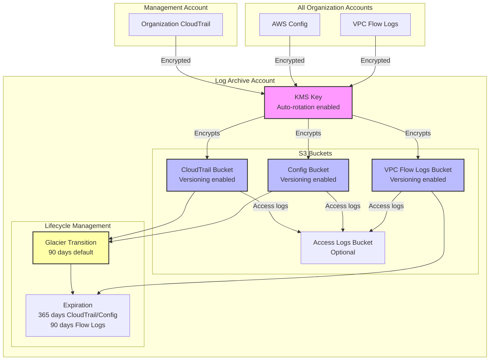

# Módulo de Archivo de Logs {#log-archive-module}

El módulo de Archivo de Logs centraliza todos los logs de auditoría y cumplimiento de toda la AWS Organization en una cuenta dedicada con almacenamiento seguro y gestión de ciclo de vida.

## Descripción General {#overview}

Este módulo se despliega en la **Log Archive Account** y crea:

- Clave KMS para el cifrado de logs con rotación automática
- Bucket S3 de CloudTrail para logs de auditoría de toda la organización
- Bucket S3 de AWS Config para instantáneas de configuración
- Bucket S3 de VPC Flow Logs para logs de tráfico de red
- Bucket opcional para logs de acceso de S3
- Políticas de ciclo de vida con transición a Glacier para optimización de costos
- Políticas de bucket que imponen acceso seguro y cifrado

## Uso {#usage}

```hcl
module "log_archive" {
  source = "../modules/log-archive"

  organization_name = "acme-corp"
  organization_id   = "o-abc123def456"
  aws_region        = "us-east-1"

  # Retention policies
  cloudtrail_retention_days      = 365
  config_retention_days          = 365
  vpc_flow_log_retention_days    = 90

  # Cost optimization
  enable_glacier_transition = true
  glacier_transition_days   = 90

  # Access logging
  enable_s3_access_logging = true
}
```

## Entradas {#inputs}

| Name | Description | Type | Required |
|------|-------------|------|----------|
| `organization_name` | Prefijo del nombre de la organización para el nombramiento de recursos | `string` | Yes |
| `organization_id` | ID de AWS Organization | `string` | Yes |
| `aws_region` | Región de AWS para la cuenta de archivo de logs | `string` | No (default: `us-east-1`) |
| `cloudtrail_retention_days` | Número de días para retener los logs de CloudTrail | `number` | No (default: `365`) |
| `config_retention_days` | Número de días para retener los logs de Config | `number` | No (default: `365`) |
| `vpc_flow_log_retention_days` | Número de días para retener los VPC Flow Logs | `number` | No (default: `90`) |
| `enable_s3_access_logging` | Habilitar el registro de acceso de S3 para los buckets de logs | `bool` | No (default: `true`) |
| `enable_glacier_transition` | Habilitar la transición a Glacier para logs antiguos | `bool` | No (default: `true`) |
| `glacier_transition_days` | Días tras los cuales los logs pasan a Glacier | `number` | No (default: `90`) |

## Salidas {#outputs}

| Name | Description |
|------|-------------|
| `cloudtrail_bucket_name` | Nombre del bucket S3 de CloudTrail |
| `cloudtrail_bucket_arn` | ARN del bucket S3 de CloudTrail |
| `config_bucket_name` | Nombre del bucket S3 de Config |
| `config_bucket_arn` | ARN del bucket S3 de Config |
| `vpc_flow_logs_bucket_name` | Nombre del bucket S3 de VPC Flow Logs |
| `vpc_flow_logs_bucket_arn` | ARN del bucket S3 de VPC Flow Logs |
| `kms_key_arn` | ARN de la clave KMS para el cifrado de logs |
| `kms_key_id` | ID de la clave KMS para el cifrado de logs |

## Arquitectura {#architecture}



## Características de Seguridad {#security-features}

### Cifrado en Reposo {#encryption-at-rest}

Todos los buckets de logs utilizan cifrado KMS con una clave dedicada:

- **Rotación automática de claves** habilitada para cumplimiento
- **Permisos específicos por servicio** para CloudTrail, Config y CloudWatch Logs
- **Bucket key habilitado** para reducir los costos de la API de KMS

### Cifrado en Tránsito {#encryption-in-transit}

Todas las políticas de bucket imponen el uso de TLS:

```json
{
  "Sid": "DenyInsecureTransport",
  "Effect": "Deny",
  "Principal": "*",
  "Action": "s3:*",
  "Resource": ["bucket-arn", "bucket-arn/*"],
  "Condition": {
    "Bool": {
      "aws:SecureTransport": "false"
    }
  }
}
```

### Prevención de Acceso Público {#public-access-prevention}

Todos los buckets tienen habilitados los bloqueos de acceso público:

- `block_public_acls = true`
- `block_public_policy = true`
- `ignore_public_acls = true`
- `restrict_public_buckets = true`

### Versionado {#versioning}

Los buckets de CloudTrail, Config y VPC Flow Logs tienen habilitado el versionado para proteger contra eliminaciones o modificaciones accidentales.

## Optimización de Costos {#cost-optimization}

### Transición a Glacier {#glacier-transition}

Los logs pasan automáticamente a la clase de almacenamiento Glacier después de 90 días (configurable):

- **CloudTrail**: Glacier después de 90 días, expira después de 365 días
- **Config**: Glacier después de 90 días, expira después de 365 días
- **VPC Flow Logs**: Expira después de 90 días (sin transición a Glacier)

Esto reduce los costos de almacenamiento hasta en un 90% para logs antiguos manteniendo el cumplimiento.

### Bucket Key {#bucket-key}

Las S3 Bucket Keys reducen los costos de la API de KMS hasta en un 99% al utilizar claves a nivel de bucket en lugar de claves a nivel de objeto.

## Estructura de Archivos {#file-structure}

```
terraform/log-archive/
├── main.tf              # Clave KMS y alias
├── buckets.tf           # Buckets S3 y configuraciones
├── variables.tf         # Variables de entrada
├── outputs.tf           # Valores de salida
├── providers.tf         # Configuración del proveedor AWS
├── backend.tf           # Backend del estado de Terraform
└── terraform.tfvars.example
```

## Dependencias {#dependencies}

- **Módulo de Organización**: Requiere el `organization_id` del módulo de Organización
- **Management Account**: El CloudTrail de la organización debe estar configurado para usar el bucket de CloudTrail
- **Security Account**: El agregador de AWS Config debe hacer referencia al bucket de Config
- **Network Account**: Los VPC Flow Logs deben estar configurados para usar el bucket de VPC Flow Logs

## Relacionado {#related}

- [Arquitectura Multi-Cuenta](../architecture/multi-account)
- [Modelo de Seguridad](../architecture/security-model)
- [Módulo de Organización](./organization)
- [Módulo de Línea Base de Seguridad](./security-baseline)
