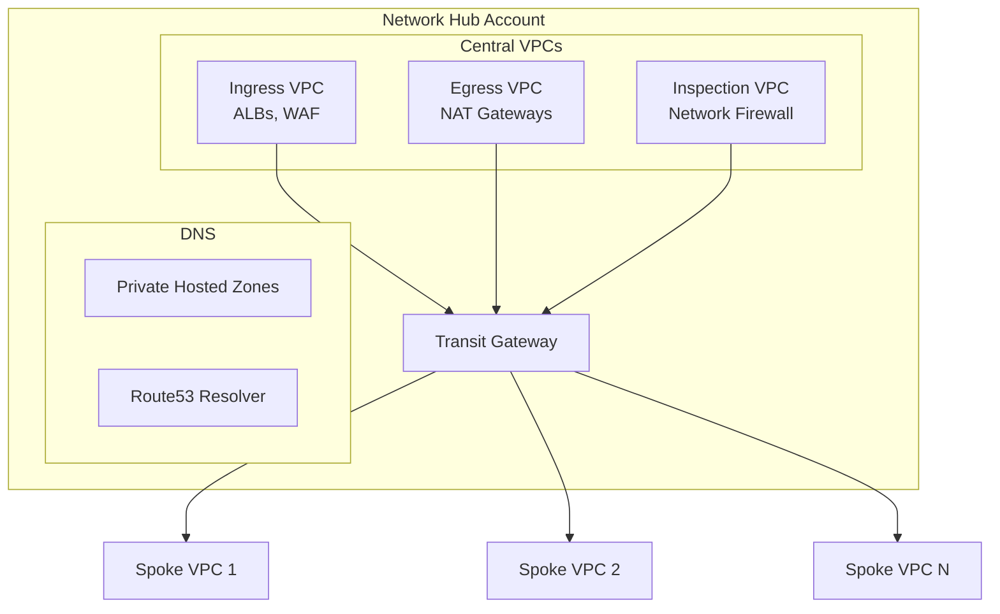

# Módulo de Redes {#networking-module}

El módulo de Redes crea la arquitectura de red hub-and-spoke utilizando Transit Gateway.

## Descripción General {#overview}

Este módulo se despliega en la **Network Hub Account** y crea:

- Transit Gateway
- VPCs Centrales (Ingress, Egress, Inspection)
- Tablas de ruteo y asociaciones
- Infraestructura de DNS (Route53)
- VPC Endpoints (compartidos)

## Arquitectura {#architecture}



## Uso {#usage}

```hcl
module "networking" {
  source = "../modules/networking"

  # Transit Gateway
  transit_gateway_name        = "acme-tgw"
  transit_gateway_description = "Central Transit Gateway"
  amazon_side_asn             = 64512

  # Central VPCs
  create_ingress_vpc    = true
  create_egress_vpc     = true
  create_inspection_vpc = true

  # CIDR Allocation
  network_hub_cidr = "10.0.0.0/16"
  
  # DNS
  private_hosted_zone_name = "aws.internal"
  enable_dns_firewall      = true

  # Availability Zones
  availability_zones = ["us-east-1a", "us-east-1b", "us-east-1c"]

  tags = {
    Environment = "shared"
    ManagedBy   = "terraform"
  }
}
```

## Entradas {#inputs}

| Name | Description | Type | Required |
|------|-------------|------|----------|
| `transit_gateway_name` | Nombre para el Transit Gateway | `string` | Yes |
| `amazon_side_asn` | ASN de BGP para el TGW | `number` | No |
| `create_ingress_vpc` | Crear VPC de Ingress | `bool` | No |
| `create_egress_vpc` | Crear VPC de Egress | `bool` | No |
| `create_inspection_vpc` | Crear VPC de Inspección | `bool` | No |
| `network_hub_cidr` | CIDR para el Network Hub | `string` | Yes |
| `private_hosted_zone_name` | Nombre de la PHZ de Route53 | `string` | No |
| `availability_zones` | AZs a utilizar | `list(string)` | Yes |

## Salidas {#outputs}

| Name | Description |
|------|-------------|
| `transit_gateway_id` | ID de Transit Gateway |
| `transit_gateway_arn` | ARN de Transit Gateway |
| `ingress_vpc_id` | ID de la VPC de Ingress |
| `egress_vpc_id` | ID de la VPC de Egress |
| `inspection_vpc_id` | ID de la VPC de Inspección |
| `route_table_ids` | Mapa de IDs de tablas de ruteo |
| `private_hosted_zone_id` | ID de la PHZ de Route53 |

## Tablas de Ruteo de Transit Gateway {#transit-gateway-route-tables}

| Route Table | Purpose | Associated VPCs |
|-------------|---------|-----------------|
| `shared` | Acceso a servicios compartidos | Todas |
| `production` | Tráfico de producción | VPCs de Producción |
| `non-production` | Tráfico de no-producción | VPCs de Dev/Staging |
| `inspection` | Inspección de tráfico | Ingress, Egress |

## Adjunto de VPC Spoke {#spoke-vpc-attachment}

Para adjuntar una VPC spoke desde otra cuenta:

```hcl
# En la cuenta de carga de trabajo (workload account)
resource "aws_ec2_transit_gateway_vpc_attachment" "spoke" {
  subnet_ids         = var.transit_subnet_ids
  transit_gateway_id = data.aws_ec2_transit_gateway.shared.id
  vpc_id             = aws_vpc.workload.id

  transit_gateway_default_route_table_association = false
  transit_gateway_default_route_table_propagation = false

  tags = {
    Name = "spoke-attachment"
  }
}

# Aceptación de compartición de RAM
resource "aws_ram_resource_share_accepter" "tgw" {
  share_arn = data.aws_ram_resource_share.tgw.arn
}
```

## VPC Endpoints {#vpc-endpoints}

VPC endpoints centralizados en la VPC de Shared Services:

| Endpoint | Type | Services Using |
|----------|------|----------------|
| S3 | Gateway | Todos |
| DynamoDB | Gateway | Todos |
| ECR (api, dkr) | Interface | ECS, EKS |
| CloudWatch Logs | Interface | Todos |
| SSM, SSM Messages | Interface | EC2 |
| Secrets Manager | Interface | Lambda, ECS |
| STS | Interface | Todos |

## Configuración de DNS {#dns-configuration}

### Private Hosted Zones {#private-hosted-zones}

```
aws.internal
├── shared.aws.internal    → 10.1.x.x
├── prod.aws.internal      → 10.10.x.x
└── dev.aws.internal       → 10.20.x.x
```

### Route53 Resolver {#route53-resolver}

- Endpoints de entrada (inbound) para resolución on-premises → AWS
- Endpoints de salida (outbound) para resolución AWS → on-premises
- Reglas del Resolver compartidas vía RAM

## Estructura de Archivos {#file-structure}

```
terraform/network/
├── main.tf              # Configuración principal
├── transit-gateway.tf   # TGW y tablas de ruteo
├── vpcs.tf              # VPCs centrales
├── nat-gateways.tf      # Configuración de NAT
├── route53.tf           # Infraestructura de DNS
├── vpc-endpoints.tf     # Endpoints centralizados
├── ram.tf               # Compartición de recursos (RAM)
├── variables.tf
├── outputs.tf
├── providers.tf
├── backend.tf
└── terraform.tfvars.example
```

## Dependencias {#dependencies}

- Módulo de Organización (para compartición vía RAM)
- Requiere que las cuentas acepten las comparticiones de RAM

## Relacionado {#related}

- [Diseño de Red](../architecture/network-design)
- [Módulo de Organización](./organization)
