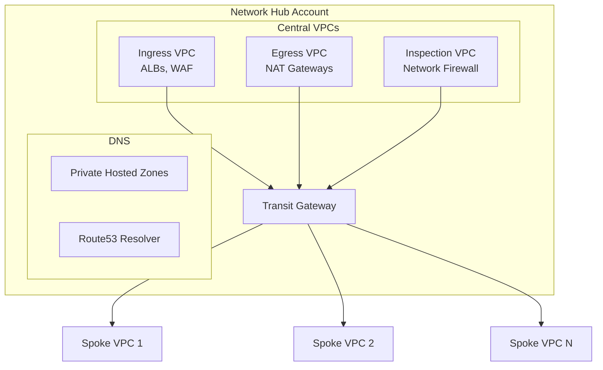

# Networking Module

The Networking module creates the hub-and-spoke network architecture using Transit Gateway.

## Overview

This module is deployed in the **Network Hub Account** and creates:

- Transit Gateway
- Central VPCs (Ingress, Egress, Inspection)
- Route tables and associations
- DNS infrastructure (Route53)
- VPC Endpoints (shared)

## Architecture



## Usage

```hcl
module "networking" {
  source = "../modules/networking"

  # Transit Gateway
  transit_gateway_name        = "acme-tgw"
  transit_gateway_description = "Central Transit Gateway"
  amazon_side_asn             = 64512

  # Central VPCs
  create_ingress_vpc    = true
  create_egress_vpc     = true
  create_inspection_vpc = true

  # CIDR Allocation
  network_hub_cidr = "10.0.0.0/16"
  
  # DNS
  private_hosted_zone_name = "aws.internal"
  enable_dns_firewall      = true

  # Availability Zones
  availability_zones = ["us-east-1a", "us-east-1b", "us-east-1c"]

  tags = {
    Environment = "shared"
    ManagedBy   = "terraform"
  }
}
```

## Inputs

| Name | Description | Type | Required |
|------|-------------|------|----------|
| `transit_gateway_name` | Name for Transit Gateway | `string` | Yes |
| `amazon_side_asn` | BGP ASN for TGW | `number` | No |
| `create_ingress_vpc` | Create Ingress VPC | `bool` | No |
| `create_egress_vpc` | Create Egress VPC | `bool` | No |
| `create_inspection_vpc` | Create Inspection VPC | `bool` | No |
| `network_hub_cidr` | CIDR for Network Hub | `string` | Yes |
| `private_hosted_zone_name` | Route53 PHZ name | `string` | No |
| `availability_zones` | AZs to use | `list(string)` | Yes |

## Outputs

| Name | Description |
|------|-------------|
| `transit_gateway_id` | Transit Gateway ID |
| `transit_gateway_arn` | Transit Gateway ARN |
| `ingress_vpc_id` | Ingress VPC ID |
| `egress_vpc_id` | Egress VPC ID |
| `inspection_vpc_id` | Inspection VPC ID |
| `route_table_ids` | Map of route table IDs |
| `private_hosted_zone_id` | Route53 PHZ ID |

## Transit Gateway Route Tables

| Route Table | Purpose | Associated VPCs |
|-------------|---------|-----------------|
| `shared` | Access to shared services | All |
| `production` | Production traffic | Production VPCs |
| `non-production` | Non-prod traffic | Dev/Staging VPCs |
| `inspection` | Traffic inspection | Ingress, Egress |

## Spoke VPC Attachment

To attach a spoke VPC from another account:

```hcl
# In the workload account
resource "aws_ec2_transit_gateway_vpc_attachment" "spoke" {
  subnet_ids         = var.transit_subnet_ids
  transit_gateway_id = data.aws_ec2_transit_gateway.shared.id
  vpc_id             = aws_vpc.workload.id

  transit_gateway_default_route_table_association = false
  transit_gateway_default_route_table_propagation = false

  tags = {
    Name = "spoke-attachment"
  }
}

# RAM share acceptance
resource "aws_ram_resource_share_accepter" "tgw" {
  share_arn = data.aws_ram_resource_share.tgw.arn
}
```

## VPC Endpoints

Centralized VPC endpoints in Shared Services VPC:

| Endpoint | Type | Services Using |
|----------|------|----------------|
| S3 | Gateway | All |
| DynamoDB | Gateway | All |
| ECR (api, dkr) | Interface | ECS, EKS |
| CloudWatch Logs | Interface | All |
| SSM, SSM Messages | Interface | EC2 |
| Secrets Manager | Interface | Lambda, ECS |
| STS | Interface | All |

## DNS Configuration

### Private Hosted Zones

```
aws.internal
├── shared.aws.internal    → 10.1.x.x
├── prod.aws.internal      → 10.10.x.x
└── dev.aws.internal       → 10.20.x.x
```

### Route53 Resolver

- Inbound endpoints for on-premises → AWS resolution
- Outbound endpoints for AWS → on-premises resolution
- Resolver rules shared via RAM

## File Structure

```
terraform/network/
├── main.tf              # Main configuration
├── transit-gateway.tf   # TGW and route tables
├── vpcs.tf              # Central VPCs
├── nat-gateways.tf      # NAT configuration
├── route53.tf           # DNS infrastructure
├── vpc-endpoints.tf     # Centralized endpoints
├── ram.tf               # Resource sharing
├── variables.tf
├── outputs.tf
├── providers.tf
├── backend.tf
└── terraform.tfvars.example
```

## Dependencies

- Organization module (for RAM sharing)
- Requires accounts to accept RAM shares

## Related

- [Network Design](../architecture/network-design)
- [Organization Module](./organization)
