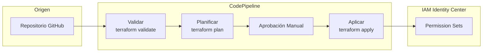

# Módulo de Permission Set Pipeline {#permission-set-pipeline-module}

El módulo de Permission Set Pipeline crea un pipeline CI/CD para gestionar permission sets de IAM Identity Center usando principios GitOps.

## Descripción General {#overview}

Este módulo se despliega en la **Shared Services Account** y crea:

- CodePipeline para cambios automatizados de permission sets
- Proyectos CodeBuild para validación, planificación y aplicación
- Etapa de aprobación manual opcional
- Bucket S3 para artefactos con cifrado
- Tema SNS para notificaciones de aprobación

## Arquitectura {#architecture}



## Uso {#usage}

```hcl
module "permission_set_pipeline" {
  source = "../modules/permission-set-pipeline"

  name_prefix             = "myorg"
  codestar_connection_arn = "arn:aws:codestar-connections:us-east-1:123456789012:connection/xxx"
  repository_id           = "myorg/permission-sets"
  branch_name             = "main"
  permission_sets_path    = "terraform/permission-sets"

  enable_manual_approval = true
  approval_email         = "platform-team@example.com"

  tags = {
    Environment = "production"
    ManagedBy   = "Terraform"
  }
}
```

## Entradas {#inputs}

| Nombre | Descripción | Tipo | Requerido |
|--------|-------------|------|-----------|
| `name_prefix` | Prefijo para nombres de recursos | `string` | Sí |
| `codestar_connection_arn` | ARN de conexión CodeStar | `string` | Sí |
| `repository_id` | ID del repositorio (owner/repo) | `string` | Sí |
| `branch_name` | Rama a monitorear | `string` | No |
| `permission_sets_path` | Ruta a la configuración de Terraform | `string` | No |
| `enable_manual_approval` | Habilitar etapa de aprobación | `bool` | No |
| `approval_email` | Email para aprobaciones | `string` | No |
| `kms_key_arn` | Clave KMS para cifrado | `string` | No |
| `terraform_version` | Versión de Terraform | `string` | No |

## Salidas {#outputs}

| Nombre | Descripción |
|--------|-------------|
| `pipeline_arn` | ARN de CodePipeline |
| `pipeline_name` | Nombre de CodePipeline |
| `codebuild_project_arn` | ARN del proyecto CodeBuild |
| `artifacts_bucket_arn` | ARN del bucket S3 de artefactos |
| `approval_topic_arn` | ARN del tema SNS de aprobación |

## Prerrequisitos {#prerequisites}

1. **Conexión CodeStar**: Crear una conexión a su proveedor Git
2. **Repositorio de Permission Sets**: Repositorio conteniendo código Terraform
3. **IAM Identity Center**: Debe estar habilitado en su organización

## Estructura del Repositorio {#repository-structure}

Su repositorio de permission sets debe tener esta estructura:

```
terraform/permission-sets/
├── main.tf
├── variables.tf
├── outputs.tf
├── versions.tf
└── permission-sets/
    ├── admin.tf
    ├── developer.tf
    └── readonly.tf
```

## Etapas del Pipeline {#pipeline-stages}

| Etapa | Acción | Descripción |
|-------|--------|-------------|
| Source | GitHub | Obtiene código del repositorio |
| Validate | CodeBuild | Ejecuta `terraform validate` |
| Plan | CodeBuild | Ejecuta `terraform plan` |
| Approval | Manual | Aprobación humana opcional |
| Apply | CodeBuild | Ejecuta `terraform apply` |

## Consideraciones de Seguridad {#security-considerations}

1. **Privilegio Mínimo**: El rol de CodeBuild tiene permisos mínimos para gestión de SSO
2. **Cifrado**: Artefactos cifrados en reposo (KMS opcional)
3. **Aprobación Manual**: Recomendada para cambios en producción
4. **Pista de Auditoría**: Logs de CloudWatch para todas las ejecuciones del pipeline

## Relacionado {#related}

- [Módulo de IAM](./iam)
- [Módulo de Shared Services](./shared-services)
- [Runbook de Configuración CI/CD](../runbooks/cicd-setup)
