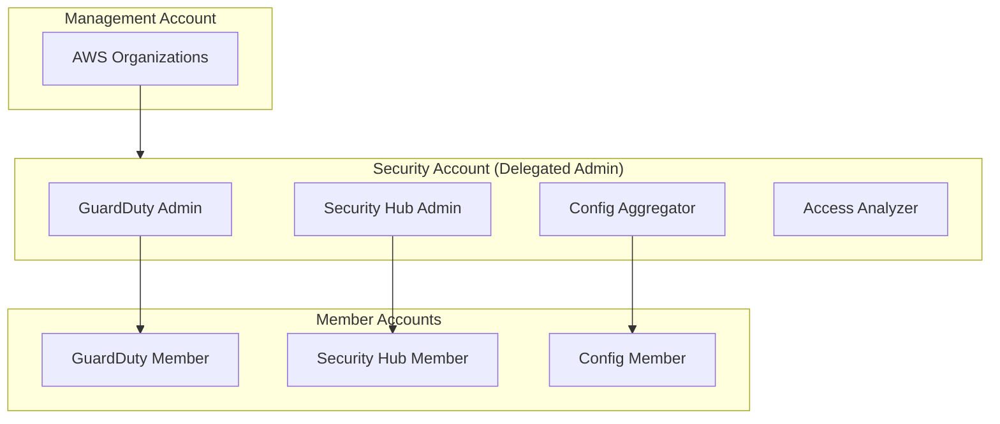

# Módulo de Línea Base de Seguridad {#security-baseline-module}

El módulo de Línea Base de Seguridad configura los servicios de seguridad en todas las cuentas.

## Descripción General {#overview}

Este módulo se despliega en la **Security Account** y configura:

- GuardDuty (a nivel de organización)
- Security Hub (a nivel de organización)
- AWS Config (agregador de organización)
- IAM Access Analyzer

## Arquitectura {#architecture}



## Uso {#usage}

```hcl
module "security_baseline" {
  source = "../modules/security-baseline"

  # GuardDuty
  enable_guardduty          = true
  guardduty_s3_protection   = true
  guardduty_eks_protection  = true
  guardduty_finding_bucket  = "acme-security-guardduty-findings"

  # Security Hub
  enable_security_hub = true
  security_hub_standards = [
    "aws-foundational-security-best-practices/v/1.0.0",
    "cis-aws-foundations-benchmark/v/1.4.0"
  ]

  # Config
  enable_config_aggregator = true
  config_delivery_bucket   = "acme-log-archive-config"

  # Access Analyzer
  enable_access_analyzer = true
  access_analyzer_type   = "ORGANIZATION"

  # Notifications
  security_notification_emails = [
    "security-team@acme.com"
  ]
}
```

## Entradas {#inputs}

| Name | Description | Type | Required |
|------|-------------|------|----------|
| `enable_guardduty` | Habilitar GuardDuty | `bool` | No |
| `guardduty_s3_protection` | Habilitar protección de S3 | `bool` | No |
| `guardduty_eks_protection` | Habilitar protección de EKS | `bool` | No |
| `enable_security_hub` | Habilitar Security Hub | `bool` | No |
| `security_hub_standards` | Estándares a habilitar | `list(string)` | No |
| `enable_config_aggregator` | Habilitar agregador de Config | `bool` | No |
| `enable_access_analyzer` | Habilitar Access Analyzer | `bool` | No |
| `security_notification_emails` | Direcciones de correo para alertas | `list(string)` | No |

## Salidas {#outputs}

| Name | Description |
|------|-------------|
| `guardduty_detector_id` | ID del detector de GuardDuty |
| `security_hub_arn` | ARN de Security Hub |
| `config_aggregator_arn` | ARN del agregador de Config |
| `access_analyzer_arn` | ARN de Access Analyzer |
| `sns_topic_arn` | ARN del tópico SNS para alertas de seguridad |

## Configuración de GuardDuty {#guardduty-configuration}

### Detectores Habilitados {#enabled-detectors}

- **EC2**: Actividad maliciosa en instancias EC2
- **S3**: Exfiltración de datos, patrones de acceso sospechosos
- **EKS**: Análisis de logs de auditoría de Kubernetes
- **Malware Protection**: Escaneo de volúmenes EBS

### Mapeo de Severidad de Hallazgos {#finding-severity-mapping}

| Severity | Action |
|----------|--------|
| Critical | PagerDuty + Slack + Email |
| High | Slack + Email |
| Medium | Email |
| Low | Solo log |

## Configuración de Security Hub {#security-hub-configuration}

### Estándares Habilitados {#enabled-standards}

1. **AWS Foundational Security Best Practices**
   - Cubre la mayoría de los servicios de AWS
   - ~200 controles automatizados

2. **CIS AWS Foundations Benchmark**
   - Cumplimiento de estándares de la industria
   - IAM, logging, monitoreo, redes

### Insights Personalizados {#custom-insights}

- Recursos con acceso público
- Almacenamiento no cifrado
- Acceso entre cuentas (cross-account)

## Reglas de Config {#config-rules}

### Reglas de Organización {#organization-rules}

| Rule | Description |
|------|-------------|
| `s3-bucket-ssl-requests-only` | Requiere SSL para S3 |
| `encrypted-volumes` | Cifrado de EBS requerido |
| `rds-storage-encrypted` | Cifrado de RDS requerido |
| `cloudtrail-enabled` | CloudTrail debe estar habilitado |
| `root-account-mfa-enabled` | MFA requerido para el usuario raíz |

## Estructura de Archivos {#file-structure}

```
terraform/security/
├── main.tf              # Configuración principal
├── guardduty.tf         # Configuración de GuardDuty
├── security-hub.tf      # Configuración de Security Hub
├── config.tf            # Agregador de Config
├── access-analyzer.tf   # Access Analyzer
├── notifications.tf     # Tópicos SNS y suscripciones
├── variables.tf
├── outputs.tf
├── providers.tf
├── backend.tf
└── terraform.tfvars.example
```

## Requisitos Previos {#prerequisites}

- La Management account debe delegar la administración a la Security account
- La Log Archive account debe existir (para el almacenamiento de hallazgos)
- Roles de IAM para acceso entre cuentas

## Relacionado {#related}

- [Modelo de Seguridad](../architecture/security-model)
- [Guía Operativa de Solución de Problemas](../runbooks/troubleshooting)
