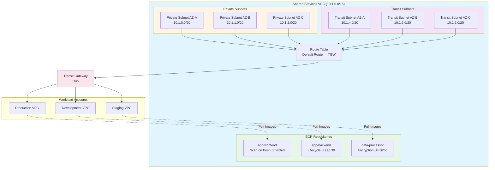

# Shared Services Module

The Shared Services module creates a centralized VPC for shared infrastructure and services accessible to all workload accounts via Transit Gateway.

## Overview

This module is deployed in the **Shared Services Account** and creates:

- VPC with DNS support enabled
- Private subnets across multiple availability zones
- Transit subnets for Transit Gateway attachment
- Route tables with Transit Gateway routing
- Transit Gateway VPC attachment
- ECR repositories with image scanning and lifecycle policies

## Usage

```hcl
module "shared_services" {
  source = "../modules/shared-services"

  organization_name = "acme-corp"
  vpc_cidr          = "10.1.0.0/16"
  
  availability_zones = [
    "us-east-1a",
    "us-east-1b",
    "us-east-1c"
  ]

  transit_gateway_id  = "tgw-0123456789abcdef0"
  tgw_route_table_id  = "tgw-rtb-0123456789abcdef0"

  enable_ecr = true
  ecr_repositories = [
    "app-frontend",
    "app-backend",
    "data-processor"
  ]
}
```

## Inputs

| Name | Description | Type | Required |
|------|-------------|------|----------|
| `organization_name` | Organization name prefix for resource naming | `string` | Yes |
| `vpc_cidr` | CIDR block for shared services VPC | `string` | No (default: `10.1.0.0/16`) |
| `availability_zones` | List of availability zones to use | `list(string)` | No (default: `["us-east-1a", "us-east-1b", "us-east-1c"]`) |
| `transit_gateway_id` | Transit Gateway ID to attach VPC to | `string` | Yes |
| `tgw_route_table_id` | Transit Gateway route table ID for association | `string` | Yes |
| `enable_ecr` | Whether to create ECR repositories | `bool` | No (default: `true`) |
| `ecr_repositories` | List of ECR repository names to create | `list(string)` | No (default: `[]`) |
| `aws_region` | AWS region for deployment | `string` | No (default: `us-east-1`) |

## Outputs

| Name | Description |
|------|-------------|
| `vpc_id` | Shared Services VPC ID |
| `private_subnet_ids` | List of private subnet IDs |
| `ecr_repository_urls` | Map of ECR repository names to repository URLs |

## Architecture



## Network Design

### VPC Configuration

The Shared Services VPC is configured with:

- **DNS Support**: Enabled for internal DNS resolution
- **DNS Hostnames**: Enabled for EC2 instance hostname assignment
- **CIDR Block**: Configurable (default: `10.1.0.0/16`)

### Subnet Strategy

**Private Subnets** (one per AZ):
- CIDR: `/20` subnets starting from the VPC base
- Purpose: Host shared services (CI/CD, monitoring, etc.)
- Routing: Default route to Transit Gateway

**Transit Subnets** (one per AZ):
- CIDR: `/20` subnets offset by 4 from private subnets
- Purpose: Transit Gateway VPC attachment endpoints
- Routing: Default route to Transit Gateway

### Transit Gateway Integration

The module creates a Transit Gateway VPC attachment using the transit subnets and associates it with the specified Transit Gateway route table. This enables:

- Hub-and-spoke connectivity to all workload accounts
- Centralized access to shared services
- Network isolation with controlled routing

## ECR Configuration

### Image Scanning

All ECR repositories are configured with:

- **Scan on Push**: Automatically scan images for vulnerabilities when pushed
- **Encryption**: AES256 encryption at rest
- **Tag Mutability**: MUTABLE (allows tag updates)

### Lifecycle Policies

Each repository includes a lifecycle policy that:

- Keeps the last 30 images
- Automatically expires older images
- Reduces storage costs

### Cross-Account Access

To allow workload accounts to pull images, configure ECR repository policies:

```hcl
resource "aws_ecr_repository_policy" "cross_account" {
  repository = "app-frontend"

  policy = jsonencode({
    Version = "2012-10-17"
    Statement = [
      {
        Sid    = "AllowWorkloadAccountPull"
        Effect = "Allow"
        Principal = {
          AWS = [
            "arn:aws:iam::111111111111:root",  # Production account
            "arn:aws:iam::222222222222:root"   # Development account
          ]
        }
        Action = [
          "ecr:GetDownloadUrlForLayer",
          "ecr:BatchGetImage",
          "ecr:BatchCheckLayerAvailability"
        ]
      }
    ]
  })
}
```

## File Structure

```
terraform/shared-services/
├── main.tf              # VPC, subnets, TGW attachment, ECR
├── variables.tf         # Input variables
├── outputs.tf           # Output values
├── providers.tf         # Provider configuration
└── terraform.tfvars.example
```

## Dependencies

- **Network Module**: Must be deployed first to create Transit Gateway
- **Transit Gateway ID**: Required from Network module output
- **Transit Gateway Route Table**: Required from Network module output

## Related

- [Networking Module](./networking)
- [Organization Module](./organization)
- [AFT Module](./aft)
