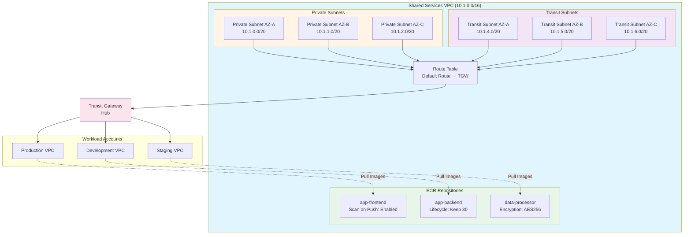

# Módulo de Servicios Compartidos {#shared-services-module}

El módulo de Servicios Compartidos crea una VPC centralizada para la infraestructura y los servicios compartidos accesibles para todas las cuentas de carga de trabajo (workload accounts) a través de Transit Gateway.

## Descripción General {#overview}

Este módulo se despliega en la **Shared Services Account** y crea:

- VPC con soporte de DNS habilitado
- Subredes privadas en múltiples zonas de disponibilidad (AZs)
- Subredes de tránsito para el adjunto de Transit Gateway
- Tablas de ruteo con enrutamiento hacia Transit Gateway
- Adjunto de VPC a Transit Gateway
- Repositorios ECR con escaneo de imágenes y políticas de ciclo de vida

## Uso {#usage}

```hcl
module "shared_services" {
  source = "../modules/shared-services"

  organization_name = "acme-corp"
  vpc_cidr          = "10.1.0.0/16"
  
  availability_zones = [
    "us-east-1a",
    "us-east-1b",
    "us-east-1c"
  ]

  transit_gateway_id  = "tgw-0123456789abcdef0"
  tgw_route_table_id  = "tgw-rtb-0123456789abcdef0"

  enable_ecr = true
  ecr_repositories = [
    "app-frontend",
    "app-backend",
    "data-processor"
  ]
}
```

## Entradas {#inputs}

| Name | Description | Type | Required |
|------|-------------|------|----------|
| `organization_name` | Prefijo del nombre de la organización para el nombramiento de recursos | `string` | Yes |
| `vpc_cidr` | Bloque CIDR para la VPC de servicios compartidos | `string` | No (default: `10.1.0.0/16`) |
| `availability_zones` | Lista de zonas de disponibilidad a utilizar | `list(string)` | No (default: `["us-east-1a", "us-east-1b", "us-east-1c"]`) |
| `transit_gateway_id` | ID de Transit Gateway al que adjuntar la VPC | `string` | Yes |
| `tgw_route_table_id` | ID de la tabla de ruteo de Transit Gateway para la asociación | `string` | Yes |
| `enable_ecr` | Indica si se deben crear repositorios ECR | `bool` | No (default: `true`) |
| `ecr_repositories` | Lista de nombres de repositorios ECR a crear | `list(string)` | No (default: `[]`) |
| `aws_region` | Región de AWS para el despliegue | `string` | No (default: `us-east-1`) |

## Salidas {#outputs}

| Name | Description |
|------|-------------|
| `vpc_id` | ID de la VPC de Servicios Compartidos |
| `private_subnet_ids` | Lista de IDs de subredes privadas |
| `ecr_repository_urls` | Mapa de nombres de repositorios ECR a URLs de repositorio |

## Arquitectura {#architecture}



## Diseño de Red {#network-design}

### Configuración de VPC {#vpc-configuration}

La VPC de Servicios Compartidos está configurada con:

- **Soporte de DNS**: Habilitado para la resolución interna de DNS
- **Nombres de host DNS**: Habilitado para la asignación de nombres de host a instancias EC2
- **Bloque CIDR**: Configurable (por defecto: `10.1.0.0/16`)

### Estrategia de Subredes {#subnet-strategy}

**Subredes Privadas** (una por AZ):
- CIDR: subredes `/20` comenzando desde la base de la VPC
- Propósito: Alojar servicios compartidos (CI/CD, monitoreo, etc.)
- Ruteo: Ruta por defecto hacia Transit Gateway

**Subredes de Tránsito** (una por AZ):
- CIDR: subredes `/20` desplazadas por 4 desde las subredes privadas
- Propósito: Endpoints para el adjunto de VPC a Transit Gateway
- Ruteo: Ruta por defecto hacia Transit Gateway

### Integración con Transit Gateway {#transit-gateway-integration}

El módulo crea un adjunto de VPC a Transit Gateway utilizando las subredes de tránsito y lo asocia con la tabla de ruteo de Transit Gateway especificada. Esto permite:

- Conectividad hub-and-spoke con todas las cuentas de carga de trabajo
- Acceso centralizado a servicios compartidos
- Aislamiento de red con ruteo controlado

## Configuración de ECR {#ecr-configuration}

### Escaneo de Imágenes {#image-scanning}

Todos los repositorios ECR están configurados con:

- **Scan on Push**: Escaneo automático de imágenes en busca de vulnerabilidades al subirlas
- **Cifrado**: Cifrado AES256 en reposo
- **Mutabilidad de Etiquetas**: MUTABLE (permite la actualización de etiquetas)

### Políticas de Ciclo de Vida {#lifecycle-policies}

Cada repositorio incluye una política de ciclo de vida que:

- Mantiene las últimas 30 imágenes
- Expira automáticamente las imágenes más antiguas
- Reduce los costos de almacenamiento

### Acceso entre Cuentas {#cross-account-access}

Para permitir que las cuentas de carga de trabajo descarguen imágenes, configure las políticas del repositorio ECR:

```hcl
resource "aws_ecr_repository_policy" "cross_account" {
  repository = "app-frontend"

  policy = jsonencode({
    Version = "2012-10-17"
    Statement = [
      {
        Sid    = "AllowWorkloadAccountPull"
        Effect = "Allow"
        Principal = {
          AWS = [
            "arn:aws:iam::111111111111:root",  # Cuenta de Producción
            "arn:aws:iam::222222222222:root"   # Cuenta de Desarrollo
          ]
        }
        Action = [
          "ecr:GetDownloadUrlForLayer",
          "ecr:BatchGetImage",
          "ecr:BatchCheckLayerAvailability"
        ]
      }
    ]
  })
}
```

## Estructura de Archivos {#file-structure}

```
terraform/shared-services/
├── main.tf              # VPC, subnets, TGW attachment, ECR
├── variables.tf         # Variables de entrada
├── outputs.tf           # Valores de salida
├── providers.tf         # Configuración del proveedor
└── terraform.tfvars.example
```

## Dependencias {#dependencies}

- **Módulo de Redes**: Debe desplegarse primero para crear el Transit Gateway
- **ID de Transit Gateway**: Requerido desde la salida del módulo de Redes
- **Tabla de Ruteo de Transit Gateway**: Requerida desde la salida del módulo de Redes

## Relacionado {#related}

- [Módulo de Redes](./networking)
- [Módulo de Organización](./organization)
- [Módulo AFT](./aft)
