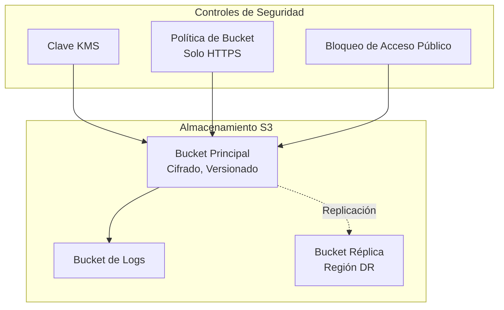

# Módulo de Storage {#storage-module}

El módulo de Storage crea buckets S3 seguros con mejores prácticas de AWS para despliegues de Landing Zone.

## Descripción General {#overview}

Este módulo proporciona:

- **Cifrado del Lado del Servidor**: Cifrado SSE-S3 o SSE-KMS
- **Versionado**: Habilitado por defecto para protección de datos
- **Registro de Acceso**: Registro opcional a bucket separado
- **Bloqueo de Acceso Público**: Todo acceso público bloqueado por defecto
- **Reglas de Ciclo de Vida**: Gestión configurable del ciclo de vida de objetos
- **Replicación Entre Regiones**: Replicación opcional para DR
- **Object Lock**: Soporte opcional de cumplimiento WORM
- **Transporte Seguro**: Aplica acceso solo HTTPS

## Arquitectura {#architecture}



## Uso {#usage}

### Bucket Seguro Básico {#basic-secure-bucket}

```hcl
module "storage" {
  source = "../modules/storage"

  bucket_name = "my-secure-bucket"

  enable_versioning = true
  enable_encryption = true
  enable_logging    = true

  lifecycle_rules = [
    {
      id                            = "archive-old-versions"
      enabled                       = true
      noncurrent_version_expiration = 90
      transition_days               = 30
      transition_storage_class      = "STANDARD_IA"
    }
  ]

  tags = {
    Environment = "production"
    ManagedBy   = "Terraform"
  }
}
```

### Con Cifrado KMS {#with-kms-encryption}

```hcl
module "storage" {
  source = "../modules/storage"

  bucket_name       = "my-kms-encrypted-bucket"
  enable_encryption = true
  kms_key_id        = "arn:aws:kms:us-east-1:123456789012:key/xxx"

  tags = {
    Environment = "production"
  }
}
```

### Con Replicación Entre Regiones {#with-cross-region-replication}

```hcl
module "storage" {
  source = "../modules/storage"

  bucket_name                     = "my-replicated-bucket"
  enable_replication              = true
  replication_role_arn            = aws_iam_role.replication.arn
  replication_destination_bucket_arn = "arn:aws:s3:::my-destination-bucket"

  tags = {
    Environment = "production"
  }
}
```

## Entradas {#inputs}

| Nombre | Descripción | Tipo | Requerido |
|--------|-------------|------|-----------|
| `bucket_name` | Nombre del bucket S3 | `string` | Sí |
| `enable_versioning` | Habilitar versionado | `bool` | No |
| `enable_encryption` | Habilitar cifrado del lado del servidor | `bool` | No |
| `kms_key_id` | ID de clave KMS para SSE-KMS | `string` | No |
| `enable_logging` | Habilitar registro de acceso | `bool` | No |
| `logging_bucket_name` | Bucket existente para logs | `string` | No |
| `enable_public_access_block` | Bloquear todo acceso público | `bool` | No |
| `lifecycle_rules` | Lista de reglas de ciclo de vida | `list(object)` | No |
| `enable_replication` | Habilitar replicación entre regiones | `bool` | No |
| `enable_object_lock` | Habilitar object lock (WORM) | `bool` | No |
| `force_destroy` | Permitir destruir bucket no vacío | `bool` | No |

## Salidas {#outputs}

| Nombre | Descripción |
|--------|-------------|
| `bucket_id` | ID del bucket S3 |
| `bucket_arn` | ARN del bucket S3 |
| `bucket_domain_name` | Nombre de dominio del bucket |
| `bucket_regional_domain_name` | Nombre de dominio regional |
| `logging_bucket_id` | ID del bucket de logs (si se creó) |
| `logging_bucket_arn` | ARN del bucket de logs (si se creó) |

## Características de Seguridad {#security-features}

| Característica | Descripción | Por Defecto |
|----------------|-------------|-------------|
| Solo HTTPS | La política del bucket deniega solicitudes no-SSL | Habilitado |
| Acceso Público Bloqueado | Todas las configuraciones de acceso público bloqueadas | Habilitado |
| Cifrado | Cifrado del lado del servidor | Habilitado (SSE-S3) |
| Versionado | Protege contra eliminación accidental | Habilitado |
| Object Lock | Cumplimiento WORM para requisitos regulatorios | Deshabilitado |

## Reglas de Ciclo de Vida {#lifecycle-rules}

| Transición | Días | Clase de Almacenamiento |
|------------|------|-------------------------|
| Standard → Standard-IA | 30 | STANDARD_IA |
| Standard-IA → Glacier | 90 | GLACIER |
| Glacier → Deep Archive | 180 | DEEP_ARCHIVE |
| Eliminar | 365 | - |

## Relacionado {#related}

- [Módulo de Log Archive](./log-archive)
- [Módulo de Backup](./backup)
- [Arquitectura de Protección de Datos](../architecture/data-protection)
