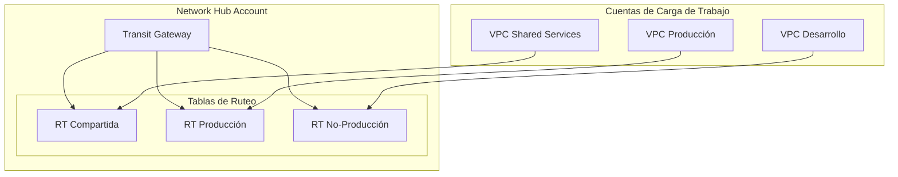

# Módulo de Transit Gateway {#transit-gateway-module}

El módulo de Transit Gateway crea un AWS Transit Gateway con tablas de ruteo y compartición opcional a nivel de organización.

## Descripción General {#overview}

Este módulo se despliega en la **Network Hub Account** y crea:

- Transit Gateway como hub central para conectividad de VPCs
- Tablas de ruteo configurables para segmentación de tráfico
- Compartición RAM con toda la AWS Organization
- Soporte BGP para conectividad híbrida

## Arquitectura {#architecture}



## Uso {#usage}

```hcl
module "transit_gateway" {
  source = "../modules/transit-gateway"

  name            = "acme-tgw"
  amazon_side_asn = 64512

  # Tablas de ruteo para segmentación de tráfico
  route_tables = ["shared", "production", "nonproduction"]

  # Compartir con la organización
  share_with_organization = true
  organization_arn        = "arn:aws:organizations::123456789012:organization/o-example"

  # Auto-aceptar adjuntos de cuentas de la organización
  auto_accept_shared_attachments = "enable"

  tags = {
    Environment = "shared"
    ManagedBy   = "Terraform"
  }
}
```

## Entradas {#inputs}

| Nombre | Descripción | Tipo | Requerido |
|--------|-------------|------|-----------|
| `name` | Prefijo de nombre para recursos de Transit Gateway | `string` | Sí |
| `amazon_side_asn` | ASN privado para sesión BGP | `number` | No |
| `auto_accept_shared_attachments` | Auto aceptar adjuntos compartidos | `string` | No |
| `route_tables` | Lista de nombres de tablas de ruteo a crear | `list(string)` | No |
| `share_with_organization` | Compartir con toda la organización | `bool` | No |
| `organization_arn` | ARN de la organización para compartir | `string` | No |

## Salidas {#outputs}

| Nombre | Descripción |
|--------|-------------|
| `transit_gateway_id` | ID del Transit Gateway |
| `transit_gateway_arn` | ARN del Transit Gateway |
| `route_table_ids` | Mapa de nombres de tablas de ruteo a IDs |
| `ram_share_arn` | ARN de la compartición de recursos RAM |

## Estrategia de Tablas de Ruteo {#route-table-strategy}

| Tabla de Ruteo | Propósito | Adjuntos Típicos |
|----------------|-----------|------------------|
| `shared` | Acceso a servicios compartidos | VPC Shared Services, VPC Egress |
| `production` | Cargas de trabajo de producción | VPCs de cuentas de producción |
| `nonproduction` | Cargas de trabajo de no-producción | VPCs de Dev, Staging, QA |

## Adjuntar una VPC {#attaching-a-vpc}

Para adjuntar una VPC desde otra cuenta:

```hcl
# En la cuenta de carga de trabajo
resource "aws_ec2_transit_gateway_vpc_attachment" "workload" {
  subnet_ids         = var.transit_subnet_ids
  transit_gateway_id = data.aws_ec2_transit_gateway.shared.id
  vpc_id             = aws_vpc.workload.id

  transit_gateway_default_route_table_association = false
  transit_gateway_default_route_table_propagation = false

  tags = {
    Name = "workload-attachment"
  }
}

# Aceptar compartición RAM primero
resource "aws_ram_resource_share_accepter" "tgw" {
  share_arn = data.aws_ram_resource_share.tgw.arn
}
```

## Flujo de Tráfico {#traffic-flow}

```
┌─────────────┐     ┌─────────────┐     ┌─────────────┐
│  VPC A      │────►│   Transit   │────►│  VPC B      │
│  10.1.0.0   │     │   Gateway   │     │  10.2.0.0   │
└─────────────┘     └─────────────┘     └─────────────┘
                           │
                           ▼
                    ┌─────────────┐
                    │  VPC Egress │
                    │  Internet   │
                    └─────────────┘
```

## Relacionado {#related}

- [Módulo de Networking](./networking)
- [Módulo de VPC](./vpc)
- [Diseño de Red](../architecture/network-design)
