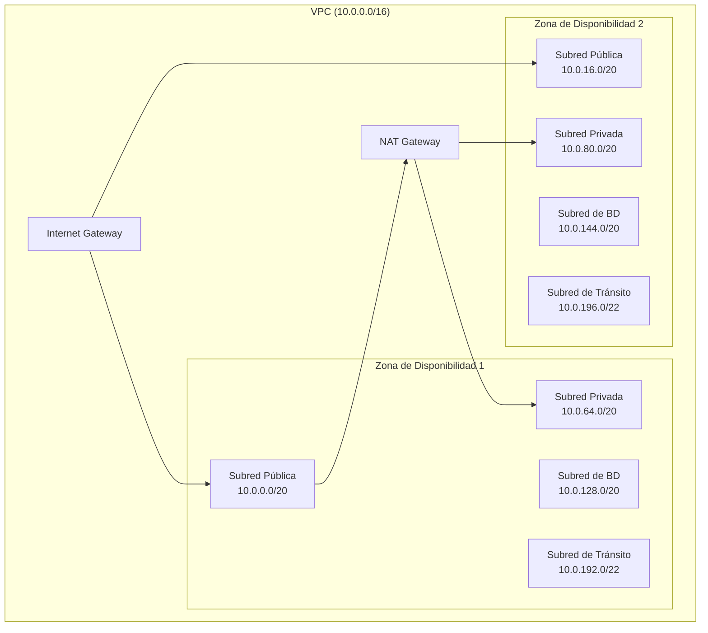

# Módulo de VPC {#vpc-module}

El módulo de VPC crea una VPC con arquitectura de subredes multi-nivel diseñada para despliegues de AWS Landing Zone.

## Descripción General {#overview}

Este módulo proporciona:

- **Despliegue Multi-AZ**: Subredes a través de múltiples zonas de disponibilidad
- **Subredes por Niveles**: Subredes públicas, privadas, de base de datos y de tránsito
- **NAT Gateway**: NAT gateway opcional (único o por AZ)
- **VPC Flow Logs**: Registro de flujo opcional a S3 o CloudWatch
- **Valores Seguros por Defecto**: Grupo de seguridad por defecto sin reglas

## Arquitectura {#architecture}



## Uso {#usage}

```hcl
module "vpc" {
  source = "../modules/vpc"

  name               = "workload-vpc"
  cidr_block         = "10.0.0.0/16"
  availability_zones = ["us-east-1a", "us-east-1b", "us-east-1c"]

  enable_nat_gateway = true
  single_nat_gateway = false  # Un NAT por AZ para HA

  enable_flow_logs         = true
  flow_log_destination_arn = "arn:aws:s3:::my-flow-logs-bucket"

  tags = {
    Environment = "production"
    ManagedBy   = "Terraform"
  }
}
```

## Entradas {#inputs}

| Nombre | Descripción | Tipo | Requerido |
|--------|-------------|------|-----------|
| `name` | Nombre de la VPC | `string` | Sí |
| `cidr_block` | Bloque CIDR de la VPC | `string` | Sí |
| `availability_zones` | Lista de AZs | `list(string)` | Sí |
| `enable_dns_support` | Habilitar soporte DNS | `bool` | No |
| `enable_dns_hostnames` | Habilitar hostnames DNS | `bool` | No |
| `enable_nat_gateway` | Crear NAT gateways | `bool` | No |
| `single_nat_gateway` | Usar un solo NAT gateway | `bool` | No |
| `enable_flow_logs` | Habilitar VPC flow logs | `bool` | No |
| `flow_log_destination_arn` | ARN de destino de flow logs | `string` | No |

## Salidas {#outputs}

| Nombre | Descripción |
|--------|-------------|
| `vpc_id` | ID de la VPC |
| `vpc_cidr_block` | Bloque CIDR de la VPC |
| `public_subnet_ids` | IDs de subredes públicas |
| `private_subnet_ids` | IDs de subredes privadas |
| `database_subnet_ids` | IDs de subredes de base de datos |
| `transit_subnet_ids` | IDs de subredes de tránsito |
| `nat_gateway_ids` | IDs de NAT gateways |
| `private_route_table_ids` | IDs de tablas de ruteo privadas |
| `transit_route_table_id` | ID de tabla de ruteo de tránsito |

## Asignación de CIDR de Subredes {#subnet-cidr-allocation}

Dado un CIDR de VPC `/16`, las subredes se asignan de la siguiente manera:

| Tipo de Subred | Rango CIDR | Ejemplo (10.0.0.0/16) | Propósito |
|----------------|------------|------------------------|-----------|
| Pública | /20 | 10.0.0.0/20 - 10.0.48.0/20 | Load balancers, NAT gateways |
| Privada | /20 | 10.0.64.0/20 - 10.0.112.0/20 | Cargas de trabajo de aplicación |
| Base de Datos | /20 | 10.0.128.0/20 - 10.0.176.0/20 | RDS, ElastiCache |
| Tránsito | /22 | 10.0.192.0/22 - 10.0.204.0/22 | Adjuntos de Transit Gateway |

## Opciones de NAT Gateway {#nat-gateway-options}

| Configuración | Costo | Disponibilidad |
|---------------|-------|----------------|
| `single_nat_gateway = true` | Bajo | Una sola AZ |
| `single_nat_gateway = false` | Alto | Multi-AZ HA |

## Características de Seguridad {#security-features}

| Característica | Descripción |
|----------------|-------------|
| Grupo de Seguridad por Defecto | Restringido sin reglas de entrada/salida |
| Subredes Privadas | Sin acceso directo a internet |
| Aislamiento de Base de Datos | Subredes separadas para bases de datos |
| Subredes de Tránsito | Subredes dedicadas para adjuntos de Transit Gateway |
| Flow Logs | Registro opcional para análisis de red |

## Relacionado {#related}

- [Módulo de Transit Gateway](./transit-gateway)
- [Módulo de Networking](./networking)
- [Diseño de Red](../architecture/network-design)
