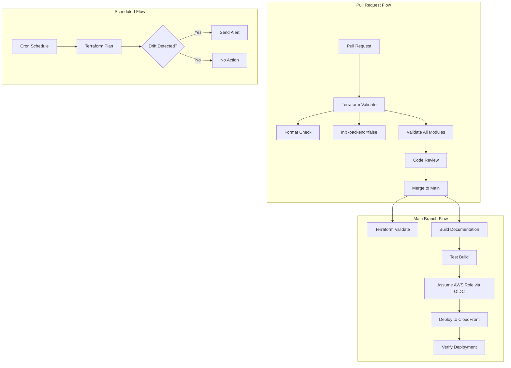

# Guía Operativa de Configuración de CI/CD {#cicd-setup-runbook}

Esta guía operativa describe cómo configurar y gestionar los pipelines de CI/CD para la AWS Landing Zone utilizando GitHub Actions.

## Descripción General del Pipeline {#pipeline-overview}

La Landing Zone incluye dos flujos de trabajo (workflows) de GitHub Actions para la automatización:

- **Terraform Validate**: Valida el código de Terraform en las solicitudes de extracción (pull requests) y los pushes.
- **Documentation Deploy**: Construye y despliega el sitio de Docusaurus en AWS CloudFront.

Ambos flujos de trabajo están deshabilitados por defecto (sufijo `.disabled`) para evitar ejecuciones accidentales antes de una configuración adecuada.

### Arquitectura del Flujo de Trabajo {#workflow-architecture}



### Activadores del Flujo de Trabajo (Triggers) {#workflow-triggers}

| Workflow | Trigger | Purpose |
|----------|---------|---------|
| Terraform Validate | PR a `main` (terraform/**) | Validar cambios antes de la fusión |
| Terraform Validate | Push a `main` (terraform/**) | Validar el código fusionado |
| Documentation Deploy | Push a `main` (docs/**, infra/**) | Despliegue automático de docs al fusionar |
| Documentation Deploy | Despacho manual | Desplegar en una etapa específica |

## Habilitar los Pipelines {#enabling-the-pipelines}

### Paso 1: Eliminar el Sufijo de Deshabilitado {#step-1-remove-disabled-suffix}

```bash
# Habilitar la validación de Terraform
mv .github/workflows/terraform-validate.yml.disabled \
   .github/workflows/terraform-validate.yml

# Habilitar el despliegue de la documentación
mv .github/workflows/docs-deploy.yml.disabled \
   .github/workflows/docs-deploy.yml

# Realizar el commit de los cambios
git add .github/workflows/
git commit -m "chore: enable CI/CD pipelines"
git push
```

### Paso 2: Configurar los Secretos de GitHub {#step-2-configure-github-secrets}

Navegue a **Settings > Secrets and variables > Actions** en su repositorio de GitHub y añada:

| Nombre del Secreto | Descripción | Valor de Ejemplo |
|-------------|-------------|---------------|
| `AWS_ROLE_ARN` | ARN del rol de IAM para OIDC de GitHub Actions | `arn:aws:iam::123456789012:role/GitHubActionsRole` |

:::caution Importante
NO utilice credenciales de AWS de larga duración (access keys). Utilice la autenticación OIDC en su lugar.
:::

### Paso 3: Configurar los Ajustes del Repositorio {#step-3-configure-repository-settings}

#### Reglas de Protección de Ramas {#branch-protection-rules}

Navegue a **Settings > Branches** y configure la protección para `main`:

- [ ] Requerir revisiones de pull request antes de fusionar (mínimo 1 revisor)
- [ ] Requerir que las comprobaciones de estado pasen antes de fusionar
  - [ ] `Validate Terraform`
  - [ ] `Build Documentation`
- [ ] Requerir que las ramas estén actualizadas antes de fusionar
- [ ] No permitir omitir los ajustes anteriores

#### Reglas de Protección de Entornos {#environment-protection-rules}

Navegue a **Settings > Environments** y cree los entornos:

**Entorno de Desarrollo (`dev`)**
- Sin reglas de protección
- Despliegue automático al fusionar con `main`

**Entorno de Producción (`prod`)**
- Revisores requeridos: 2 aprobadores
- Ramas de despliegue: solo `main`
- Aprobación manual requerida

## Terraform en CI/CD {#terraform-in-cicd}

### Gestión del Estado (State Management) {#state-management}

Los pipelines utilizan el backend de S3 de Terraform para la gestión del estado:

```hcl
# terraform/*/backend.tf
terraform {
  backend "s3" {
    bucket         = "acme-terraform-state"
    key            = "terraform/organization/terraform.tfstate"
    region         = "us-east-1"
    dynamodb_table = "terraform-locks"
    encrypt        = true
  }
}
```

**Características Clave:**
- **Versionado de S3**: Habilitado para el historial del estado y la reversión
- **Bloqueo de DynamoDB**: Evita modificaciones concurrentes
- **Cifrado**: Archivos de estado cifrados en reposo con SSE-S3

### Flujo de Trabajo de Validación {#validation-workflow}

El flujo de trabajo de validación se ejecuta sin inicialización del backend:

```bash
terraform init -backend=false
terraform validate
terraform fmt -check
```

Este enfoque:
- Valida la sintaxis y la configuración
- Comprueba el cumplimiento del formato
- No requiere credenciales de AWS
- Se ejecuta rápidamente en cada PR

### Estrategia de Espacios de Trabajo (Workspaces) {#workspace-strategy}

Esta Landing Zone utiliza **archivos de estado separados por cuenta** en lugar de espacios de trabajo de Terraform:

```
terraform/
├── organization/     # Estado: terraform/organization/terraform.tfstate
├── security/         # Estado: terraform/security/terraform.tfstate
├── log-archive/      # Estado: terraform/log-archive/terraform.tfstate
└── network/          # Estado: terraform/network/terraform.tfstate
```

**Beneficios:**
- Clara separación de responsabilidades
- Ciclos de despliegue independientes
- Radio de impacto reducido
- Más fácil de entender y mantener

## Autenticación OIDC {#oidc-authentication}

### Configuración del Proveedor OIDC de GitHub {#github-oidc-provider-setup}

Cree el proveedor OIDC en su cuenta de gestión de AWS:

```bash
# Crear proveedor OIDC
aws iam create-open-id-connect-provider \
  --url https://token.actions.githubusercontent.com \
  --client-id-list sts.amazonaws.com \
  --thumbprint-list 6938fd4d98bab03faadb97b34396831e3780aea1
```

### Rol de IAM para GitHub Actions {#iam-role-for-github-actions}

Cree un rol de IAM con una política de confianza para GitHub:

```json
{
  "Version": "2012-10-17",
  "Statement": [
    {
      "Effect": "Allow",
      "Principal": {
        "Federated": "arn:aws:iam::123456789012:oidc-provider/token.actions.githubusercontent.com"
      },
      "Action": "sts:AssumeRoleWithWebIdentity",
      "Condition": {
        "StringEquals": {
          "token.actions.githubusercontent.com:aud": "sts.amazonaws.com"
        },
        "StringLike": {
          "token.actions.githubusercontent.com:sub": "repo:your-org/aws-landing-zone-template:*"
        }
      }
    }
  ]
}
```

### Sin Credenciales de Larga Duración {#no-long-lived-credentials}

**Nunca utilice claves de acceso de AWS en GitHub Actions:**

- ❌ Secretos `AWS_ACCESS_KEY_ID` y `AWS_SECRET_ACCESS_KEY`
- ✅ OIDC con `aws-actions/configure-aws-credentials@v4`

**Beneficios de OIDC:**
- Credenciales temporales (expiración de 1 hora)
- No se requiere rotación de credenciales
- Gestión automática de credenciales
- Registro de auditoría a través de CloudTrail

## Detección de Desviaciones (Drift Detection) {#drift-detection}

### Detección de Desviaciones Programada {#scheduled-drift-detection}

Añada un flujo de trabajo programado para detectar desviaciones en la infraestructura:

```yaml
name: Terraform Drift Detection

on:
  schedule:
    - cron: '0 8 * * 1-5'  # 8 AM UTC, días laborables
  workflow_dispatch:

jobs:
  drift-detect:
    name: Detect Drift
    runs-on: ubuntu-latest
    
    steps:
      - uses: actions/checkout@v4
      
      - name: Configure AWS Credentials
        uses: aws-actions/configure-aws-credentials@v4
        with:
          role-to-assume: ${{ secrets.AWS_ROLE_ARN }}
          aws-region: us-east-1
      
      - name: Terraform Plan
        run: |
          cd terraform/organization
          terraform init
          terraform plan -detailed-exitcode
        continue-on-error: true
        id: plan
```

### Proceso de Remediación {#remediation-process}

Cuando se detecta una desviación:

1. **Investigar**: Revise la salida del plan para entender los cambios.
2. **Categorizar**:
   - **Esperado**: Cambios manuales que deben ser importados.
   - **Inesperado**: Cambios no autorizados que deben ser revertidos.
3. **Remediar**:
   - Importar cambios esperados: `terraform import`
   - Revertir cambios inesperados: `terraform apply`
4. **Documentar**: Registre la desviación y la remediación en el log de incidentes.

## Procedimientos de Reversión {#rollback-procedures}

### Revertir Cambios de Terraform {#rollback-terraform-changes}

#### Opción 1: Revertir Commit {#option-1-revert-commit}

```bash
# Identificar el commit causante del fallo
git log --oneline terraform/

# Revertir el commit
git revert <commit-sha>

# Subir la reversión
git push origin main
```

#### Opción 2: Restaurar Estado Anterior {#option-2-restore-previous-state}

```bash
# Listar versiones del estado
aws s3api list-object-versions \
  --bucket acme-terraform-state \
  --prefix terraform/organization/terraform.tfstate

# Descargar versión anterior
aws s3api get-object \
  --bucket acme-terraform-state \
  --key terraform/organization/terraform.tfstate \
  --version-id <version-id> \
  terraform.tfstate.restored

# Subir el estado restaurado
terraform state push terraform.tfstate.restored
```

## Consideraciones de Seguridad {#security-considerations}

### Gestión de Secretos {#secret-management}

**Secretos de GitHub:**
- Utilice secretos específicos por entorno.
- Rote los roles de OIDC trimestralmente.
- Audite los logs de acceso a secretos.
- Nunca registre valores de secretos en los logs.

**Secretos de Terraform:**
- Utilice AWS Secrets Manager para valores sensibles.
- Haga referencia a los secretos a través de data sources.
- Nunca suba secretos a git.
- Utilice `.gitignore` para archivos de secretos locales.

## Relacionado {#related}

- [Guía Operativa de Despliegue](./deployment)
- [Guía Operativa de Solución de Problemas](./troubleshooting)
- [Descripción General de la Arquitectura](../architecture/overview)
