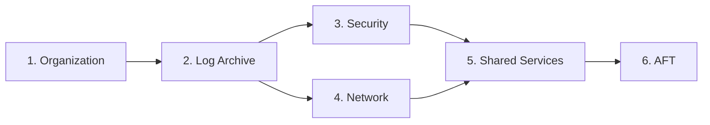

# Guía Operativa de Despliegue {#deployment-runbook}

Esta guía operativa describe cómo desplegar y actualizar la infraestructura de la AWS Landing Zone.

## Requisitos Previos {#prerequisites}

- [ ] Terraform >= 1.5.0 instalado
- [ ] AWS CLI v2 configurado
- [ ] Acceso a la cuenta de gestión (Management account)
- [ ] El bucket S3 de backend y la tabla de DynamoDB existen

## Orden de Despliegue {#deployment-order}

:::caution Importante
Los módulos deben desplegarse en el orden correcto debido a sus dependencias.
:::



| Orden | Módulo | Cuenta | Dependencias |
|-------|--------|---------|--------------|
| 1 | Organization | Management | Ninguna |
| 2 | Log Archive | Log Archive | Organization |
| 3 | Security | Security | Log Archive |
| 4 | Network | Network Hub | Log Archive |
| 5 | Shared Services | Shared Services | Security, Network |
| 6 | AFT | AFT | Todas las anteriores |

## Despliegue Inicial {#initial-deployment}

### Paso 1: Configurar el Backend {#step-1-configure-backend}

Cree los recursos del backend de Terraform (ejecutar una vez):

```bash
# Crear bucket S3 para el estado
aws s3api create-bucket \
  --bucket acme-terraform-state \
  --region us-east-1

# Habilitar el versionado
aws s3api put-bucket-versioning \
  --bucket acme-terraform-state \
  --versioning-configuration Status=Enabled

# Crear tabla de DynamoDB para el bloqueo (locking)
aws dynamodb create-table \
  --table-name terraform-locks \
  --attribute-definitions AttributeName=LockID,AttributeType=S \
  --key-schema AttributeName=LockID,KeyType=HASH \
  --billing-mode PAY_PER_REQUEST
```

### Paso 2: Desplegar el Módulo de Organización {#step-2-deploy-organization-module}

```bash
cd terraform/organization

# Copiar variables de ejemplo
cp terraform.tfvars.example terraform.tfvars

# Editar variables
vim terraform.tfvars

# Inicializar y planificar
terraform init
terraform plan -out=tfplan

# ¡Revise el plan cuidadosamente!
# Aplicar
terraform apply tfplan
```

### Paso 3: Desplegar el Módulo de Archivo de Logs {#step-3-deploy-log-archive-module}

```bash
cd ../log-archive

# Asumir rol en la cuenta de Log Archive
export AWS_PROFILE=log-archive

cp terraform.tfvars.example terraform.tfvars
vim terraform.tfvars

terraform init
terraform plan -out=tfplan
terraform apply tfplan
```

### Paso 4: Desplegar el Módulo de Seguridad {#step-4-deploy-security-module}

```bash
cd ../security

export AWS_PROFILE=security

cp terraform.tfvars.example terraform.tfvars
vim terraform.tfvars

terraform init
terraform plan -out=tfplan
terraform apply tfplan
```

### Paso 5: Desplegar el Módulo de Redes {#step-5-deploy-network-module}

```bash
cd ../network

export AWS_PROFILE=network

cp terraform.tfvars.example terraform.tfvars
vim terraform.tfvars

terraform init
terraform plan -out=tfplan
terraform apply tfplan
```

### Paso 6: Desplegar el Módulo de Servicios Compartidos {#step-6-deploy-shared-services-module}

```bash
cd ../shared-services

export AWS_PROFILE=shared-services

cp terraform.tfvars.example terraform.tfvars
vim terraform.tfvars

terraform init
terraform plan -out=tfplan
terraform apply tfplan
```

### Paso 7: Desplegar AFT (Opcional) {#step-7-deploy-aft}

```bash
cd ../aft/aft-setup

export AWS_PROFILE=aft

terraform init
terraform plan -out=tfplan
terraform apply tfplan
```

## Gestión del Estado (State Management) {#state-management}

### El Problema del Bootstrap {#the-bootstrap-problem}

Al desplegar una Landing Zone, se enfrenta a un problema de "el huevo o la gallina":
- El estado de Terraform debe almacenarse en S3 con bloqueo de DynamoDB.
- Pero el bucket S3 y la tabla de DynamoDB aún no existen.
- Necesita Terraform para crearlos, pero Terraform necesita almacenamiento para el estado.

### Solución: Despliegue en Dos Fases {#solution-two-phase-deployment}

#### Fase 1: Bootstrap del Estado Local {#phase-1-local-state-bootstrap}

Comience con el estado local para crear la infraestructura del estado:

```hcl
# terraform/organization/backend.tf (inicial)
terraform {
  # Comenzar con backend local
  backend "local" {
    path = "terraform.tfstate"
  }
}
```

Cree la infraestructura del estado:
```bash
cd terraform/organization
terraform init
terraform apply -target=aws_s3_bucket.terraform_state
terraform apply -target=aws_dynamodb_table.terraform_locks
```

#### Fase 2: Migrar al Backend de S3 {#phase-2-migrate-to-s3-backend}

Actualice la configuración del backend:
```hcl
# terraform/organization/backend.tf (final)
terraform {
  backend "s3" {
    bucket         = "acme-terraform-state"
    key            = "organization/terraform.tfstate"
    region         = "us-east-1"
    encrypt        = true
    dynamodb_table = "terraform-locks"
  }
}
```

Migre el estado:
```bash
terraform init -migrate-state
```

Terraform preguntará:
```
Do you want to copy existing state to the new backend?
  Enter "yes" to copy and "no" to start with an empty state.
```

Introduzca `yes` para migrar.

### Archivo de Estado por Cuenta {#state-file-per-account}

Cada módulo de cuenta tiene su propio archivo de estado:

| Módulo | Clave del Estado (State Key) |
|--------|-----------|
| organization | `organization/terraform.tfstate` |
| log-archive | `log-archive/terraform.tfstate` |
| security | `security/terraform.tfstate` |
| network | `network/terraform.tfstate` |
| shared-services | `shared-services/terraform.tfstate` |
| aft | `aft/terraform.tfstate` |

### Bloqueo del Estado (State Locking) {#state-locking}

DynamoDB proporciona bloqueo del estado para evitar modificaciones concurrentes:

```hcl
resource "aws_dynamodb_table" "terraform_locks" {
  name         = "terraform-locks"
  billing_mode = "PAY_PER_REQUEST"
  hash_key     = "LockID"

  attribute {
    name = "LockID"
    type = "S"
  }
}
```

Si encuentra un error de bloqueo:
```bash
# Verificar quién tiene el bloqueo
aws dynamodb get-item \
  --table-name terraform-locks \
  --key '{"LockID": {"S": "acme-terraform-state/organization/terraform.tfstate"}}'

# Forzar el desbloqueo (¡usar con precaución!)
terraform force-unlock <LOCK_ID>
```

### Respaldo y Recuperación del Estado {#state-backup-and-recovery}

El versionado de S3 está habilitado para la recuperación del estado:

```bash
# Listar versiones del estado
aws s3api list-object-versions \
  --bucket acme-terraform-state \
  --prefix organization/terraform.tfstate

# Restaurar versión anterior
aws s3api get-object \
  --bucket acme-terraform-state \
  --key organization/terraform.tfstate \
  --version-id <VERSION_ID> \
  terraform.tfstate.backup
```

### Acceso al Estado entre Cuentas {#cross-account-state-access}

Para módulos desplegados en diferentes cuentas, utilice la asunción de rol (assume role):

```hcl
terraform {
  backend "s3" {
    bucket         = "acme-terraform-state"
    key            = "security/terraform.tfstate"
    region         = "us-east-1"
    encrypt        = true
    dynamodb_table = "terraform-locks"
    
    # Asumir rol en la cuenta de gestión donde reside el bucket de estado
    role_arn       = "arn:aws:iam::MANAGEMENT_ACCOUNT:role/TerraformStateAccess"
  }
}
```

### Importación de Recursos Existentes {#importing-existing-resources}

Si los recursos ya existen (por ejemplo, desde la consola u otra herramienta):

```bash
# Importar recurso existente
terraform import aws_organizations_organization.main o-abc123

# Importar con un proveedor específico
terraform import -provider=aws.security aws_guardduty_detector.main abc123def456
```

### Comandos de Manipulación del Estado {#state-manipulation-commands}

```bash
# Listar recursos en el estado
terraform state list

# Mostrar un recurso específico
terraform state show aws_s3_bucket.cloudtrail

# Mover recurso (renombrar)
terraform state mv aws_s3_bucket.old aws_s3_bucket.new

# Eliminar recurso del estado (no elimina el recurso real)
terraform state rm aws_s3_bucket.orphaned

# Descargar el estado remoto localmente
terraform state pull > terraform.tfstate.backup
```

:::caution
Los comandos de manipulación del estado pueden causar desviaciones (drift) o recursos huérfanos. Siempre realice un respaldo del estado antes de manipularlo.
:::

## Actualizaciones Diarias {#day-to-day-updates}

### Realizar Cambios {#making-changes}

1. Cree una rama:

```bash
git checkout -b feature/update-scp-policies
```

2. Realice los cambios en los archivos de Terraform.

3. Valide los cambios:

```bash
cd terraform/<module>
terraform init
terraform validate
terraform fmt -check
```

4. Planifique los cambios:

```bash
terraform plan -out=tfplan
```

5. Cree un PR para revisión.

6. Tras la aprobación, aplique:

```bash
terraform apply tfplan
```

### Uso del Script de Validación {#using-the-validation-script}

```bash
# Validar todos los módulos
./scripts/tf-validate.sh

# Validar un módulo específico
./scripts/tf-validate.sh organization
```

### Uso del Script de Planificación {#using-the-plan-script}

```bash
# Planificar una cuenta específica
./scripts/tf-plan.sh organization
./scripts/tf-plan.sh security
```

## Integración CI/CD {#cicd-integration}

### GitHub Actions (cuando esté habilitado) {#github-actions}

```yaml
# .github/workflows/terraform.yml
name: Terraform

on:
  pull_request:
    paths:
      - 'terraform/**'

jobs:
  validate:
    runs-on: ubuntu-latest
    steps:
      - uses: actions/checkout@v4
      - uses: hashicorp/setup-terraform@v3
      - run: |
          for dir in terraform/*/; do
            echo "Validating $dir"
            terraform -chdir="$dir" init -backend=false
            terraform -chdir="$dir" validate
          done
```

## Procedimientos de Reversión {#rollback-procedures}

### Cambios Menores {#minor-changes}

Utilice Terraform para revertir:

```bash
git revert <commit>
terraform plan -out=tfplan
terraform apply tfplan
```

### Cambios Mayores {#major-changes}

1. Identifique el último estado conocido como bueno.
2. Verifique el historial del estado de Terraform en el versionado de S3.
3. Restaure la versión anterior del estado si es necesario:

```bash
# Listar versiones del estado
aws s3api list-object-versions \
  --bucket acme-terraform-state \
  --prefix terraform/organization/terraform.tfstate

# Restaurar versión anterior
aws s3api get-object \
  --bucket acme-terraform-state \
  --key terraform/organization/terraform.tfstate \
  --version-id <version-id> \
  terraform.tfstate.backup
```

### Reversión de Emergencia {#emergency-rollback}

Si la infraestructura está dañada:

1. Detenga todos los despliegues.
2. Notifique a las partes interesadas.
3. Identifique el cambio que causó el fallo.
4. Aplique una corrección dirigida o una reversión completa.
5. Documente el incidente.

## Verificación {#verification}

Tras el despliegue, verifique:

```bash
# Verificar Organización
aws organizations describe-organization

# Verificar SCPs
aws organizations list-policies --filter SERVICE_CONTROL_POLICY

# Verificar GuardDuty
aws guardduty list-detectors

# Verificar Security Hub
aws securityhub describe-hub

# Verificar Transit Gateway
aws ec2 describe-transit-gateways
```

## Relacionado {#related}

- [Guía Operativa de Solución de Problemas](./troubleshooting)
- [Guía Operativa de Aprovisionamiento de Cuentas](./account-vending)
- [Descripción General de la Arquitectura](../architecture/overview)
